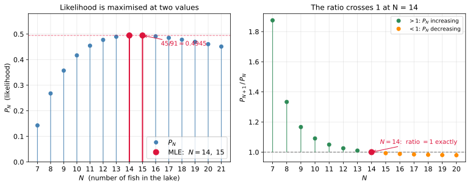

# 최대가능도 추정

---

## 1. 학습 목표

이 쪽을 마치면 다음을 할 수 있게 된다.

- 최대가능도 추정의 기준을 한 문장으로 말하기
- 데이터와 매개변수의 자리가 바뀌는 것이 가능도의 핵심임을 설명하기
- 표지-재포획 문제의 가능도를 세우고, 이웃과 견주어 최대가능도 추정값을 끝까지 구하기
- 추정값이 하나로 정해지지 않는 일이 왜 결함이 아닌지 말하기
- 일반형 $\widehat{N} = \lfloor mn/k \rfloor$과 그것이 무너지는 자리를 알기
- 이 방법이 MNIST에서 통하지 않는 까닭을 말하기

---

## 2. 무엇을 기준으로 삼는가

[앞 쪽](02_softmax.md)까지 모델이 정해졌다. 이제 7,850개의 수를 정해야 하는데, 무엇을 좋은 값이라 할 것인가?

기준은 이것이다.

!!! quote "최대가능도 추정"
    **관찰한 데이터를 가장 그럴듯하게 만드는 매개변수를 고른다.**

이를 최대가능도 추정(maximum likelihood estimation, MLE)이라 한다.

말이 추상적으로 들리지만 하는 일은 단순하다. 매개변수를 이리저리 바꾸어 가며 "그 값이라면 내가 본 데이터가 나올 확률이 얼마인가"를 셈하고, 그 확률이 가장 큰 값을 고른다.

---

## 3. 매개변수가 하나인 예: 표지-재포획

매개변수가 7,850개인 문제로 바로 가면 무엇이 일어나는지 보이지 않는다. 하나뿐인 예를 **끝까지** 풀어 보자. 여기서 하는 일이 뒤의 세 쪽에서 규모만 커진 채 되풀이된다.

!!! question "문제"
    호수에 물고기가 $N$마리 있다. 3마리를 잡아 표지를 붙여 놓아주었다. 나중에 5마리를 잡았더니 그중 1마리에 표지가 있었다. $N$을 얼마로 어림하겠는가?

### 가능도 세우기

관찰 결과가 나올 확률을 $N$의 식으로 적는 것이 첫 걸음이다.

호수에 $N$마리가 있고 그중 3마리가 표지를 가졌다. 5마리를 잡는 방법의 수는 전체에서 5를 고르는 경우이므로

$$
\binom{N}{5}
$$

이다. 이 가운데 "표지된 것이 정확히 1마리"인 경우를 세자. 표지된 3마리에서 1마리를 고르고, 표지 없는 $N-3$마리에서 나머지 4마리를 고르면 된다. 곱의 법칙으로

$$
\binom{3}{1}\binom{N-3}{4}
$$

이다. 모든 경우가 같은 확률로 뽑힌다고 보면

$$
P_N = \frac{\binom{3}{1}\binom{N-3}{4}}{\binom{N}{5}}
$$

이것이 **초기하분포**(hypergeometric distribution)이며, 되돌려 놓지 않고 뽑을 때 나오는 분포다.

식이 뜻을 가지려면 $N - 3 \ge 4$, 곧 $N \ge 7$이어야 한다. 표지 없는 물고기가 4마리는 있어야 관찰한 결과가 가능하기 때문이다. 실제로 $P_7 = 1/7 \approx 0.143$이다.

### 자리가 바뀌었다

여기서 핵심은 계산이 아니라 **누가 변수인가**이다.

| | 확률을 볼 때 | 가능도를 볼 때 |
|---|---|---|
| $N$ (매개변수) | 고정 | **변수** |
| 관찰 결과 | 변수 | **고정** |

보통 확률을 셈할 때는 $N$을 알고 결과가 어떻게 나올지를 묻는다. 가능도는 그 반대다. **결과를 이미 보았고 $N$을 모른다.** 같은 식 $P_N$을 $N$의 함수로 읽는 것이며, 이렇게 읽은 것을 **가능도**라 부른다.

가능도는 확률이 아니다. $N$에 대해 더해도 1이 되지 않는다. 그냥 "이 매개변수가 얼마나 데이터를 잘 설명하는가"를 재는 값이다.

### 최댓값 찾기

$N$이 정수이므로 미분할 수 없다. 대신 **이웃한 값끼리 견준다.** 비가 1보다 크면 늘어나는 중이고 작으면 줄어드는 중이다.

$$
\frac{P_{N+1}}{P_N}
= \frac{\binom{N-2}{4}}{\binom{N-3}{4}} \cdot \frac{\binom{N}{5}}{\binom{N+1}{5}}
$$

두 비를 따로 정리한다. 일반적으로 $\binom{a}{4} \big/ \binom{a-1}{4} = a/(a-4)$이므로, $a = N-2$를 넣으면

$$
\frac{\binom{N-2}{4}}{\binom{N-3}{4}} = \frac{N-2}{N-6}
$$

이고, $\binom{N+1}{5} = \binom{N}{5} \cdot \dfrac{N+1}{N-4}$이므로

$$
\frac{\binom{N}{5}}{\binom{N+1}{5}} = \frac{N-4}{N+1}
$$

이다. 곱하면

$$
\frac{P_{N+1}}{P_N} = \frac{(N-2)(N-4)}{(N-6)(N+1)}
$$

이 비가 1이 되는 자리를 찾는다.

$$
\begin{aligned}
(N-2)(N-4) &= (N-6)(N+1) \\
N^2 - 6N + 8 &= N^2 - 5N - 6 \\
-6N + 8 &= -5N - 6 \\
N &= 14
\end{aligned}
$$

$N < 14$에서는 비가 1보다 크므로 $P_N$이 늘어나고, $N > 14$에서는 1보다 작으므로 줄어든다. 그리고 $N = 14$에서 비가 **정확히** 1이므로 $P_{15} = P_{14}$이다.

$N = 7$부터 50까지 그려 보면 이 논증이 눈에 보인다.



왼쪽이 가능도 자체다. 점으로 찍은 까닭이 있다. $N$은 물고기 마릿수이므로 **정수만 뜻이 있고**, 점 사이를 잇는 곡선은 실제로 존재하지 않는다. 미분 대신 이웃끼리 견주는 방법을 쓴 것이 이 때문이다.

$N = 7$에서 0.143으로 시작해 가파르게 올라 14와 15에서 봉우리에 닿고, 그 뒤로는 **아주 천천히** 내려온다. 이 비대칭이 눈에 띈다. 왼쪽은 가파르고 오른쪽은 길게 끌린다.

봉우리가 뾰족하지 않다는 점도 함께 보라. $N = 12$부터 18까지 일곱 값이 모두 0.477과 0.495 사이에 있어 서로 3.5%밖에 차이 나지 않고, $P_{12} = 0.4773$과 $P_{18} = 0.4779$는 사실상 같다. 더 멀리 가도 마찬가지여서, $N = 50$에서조차 $P_{50} = 0.2526$으로 **최댓값의 절반을 넘는다.**

곧 이 자료는 "물고기가 50마리일 리 없다"고 말해 주지 못한다. 14를 답으로 고르기는 했지만 그 답이 얼마나 헐거운지를 그림이 보여 준다. 14와 15가 비기는 것도 이 평평함의 한 모습일 뿐이다. 표본을 늘리면 봉우리가 뾰족해지는데, 그것을 실제로 재어 보는 것이 연습문제 5다.

오른쪽은 우리가 실제로 셈한 비 $P_{N+1}/P_N$이다. 부호가 바뀌는 자리가 잘 보이도록 $N \le 25$까지만 그렸다. 초록 점은 1보다 커서 "다음 값이 더 그럴듯하다"는 뜻이고, 주황 점은 1보다 작아서 반대를 뜻한다. 색이 바뀌는 자리가 곧 봉우리이며, 그 경계인 $N = 14$에서 비가 정확히 1이다. 위에서 푼 이차방정식이 찾아낸 것이 바로 이 점이다.

그 뒤로 주황 점들이 1에 바짝 붙어 천천히 낮아지는 것도 눈여겨볼 만하다. 비가 1에 가깝다는 것은 이웃한 두 값이 거의 같다는 뜻이고, 그것이 왼쪽 그림의 긴 꼬리로 나타난다.

### 답

두 값을 직접 셈해 확인한다.

$$
P_{14} = \frac{\binom{3}{1}\binom{11}{4}}{\binom{14}{5}}
       = \frac{3 \times 330}{2002} = \frac{990}{2002} = \frac{45}{91}
$$

$$
P_{15} = \frac{\binom{3}{1}\binom{12}{4}}{\binom{15}{5}}
       = \frac{3 \times 495}{3003} = \frac{1485}{3003} = \frac{45}{91}
$$

두 분수가 모두 약분되어 같아진다. 따라서

$$
\widehat{N}_{\text{MLE}} \in \{14,\ 15\}, \qquad P_{14} = P_{15} = \frac{45}{91} \approx 0.4945
$$

이다. $\square$

양옆의 값과 견주어 보면 봉우리임이 더 분명해진다. $P_{13} = 0.4895$, $P_{16} = 0.4911$로 둘 다 0.4945보다 작다.

### 비김을 어떻게 볼 것인가

답이 하나로 정해지지 않은 것이 이 예제의 결함은 아니다. 최대가능도 추정의 성질을 보여 주는 것이다.

가능도 함수는 봉우리 근처에서 평평할 수 있고, 그때는 **자료가 두 값을 갈라놓을 만큼의 정보를 담고 있지 않다**는 뜻이다. 물고기 다섯 마리를 잡아 본 것으로 14와 15를 구별하겠다는 것이 애초에 무리다.

표본을 늘리면 봉우리가 뾰족해지면서 이런 애매함이 줄어든다. 연습문제 5에서 실제로 재어 본다.

### 일반형: 링컨-피터슨 추정량

같은 유도를 일반적인 숫자로 해 두면 쓸모가 있다. 표지를 $m$마리 붙이고, 나중에 $n$마리를 잡아 그중 $k$마리가 표지되어 있었다면

$$
P_N = \frac{\binom{m}{k}\binom{N-m}{n-k}}{\binom{N}{n}}
$$

이고, 위와 똑같이 이웃한 비를 정리하면 비가 1이 되는 자리가 $N + 1 = mn/k$에서 나온다(연습문제 9). 따라서

$$
\widehat{N}_{\text{MLE}} = \left\lfloor \frac{mn}{k} \right\rfloor
$$

이며, $mn/k$가 **정수일 때만** $mn/k - 1$과 $mn/k$가 비긴다.

우리 문제에 넣어 보면 $mn/k = 3 \times 5 / 1 = 15$가 정수이므로 14와 15가 비긴다. 앞의 결과와 맞는다. 곧 **비김은 3과 5를 잡은 것이 특별해서가 아니라 15가 정수여서 생긴 일이다.**

$mn/k$라는 값은 상식적인 비례식과도 통한다. 잡은 것 가운데 표지된 비율이 호수 전체의 표지 비율과 같아야 한다고 보면

$$
\frac{k}{n} \approx \frac{m}{N}
\quad\Longrightarrow\quad
N \approx \frac{mn}{k}
$$

이다. 이를 **링컨-피터슨 추정량**이라 하며 생태학에서 개체 수를 셀 때 실제로 쓴다. 최대가능도 추정이 상식과 어긋나는 답을 주지 않는다는 확인이자, 상식적 어림이 어떤 원리에서 나온 것인지에 대한 답이기도 하다.

다만 이 추정량이 무너지는 자리가 있다. $k = 0$이면 $mn/k$가 정의되지 않고, 실제로 가능도가 $N$에 대해 계속 늘어나 최댓값이 없다. 표지된 것이 하나도 잡히지 않았다면 "호수가 아주 크다"는 말밖에 할 수 없기 때문이다. 연습문제 4에서 다룬다.

!!! note "여기서 끝, 그다음은 5장"
    표지-재포획 이야기는 이것으로 마친다. 가능도를 세우고, 이웃과 견주어 최댓값을 찾고, 일반형과 그 한계까지 보았다.

    같은 예제를 코드로 시늉해 보는 것과, 최대가능도 추정 자체를 정규분포·회귀·로지스틱 회귀 등 여러 모형에서 일반적으로 다루는 것은 [5.1 최대가능도 추정](../../ch05/mle/mle.md)에 있다. 표지-재포획을 시늉과 함께 더 파헤친 쪽은 [표지-재포획 MLE](../../ch05/mle/capture_recapture_mle.md)다.

    이 쪽의 몫은 거기까지 가기 전에 **최대가능도 추정이라는 기준 하나를 끝까지 따라가 보는 것**이었다.

---

## 4. 왜 MNIST에서는 이대로 못 하는가

위에서 답을 찾을 수 있었던 까닭이 둘이다.

1. 매개변수가 **하나**였다.
2. 그 매개변수가 **정수**였다.

그래서 이웃한 값끼리 견주는 것만으로 최댓값을 찾을 수 있었다.

MNIST에서는 둘 다 성립하지 않는다. 매개변수가 7,850개이고 모두 실수다. "이웃한 값"이라는 것이 없고, 격자를 만들어 훑는 것도 불가능하다. 값마다 두 가지만 시험해도 $2^{7850}$가지다.

그러니 기준은 그대로 두고 **찾는 방법**을 바꾸어야 한다. 남은 세 쪽이 그 방법을 만든다.

| 다음 할 일 | 왜 |
|---|---|
| [가능도를 손실로 바꾸기](04_cross_entropy.md) | 곱을 합으로, 최대화를 최소화로 |
| [경사 하강법](05_gradient_descent.md) | 미분을 써서 방향을 찾기 |

---

## 연습문제

<div class="drillbox" markdown>

**연습문제 1.** <span class="diff easy" title="쉬움"></span>
$P_N$을 $N = 10, 14, 20, 50$에서 셈하여 표로 만들라. $N$이 커질 때 $P_N$이 줄어드는 까닭을 말로 설명하라.

</div>

??? success "연습문제 1 풀이"
    ```python
    from math import comb
    PN = lambda N: 3 * comb(N - 3, 4) / comb(N, 5)
    for N in (10, 14, 20, 50):
        print(N, round(PN(N), 4))
    ```

    | $N$ | 10 | 14 | 20 | 50 |
    |---|---|---|---|---|
    | $P_N$ | 0.4167 | **0.4945** | 0.4605 | 0.2526 |

    $N = 14$ 근처에서 가장 크고 양쪽으로 줄어든다.

    큰 $N$에서 줄어드는 까닭은 직관적이다. 호수에 물고기가 아주 많다면 표지 붙은
    3마리는 바다의 좁쌀이므로, 5마리를 잡았을 때 그중 하나가 표지 붙은 것일 확률이
    낮아진다. $N = 50$이면 표지 비율이 6%뿐이라 가능도가 0.2526까지 떨어진다.

    작은 $N$에서 줄어드는 까닭도 같은 이치의 반대다. $N = 10$이면 표지 비율이 30%나
    되어, 5마리를 잡으면 표지 붙은 것이 **두 마리 이상** 나올 가능성이 커진다.
    우리가 관찰한 것은 정확히 1마리였으므로 그 결과의 확률이 낮아진다.

    곧 관찰된 비율 $1/5 = 20\%$를 가장 그럴듯하게 만드는 $N$이 답이며, 표지 비율
    $3/N$이 20%가 되는 $N = 15$ 근처다.

---

<div class="drillbox" markdown>

**연습문제 2.** <span class="diff easy" title="쉬움"></span>
가능도는 확률이 아니다. $P_N$을 $N$에 대해 모두 더하면 1이 되는가? 가능도가 무엇의 함수인지 다시 말하라.

</div>

??? success "연습문제 2 풀이"
    1이 되지 않는다. $N = 7$부터 999까지 더하면 **58.6**이고, 범위를 넓히면 계속 커진다.

    ```python
    print(sum(PN(N) for N in range(7, 1000)))     # 58.6 — 1이 아니다
    ```

    까닭은 $P_N$이 **$N$에 대한 확률분포가 아니기** 때문이다. 각 $N$에 대해 $P_N$은
    "그 $N$이 참이라면 이 관찰이 나올 확률"이며, 확률의 조건이 걸린 쪽은 $N$이 아니라
    **관찰 결과**다. 고정된 $N$에 대해 가능한 모든 관찰 결과의 확률을 더하면 그때
    1이 된다.

    | | 무엇의 함수인가 | 더하면 1이 되는가 |
    |---|---|---|
    | 확률 $P(\text{관찰} \mid N)$ | 관찰의 함수 | 관찰에 대해 더하면 1 |
    | 가능도 $L(N)$ | **$N$의 함수** | **아니다** |

    그래서 "$N = 14$일 가능도가 0.4945다"를 "$N = 14$일 확률이 49.45%다"로 읽으면
    안 된다. 뒤쪽을 말하려면 $N$에 대한 사전분포가 필요하고, 그것이 베이즈 추정이다.

    가능도는 절댓값보다 **서로 견주는 데** 쓰는 값이다. $N = 14$가 $N = 50$보다
    1.96배 그럴듯하다는 비교가 뜻을 갖는다.

---

<div class="drillbox" markdown>

**연습문제 3.** <span class="diff easy" title="쉬움"></span>
가능도를 여러 표본에 대해 **곱**으로 쓰는 근거는 무엇인가? 그 가정이 MNIST에서 참일 법한가?

</div>

??? success "연습문제 3 풀이"
    독립이면 결합 확률이 곱이 된다는 정의 그대로다. 표본 $n$개가 서로 독립이라면

    $$P(x_1, \ldots, x_n \mid \theta) = \prod_{i=1}^{n} P(x_i \mid \theta)$$

    이 가정 없이는 시작할 수 없다. 독립이 아니면 6만 장의 결합 분포를 다루어야
    하는데, 그것은 손댈 수 있는 대상이 아니다.

    MNIST에서 참일 법한가? **엄밀히는 아니다.** MNIST는 미국 인구조사국 직원과
    고등학생들이 쓴 글씨를 모은 것이고, **한 사람이 여러 장을 썼다.** 같은 사람이
    쓴 숫자들은 서로 닮았으므로 독립이 아니다.

    그런데도 이 가정을 쓴다. 어긋남이 심하지 않고, 얻는 것(문제를 다룰 수 있게
    된다)이 잃는 것보다 크기 때문이다. 이런 가정을 실무에서는 "작동하는 근사"로
    받아들인다.

    다만 어긋남이 아픈 곳이 있다. MNIST의 원래 설계는 학습 집합과 시험 집합에
    **서로 다른 사람**의 글씨를 넣었다. 만약 같은 사람의 글씨가 양쪽에 섞여 있다면
    시험 정확도가 부풀려진다. 자료를 나눌 때 "표본 단위"가 아니라 "사람 단위"로
    나누어야 하는 까닭이며, 의료 영상처럼 한 환자에게서 여러 장을 얻는 자료에서
    특히 중요하다.

---

<div class="drillbox" markdown>

**연습문제 4.** <span class="diff med" title="중간"></span>
표지된 것이 하나도 잡히지 않았다면($k = 0$) 최대가능도 추정값은 무엇인가? 잡은 것이 모두 표지되어 있었다면($k = n = m$)? 두 경계에서 추정량이 어떻게 되는지 살펴라.

</div>

??? success "연습문제 4 풀이"
    **$k = 0$인 경우.** 가능도는 다음과 같다.

    $$P_N = \frac{\binom{3}{0}\binom{N-3}{5}}{\binom{N}{5}}
          = \frac{\binom{N-3}{5}}{\binom{N}{5}}$$

    ```python
    PN0 = lambda N: comb(N - 3, 5) / comb(N, 5)
    for N in (8, 20, 100, 1000):
        print(N, round(PN0(N), 4))
    # 8 0.0179 / 20 0.3991 / 100 0.856 / 1000 0.9851
    ```

    $N$이 커질수록 **계속 늘어나** 1에 다가가고 최댓값이 없다. 곧 최대가능도 추정값이
    **존재하지 않는다.** 일반형 $mn/k$에서도 $k = 0$이면 분모가 0이 되어 정의되지 않는다.

    이상한 답이 아니라 옳은 답이다. 표지 붙은 물고기가 하나도 안 잡혔다면 "호수가
    아주 크다"는 말밖에 할 수 없다. 자료가 위쪽 한계를 전혀 말해 주지 못한다.

    **$k = n = m$인 경우.** 표지 5마리를 붙이고 5마리를 잡아 모두 표지되어 있었다면

    $$P_N = \frac{\binom{5}{5}\binom{N-5}{0}}{\binom{N}{5}} = \frac{1}{\binom{N}{5}}$$

    로 $N$에 대해 **줄어들기만** 한다. 따라서 가능한 가장 작은 $N$, 곧
    $\widehat{N} = 5 = m$이 답이다. 일반형으로도 $mn/k = 25/5 = 5$로 맞는다.

    이 역시 옳다. 표지 5마리를 붙였는데 잡은 5마리가 모두 표지된 것이라면, 가장
    그럴듯한 설명은 "호수에 딱 5마리뿐"이다.

    두 경계가 함께 말해 주는 것이 있다. 최대가능도 추정은 **자료가 말해 주는 것만**
    말한다. 자료가 매개변수를 묶어 주지 못하면 추정값이 무한으로 달아나거나 경계에
    달라붙는다. 딥러닝에서도 같은 일이 일어나며, 그럴 때 쓰는 처방이 정칙화, 곧
    사전분포를 더하는 것이다(연습문제 10).

---

<div class="drillbox" markdown>

**연습문제 5.** <span class="diff med" title="중간"></span>
3절은 표본을 늘리면 가능도의 봉우리가 뾰족해진다고 했다. 이를 실제로 재어라. $(m,n,k) = (3,5,1)$, $(30,50,10)$, $(300,500,100)$에서 가능도가 최댓값의 절반 이상인 $N$의 범위를 구하여 견주어라.

</div>

??? success "연습문제 5 풀이"
    세 경우 모두 $mn/k$의 비율은 같고 표본 크기만 10배씩 다르다.

    | $(m,n,k)$ | $mn/k$ | 추정값 | 최댓값 | 절반 이상인 구간 | 폭 | 추정값 대비 |
    |---|---|---|---|---|---|---|
    | $(3,5,1)$ | 15 | 14 | 0.4945 | $[8,\ 51]$ | 44 | **314%** |
    | $(30,50,10)$ | 150 | 149 | 0.1710 | $[118,\ 203]$ | 86 | **58%** |
    | $(300,500,100)$ | 1500 | 1499 | 0.0546 | $[1381,\ 1639]$ | 259 | **17%** |

    추정값은 비례해 커지는데 **불확실성의 상대적 폭은 314% → 58% → 17%로 줄어든다.**
    표본을 100배 늘려 상대 폭이 18분의 1이 되었으니, 대략 표본 크기의 제곱근에
    반비례해 좁아지는 셈이다. 통계에서 흔히 보는 $1/\sqrt{n}$ 꼴이다.

    첫 줄의 314%가 무엇을 뜻하는지 새겨 둘 만하다. 물고기 다섯 마리를 잡아 얻은
    "14마리"라는 추정값은, 가능도가 절반 이상인 범위만 보아도 8에서 51까지 걸쳐
    있다. **점 추정값 하나만 보고하면 이 넓이가 감춰진다.** 그래서 추정값에는 구간이
    함께 따라야 한다.

    최댓값 자체가 0.4945에서 0.0546으로 줄어드는 것도 눈에 띈다. 표본이 커지면
    가능한 결과의 수가 많아져 어느 하나의 확률이 작아지기 때문이다. 봉우리의
    **뾰족함**과 봉우리의 **높이**는 다른 이야기이며, 가능도는 절댓값이 아니라
    모양을 보아야 한다(연습문제 2).

---

<div class="drillbox" markdown>

**연습문제 6.** <span class="diff med" title="중간"></span>
지금까지는 되돌려 놓지 않고 뽑는다고 보았다(초기하분포). 같은 물고기를 다시 잡을 수 있다고 보면 이항분포가 된다. 이 모형의 최대가능도 추정값을 구하고 초기하와 견주어라.

</div>

??? success "연습문제 6 풀이"
    되돌려 놓고 뽑으면 한 번 잡을 때 표지된 것일 확률이 매번 $p = m/N$이다. 따라서
    $n$번 잡아 $k$번 표지된 것이 나올 확률은 이항분포다.

    $$P_N = \binom{n}{k} \left(\frac{m}{N}\right)^{k}
            \left(1 - \frac{m}{N}\right)^{n-k}$$

    푸는 요령이 있다. $p = m/N$으로 바꾸면 이는 베르누이 시행의 가능도이고,
    연습문제 7에서 $\widehat{p} = k/n$임을 구한다. 따라서

    $$\frac{m}{\widehat{N}} = \frac{k}{n}
      \quad\Longrightarrow\quad
      \widehat{N} = \frac{mn}{k}$$

    ```python
    Ns = np.arange(7, 60)
    L = (3 / Ns) ** 1 * (1 - 3 / Ns) ** 4
    print(Ns[L.argmax()])      # 15
    ```

    $(m,n,k) = (3,5,1)$에서 **15**가 나온다.

    | 모형 | 추정값 | 비김 |
    |---|---|---|
    | 초기하 (되돌리지 않음) | 14, 15 | **있다** |
    | 이항 (되돌림) | 15 | 없다 |

    두 모형이 같은 $mn/k$를 주는데 **초기하만 비긴다.** 까닭은 초기하가 정수 $N$에
    대한 분포라 이웃끼리 견주어야 하고, 그 비가 딱 1이 되는 자리가 생기기 때문이다.
    이항 모형에서는 $N$을 실수로 두고 미분할 수 있어 $mn/k$ 하나가 곧 답이다.

    어느 쪽이 옳은가. 잡은 물고기를 놓아주지 않았다면 **초기하가 맞다.** 이항은
    근사이며, 표본이 전체에 비해 작을 때($n \ll N$) 두 모형이 거의 같아진다. 여기서는
    15마리 가운데 5마리를 잡았으니 작다고 할 수 없는데도 답이 거의 같게 나왔다.

    되돌려 놓는가 아닌가가 추정에 영향을 준다는 것은 새겨 둘 만하다. 학습 자료에서
    묶음을 뽑을 때도 같은 구별이 있고, [경사 하강법 연습문제 9](05_gradient_descent.md)는
    되돌리지 않고 뽑는 쪽을 가정해 묶음 기울기의 불편성을 증명한다.

---

<div class="drillbox" markdown>

**연습문제 7.** <span class="diff med" title="중간"></span>
베르누이 시행에서 최대가능도 추정값을 직접 유도하라. 동전을 $n$번 던져 $k$번 앞면이 나왔을 때 $\hat{p}$는 얼마인가?

</div>

??? success "연습문제 7 풀이"
    가능도는 다음과 같다(순서를 무시하면 이항계수가 붙지만 $p$와 무관하므로 생략해도
    최댓값의 자리는 같다).

    $$L(p) = p^k (1-p)^{n-k}$$

    로그를 취한다. 곱이 합이 되어 미분이 쉬워지는 것이 여기서도 그대로다.

    $$\ell(p) = k \log p + (n-k) \log(1-p)$$

    미분해서 0으로 둔다.

    $$\frac{d\ell}{dp} = \frac{k}{p} - \frac{n-k}{1-p} = 0$$

    $$k(1-p) = (n-k)p \;\Longrightarrow\; k = np
      \;\Longrightarrow\; \boxed{\hat{p} = \frac{k}{n}}$$

    이계도함수가 $-k/p^2 - (n-k)/(1-p)^2 < 0$이므로 최댓값이다. $\square$

    답이 **관찰된 비율**이라는 점이 중요하다. 최대가능도 추정이 상식과 어긋나지
    않는다는 확인이며, 연습문제 6의 링컨-피터슨 추정량도 같은 성격이었다.

    다만 이 추정량의 약점도 바로 보인다. $k = 0$이면 $\hat{p} = 0$으로, "앞면이
    절대 나오지 않는다"고 단언한다. 10번 던져 모두 뒷면이 나왔다고 그렇게 결론
    내리는 것은 지나치다. 이것이 최대가능도 추정의 전형적인 약점이며, 사전분포를
    더해 완화하는 것이 베이즈 추정이다(연습문제 10).

---

<div class="drillbox" markdown>

**연습문제 8.** <span class="diff hard" title="어려움"></span>
MNIST에서 이웃끼리 견주거나 격자를 훑어 최댓값을 찾는 일이 왜 불가능한지 수로 보여라. 매개변수마다 두 가지 값만 시험한다고 하자.

</div>

??? success "연습문제 8 풀이"
    매개변수가 7,850개이고 각각에 두 가지만 시험한다면 경우의 수는

    $$2^{7850}$$

    이다. 크기를 가늠해 보자.

    $$\log_{10} 2^{7850} = 7850 \times \log_{10} 2 \approx 7850 \times 0.30103 \approx 2363$$

    곧 약 $10^{2363}$가지다.

    견줄 대상을 들면 이 수가 얼마나 터무니없는지 드러난다.

    | | 대략 |
    |---|---|
    | 관측 가능한 우주의 원자 수 | $10^{80}$ |
    | 우주의 나이를 플랑크 시간으로 센 값 | $10^{60}$ |
    | **이 격자 탐색의 경우의 수** | $10^{2363}$ |

    우주의 모든 원자가 우주의 나이만큼 매 플랑크 시간마다 한 가지씩 시험해도
    $10^{140}$가지밖에 못 해 본다. $10^{2363}$은 그것의 $10^{2223}$배다.

    그리고 값마다 두 가지라는 것이 이미 터무니없는 단순화다. 매개변수는 실수이므로
    각각에 대해 셈해야 할 후보가 무한히 많다.

    이것이 사슬의 나머지가 필요한 까닭이다. 답을 **찾아 나설** 수 없으므로, 대신
    **어느 쪽으로 가면 나아지는지**만 알아내어 조금씩 움직인다. 그 방향을 알려
    주는 것이 미분이며, 미분을 쓰려면 가능도를 미분 가능한 꼴로 다시 써야 한다.
    [교차 엔트로피 손실](04_cross_entropy.md)과 [경사 하강법](05_gradient_descent.md)이
    그 일을 한다.

    차원이 높을 때 훑기가 불가능해지는 이 현상을 **차원의 저주**라 한다.

---

<div class="drillbox" markdown>

**연습문제 9.** <span class="diff hard" title="어려움"></span>
3절은 일반형의 추정값이 $\lfloor mn/k \rfloor$이고 $mn/k$가 정수일 때만 비긴다고 했다. 이를 증명하라.

</div>

??? success "연습문제 9 풀이"
    일반형의 가능도는 다음과 같다.

    $$P_N = \frac{\binom{m}{k}\binom{N-m}{n-k}}{\binom{N}{n}}$$

    $\binom{m}{k}$는 $N$과 무관하므로 최댓값의 자리에 영향을 주지 않는다. 이웃한 비를
    셈한다. $\binom{N+1-m}{n-k} / \binom{N-m}{n-k} = \frac{N+1-m}{N+1-m-n+k}$이고
    $\binom{N}{n} / \binom{N+1}{n} = \frac{N+1-n}{N+1}$이므로

    $$\frac{P_{N+1}}{P_N}
      = \frac{(N+1-m)(N+1-n)}{(N+1-m-n+k)(N+1)}$$

    비가 1이 되는 곳을 찾는다. $M = N+1$로 두면

    $$(M-m)(M-n) = (M-m-n+k)M$$

    왼쪽을 펼치면 $M^2 - (m+n)M + mn$, 오른쪽은 $M^2 - (m+n-k)M$이다. $M^2$이
    지워지고

    $$\begin{aligned}
    -(m+n)M + mn &= -(m+n)M + kM \\
    mn &= kM \\
    M &= \frac{mn}{k}
    \end{aligned}$$

    곧 $N + 1 = mn/k$, 다시 말해 $N = mn/k - 1$에서 비가 정확히 1이다. $\square$

    이제 규칙이 설명된다. $mn/k$가 **정수**라면 $N = mn/k - 1$이 정수이고 그 자리에서
    $P_{N+1} = P_N$이므로, $mn/k - 1$과 $mn/k$가 **비긴다.** $mn/k$가 정수가
    아니라면 비가 1이 되는 자리가 정수 격자 위에 없으므로 비김이 없고, 최댓값은
    $\lfloor mn/k \rfloor$ 하나다.

    확인해 보자. $(m,n,k) = (3,5,1)$이면 $mn/k = 15$가 정수이므로 14와 15가 비긴다.
    $(3,5,2)$이면 $7.5$가 정수가 아니므로 $\lfloor 7.5 \rfloor = 7$ 하나다.

    덧붙여, 이 유도는 최대가능도 추정값이 링컨-피터슨 추정량 $mn/k$와 (정수로
    내림하는 것을 빼면) 같다는 것도 함께 증명한 셈이다.

---

<div class="drillbox" markdown>

**연습문제 10.** <span class="diff hard" title="어려움"></span>
최대가능도 추정에 사전분포를 더하면 최대사후확률(MAP) 추정이 된다. 이 둘의 관계를 적고, 딥러닝에서 가중치 감쇠가 왜 사전분포에 해당하는지 설명하라.

</div>

??? success "연습문제 10 풀이"
    베이즈 정리로 사후확률을 쓴다.

    $$p(\theta \mid D) = \frac{p(D \mid \theta)\, p(\theta)}{p(D)}$$

    분모는 $\theta$와 무관하므로 최댓값의 자리에 영향이 없다. 로그를 취하면

    $$\log p(\theta \mid D) = \underbrace{\log p(D \mid \theta)}_{\text{로그가능도}}
      + \underbrace{\log p(\theta)}_{\text{사전분포}} + \text{const}$$

    곧 **MAP는 로그가능도에 사전분포의 로그를 더한 것을 최대화**한다. 사전분포가
    고르면($p(\theta)$가 상수) 둘째 항이 사라져 MAP와 MLE가 같아진다.

    이제 사전분포를 가우시안으로 두자. $\theta \sim \mathcal{N}(0, \sigma^2 I)$이면

    $$\log p(\theta) = -\frac{1}{2\sigma^2}\lVert \theta \rVert^2 + \text{const}$$

    부호를 뒤집어 손실로 만들면

    $$\text{loss} = \underbrace{-\log p(D \mid \theta)}_{\text{교차 엔트로피}}
      + \underbrace{\frac{1}{2\sigma^2}\lVert \theta \rVert^2}_{\text{L2 정칙화}}$$

    둘째 항이 정확히 **가중치 감쇠**다. 곧 L2 정칙화를 쓰는 것은 "가중치가 0 근처의
    작은 값일 것"이라는 가우시안 사전분포를 두는 것과 같다. 정칙화 세기 $\lambda$와
    사전분포의 폭은 $\lambda = 1/(2\sigma^2)$로 이어지므로, 정칙화를 세게 하는 것은
    **사전분포를 좁게** 잡는 것이다. $\square$

    같은 식으로 라플라스 사전분포를 두면 L1 정칙화가 나온다.

    이 관계가 두 가지를 설명해 준다.

    첫째, 정칙화가 임의로 덧붙인 꾸밈이 아니라는 것이다. 교차 엔트로피가 최대가능도
    추정에서 나왔듯, 정칙화 항은 사전분포에서 나온다. 사슬이 한 칸 더 길어진 셈이다.

    둘째, 정칙화를 언제 걸어야 하는지에 대한 지침이다. 사전분포는 자료가 적을 때
    힘을 쓰고 자료가 많으면 로그가능도에 묻힌다. 그래서 [선형 모델](01_linear_model.md)
    연습문제 8에서 가중치 감쇠가 오히려 해로웠다. 표본 6만 개에 매개변수 7,850개라
    자료가 이미 넉넉하고, 그런 상황에서 좁은 사전분포는 도움이 아니라 방해다.

## 정리하며

**다룬 것** — 최대가능도 추정

학습의 기준을 정했다. 관찰한 데이터를 가장 그럴듯하게 만드는 매개변수를 고른다.

가능도의 핵심은 **자리 바꿈**이다. 같은 식을 데이터의 함수가 아니라 매개변수의 함수로 읽는다. 가능도는 확률이 아니며 매개변수에 대해 더해도 1이 되지 않는다.

표지-재포획 문제를 끝까지 풀었다. 초기하 가능도를 세우고, 미분할 수 없으므로 이웃한 값의 비를 정리해 최댓값의 자리를 찾았다. 답은 $\widehat{N} \in \{14, 15\}$로 **하나가 아니다.** 이는 결함이 아니라 자료가 두 값을 갈라놓을 만큼의 정보를 담고 있지 않다는 뜻이며, 표본을 늘리면 봉우리가 뾰족해진다.

일반형은 $\widehat{N} = \lfloor mn/k \rfloor$이고 $mn/k$가 정수일 때만 비긴다. 이는 생태학이 쓰는 링컨-피터슨 추정량과 같아서, 최대가능도 추정이 상식적인 비례식에 원리를 붙여 준 셈이다. 그리고 $k = 0$이면 추정값이 존재하지 않는다. 자료가 매개변수를 묶어 주지 못하면 최대가능도 추정은 답을 내놓지 않는다.

여기까지가 매개변수 하나로 할 수 있는 이야기다. 7,850개의 실수일 때는 이웃이라는 것이 없고 격자를 훑을 수도 없으므로, 다음 두 쪽이 미분을 쓸 수 있는 꼴로 문제를 다시 쓴다. 기준은 그대로 두고 찾는 방법만 바꾼다.
