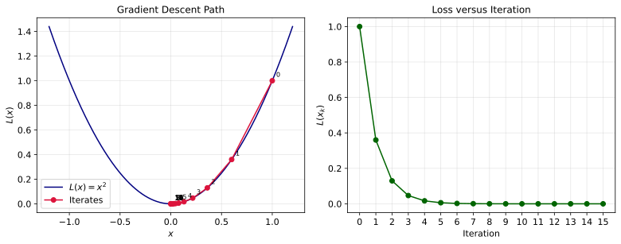
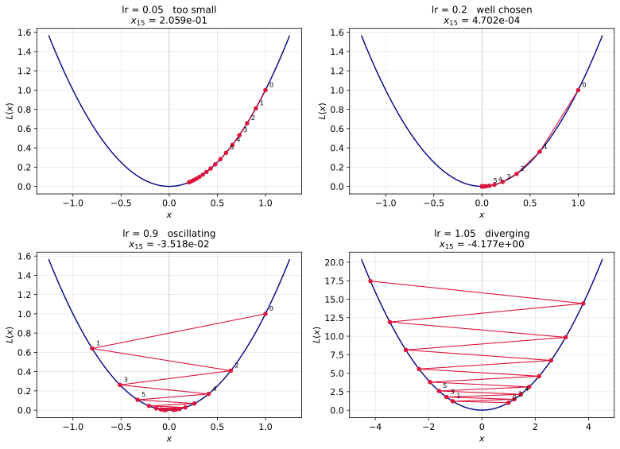

# 경사 하강법

---

## 1. 학습 목표

이 쪽을 마치면 다음을 할 수 있게 된다.

- 경사 하강법의 갱신 식을 적고 부호가 왜 음수인지 말하기
- 학습률이 너무 클 때와 너무 작을 때가 어떻게 **다르게** 나빠지는지 구별하기
- $L(x) = x^2$에서 수렴 조건 $0 < \lambda < 1$을 직접 유도하고 눈으로 확인하기
- 배치 하나로 기울기를 어림하는 일이 왜 받아들일 만한지 설명하기
- 소프트맥스와 교차 엔트로피가 만나 기울기가 $p - y$로 떨어지는 것을 유도하기

---

## 2. 기울기의 반대로 간다

[앞 쪽](04_cross_entropy.md)에서 최소화할 손실이 정해졌다. 이제 7,850차원 공간에서 그 손실이 가장 낮은 자리를 찾아야 한다.

손실을 각 매개변수로 미분해 모은 것을 **기울기**(gradient)라 한다. 기울기는 손실이 가장 가파르게 **올라가는** 방향을 가리킨다. 우리는 내려가고 싶으므로 그 반대로 간다.

$$
\theta_{n+1} = \theta_n - \lambda \frac{\partial \text{loss}}{\partial \theta}
$$

음의 부호가 "반대로"를 뜻한다. $\lambda$는 **학습률**이며 한 걸음의 크기를 정한다.

이것이 경사 하강법의 전부다. 손실이 가장 낮은 자리를 한 번에 찾는 것이 아니라, 발밑의 기울기만 보고 조금씩 내려가기를 되풀이한다. 안개 속에서 산을 내려가는 것과 같다. 전체 지형은 볼 수 없지만 발밑이 어느 쪽으로 기울었는지는 알 수 있다.

---

## 3. 학습률

학습률은 딥러닝에서 가장 자주 만지는 값이다. 양쪽으로 잘못될 수 있고, **두 잘못이 서로 다르다.**

| 학습률이 | 무엇이 일어나는가 | 어떻게 알아채는가 |
|---|---|---|
| 너무 크다 | 골짜기를 넘나들며 튄다. 심하면 발산한다 | 손실 곡선이 들쭉날쭉하거나 아예 올라간다 |
| 너무 작다 | 방향은 옳지만 걸음이 짧아 도착하지 못한다 | 손실이 곱게 내려가지만 아직 높다 |

이 구별이 실무에서 중요하다. **너무 작은 것은 더 기다리면 해결되고, 너무 큰 것은 그렇지 않다.** 학습 곡선이 튀고 있으면 에포크를 늘려도 나아지지 않으므로 학습률을 줄여야 한다. 반대로 곱게 내려가는 중이라면 더 돌리거나 학습률을 키우면 된다.

더 자세한 이야기는 [학습률과 이동 폭](../../ch06/gradient_descent/learning_rate.md)에 있다. 다음 절은 이 말을 눈으로 확인한다.

---

## 4. 코드: 학습률을 눈으로 보기

7,850차원에서 무슨 일이 일어나는지는 볼 수 없다. 그래서 **정확히 풀 수 있는 가장 단순한 예**로 먼저 본다. 여기서 보이는 것이 큰 모델에서도 그대로 일어난다.

$$
L(x) = x^2, \qquad L'(x) = 2x
$$

### 한 번 굴려 보기

```python
import numpy as np
import matplotlib.pyplot as plt

# =============================================================================
# 설정
# =============================================================================
learning_rate = 0.2
x0 = 1.0
num_iterations = 15


# =============================================================================
# 손실 함수와 그 기울기
# =============================================================================
def loss(x):
    return x**2


def gradient(x):
    return 2 * x


# =============================================================================
# 경사 하강법
# =============================================================================
# 2절의 갱신 식 그대로다. 기울기의 반대 방향으로 학습률만큼 간다
x_values = [x0]
x = x0

for _ in range(num_iterations):
    x = x - learning_rate * gradient(x)
    x_values.append(x)

x_values = np.array(x_values)
loss_values = loss(x_values)
iterations = np.arange(num_iterations + 1)

# =============================================================================
# 그리기
# =============================================================================
# 왼쪽: 손실 곡선 위를 걸어 내려가는 자취. 점 옆의 숫자가 몇 번째 걸음인지다
# 오른쪽: 걸음 수에 따른 손실. 실제로 학습할 때 보게 되는 그림이 이쪽이다
x_curve = np.linspace(-1.2, 1.2, 400)

fig, axes = plt.subplots(1, 2, figsize=(12, 5))

axes[0].plot(x_curve, loss(x_curve), color="navy", label=r"$L(x)=x^2$")
axes[0].plot(x_values, loss_values, "o-", color="crimson", label="Iterates")

for k, (x_k, loss_k) in enumerate(zip(x_values, loss_values)):
    axes[0].annotate(str(k), (x_k, loss_k), xytext=(5, 5),
                     textcoords="offset points", fontsize=8)

axes[0].set_xlabel(r"$x$")
axes[0].set_ylabel(r"$L(x)$")
axes[0].set_title("Gradient Descent Path")
axes[0].grid(alpha=0.3)
axes[0].legend()

axes[1].plot(iterations, loss_values, "o-", color="darkgreen")
axes[1].set_xlabel("Iteration")
axes[1].set_ylabel(r"$L(x_k)$")
axes[1].set_title("Loss versus Iteration")
axes[1].set_xticks(iterations)
axes[1].grid(alpha=0.3)

plt.tight_layout()
plt.show()

print(f"Final Answer : {x_values[-1]}")
```

**출력:**

```
Final Answer : 0.00047018498457599973
```



왼쪽 그림에서 점들이 포물선을 따라 골짜기로 미끄러져 내려간다. 점 옆의 숫자가 걸음 번호이며, 0번에서 시작해 걸음마다 원점 쪽으로 다가가되 **간격이 점점 좁아진다.** 최솟값에 가까워질수록 기울기가 작아져 걸음도 짧아지기 때문이다.

오른쪽은 같은 일을 걸음 수에 대해 그린 것으로, 실제로 학습할 때 보게 되는 그림이 이쪽이다. 손실이 매끄럽게 0으로 떨어진다. 학습률 0.2는 이 문제에서 잘 고른 값이다.

### 왜 그런지 손으로 풀 수 있다

이 예제가 좋은 까닭은 갱신을 **닫힌 꼴로 풀 수 있기** 때문이다. 갱신 식에 $L'(x) = 2x$를 넣으면

$$
x_{k+1} = x_k - \lambda \cdot 2 x_k = (1 - 2\lambda)\, x_k
$$

이고, 이를 되풀이하면 다음을 얻는다.

$$
x_k = (1 - 2\lambda)^k \, x_0
$$

곧 걸음마다 **같은 수를 곱하는 것**이 전부다. 그 수를 $r = 1 - 2\lambda$라 하면 등비수열이므로 결과가 $|r|$ 하나로 완전히 정해진다. 0으로 가려면 $|r| < 1$이어야 하므로

$$
|1 - 2\lambda| < 1
\quad\Longleftrightarrow\quad
0 < \lambda < 1
$$

이것이 **수렴 조건**이다. 학습률이 1을 넘으면 어떤 초기값에서 시작하든 몇 번을 굴리든 발산한다. 위에서 쓴 $\lambda = 0.2$는 $r = 0.6$이므로 $x_{15} = 0.6^{15} = 4.70 \times 10^{-4}$이고, 실제 출력과 자릿수까지 맞는다.

### 학습률을 바꾸어 가며

같은 코드를 학습률만 바꾸어 돌려 보자.

```python
for lr in (0.01, 0.1, 0.2, 0.5, 0.9, 1.0, 1.05, 1.2):
    x, xs = x0, []
    for _ in range(num_iterations):
        x = x - lr * gradient(x)
        xs.append(x)
    print(f"lr={lr:<5} r={1 - 2 * lr:>5.2f}  x_1={xs[0]:>8.4f}  x_15={xs[-1]:>12.3e}")
```

**출력:**

```
lr=0.01  r= 0.98  x_1=  0.9800  x_15=   7.386e-01
lr=0.1   r= 0.80  x_1=  0.8000  x_15=   3.518e-02
lr=0.2   r= 0.60  x_1=  0.6000  x_15=   4.702e-04
lr=0.5   r= 0.00  x_1=  0.0000  x_15=   0.000e+00
lr=0.9   r=-0.80  x_1= -0.8000  x_15=  -3.518e-02
lr=1.0   r=-1.00  x_1= -1.0000  x_15=  -1.000e+00
lr=1.05  r=-1.10  x_1= -1.1000  x_15=  -4.177e+00
lr=1.2   r=-1.40  x_1= -1.4000  x_15=  -1.556e+02
```

다섯 가지 모습이 뚜렷하게 갈린다.

| 학습률 | $r = 1-2\lambda$ | 무슨 일이 일어나는가 |
|---|---|---|
| $\lambda < 0.5$ | $0 < r < 1$ | 한쪽에서 **곧장** 내려간다. 작을수록 더디다 |
| $\lambda = 0.5$ | $r = 0$ | **한 걸음에 정확히 최솟값.** 가장 빠르다 |
| $0.5 < \lambda < 1$ | $-1 < r < 0$ | 최솟값을 **넘나들며** 수렴한다. 부호가 매번 바뀐다 |
| $\lambda = 1$ | $r = -1$ | $+1$과 $-1$을 오갈 뿐 **영원히 줄지 않는다** |
| $\lambda > 1$ | $r < -1$ | **발산한다.** 걸음마다 더 멀어진다 |

$\lambda = 1.2$에서 15걸음 만에 $x$가 1에서 $-155.6$까지 튀어 나간 것을 보라. 되돌릴 길이 없고, 더 오래 돌릴수록 더 나빠진다.

네 가지를 같은 그림으로 놓으면 차이가 한눈에 들어온다.



왼쪽 위는 걸음이 너무 짧아 15걸음을 걷고도 출발점 근처에 머물러 있다. 오른쪽 위가 잘 고른 경우다. 왼쪽 아래는 원점을 **넘어가며** 좌우로 오가는데, 그래도 폭이 줄어들므로 결국 수렴한다. 오른쪽 아래는 넘어가는 폭이 걸음마다 **커져서** 포물선을 거꾸로 기어 올라간다. 축의 눈금이 다른 셋과 전혀 다르다는 점을 눈여겨보라.

### 너무 작은 것과 너무 큰 것은 얼마나 다른가

3절에서 두 잘못이 서로 다르다고 했다. 걸음 수를 세어 보면 그 말의 뜻이 또렷해진다.

```python
for lr in (0.01, 0.05, 0.1, 0.2, 0.5, 0.8, 0.9, 0.99):
    x, n = x0, 0
    while abs(x) > 1e-3:
        x = x - lr * gradient(x)
        n += 1
    print(f"lr={lr:<5} {n:>4} 걸음")
```

**출력:**

```
lr=0.01   342 걸음
lr=0.05    66 걸음
lr=0.1     31 걸음
lr=0.2     14 걸음
lr=0.5      1 걸음
lr=0.8     14 걸음
lr=0.9     31 걸음
lr=0.99   342 걸음
```

표가 **정확히 대칭**이다. $\lambda = 0.01$과 $\lambda = 0.99$가 똑같이 342걸음, $0.1$과 $0.9$가 똑같이 31걸음, $0.2$와 $0.8$이 똑같이 14걸음이다. $|r| = |1 - 2\lambda|$이 $\lambda = 0.5$를 가운데 두고 대칭이기 때문이다.

여기서 중요한 것을 읽을 수 있다. **너무 작은 학습률과, 수렴하는 범위 안에서 너무 큰 학습률은 똑같이 더디다.** 다만 더딘 모습이 다르다. 작으면 곱게 기어가고 크면 요란하게 넘나든다. 그러므로 학습 곡선이 들쭉날쭉하다면 이미 $\lambda > 0.5$ 쪽에 와 있다는 신호이므로, 더 키우지 말고 **줄여야** 한다.

그리고 $\lambda = 1$이라는 벼랑이 바로 옆에 있다. 0.99는 느릴 뿐이지만 1.05는 회복이 불가능하다. **한쪽 방향의 잘못만 치명적**이라는 것이 학습률 고르기의 성격이며, 모르면 작은 쪽에서 시작해 키우는 까닭이 이것이다.

### 7,850차원에서도 그런가

같은 실험을 이 절의 MNIST 선형 모델에 평범한 SGD로 해 보면 이렇다(3 에포크).

| 학습률 | $10^{-4}$ | $10^{-3}$ | $10^{-2}$ | $10^{-1}$ | $1$ | $10$ |
|---|---|---|---|---|---|---|
| 마지막 에포크 손실 | 1.456 | 0.569 | 0.339 | **0.290** | 1.306 | 12.72 |
| 시험 정확도 | 70.46% | 87.45% | 91.04% | **91.75%** | 83.84% | 79.01% |

가운데가 좋고 양쪽이 나쁘다는 그림이 그대로 되풀이된다. 너무 작으면 3 에포크 안에 도착하지 못해 70%에 머물고, 너무 크면 손실이 튀어 올라 되돌아오지 못한다.

!!! note "다만 이 모델은 폭발하지 않는다"
    1차원 예제와 다른 점이 하나 있다. 학습률을 1000까지 올려도 손실이 수만 대에서 오르내릴 뿐 `nan`이 되지 않고, 가중치도 무한대로 달아나지 않는다.

    까닭은 이 모델의 기울기가 **묶여 있기** 때문이다. 로짓에 대한 기울기가 $p - t$인데([교차 엔트로피 손실 연습문제 8](04_cross_entropy.md)) 확률과 원-핫의 차이이므로 크기가 1을 넘지 못한다. 가중치가 아무리 엉뚱해져도 한 걸음의 크기가 일정 수준 이상 커지지 않는다.

    반면 $L(x) = x^2$에서는 기울기 $2x$가 $|x|$에 **비례해** 자란다. 멀어질수록 더 크게 튀므로 발산이 폭발적이다. 깊은 신경망은 이쪽에 가까워서 `nan`을 실제로 자주 만난다.

    곧 "학습률이 크면 `nan`이 뜬다"는 말은 모델에 따라 맞기도 하고 틀리기도 한다. 확실한 것은 **손실이 내려가지 않는다**는 것뿐이며, 그것만 보고도 학습률을 줄여야 한다는 판단은 내릴 수 있다.

---

## 5. 배치로 어림한다

손실은 표본 6만 개에 대한 합이다. 기울기를 정확히 구하려면 매 걸음마다 6만 장을 모두 훑어야 한다. 그렇게 하는 것을 **온배치 경사 하강법**이라 한다.

실제로는 그렇게 하지 않는다. 데이터를 128장쯤의 **작은 배치**으로 나누고, 배치 하나의 기울기로 한 걸음을 내딛는다. 이를 **확률적 경사 하강법**(stochastic gradient descent)이라 한다.

배치 하나의 기울기는 전체 기울기와 같지 않다. 그런데도 괜찮은 까닭은 그것이 전체 기울기의 **불편 추정량**이기 때문이다. 배치를 무작위로 고르면

$$
\mathbb{E}\!\left[\nabla \text{loss}_{\text{배치}}\right] = \nabla \text{loss}_{\text{전체}}
$$

이다. 곧 방향이 틀릴 수는 있어도 **치우쳐 있지는 않다.** 평균적으로는 옳은 방향이며, 걸음을 많이 내딛으면 잡음이 상쇄된다.

그리고 이 맞바꿈이 유리하다. 6만 장을 한 번 훑는 동안, 온배치라면 **한 걸음**을 내딛지만 배치 128이라면 469걸음을 내딛는다. 각 걸음의 방향이 조금 엉성해도 469번 움직이는 편이 훨씬 빨리 내려간다.

!!! note "잡음이 오히려 돕기도 한다"
    배치의 잡음은 순전한 손해가 아니다. 얕은 극소점이나 안장점에서 빠져나오는 데 도움이 된다. 이 절의 모델에서는 손실면이 볼록해서 그런 일이 없지만(6절), 다음 절부터는 중요해진다.

---

## 6. 이 모델의 손실면은 볼록하다

소프트맥스 회귀의 교차 엔트로피 손실은 $(A, b)$에 대해 **볼록**하다. 볼록함수는 극소점이 곧 최소점이므로, 잘못된 골짜기에 갇힐 염려가 없다.

그래서 이 쪽에서는 최적화기 선택이 별로 중요하지 않다. Adam이든 관성 SGD든 평범한 SGD든 어지간하면 같은 자리에 닿는다(연습문제 6). 이 장의 코드가 Adam을 쓰는 까닭은 학습률을 덜 고민해도 되기 때문이며, 반드시 필요해서가 아니다.

이 편안함은 이 절에서 끝난다. [3.3 다층 퍼셉트론](../mnist/03_mlp.md)부터는 손실면이 비볼록해지고, 그때부터 최적화가 진짜 문제가 된다. 흥미롭게도 비볼록해지는 원인은 활성화 함수가 아니라 **층을 곱으로 쌓는다는 사실 자체**다(3.3절 연습문제 13).

---

## 7. 기울기는 손으로 구하지 않아도 된다

$\partial \text{loss} / \partial \theta$을 직접 유도할 필요는 없다. PyTorch의 [자동 미분](../../ch06/autograd/01_basic_scalar_backward.md)이 계산 그래프를 거슬러 올라가며 대신 구해 준다. 코드에서는 `loss.backward()` 한 줄이다.

그 한 줄이 어떻게 스칼라 하나에서 매개변수마다의 편미분을 모두 만들어 내는지는 [3.3절 학습 루프를 한 줄씩](../mnist/03_mlp.md)에서 사슬 규칙으로 뜯어본다. 층이 여럿일 때 비로소 그 되돌아오는 길이 눈에 보이기 때문이다.

그래도 이 모델에서만은 손으로 해 보는 값이 있다. 소프트맥스와 교차 엔트로피가 만나면 기울기가 놀랍도록 간단해진다.

$$
\frac{\partial \text{loss}}{\partial y_k} = p_k - y_k
$$

곧 **예측 확률 빼기 정답**이다. 지수함수도 로그도 남지 않는다. 이것이 두 함수를 따로 쓰지 않고 `nn.CrossEntropyLoss` 하나로 묶는 까닭이며, 유도는 [교차 엔트로피 손실 연습문제 8](04_cross_entropy.md)에 있다.

이 식에서 세 가지가 바로 읽힌다.

- 옳게 맞히면 $p_t \approx 1$이라 기울기가 0에 가깝다. **잘하고 있는 표본은 내버려 둔다.**
- 크게 틀리면 기울기가 1에 가깝다. **못하는 표본에서 배운다.**
- $\sum_k (p_k - y_k) = 1 - 1 = 0$이다. 기울기의 합이 늘 0이므로 로짓 전체를 같이 밀어 올리는 쪽으로는 가지 않는다. [소프트맥스](02_softmax.md)의 이동 불변성과 맞물리는 성질이다.

---

## 연습문제

!!! note "아래 풀이의 수치에 대하여"
    풀이에 적힌 정확도는 모두 이 절의 설정(정규화 적용, 배치 128, Adam $10^{-3}$, 10 에포크, 씨앗 42)으로 실제로 재어 얻은 것이다. 초기 가중치와 자료를 섞는 차례가 실행마다 달라 마지막 자리가 0.1~0.4%포인트쯤 흔들리므로, 본문이 보고하는 92.51%와 조금 다를 수 있다. 한 표 안의 값들은 같은 조건에서 잰 것이므로 서로 견주는 데에는 문제가 없다.

<div class="drillbox" markdown>

**연습문제 1.** <span class="diff easy" title="쉬움"></span>
경사 하강법의 갱신 식을 적고, 부호가 음수인 까닭을 말하라. 양수로 바꾸면 무엇이 일어나는가?

</div>

??? success "연습문제 1 풀이"
    $$\theta_{n+1} = \theta_n - \lambda \frac{\partial \text{loss}}{\partial \theta}$$

    기울기는 손실이 가장 가파르게 **올라가는** 방향을 가리킨다. 우리는 손실을
    줄이려 하므로 그 반대로 가야 하고, 그것이 음의 부호다.

    양수로 바꾸면 **경사 상승법**이 되어 손실을 키우는 쪽으로 간다. 손실은 아래로
    막혀 있지 않으므로(교차 엔트로피는 위로 무한히 커진다) 발산한다. 몇 걸음 안에
    손실이 `inf`가 되고 가중치가 `nan`이 된다.

    부호를 뒤집는 것이 쓸모 있는 경우도 있다. 가능도를 직접 **최대화**할 때가 그렇고,
    적대적 예제를 만들 때 입력에 대해 손실을 키우는 방향으로 움직이는 것도 그렇다.
    다만 매개변수 학습에서는 언제나 음의 부호다.

---

<div class="drillbox" markdown>

**연습문제 2.** <span class="diff easy" title="쉬움"></span>
`optimizer.zero_grad()`를 빼면 무엇이 일어나는가? 실제로 빼고 학습시켜 보라.

</div>

??? success "연습문제 2 풀이"
    PyTorch의 `backward()`는 기울기를 **덮어쓰지 않고 더한다.** 따라서 지우지 않으면
    지금까지의 모든 배치의 기울기가 계속 누적된다.

    | | `zero_grad()` 있음 | 없음 |
    |---|---|---|
    | 시험 정확도 | **92.42%** | **88.66%** |

    3.76%포인트 나빠진다. 그런데 **여전히 88.66%가 나온다**는 점이 이 버그의 위험한
    지점이다. 오류도 나지 않고 정확도가 그럴듯하니 알아채기 어렵다.

    왜 완전히 망가지지 않는가. 누적된 기울기는 옛 기울기들의 합이므로 방향이 대체로
    여전히 내려가는 쪽을 가리킨다. 다만 걸음이 점점 커지고 오래된(이미 낡은)
    정보가 섞여 있어 비효율적으로 움직인다. Adam이 기울기 크기로 걸음을 나누어
    조절하는 덕에 폭발까지는 가지 않는다. 평범한 SGD에서 같은 실수를 하면 발산하는
    일이 흔하다.

    기울기를 더하도록 설계된 까닭은 이것이 필요한 경우가 있어서다. 배치를 여러 번
    나누어 큰 배치 하나처럼 다루는 기울기 누적(gradient accumulation)이 그렇다.
    메모리가 부족해 배치 128을 한 번에 못 올릴 때 32씩 네 번 더한 뒤 갱신한다.

---

<div class="drillbox" markdown>

**연습문제 3.** <span class="diff easy" title="쉬움"></span>
학습률 $\lambda$가 너무 클 때와 너무 작을 때, 두 잘못을 학습 곡선에서 어떻게 구별하는가? 어느 쪽이 더 고치기 쉬운가?

</div>

??? success "연습문제 3 풀이"
    | | 곡선의 모양 | 고치는 법 |
    |---|---|---|
    | 너무 크다 | 들쭉날쭉 튀거나, 오르거나, `nan` | 학습률을 줄인다 |
    | 너무 작다 | 곱게 내려가지만 아직 높다 | 더 돌리거나 학습률을 키운다 |

    **너무 작은 쪽이 고치기 쉽다.** 방향은 옳고 걸음만 짧으므로, 기다리면 결국
    도착한다. 시간만 쓰면 되는 문제다.

    너무 큰 쪽은 기다려서 해결되지 않는다. 골짜기를 넘나들며 튀고 있으므로 에포크를
    열 배 늘려도 같은 자리에서 계속 튄다. 심하면 발산해 학습이 아예 망가진다.

    그래서 실무의 순서가 정해진다. **모르면 작은 쪽에서 시작해 키운다.** 손실이
    곱게 내려가는 가장 큰 학습률을 찾는 것이 목표다. 학습률을 조금씩 키우며 손실을
    지켜보는 자동화된 방법도 있다(learning rate finder).

    한 가지 헷갈리기 쉬운 점. 배치마다의 손실은 원래 조금 흔들린다. 배치가 다르면
    손실이 다르기 때문이다. 그러니 튀는지 보려면 **에포크 평균**을 보아야 한다.
    연습문제 4에서 실제 값으로 확인한다.

---

<div class="drillbox" markdown>

**연습문제 4.** <span class="diff med" title="중간"></span>
4절은 평범한 SGD로 학습률을 훑었다. 이번에는 이 절의 코드가 실제로 쓰는 **Adam**으로 $10^{-1}, 10^{-2}, 10^{-3}, 10^{-4}$를 10 에포크씩 돌려 보라. 좋은 학습률의 자리가 SGD와 같은가?

</div>

??? success "연습문제 4 풀이"
    | 학습률 | $10^{-1}$ | $10^{-2}$ | $10^{-3}$ | $10^{-4}$ |
    |---|---|---|---|---|
    | 시험 정확도 | 89.59% | 89.71% | **92.41%** | 91.86% |

    양쪽이 모두 나쁘고 가운데가 가장 좋다. 다만 나빠지는 **방식**이 다르다는 것이
    요점이다.

    $10^{-1}$과 $10^{-2}$는 걸음이 너무 커서 최솟값 근처를 넘나든다. 손실 곡선을
    에포크별로 그려 보면 내려가다가 올라가는 일이 되풀이된다. 여기서 에포크를
    100으로 늘려도 89%대에 머문다.

    $10^{-4}$는 반대다. 곡선이 곱게 내려가는 중인데 10 에포크가 끝나 버렸다. 이쪽은
    **더 돌리면 나아진다.** 실제로 에포크를 늘리면 $10^{-3}$과 비슷한 자리에 닿는다.

    같은 91~92%대의 숫자가 전혀 다른 상태를 나타낸다는 점을 기억해 두면 좋다.
    정확도 하나만 보고 학습률을 판단할 수 없고, **곡선의 모양**을 보아야 한다.

    **자리가 다르다.** 4절의 SGD 표와 나란히 놓으면 분명해진다.

    | 학습률 | $10^{-4}$ | $10^{-3}$ | $10^{-2}$ | $10^{-1}$ |
    |---|---|---|---|---|
    | SGD (4절, 3 에포크) | 70.46% | 87.45% | 91.04% | **91.75%** |
    | Adam (10 에포크) | 91.86% | **92.41%** | 89.71% | 89.59% |

    SGD는 $10^{-1}$이 가장 좋고 Adam은 $10^{-3}$이 가장 좋다. 곧 좋은 학습률의
    자리가 **최적화기마다 100배쯤 다르다.**

    까닭은 Adam이 기울기를 그 크기의 어림값으로 나누기 때문이다. 실효 걸음이 이미
    정규화되어 있으므로 $\lambda$가 걸음의 크기를 거의 그대로 뜻하게 되고, 그래서
    훨씬 작은 값을 쓴다. SGD에서는 $\lambda$에 기울기 크기가 곱해지므로 기울기가
    작으면 $\lambda$를 키워야 한다.

    실무의 교훈은 이것이다. **어떤 논문에서 본 학습률을 최적화기를 바꾸면서 그대로
    가져오면 안 된다.** 학습률은 최적화기와 짝을 이루는 값이다.

---

<div class="drillbox" markdown>

**연습문제 5.** <span class="diff med" title="중간"></span>
배치 크기를 1, 32, 128, 1024, 60000으로 바꾸어 정확도와 걸린 시간을 재어라. 온배치(60000)이 유독 나쁜 까닭은 무엇인가?

</div>

??? success "연습문제 5 풀이"
    | 배치 | 1 (1 에포크) | 32 | 128 | 1024 | 60000 |
    |---|---|---|---|---|---|
    | 정확도 | 90.03% | 92.07% | **92.42%** | 92.25% | **72.88%** |
    | 걸린 시간 | 108초 | 48초 | 15초 | 6초 | 5초 |
    | 갱신 횟수 | 60,000 | 18,750 | 4,690 | 590 | **10** |

    온배치가 72.88%로 크게 뒤진다. 까닭은 정확도 표만 보면 안 보이고 **갱신 횟수**를
    보아야 드러난다. 10 에포크를 돌렸지만 한 에포크에 갱신이 **한 번**뿐이므로
    걸음을 딱 **10번** 내딛었다. 7,850차원 공간에서 열 걸음으로 갈 수 있는 곳은 멀지
    않다.

    배치 하나의 기울기는 전체 기울기보다 엉성하다. 그런데도 배치 128이 이기는 까닭은,
    **엉성한 걸음 4,690번이 정확한 걸음 10번보다 훨씬 멀리 간다**는 것이다. 5절이
    말한 맞바꿈이 이것이다.

    배치 1은 갱신을 6만 번 하지만 시간이 108초로 가장 오래 걸리고 정확도도 낮다.
    배치가 너무 작으면 기울기의 잡음이 커지고, 무엇보다 GPU가 한 번에 하나씩만
    처리하게 되어 병렬성을 전혀 못 쓴다. 그래서 걸음마다의 값이 비싸진다.

    128과 1024는 정확도가 비슷한데 시간은 1024가 2.5배 빠르다. 큰 배치가 GPU를
    잘 채우기 때문이다. 실무에서 배치 크기는 정확도보다 **메모리와 처리량**으로
    정하는 값이며, 크게 키울 때는 학습률도 함께 키우는 것이 관례다.

---

<div class="drillbox" markdown>

**연습문제 6.** <span class="diff med" title="중간"></span>
최적화기를 Adam에서 관성 SGD로, 그리고 관성 없는 SGD로 바꾸어 견주어라. 차이가 작다면 그 까닭은 무엇인가?

</div>

??? success "연습문제 6 풀이"
    | 최적화기 | Adam $10^{-3}$ | SGD $10^{-2}$ 관성 0.9 | SGD $10^{-2}$ 관성 없음 |
    |---|---|---|---|
    | 시험 정확도 | **92.41%** | **92.41%** | 92.01% |

    Adam과 관성 SGD가 소수점 둘째 자리까지 같고, 관성을 빼도 0.4%포인트만 뒤진다.
    사실상 무엇을 쓰든 같은 자리에 닿는다.

    까닭은 6절에서 말한 **볼록성**이다. 소프트맥스 회귀의 교차 엔트로피 손실은
    $(A, b)$에 대해 볼록하므로 극소점이 곧 최소점이고, 갇힐 잘못된 골짜기가 없다.
    내려가기만 하면 결국 같은 곳에 도착한다.

    그래서 최적화기의 값어치는 **어디에 닿는가**가 아니라 **얼마나 빨리 닿는가**에
    있고, 10 에포크는 세 방법 모두에게 충분한 시간이었다. 에포크를 2로 줄이면 차이가
    드러난다.

    이 편안함은 이 절에서 끝난다. [3.3 다층 퍼셉트론](../mnist/03_mlp.md)부터는
    손실면이 비볼록해져 어디에 닿는지가 방법에 따라 달라진다. 흥미롭게도 비볼록해지는
    원인은 활성화 함수가 아니라 **층을 곱으로 쌓는다는 사실 자체**이며,
    [3.3절 연습문제 13](../mnist/03_mlp.md)이 두 줄짜리 반례로 그것을 보인다.

    덧붙여 학습률이 Adam은 $10^{-3}$, SGD는 $10^{-2}$로 다르다는 점을 눈여겨보라.
    Adam은 기울기를 그 크기로 나누므로 실효 걸음이 이미 정규화되어 있고, 그래서
    더 작은 학습률을 쓴다. 두 최적화기의 학습률을 같은 자로 견줄 수 없다.

---

<div class="drillbox" markdown>

**연습문제 7.** <span class="diff med" title="중간"></span>
첫 에포크 동안 기울기의 노름이 어떻게 변하는지 기록해 보라. 이 값을 지켜보는 것이 왜 쓸모 있는가?

</div>

??? success "연습문제 7 풀이"
    ```python
    for xb, yb in train_loader:
        optimizer.zero_grad()
        criterion(model(xb), yb).backward()
        print(model[1].weight.grad.norm().item())
        optimizer.step()
    ```

    | 걸음 | 1번째 | 100번째 | 469번째 |
    |---|---|---|---|
    | 기울기 노름 | **4.512** | 1.152 | **0.870** |

    첫 걸음에서 4.5였다가 한 에포크가 끝날 때 0.87로 5분의 1이 된다.

    줄어드는 것이 정상이다. 기울기는 $p - t$에 비례하고([04 연습문제 8](04_cross_entropy.md))
    학습이 진행되면 $p$가 정답에 가까워지므로 $p - t$가 0으로 간다. 곧 **기울기가
    줄어드는 것은 잘 배우고 있다는 신호**다.

    이 값을 지켜보는 것이 쓸모 있는 까닭은, 학습이 멈췄을 때 원인을 가려 주기
    때문이다.

    | 기울기 노름이 | 무엇을 뜻하는가 |
    |---|---|
    | 0에 가까워졌다 | 수렴했다 (또는 기울기가 끊겼다) |
    | 계속 크다 | 학습률이 작아 못 내려가고 있다 |
    | 폭발한다 (`inf`, `nan`) | 학습률이 크거나 수치 문제가 있다 |
    | 정확히 0이다 | **기울기가 끊겼다** — `detach()`나 `no_grad()`를 의심하라 |

    마지막 줄이 특히 쓸모 있다. 손실이 전혀 줄지 않을 때 가장 먼저 확인할 것은
    기울기가 실제로 흐르고 있는지다. 층이 깊어지면 층마다 노름을 기록해 어디서
    끊기거나 폭발하는지 찾는다.

---

<div class="drillbox" markdown>

**연습문제 8.** <span class="diff med" title="중간"></span>
학습률을 3 에포크마다 절반으로 줄이는 스케줄러를 붙여 보라. 정확도가 어떻게 되는가? 왜 이런 방식이 도움이 되는가?

</div>

??? success "연습문제 8 풀이"
    ```python
    scheduler = torch.optim.lr_scheduler.StepLR(optimizer, step_size=3, gamma=0.5)
    # 에포크마다 마지막에 scheduler.step()
    ```

    | | 고정 $10^{-3}$ | StepLR(3, 0.5) |
    |---|---|---|
    | 시험 정확도 | 92.42% | **92.59%** |

    0.17%포인트 오른다. 작지만 방향이 맞다.

    도움이 되는 까닭은 학습의 두 국면이 서로 다른 걸음을 원하기 때문이다. 처음에는
    최솟값이 멀리 있으므로 큰 걸음이 유리하다. 가까워지면 큰 걸음이 최솟값을 지나쳐
    그 주변을 맴돌게 만든다. 걸음을 줄이면 더 깊이 내려앉을 수 있다.

    연습문제 7의 기울기 노름이 이 그림과 맞물린다. 기울기가 0.87까지 줄어든 상태에서
    같은 학습률을 쓰면 실효 걸음이 작아지긴 하지만, 최솟값 근처의 잡음 때문에
    이리저리 흔들린다. 학습률을 함께 줄이면 그 흔들림이 잦아든다.

    이득이 작은 것은 이 문제가 볼록하고 쉬워서다. 깊은 모델에서는 학습률 스케줄이
    정확도를 몇 %포인트까지 바꾸는 일이 흔하며, 코사인 감쇠나 준비 구간(warmup)을
    포함한 스케줄이 거의 표준으로 쓰인다.

---

<div class="drillbox" markdown>

**연습문제 9.** <span class="diff hard" title="어려움"></span>
배치 하나의 기울기가 전체 기울기의 **불편 추정량**임을 증명하라. 치우치지 않았다는 것과 정확하다는 것은 어떻게 다른가?

</div>

??? success "연습문제 9 풀이"
    전체 손실을 표본별 손실의 평균이라 하자.

    $$\text{loss} = \frac{1}{n}\sum_{i=1}^{n} \ell_i,
      \qquad g = \nabla \text{loss} = \frac{1}{n}\sum_{i=1}^{n} \nabla \ell_i$$

    배치 $B$를 $n$개에서 **복원 없이 균등하게** $m$개 고른 것이라 하면, 배치 기울기는

    $$g_B = \frac{1}{m}\sum_{i \in B} \nabla \ell_i$$

    기댓값을 셈한다. 지시함수 $\mathbb{1}[i \in B]$를 쓰면 각 $i$가 뽑힐 확률이
    $m/n$이므로

    $$\mathbb{E}[g_B]
      = \frac{1}{m}\sum_{i=1}^{n} \mathbb{E}\big[\mathbb{1}[i \in B]\big] \nabla \ell_i
      = \frac{1}{m}\sum_{i=1}^{n} \frac{m}{n} \nabla \ell_i
      = \frac{1}{n}\sum_{i=1}^{n} \nabla \ell_i = g \qquad \square$$

    곧 배치를 어떻게 고르든(균등하게만 고르면) 평균적으로는 전체 기울기와 같다.

    **치우치지 않음과 정확함의 차이.** 불편성은 **기댓값**에 대한 진술이고, 정확함은
    **분산**에 대한 진술이다. $g_B$는 치우치지 않았지만 분산이 있다.

    $$\mathrm{Var}(g_B) \propto \frac{1}{m}$$

    배치를 키우면 분산이 $1/m$로 줄어들지만 0이 되지는 않는다($m = n$일 때만 0).
    그러므로 배치 기울기는 **방향이 평균적으로 옳지만 매번 틀린다.**

    이것이 왜 괜찮은가. 경사 하강법은 한 걸음의 정확함을 필요로 하지 않는다.
    여러 걸음에 걸쳐 잡음이 상쇄되면서 평균적으로 옳은 방향으로 나아가면 된다.
    그리고 분산을 줄이는 데 드는 값(배치를 키우는 계산)보다 걸음을 더 많이 내딛는
    편이 이득이라는 것이 연습문제 5의 실측이었다.

    잡음이 순전한 손해가 아니라는 점도 덧붙일 만하다. 비볼록한 손실면에서는 이
    잡음이 얕은 극소점과 안장점을 빠져나오는 데 도움이 된다. 온배치 경사 하강법은
    안장점에 정확히 갇히면 나올 길이 없다.

---

<div class="drillbox" markdown>

**연습문제 10.** <span class="diff hard" title="어려움"></span>
이 모델의 손실이 매개변수에 대해 **볼록**함을 보여라. 이 사실이 다음 절에서 왜 깨지는가?

</div>

??? success "연습문제 10 풀이"
    표본 하나의 손실을 로짓으로 쓰면([04 연습문제 8](04_cross_entropy.md))

    $$\ell = -y_c + \log \sum_j e^{y_j}$$

    이다. 두 항을 따로 본다.

    **첫 항** $-y_c$는 $y$의 선형함수이고, $y = xA^{\top} + b$도 $(A, b)$의 선형함수다.
    선형함수는 볼록하다(그리고 오목하기도 하다).

    **둘째 항** $\log\sum_j e^{y_j}$는 log-sum-exp 함수이며 볼록하다. 헤세 행렬을
    셈하면 $\mathrm{diag}(p) - pp^{\top}$인데([02 연습문제 10](02_softmax.md)),
    임의의 $v$에 대해

    $$v^{\top}\big(\mathrm{diag}(p) - pp^{\top}\big)v
      = \sum_k p_k v_k^2 - \Big(\sum_k p_k v_k\Big)^2
      = \mathbb{E}_p[v^2] - \big(\mathbb{E}_p[v]\big)^2
      = \mathrm{Var}_p(v) \ge 0$$

    이므로 양의 준정부호다. 곧 log-sum-exp는 $y$에 대해 볼록하다.

    이제 두 사실을 잇는다. **볼록함수와 아핀 사상의 합성은 볼록하다.** $y$가 $(A,b)$의
    아핀 함수이므로 $\log\sum e^{y_j}$는 $(A, b)$에 대해서도 볼록하다. 볼록함수의
    합도 볼록하고, 볼록함수들의 (양수 가중) 평균도 볼록하므로 전체 손실이 볼록하다.
    $\square$

    따라서 극소점이 곧 최소점이고, 연습문제 6에서 어떤 최적화기를 써도 같은 자리에
    닿은 까닭이 설명된다.

    **다음 절에서 왜 깨지는가.** 결정적인 고리는 "$y$가 매개변수의 **아핀** 함수"라는
    부분이었다. 층을 두 개 쌓으면

    $$y = \sigma(x W_1 + b_1) W_2 + b_2$$

    이고, 이는 $(W_1, W_2)$에 대해 아핀이 아니다. $W_1$과 $W_2$가 **곱해지기**
    때문이다. 볼록함수와 비아핀 사상의 합성은 볼록할 필요가 없다.

    주목할 점은 활성화 $\sigma$가 없어도 깨진다는 것이다. $y = xW_1W_2 + \ldots$에서
    이미 곱이 있다. [3.3절 연습문제 13](../mnist/03_mlp.md)이 $f(w_1, w_2) = (w_1w_2-1)^2$
    이라는 두 줄짜리 반례로 이를 보인다. 곧 딥러닝의 손실면이 비볼록한 근본 원인은
    비선형 활성화가 아니라 **층을 곱으로 쌓는 구조 자체**다.

## 정리하며

**다룬 것** — 경사 하강법

기울기의 반대 방향으로 조금씩 내려간다. 학습률이 걸음의 크기를 정하며, 너무 큰 것과 너무 작은 것은 서로 **다른 방식으로** 나빠진다. 튀는 것은 기다려도 낫지 않고, 더딘 것은 기다리면 낫는다.

기울기는 배치 하나로 어림한다. 치우치지 않은 어림이므로 방향이 평균적으로 옳고, 한 번 데이터를 훑는 동안 469걸음을 내딛을 수 있어 훨씬 빠르다.

이 모델의 손실면은 볼록해서 극소점이 곧 최소점이다. 이 편안함은 다음 절에서 끝난다.

소프트맥스와 교차 엔트로피가 만나면 기울기가 $p - y$로 떨어진다. 사슬이 여기서 닫힌다. 이제 코드로 옮길 차례다.
