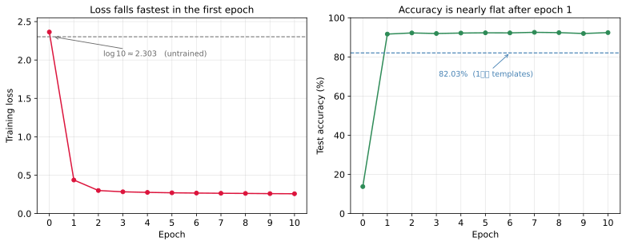

# 구현과 결과

---

## 1. 학습 목표

이 쪽을 마치면 다음을 할 수 있게 된다.

- 사슬의 다섯 고리가 코드의 어느 줄에 해당하는지 짚기
- 82.03%에서 92.51%로 오른 몫을 무엇이 벌었는지 말하기
- 학습 곡선을 읽어 손실의 낙폭이 어디에 몰려 있는지 말하기
- 정확도가 오르내리는 것과 손실이 줄어드는 것이 어떻게 어긋날 수 있는지 설명하기
- 이 모델이 어디서 막히는지 학습 정확도로 확인하기

---

## 2. 사슬이 코드의 어디에 있는가

앞의 다섯 쪽을 코드로 옮기면 아래와 같다. 사슬의 고리마다 대응하는 줄이 하나씩 있다.

| 고리 | 코드 |
|---|---|
| [선형 모델](01_linear_model.md) | `nn.Linear(28 * 28, 10)` |
| [소프트맥스](02_softmax.md) | `CrossEntropyLoss` 안에 들어 있다 |
| [최대가능도 추정](03_mle.md) | 손실을 최소화하는 일 전체 |
| [교차 엔트로피 손실](04_cross_entropy.md) | `criterion = nn.CrossEntropyLoss()` |
| [경사 하강법](05_gradient_descent.md) | `loss.backward()`와 `optimizer.step()` |

---

## 3. 코드

```python
"""
2단계: MNIST 선형 모델 + 소프트맥스

은닉층이 하나도 없다. 784차원 입력을 10개 로짓으로 옮기는 아핀 변환
하나뿐이며, 학습할 수는 784*10 + 10 = 7850개다.
1단계가 이 가중치를 클래스 평균으로 못박았다면, 여기서는 데이터에
맞추어 학습한다.
"""

import torch
import torch.nn as nn
import torch.optim as optim
from torch.utils.data import DataLoader
from torchvision import datasets, transforms

torch.manual_seed(42)
device = torch.device('cuda' if torch.cuda.is_available() else 'cpu')

# 아래 주석에서 오른쪽 끝의 괄호가 그 줄을 지난 뒤의 텐서 모양이다.
# B는 묶음 크기이며 학습에서는 128, 시험에서는 1000이다.

# =============================================================================
# 데이터
# =============================================================================
# 네 걸음 모두 같은 정규화를 쓴다. 0.1307과 0.3081은 MNIST 학습 집합의
# 화소 평균과 표준편차이며, 이래야 결과를 나란히 견줄 수 있다
transform = transforms.Compose([
    transforms.ToTensor(),                    # PIL 28x28 -> (1, 28, 28), [0,1]
    transforms.Normalize((0.1307,), (0.3081,)),   # 모양 그대로  (1, 28, 28)
])

train_dataset = datasets.MNIST('./data', train=True, download=True, transform=transform)
test_dataset = datasets.MNIST('./data', train=False, download=True, transform=transform)
# 표본 하나는 ((1, 28, 28) 텐서, 정수 레이블) 짝이다

train_loader = DataLoader(train_dataset, batch_size=128, shuffle=True)
test_loader = DataLoader(test_dataset, batch_size=1000, shuffle=False)
# 부르개가 묶음 축을 앞에 붙인다
#   images: (B, 1, 28, 28)      labels: (B,)  0~9 정수

# =============================================================================
# 모델: y = xA + b
# =============================================================================
# nn.Flatten이 (B, 1, 28, 28)을 (B, 784)로 편다. 1단계에서 view로 하던
# 일과 같으며, 여기서도 이 순간 화소의 이웃 관계가 사라진다.
# 그 뒤는 nn.Linear 하나뿐이다. 은닉층도 활성화 함수도 없으므로 이
# 모델이 표현할 수 있는 결정 경계는 선형이다.
# 소프트맥스를 붙이지 않는 까닭은 아래 CrossEntropyLoss가 안에 품고
# 있기 때문이다. 여기서 또 걸면 두 번 적용된다
model = nn.Sequential(
    nn.Flatten(),               # (B, 1, 28, 28) -> (B, 784)
    nn.Linear(28 * 28, 10),     # (B, 784)       -> (B, 10)   로짓
).to(device)

# 매개변수는 두 개뿐이다
#   weight: (10, 784)   클래스마다 784개 화소에 매기는 무게 한 줄
#   bias:   (10,)       클래스마다 상수 하나
# 784*10 + 10 = 7850
n_params = sum(p.numel() for p in model.parameters())
print(f"Trainable parameters: {n_params:,}")   # 7,850

# =============================================================================
# 손실과 최적화: 사슬 그대로
# =============================================================================
# CrossEntropyLoss가 곧 손실 -l이다. 안에서 log_softmax와 NLLLoss를
# 합쳐 계산하므로, 소프트맥스를 따로 적용하는 것보다 수치적으로 안정하다.
# 로짓 (B, 10)과 정수 레이블 (B,)을 받아 스칼라 하나를 돌려준다.
# 레이블이 원-핫 (B, 10)이 아니라 정수 (B,)라는 점을 눈여겨볼 것
criterion = nn.CrossEntropyLoss()
# Adam이 theta <- theta - lambda * g 갱신을 매개변수마다 조절해 수행한다
optimizer = optim.Adam(model.parameters(), lr=1e-3)


def evaluate(loader):
    """시험 정확도를 백분율로 돌려준다."""
    model.eval()
    correct = total = 0
    with torch.no_grad():
        for images, labels in loader:
            images, labels = images.to(device), labels.to(device)
            #                        images: (B, 1, 28, 28)   labels: (B,)
            preds = model(images).argmax(dim=1)
            # model(images): (B, 10) 로짓 -> argmax로 축 1을 접어  (B,)
            # 로짓의 순서가 소프트맥스를 지나도 그대로이므로, 예측만
            # 할 것이면 확률로 옮길 까닭이 없다
            correct += (preds == labels).sum().item()   # (B,) -> 스칼라
            total += labels.size(0)
    return 100 * correct / total


# =============================================================================
# 학습
# =============================================================================
EPOCHS = 10
for epoch in range(1, EPOCHS + 1):
    model.train()
    running = 0.0
    for images, labels in train_loader:
        images, labels = images.to(device), labels.to(device)
        #                    images: (B, 1, 28, 28)     labels: (B,)
        optimizer.zero_grad()          # 기울기는 누적되므로 매번 지운다
        loss = criterion(model(images), labels)
        #                (B, 10)        (B,)   ->  loss: () 스칼라
        loss.backward()                # dl/dtheta 를 채운다
        #   weight.grad: (10, 784)     bias.grad: (10,)   매개변수와 같은 모양
        optimizer.step()               # theta - lambda * g
        running += loss.item() * images.size(0)
        # loss는 묶음 안에서 이미 평균이므로, 묶음 크기를 곱해 되돌려
        # 더해야 에포크 평균이 맞는다. 60000 = 128*468 + 96이라 마지막
        # 묶음이 96개뿐이며, 그래서 images.size(0)을 쓰고 128을 쓰지 않는다

    print(f"Epoch {epoch:2d}/{EPOCHS}  "
          f"Loss: {running / len(train_dataset):.4f}  "
          f"Test Accuracy: {evaluate(test_loader):.2f}%")

print(f"\nFinal Test Accuracy: {evaluate(test_loader):.2f}%")
```

**출력:**

```
Trainable parameters: 7,850
Epoch  1/10  Loss: 0.4350  Test Accuracy: 91.45%
Epoch  2/10  Loss: 0.2989  Test Accuracy: 91.91%
Epoch  3/10  Loss: 0.2843  Test Accuracy: 92.54%
Epoch  4/10  Loss: 0.2762  Test Accuracy: 91.99%
Epoch  5/10  Loss: 0.2713  Test Accuracy: 92.38%
Epoch  6/10  Loss: 0.2666  Test Accuracy: 92.52%
Epoch  7/10  Loss: 0.2629  Test Accuracy: 92.02%
Epoch  8/10  Loss: 0.2622  Test Accuracy: 92.19%
Epoch  9/10  Loss: 0.2590  Test Accuracy: 92.37%
Epoch 10/10  Loss: 0.2575  Test Accuracy: 92.51%

Final Test Accuracy: 92.51%
```

첫 에포크에 이미 91.45%에 닿는다는 점을 눈여겨보라. 손실도 $\log 10 \approx 2.30$에서 시작해 0.4350까지 내려왔다. 볼록한 문제라 초반에 빠르게 내려가고, 남은 아홉 에포크가 1.06%포인트를 더한다.

열 줄을 모두 실은 까닭이 있다. **손실은 한 번도 올라가지 않는데 정확도는 오르내린다.** 3에포크의 92.54%가 마지막 10에포크의 92.51%보다 높고, 6에포크의 92.52%도 그렇다. 곧 마지막 모델이 가장 좋은 모델이 아니다. 왜 그런지는 아래에서 본다.

### 에포크에 따른 손실

에포크마다의 손실과 정확도를 기록해 그리면 이 말이 눈에 보인다. 아래는 같은 코드를 다시 돌려 얻은 것이며, 학습을 시작하기 **전**의 값을 0에포크로 함께 찍었다.



| 에포크 | 0 | 1 | 2 | 3 | 4 | 5 | 6 | 7 | 8 | 9 | 10 |
|---|---|---|---|---|---|---|---|---|---|---|---|
| 학습 손실 | 2.3644 | **0.4368** | 0.3001 | 0.2833 | 0.2757 | 0.2703 | 0.2669 | 0.2641 | 0.2621 | 0.2595 | 0.2578 |
| 시험 정확도 | 13.77% | **91.67%** | 92.25% | 91.97% | 92.20% | 92.32% | 92.28% | 92.57% | 92.41% | 91.97% | 92.42% |

세 가지를 읽을 수 있다.

**시작점이 예측한 자리에 있다.** 학습 전 손실이 2.3644로 [교차 엔트로피 손실](04_cross_entropy.md)에서 셈한 $\log 10 \approx 2.3026$ 바로 위에 있고, 정확도는 13.77%로 무작위로 찍는 10%와 크게 다르지 않다. 학습 곡선의 첫 점을 확인하는 것만으로 파이프라인이 제대로 물려 있는지 알 수 있다.

**손실의 거의 전부가 첫 에포크에 떨어진다.** 전체 낙폭 $2.3644 - 0.2578 = 2.107$ 가운데 첫 에포크가 $2.3644 - 0.4368 = 1.928$, 곧 **91.5%**를 가져간다. 남은 아홉 에포크가 나눠 갖는 것은 8.5%뿐이다. 손실면이 볼록해서 멀리 있을 때 기울기가 크고 최솟값에 가까워지면 작아지기 때문이며([경사 하강법](05_gradient_descent.md)), 첫 에포크의 469걸음이 이미 골짜기 바닥 근처까지 데려다 놓는다.

**정확도는 오르기만 하지 않는다.** 이 표에서도 그렇고, 앞에 실은 출력에서도 그렇다. 두 번 돌려 두 번 다 나타나는 결이다.

마지막 관찰이 특히 중요하다. 손실은 확률을 재는 **매끄러운** 값이지만 정확도는 "가장 큰 로짓이 맞았는가"만 세는 **계단** 값이다. 경계에 걸친 표본 몇 개가 넘나들면 정확도는 0.3~0.6%포인트씩 흔들리지만 손실은 꿈쩍도 하지 않는다.

앞의 출력에서 곧바로 확인할 수 있다.

| 에포크 | 3 | 4 | | 6 | 7 |
|---|---|---|---|---|---|
| 학습 손실 | 0.2843 | 0.2762 ↓ | | 0.2666 | 0.2629 ↓ |
| 시험 정확도 | **92.54%** | 91.99% ↑↓ | | **92.52%** | 92.02% ↑↓ |

두 곳 모두 손실은 **줄어들기만** 했는데 정확도는 0.5%포인트씩 떨어졌다.

그러므로 **정확도가 0.2%포인트 올랐다고 모델이 나아진 것이 아니다.** 이 흔들림보다 작은 차이를 두고 두 모델의 우열을 말하면 안 되며, 이 장의 걸음들이 10%포인트 단위로 벌어지는 것은 그래서 다행스러운 일이다.

그리고 여기서 따라 나오는 실용적인 결론이 있다. 앞의 출력에서 가장 높은 정확도는 마지막 에포크가 아니라 **3에포크의 92.54%**다. 마지막 모델을 그냥 쓰는 것이 늘 최선은 아니라는 뜻이며, 검증 자료로 가장 좋은 시점의 가중치를 골라 두는 관례가 여기서 나온다. 다만 그 차이가 0.03%포인트이므로 이 경우에는 흔들림 안이고, **고를 값이 없다**고 보는 편이 옳다.

---

## 4. 무엇이 10%포인트를 벌었는가

1단계의 82.03%에서 **92.51%**로 올랐다.

| | 1단계 | 2단계 |
|---|---|---|
| 매개변수 | 7,850 (고정) | 7,850 (학습) |
| 결정 경계 | 선형 | 선형 |
| 정확도 | 82.03% | **92.51%** |

매개변수 수가 **같다.** 모델을 키우지 않았고 층을 쌓지도 않았다. 달라진 것은 그 7,850개를 클래스 평균으로 못박느냐 데이터에 맞추어 움직이느냐뿐이다.

그러면 학습이 구체적으로 무엇을 더 했는가? 학습된 가중치를 그려 보면 답이 보인다. 클래스 평균은 숫자 모양 그대로의 흐릿한 자국이지만, 학습된 가중치는 **양수와 음수가 섞인** 무늬다. 곧 "이 자리가 켜져 있으면 3이다"뿐 아니라 "이 자리가 켜져 있으면 3이 **아니다**"까지 담는다.

클래스 평균은 그 클래스만 보고 만들어지므로 다른 클래스와 어떻게 구별할지를 담을 길이 없다. 학습은 클래스를 **가르는** 데 쓸모 있는 방향으로 가중치를 옮긴다. [01절 연습문제 4](01_linear_model.md)에서 상관계수로 재어 본다.

---

## 5. 어디서 막히는가

이 모델이 그릴 수 있는 결정 경계는 여전히 초평면뿐이다. 그 제약이 실제로 걸림돌인지 확인하는 방법이 있다. **학습 정확도**를 보는 것이다.

50 에포크까지 돌려도 학습 정확도가 100%에 이르지 못한다. 곧 MNIST의 학습 집합은 선형으로 완전히 가를 수 없다. 어떤 $(A, b)$로도 6만 장을 모두 맞출 수 없다는 뜻이다.

이것이 중요한 구별이다. 여기서 막히는 것은

- 학습이 부족해서가 **아니고**
- 최적화기가 나빠서가 **아니고**
- 자료가 모자라서도 **아니다**

**모델이 담을 수 있는 함수의 모둠 안에 정답이 없다.** 이런 막힘은 더 돌리거나 학습률을 만져서 풀리지 않는다. 모델을 바꾸어야 한다.

그것이 [3.3 다층 퍼셉트론](../mnist/03_mlp.md)이 하는 일이다. 다만 거기서도 곧바로 되지는 않는다. 층을 쌓는 것만으로는 이 쪽과 똑같은 자리에 머문다는 사실을 먼저 보게 된다.

---

## 연습문제

!!! note "아래 풀이의 수치에 대하여"
    풀이에 적힌 정확도는 모두 이 절의 설정(정규화 적용, 묶음 128, Adam $10^{-3}$, 10 에포크, 씨앗 42)으로 실제로 재어 얻은 것이다. 초기 가중치와 자료를 섞는 차례가 실행마다 달라 마지막 자리가 0.1~0.4%포인트쯤 흔들리므로, 본문이 보고하는 92.51%와 조금 다를 수 있다. 한 표 안의 값들은 같은 조건에서 잰 것이므로 서로 견주는 데에는 문제가 없다.

<div class="drillbox" markdown>

**연습문제 1.** <span class="diff easy" title="쉬움"></span>
코드에서 사슬의 다섯 고리가 각각 어느 줄인지 짚어라. 소프트맥스는 어디에 있는가?

</div>

??? success "연습문제 1 풀이"
    | 고리 | 줄 |
    |---|---|
    | 선형 모델 | `nn.Linear(28 * 28, 10)` |
    | 소프트맥스 | **눈에 보이지 않는다** — `CrossEntropyLoss` 안에 있다 |
    | 최대가능도 추정 | 손실을 최소화한다는 전체 구조 |
    | 교차 엔트로피 손실 | `criterion = nn.CrossEntropyLoss()` |
    | 경사 하강법 | `loss.backward()` + `optimizer.step()` |

    소프트맥스가 코드에 보이지 않는다는 점이 처음 보면 당황스럽다. 모델은
    `nn.Flatten`과 `nn.Linear` 둘뿐이고 활성화도 소프트맥스도 없다.

    `nn.CrossEntropyLoss`가 안에서 `log_softmax`와 음의 로그가능도를 합쳐 셈하기
    때문이다. 이렇게 묶는 까닭이 둘이다. 수치적으로 안정하고
    ([02절](02_softmax.md)), 기울기가 $p - t$로 깔끔하게 떨어진다
    ([04 연습문제 8](04_cross_entropy.md)).

    그래서 모델에 소프트맥스를 **또** 붙이면 두 번 적용되어 조용히 학습을 망친다.
    이것이 초보자가 가장 자주 겪는 함정이며, [02절 연습문제 3](02_softmax.md)에서
    다룬다.

---

<div class="drillbox" markdown>

**연습문제 2.** <span class="diff easy" title="쉬움"></span>
`optimizer.zero_grad()`, `loss.backward()`, `optimizer.step()`의 순서를 바꾸면 각각 무엇이 잘못되는가?

</div>

??? success "연습문제 2 풀이"
    올바른 순서는 **지우고 → 셈하고 → 갱신한다**이다.

    | 잘못된 순서 | 무엇이 일어나는가 |
    |---|---|
    | `backward()` → `zero_grad()` → `step()` | 기울기를 셈한 뒤 지우므로 **`step()`이 0인 기울기로 갱신한다.** 매개변수가 전혀 바뀌지 않고 손실이 처음 값에 머문다 |
    | `backward()` → `step()` → `zero_grad()` | **올바르게 작동한다.** 다음 반복 전에 지우면 되므로 위치만 다를 뿐이다 |
    | `zero_grad()` → `step()` → `backward()` | 기울기 0으로 갱신한 뒤 기울기를 셈하지만 쓰지 않는다. 역시 학습이 안 된다 |
    | `zero_grad()` 생략 | 기울기가 누적된다([05 연습문제 2](05_gradient_descent.md)) |

    둘째 줄이 중요하다. `zero_grad()`를 반복의 **끝**에 두어도 맞다. 지우는 시점이
    "`backward()` 이전"이기만 하면 되기 때문이다. 실제로 두 관례가 모두 쓰인다.

    가장 알아채기 어려운 것이 첫째 줄이다. 오류도 경고도 없이 손실이 전혀 줄지
    않는다. 이럴 때 `model[1].weight.grad.norm()`을 찍어 보면 0이 나와 원인이
    바로 드러난다([05 연습문제 7](05_gradient_descent.md)).

---

<div class="drillbox" markdown>

**연습문제 3.** <span class="diff easy" title="쉬움"></span>
첫 에포크만으로 이미 90.86%에 닿는다. 나머지 아홉 에포크가 더하는 것은 1.65%포인트뿐이다. 이 모양을 어떻게 설명하는가?

</div>

??? success "연습문제 3 풀이"
    손실면이 **볼록**하기 때문이다([05절](05_gradient_descent.md)).

    볼록한 골짜기에서는 멀리 있을 때 기울기가 크고 가까워지면 작아진다. 첫 에포크에
    469걸음을 내딛는 동안 기울기 노름이 4.512에서 0.870으로 5분의 1이 되는데
    ([05 연습문제 7](05_gradient_descent.md)), 이는 이미 최솟값 근처에 닿았다는 뜻이다.
    손실도 $\log 10 \approx 2.30$에서 0.47까지 내려왔다.

    그 뒤로는 남은 거리가 짧으니 얻을 것도 적다. 92.51%가 이 모델이 닿을 수 있는
    천장이므로, 아홉 에포크는 그 천장에 바짝 붙는 데 쓰인다.

    이 모양을 알아 두면 실험 설계에 도움이 된다. **볼록하고 쉬운 문제라면 몇 에포크로
    거의 답이 나온다.** 그러니 이 모델의 학습률이나 묶음 크기를 고를 때 10 에포크를
    매번 돌릴 필요가 없고, 2~3 에포크로 견주어도 순서가 거의 같다.

    깊은 모델에서는 이야기가 다르다. 초반에 천천히 오르다가 어느 순간 빠르게 좋아지거나,
    한참 정체하다 움직이는 일이 흔하다. 학습 곡선의 모양이 모델의 성격을 말해 준다.

---

<div class="drillbox" markdown>

**연습문제 4.** <span class="diff med" title="중간"></span>
클래스별 정확도를 재어 어느 숫자가 가장 자주 틀리는지 찾아라. [1단계](../mnist/01_template_learning.md)의 결과와 견주면 어떤가?

</div>

??? success "연습문제 4 풀이"
    ```python
    conf = torch.zeros(10, 10, dtype=torch.long)
    for t, p in zip(y_test, pred):
        conf[t, p] += 1
    per = 100 * conf.diag() / conf.sum(dim=1)
    ```

    | 숫자 | 0 | 1 | 2 | 3 | 4 | 5 | 6 | 7 | 8 | 9 |
    |---|---|---|---|---|---|---|---|---|---|---|
    | 2단계 | 97.8 | 97.6 | 88.5 | 92.0 | 93.5 | **85.3** | 95.4 | 91.8 | 89.4 | 91.8 |
    | 1단계 | 89.6 | 96.2 | 75.7 | 80.6 | 82.6 | **68.6** | 86.3 | 83.3 | 73.7 | 80.7 |

    가장 낮은 클래스가 **5(85.3%)**이며, 1단계에서도 5가 가장 낮았다(68.6%).

    두 가지를 읽을 수 있다.

    **어려운 숫자는 그대로 어렵다.** 1단계와 2단계의 순서가 거의 같다. 5, 8, 2가
    아래쪽이고 0, 1이 위쪽이다. 학습이 모든 클래스를 고르게 끌어올렸을 뿐, 어느
    숫자가 헷갈리는지는 자료 자체의 성질이라 모델을 바꾸어도 잘 안 바뀐다.

    **그러나 오른 폭은 고르지 않다.** 1이 96.2%에서 97.6%로 1.4%포인트 오른 반면
    8은 73.7%에서 89.4%로 15.7%포인트 올랐다. 1은 1단계에서도 이미 잘되고 있었으므로
    남은 여지가 적었고, 8은 평균 템플릿으로는 3·5와 뒤엉켰지만 학습된 가중치가
    음수 자리를 써서 갈라낼 수 있었다([01 연습문제 4](01_linear_model.md)).

    곧 학습이 벌어 준 10%포인트는 **어려운 클래스에 몰려 있다.**

---

<div class="drillbox" markdown>

**연습문제 5.** <span class="diff med" title="중간"></span>
혼동 행렬에서 가장 흔한 잘못을 찾아라. 그 짝이 왜 헷갈리는가?

</div>

??? success "연습문제 5 풀이"
    대각선을 지우고 가장 큰 값을 찾는다.

    ```python
    off = conf.clone(); off.fill_diagonal_(0)
    i, j = divmod(off.argmax().item(), 10)
    print(i, "->", j, off[i, j].item())
    ```

    가장 흔한 잘못은 **2를 8로 예측하는 것(45회)**이다.

    2와 8이 헷갈리는 까닭은 획이 지나가는 자리가 많이 겹치기 때문이다. 2의 아래쪽
    가로획과 위쪽 곡선은 8의 아래 고리와 위 고리가 차지하는 자리와 상당히 겹친다.
    특히 2를 아래에 고리를 넣어 쓰는 필체는 8과 거의 같은 화소를 켠다.

    이 모델이 선형이라는 점이 여기서 아프다. 2와 8을 가르려면 "위쪽 고리가 닫혀
    있는가"를 보아야 하는데, 그것은 화소 하나하나의 가중합으로 판단할 수 있는
    성질이 아니다. 닫힘은 화소들 사이의 **관계**이기 때문이다.

    [3.4 합성곱 신경망](../mnist/04_cnn.md)이 이 지점을 겨냥한다. 작은 필터가 국소적인
    무늬(획의 끝, 꺾임, 이음)를 읽으므로 고리가 닫혔는지를 훨씬 잘 잡아낸다.
    참고로 1단계에서 가장 흔한 혼동은 5와 8이 3으로 흘러가는 것이었다.

---

<div class="drillbox" markdown>

**연습문제 6.** <span class="diff med" title="중간"></span>
학습 정확도와 시험 정확도를 함께 재어라. 이 모델은 과적합하고 있는가?

</div>

??? success "연습문제 6 풀이"
    | | 학습 | 시험 | 차이 |
    |---|---|---|---|
    | 10 에포크 | 92.8% 안팎 | 92.42% | 0.4%p |
    | 50 에포크 | 93.38% | 92.16% | 1.2%p |

    **과적합하고 있지 않다.** 두 가지 근거가 있다.

    첫째, 학습 정확도와 시험 정확도의 차이가 1%포인트대로 아주 작다. 과적합이라면
    이 간격이 크게 벌어진다.

    둘째, 더 결정적으로 **학습 정확도조차 100%에 한참 못 미친다.** 6만 장을 다 외우지
    못하고 있다. 과적합은 자료를 외우고 있을 때 생기는 문제이므로, 외우지도 못하는
    모델에게는 해당하지 않는다.

    이것은 **과소적합**이며, 처방이 정반대다.

    | | 과적합 | 과소적합 (이 경우) |
    |---|---|---|
    | 증상 | 학습 ≫ 시험 | 학습 ≈ 시험, 둘 다 낮음 |
    | 처방 | 정칙화, 자료 늘리기, 모델 줄이기 | **모델을 키우거나 바꾼다** |

    그래서 [01절 연습문제 8](01_linear_model.md)에서 가중치 감쇠가, 그리고
    [04절 연습문제 7](04_cross_entropy.md)에서 이름표 평탄화가 모두 정확도를 **떨어뜨렸다.**
    과소적합 중인 모델에 정칙화를 더하면 손해만 남는다.

    진단을 먼저 하고 처방을 고르는 순서가 중요하다. 정확도가 낮다는 사실만으로는
    어느 쪽인지 알 수 없고, 학습 정확도를 함께 보아야 갈린다.

---

<div class="drillbox" markdown>

**연습문제 7.** <span class="diff med" title="중간"></span>
틀린 예측 몇 개를 그려 보라. 사람이 보아도 어려운 것과 모델만 틀린 것을 가려낼 수 있는가?

</div>

??? success "연습문제 7 풀이"
    ```python
    wrong = (pred != y_test).nonzero().squeeze()
    for idx in wrong[:12]:
        plt.imshow(X_test[idx].squeeze(), cmap='gray')
        plt.title(f"true {y_test[idx].item()}, pred {pred[idx].item()}")
    ```

    두 부류가 눈에 띈다.

    **사람도 헷갈리는 것.** 획이 끊겼거나 지나치게 흘려 써서 무엇인지 단정하기
    어려운 글씨들이 있다. MNIST에는 이런 표본이 실제로 몇백 장 있고, 사람의
    분류 정확도도 100%가 아니라 98% 남짓으로 알려져 있다. 이 부류는 어떤 모델로도
    맞히기 어렵다.

    **모델만 틀리는 것.** 사람 눈에는 명백한 3인데 8로 예측하는 경우가 훨씬 많다.
    이쪽이 이 모델의 한계를 보여 준다. 두드러진 특징은 획이 굵거나 크게 기울었거나
    한쪽으로 치우친 글씨들이다. 모두 화소 위치를 그대로 견주는 방식이 약한 지점이며,
    [1단계 4절](../mnist/01_template_learning.md)이 꼽은 세 약점과 같다.

    이 구별이 실무에서 중요하다. **틀린 예측을 눈으로 보는 것이 다음에 무엇을 할지를
    알려 준다.** 사람도 못 맞히는 것뿐이라면 천장에 닿은 것이므로 더 얻을 것이 없다.
    명백한 것을 틀리고 있다면 모델이나 전처리에 고칠 것이 남아 있다는 뜻이다.

    이 모델은 후자가 훨씬 많으므로 아직 갈 길이 멀다. 실제로 합성곱 신경망이
    99.2%까지 간다.

---

<div class="drillbox" markdown>

**연습문제 8.** <span class="diff med" title="중간"></span>
`evaluate`는 `model.eval()`을, 학습 반복문은 `model.train()`을 부른다. 이 모델에서 두 호출이 실제로 하는 일이 있는가? 그렇다면 왜 적어 두는가?

</div>

??? success "연습문제 8 풀이"
    **이 모델에서는 하는 일이 없다.** `train()`과 `eval()`이 바꾸는 것은 층마다의
    `self.training` 표시뿐이고, 그 표시를 실제로 보는 층은 드롭아웃과 각종 정규화
    층이다. 이 모델은 `nn.Flatten`과 `nn.Linear`뿐이므로 어느 쪽이든 계산이 같다.

    ```python
    model.train(); a = model(X_test[:100])
    model.eval();  b = model(X_test[:100])
    print(torch.equal(a, b))      # True
    ```

    그런데도 적어 두는 까닭이 셋이다.

    1. **모델을 바꾸면 곧 필요해진다.** [3.4 합성곱 신경망](../mnist/04_cnn.md)은
       `nn.Dropout(0.25)`을 쓰므로 그때부터 이 호출이 결과를 바꾼다. 드롭아웃을
       켠 채로 평가하면 뉴런의 4분의 1이 무작위로 꺼진 채 예측하게 되어 정확도가
       낮게 나오고, 같은 입력에 대해 매번 다른 답을 준다.
    2. **빠뜨렸을 때 오류가 나지 않는다.** 정확도가 조금 낮게 나올 뿐이므로
       알아채기 어렵다. `zero_grad()`를 빠뜨리는 것과 같은 종류의 버그다
       ([05 연습문제 2](05_gradient_descent.md)).
    3. **배치 정규화는 더 고약하다.** 학습 모드에서는 묶음의 통계를 쓰고 평가
       모드에서는 누적된 통계를 쓰므로, 모드를 잘못 두면 묶음 크기에 따라 예측이
       달라진다. 묶음 하나로 평가하면 결과가 엉망이 된다.

    그래서 "지금은 필요 없지만 적어 둔다"가 옳은 습관이다. 덧붙여 `eval()`은
    기울기 셈을 끄지 **않는다.** 그것은 `torch.no_grad()`가 하는 다른 일이며,
    평가할 때는 보통 둘을 함께 쓴다.

---

<div class="drillbox" markdown>

**연습문제 9.** <span class="diff hard" title="어려움"></span>
82.03%에서 92.51%로 오른 것을 **남은 오차**로 다시 재어라. 이렇게 재는 것이 왜 더 정직한가?

</div>

??? success "연습문제 9 풀이"
    정확도의 차이와 오차의 비를 함께 보자.

    | | 정확도 | 오차 | 오차의 비 |
    |---|---|---|---|
    | 1단계 템플릿 | 82.03% | 17.97% | — |
    | 2단계 선형 | 92.51% | 7.49% | **58.3% 줄임** |
    | 3단계 다층 퍼셉트론 | 97.42% | 2.58% | 65.6% 줄임 |
    | 4단계 합성곱 | 99.22% | 0.78% | 69.8% 줄임 |

    정확도로 보면 걸음마다 얻는 양이 10.5 → 4.9 → 1.8%포인트로 **줄어드는** 것처럼
    보인다. 뒤로 갈수록 시시해 보인다.

    오차로 보면 완전히 다르다. 세 걸음이 각각 남은 오차의 58%, 66%, 70%를 지운다.
    **오히려 뒤쪽 걸음이 더 큰 일을 한다.**

    오차로 재는 것이 더 정직한 까닭은 **남은 여지를 기준으로 삼기** 때문이다.
    82%에서 10%포인트를 얻는 것과 97%에서 1.8%포인트를 얻는 것은 난이도가 전혀
    다르다. 후자는 앞의 모델이 이미 다 맞힌 쉬운 표본이 없는 상태에서, 남은
    어려운 258개를 180개 더 맞히는 일이다.

    정확도가 높아질수록 이 차이가 극단적으로 벌어진다. 99.0%에서 99.5%로 가는
    0.5%포인트는 오차를 **절반**으로 줄이는 일이며, 99.5%에서 99.9%는 다시 5분의
    1로 줄이는 일이다. 정확도 눈금으로는 둘 다 "0.4%포인트쯤"으로 보인다.

    그래서 성숙한 분야에서는 정확도 대신 오차율로 발표하는 관례가 있다. ImageNet의
    상위-5 오차, 음성 인식의 단어 오차율이 그렇다. 실무에서 목표를 세울 때도
    "정확도 1%포인트 올리기"보다 "오차 절반으로 줄이기"가 더 뜻이 분명하다.

---

<div class="drillbox" markdown>

**연습문제 10.** <span class="diff hard" title="어려움"></span>
이 모델의 정확도를 92.51%보다 크게 올리려면 무엇을 바꾸어야 하는가? 바꿔도 소용없는 것과 소용있는 것을 근거와 함께 가려라.

</div>

??? success "연습문제 10 풀이"
    이 절과 앞 다섯 쪽의 실험이 이미 답을 거의 다 준다.

    **소용없는 것** — 모두 실제로 재어 확인했다.

    | 시도 | 결과 | 근거 |
    |---|---|---|
    | 더 오래 돌리기 | 50 에포크에 92.16% (더 낮다) | [01 연습 11](01_linear_model.md) |
    | 학습률 바꾸기 | $10^{-3}$이 이미 가장 좋다 | [05 연습 4](05_gradient_descent.md) |
    | 최적화기 바꾸기 | Adam = 관성 SGD (볼록하다) | [05 연습 6](05_gradient_descent.md) |
    | 묶음 크기 바꾸기 | 128 근처가 최선 | [05 연습 5](05_gradient_descent.md) |
    | 가중치 감쇠 | 92.48% → 90.15% (나빠진다) | [01 연습 8](01_linear_model.md) |
    | 이름표 평탄화 | 92.42% → 90.71% (나빠진다) | [04 연습 7](04_cross_entropy.md) |
    | 손실 함수 바꾸기 | MSE로 +0.57%p뿐 | [04 연습 6](04_cross_entropy.md) |
    | 편향 늘리거나 줄이기 | 차이 0.06%p | [01 연습 7](01_linear_model.md) |

    공통점이 있다. 이들은 모두 **같은 함수 모둠 안에서 더 좋은 값을 찾으려는** 시도다.
    그런데 학습 정확도가 93.38%에서 멈춘다는 사실이 그 모둠 안에 답이 없음을
    말해 준다([01 연습 11](01_linear_model.md)). 찾기의 문제가 아니라 **찾을 대상이
    없는** 문제이므로, 찾는 방법을 개선해서는 얻을 것이 없다.

    **소용있는 것** — 모델이 표현할 수 있는 함수의 모둠을 넓히는 것뿐이다.

    | 시도 | 무엇을 푸는가 | 어디서 |
    |---|---|---|
    | 비선형성을 넣는다 | 결정 경계가 초평면이라는 제약 | [3.3 다층 퍼셉트론](../mnist/03_mlp.md) → 97.42% |
    | 이웃 관계를 쓴다 | 화소를 순서 없는 꾸러미로 본다는 제약 | [3.4 합성곱 신경망](../mnist/04_cnn.md) → 99.22% |
    | 특징을 손으로 만든다 | 같은 제약을 입력 쪽에서 푼다 | — |
    | 자료를 늘린다 | 평행 이동·회전에 약하다는 제약 | — |

    세 번째와 네 번째도 실제로 통한다. 화소 대신 HOG 같은 특징을 넣으면 선형 모델로도
    97%대에 닿고, 무작위 평행 이동으로 자료를 늘리면 같은 모델이 조금 나아진다.
    곧 **제약을 푸는 방법은 모델 쪽에도 입력 쪽에도 있다.**

    일반적인 교훈은 이것이다. 성능이 막혔을 때 먼저 물어야 하는 것은 "더 잘 찾을 수
    있는가"가 아니라 **"찾을 대상이 모둠 안에 있는가"**이다. 앞의 물음에 답하려면
    학습 정확도를 보면 되고, 이 진단을 건너뛰면 소용없는 시도에 시간을 쏟게 된다.

## 정리하며

**다룬 것** — 사슬을 코드로

앞의 다섯 쪽이 코드 스무 줄로 옮겨진다. `nn.Linear`가 모델이고, `CrossEntropyLoss`가 소프트맥스와 손실을 함께 품고, `backward()`와 `step()`이 경사 하강법이다.

결과는 82.03%에서 92.51%다. 매개변수 수가 1단계와 **똑같으므로**, 이 10%포인트는 순전히 학습이 벌어 준 몫이다. 학습된 가중치가 클래스 평균과 달리 음수를 함께 담아 클래스를 가르는 데 쓰기 때문이다.

그리고 막히는 자리가 분명하다. 학습 정확도조차 100%에 못 미치므로 이 막힘은 모델의 표현력에서 온다. 다음 절이 그 제약을 푼다.
