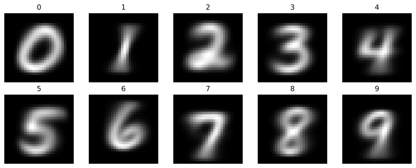

# 템플릿 학습: 학습하지 않는 첫 분류기

이 장은 MNIST 하나로 네 걸음을 걷는다. 그 첫걸음은 학습을 전혀 하지 않는 모델이다. 무엇을 배우기 전에, 배우지 않고 어디까지 갈 수 있는지부터 보아 두자.

MNIST 손글씨 숫자를 분류하는 가장 단순한 방법은 이렇다. 클래스마다 학습 이미지를 모두 평균 내어 **템플릿**을 만들고, 새 이미지는 가장 가까운 템플릿의 클래스로 예측한다. 학습할 가중치도, 역전파도, 반복 루프도 없다. 데이터를 한 번 훑으면 끝난다.

이 방법이 시험 데이터에서 **82.03%**를 맞힌다.

이 페이지를 첫 예제로 두는 데에는 두 가지 이유가 있다.

첫째, 이 장에서 배울 도구가 여기 거의 다 나온다. 텐서 만들기, 인덱싱, 브로드캐스팅, 축약 연산, `DataLoader`, GPU로 옮기기까지 모두 쓰인다. 다만 아직 자동 미분과 최적화기는 쓰지 않는다.

둘째, 82.03%가 이 장의 바닥이 된다. 뒤따르는 세 걸음(3.2 선형 모델과 소프트맥스, 3.3 다층 퍼셉트론, 3.4 합성곱 신경망)은 저마다 생각을 하나씩 더하는데, 그 값어치는 모두 이 82%를 얼마나 끌어올리느냐로 매겨진다.

---

## 1. 핵심 개념

방법은 두 단계뿐이다.

1. **템플릿 만들기** — 클래스 $k$에 속하는 학습 이미지를 모두 평균 내어 템플릿 $\overline{x}_k$를 얻는다.
2. **가장 가까운 템플릿 고르기** — 새 이미지 $x$는 $\overline{x}_k$ 가운데 가장 가까운 것의 클래스로 예측한다.

---

## 2. 수학적 배경

클래스 $k$의 학습 표본 집합을 $\mathcal{D}_k$라 하면 템플릿은 그 평균이다.

$$
\overline{x}_k = \frac{1}{|\mathcal{D}_k|} \sum_{x \in \mathcal{D}_k} x
$$

분류는 제곱 거리를 최소화하는 클래스를 고르는 것이다.

$$
\widehat{y} = \operatorname*{arg\,min}_{k \in \{0,\ldots,9\}} \lVert x - \overline{x}_k \rVert^2
$$

### 사실은 선형 분류기이다

제곱을 전개하면 이 규칙의 정체가 드러난다.

$$
\lVert x - \overline{x}_k \rVert^2 = \lVert x \rVert^2 - 2\,x^{\top}\overline{x}_k + \lVert \overline{x}_k \rVert^2
$$

첫 항 $\lVert x \rVert^2$은 $k$와 무관하므로 어느 클래스를 고르든 똑같이 더해진다. 곧 최소화 문제에서는 지워도 된다. 남은 두 항의 부호를 뒤집으면 최대화 문제가 된다.

$$
\widehat{y} = \operatorname*{arg\,max}_{k} \left( x^{\top}\overline{x}_k - \frac{1}{2}\lVert \overline{x}_k \rVert^2 \right)
$$

이는 가중치 $w_k = \overline{x}_k$, 편향 $b_k = -\tfrac{1}{2}\lVert \overline{x}_k \rVert^2$인 선형 분류기와 정확히 같다. 곧 템플릿 학습은 **가중치를 경사 하강법으로 학습하는 대신 클래스 평균으로 고정해 둔 선형층** 하나인 셈이다. $\square$

이 사실이 82.03%의 성격을 말해 준다. 이 값은 "학습하지 않은 선형 분류기"가 픽셀 공간에서 얻는 성능이며, 여기서 더 올라가려면 가중치를 학습하거나(로지스틱 회귀) 공간 자체를 바꾸어야 한다(합성곱 신경망).

---

## 3. PyTorch 구현

```python
"""
템플릿 학습: 클래스마다 평균 이미지를 만들어 가장 가까운 것으로 분류한다.
신경망 학습도 역전파도 쓰지 않는다.
"""
import torch
from torch.utils.data import DataLoader
from torchvision import datasets, transforms
import matplotlib.pyplot as plt

# === 1. MNIST 불러오기 ===
# ToTensor는 0~255인 uint8 픽셀을 0~1 사이 실수로 바꾼다. 여기서는 이
# 스케일 조정이 결과에 영향을 주지 않는데, 모든 이미지에 같은 변환이
# 걸리므로 거리의 대소 관계가 바뀌지 않기 때문이다
transform = transforms.ToTensor()

train_dataset = datasets.MNIST(
    root="./data",
    train=True,
    download=True,
    transform=transform
)

test_dataset = datasets.MNIST(
    root="./data",
    train=False,
    download=True,
    transform=transform
)

# shuffle=False인 까닭은 이 방법에 학습 순서라는 것이 없어서다. 평균은
# 더하는 순서와 무관하므로 섞을 이유가 없다.
# 배치를 쓰는 것도 경사 때문이 아니라, 6만 장을 한꺼번에 메모리에
# 올리지 않으려는 것뿐이다
train_loader = DataLoader(train_dataset, batch_size=1024, shuffle=False)
test_loader = DataLoader(test_dataset, batch_size=1024, shuffle=False)

# === 2. 클래스마다 평균 이미지 만들기 ===
# 합과 개수를 따로 모아 마지막에 한 번 나눈다. 배치마다 평균을 내어
# 그 평균들을 다시 평균 내면 안 된다. 배치마다 클래스별 장수가 달라
# 잘못된 가중 평균이 되기 때문이다
digit_sums = torch.zeros(10, 28, 28)
digit_counts = torch.zeros(10)

for images, labels in train_loader:
    # (배치, 1, 28, 28) -> (배치, 28, 28). MNIST는 흑백이라 채널 축이
    # 1뿐이므로 squeeze로 없앤다
    images = images.squeeze(1)

    for digit in range(10):
        # 불리언 마스크로 이 배치 안에서 해당 숫자인 이미지만 고른다
        mask = labels == digit
        # dim=0으로 축약하면 선택된 이미지들이 픽셀별로 더해져 (28, 28)이
        # 된다. 선택된 것이 하나도 없어도 0으로 채운 (28, 28)이 나와
        # 오류가 나지 않는다
        digit_sums[digit] += images[mask].sum(dim=0)
        digit_counts[digit] += mask.sum()

# [:, None, None]로 (10,)을 (10, 1, 1)로 만들어 브로드캐스팅이 되게 한다.
# 이것 없이 나누면 모양이 맞지 않아 오류가 난다
average_images = digit_sums / digit_counts[:, None, None]

print(digit_counts)
print(average_images.shape)  # torch.Size([10, 28, 28])
```

**출력:**

```
tensor([5923., 6742., 5958., 6131., 5842., 5421., 5918., 6265., 5851., 5949.])
torch.Size([10, 28, 28])
```

클래스별 장수가 5421부터 6742까지 고르지 않다는 점에 주목하라. 평균을 내는 방식이라 이 불균형이 템플릿 자체를 왜곡하지는 않지만, 뒤에서 볼 클래스별 정확도에는 영향을 준다.

### 템플릿 열 장 그려 보기

```python
# 만들어진 템플릿을 눈으로 보는 것이 이 방법을 이해하는 가장 빠른 길이다.
# 흐릿한 숫자 열 개가 나오는데, 그 흐릿함이 곧 이 방법의 한계를 말해 준다.
# 같은 숫자라도 사람마다 쓰는 모양이 달라, 평균을 내면 그 차이가 뭉개진다
fig, axes = plt.subplots(2, 5, figsize=(10, 4))

for digit, ax in enumerate(axes.flat):
    ax.imshow(average_images[digit], cmap="gray")
    ax.set_title(str(digit))
    ax.axis("off")

plt.tight_layout()
plt.show()
```



흐릿하다는 것이 이 그림의 요점이다. 0과 1은 그래도 또렷한 편인데, 사람마다 쓰는 모양이 비슷하기 때문이다. 반면 2, 5, 8은 뭉개져 형체가 흐리다. 같은 숫자를 쓰는 방식이 여럿이라 평균이 그 차이를 지워 버린 것이다.

배경이 완전한 검정이 아니라 옅은 회색 테두리를 두른 것도 눈여겨볼 만하다. 어떤 사람은 크게 쓰고 어떤 사람은 작게 써서, 평균을 내면 획이 지나갈 **수도** 있었던 자리가 전부 옅게 켜진다.

이 흐릿함이 그대로 82.03%라는 값의 정체다. 4절에서 그 까닭을 셋으로 나누어 본다.

### 가장 가까운 템플릿으로 분류하기

```python
def predict(images, templates):
    """가장 가까운 템플릿의 클래스를 반환한다.

    인수:
        images:    (배치, 1, 28, 28)
        templates: (10, 28, 28)
    반환값:
        (배치,) 모양의 예측 클래스
    """
    images = images.squeeze(1)

    # 브로드캐스팅으로 모든 (이미지, 템플릿) 쌍의 거리를 한 번에 계산한다.
    #   images[:, None]    -> (배치,  1, 28, 28)
    #   templates[None, :] -> (   1, 10, 28, 28)
    # 빼면 (배치, 10, 28, 28)이 되고, 픽셀 축 (2, 3)을 축약하면
    # (배치, 10)짜리 거리 표가 남는다.
    # 반복문으로 열 번 도는 것보다 훨씬 빠르지만, 배치가 크면
    # (배치, 10, 28, 28) 중간 텐서가 메모리를 꽤 차지한다
    distances = (
        images[:, None, :, :] - templates[None, :, :, :]
    ).square().sum(dim=(2, 3))

    # 제곱근을 씌우지 않는다. 제곱근은 단조 증가 함수라 최솟값의 위치를
    # 바꾸지 않으므로, 굳이 계산을 더할 이유가 없다
    return distances.argmin(dim=1)


# === 4. 시험 데이터로 평가하기 ===
correct = 0
total = 0

for images, labels in test_loader:
    predictions = predict(images, average_images)

    correct += (predictions == labels).sum().item()
    total += labels.size(0)

accuracy = correct / total

print(f"Test accuracy: {accuracy:.2%}")
```

**출력:**

```
Test accuracy: 82.03%
```

---

## 4. 이 값을 어떻게 볼 것인가

82.03%는 두 방향에서 읽어야 한다.

아래에서 보면 꽤 높다. 열 클래스를 무작위로 찍으면 10%이므로, 평균 내기 하나로 그보다 여덟 배 넘게 잘한다. 학습할 매개변수가 하나도 없고 데이터를 한 번만 훑는데도 그렇다.

위에서 보면 한참 낮다. 같은 MNIST에서 로지스틱 회귀는 92% 언저리, 작은 합성곱 신경망은 99%를 넘긴다. 그 사이의 간격이 곧 학습이 벌어 주는 몫이다.

간격이 생기는 까닭은 픽셀 공간에서 거리를 재기 때문이다.

- **한 클래스 안의 여러 모양을 평균이 뭉갠다.** 1을 곧게 쓰는 사람과 비스듬히 쓰는 사람의 이미지를 평균 내면 어느 쪽과도 닮지 않은 흐릿한 자국이 남는다.
- **평행 이동과 회전에 약하다.** 같은 숫자라도 두 픽셀만 옆으로 밀리면 제곱 거리가 크게 뛴다. 픽셀을 위치별로 대응시켜 비교하기 때문이다.
- **획의 굵기에 휘둘린다.** 굵게 쓴 이미지는 켜진 픽셀이 많아 어느 템플릿과도 거리가 멀어진다.

뒤따르는 세 걸음이 이 세 가지를 차례로 걷어낸다. [3.2 선형 모델과 소프트맥스](../linear_softmax/index.md)은 가중치를 고정하는 대신 데이터에 맞추어 움직이고, [3.3 다층 퍼셉트론](03_mlp.md)은 층을 쌓아 한 클래스의 여러 필체를 따로 다루며, [3.4 합성곱 신경망](04_cnn.md)은 화소의 이웃 관계를 되찾아 평행 이동에 강해진다. 그 학습을 실제로 굴러가게 하는 도구(자동 미분, 경사 하강법)는 [5장 PyTorch 기초](../../ch05/index.md)에서 다룬다.

같은 아이디어를 배운 표현 위에서 되살린 것이 [원형 망](../../ch14/metric_learning/prototypical.md)이다. 클래스를 그 표본들의 평균으로 나타내고 가장 가까운 것을 고른다는 뼈대는 그대로 두고, 평균을 날것의 픽셀이 아니라 학습된 임베딩 공간에서 잡는다.

---

## 연습문제

<div class="drillbox" markdown>

**연습문제 1.** <span class="diff easy" title="쉬움"></span>
이 방법이 들고 있는 수를 세어라. 템플릿 열 장과 2절에서 얻은 편향을 합쳐 모두 몇 개인가? [3.2절](../linear_softmax/01_linear_model.md)의 `nn.Linear(784, 10)`과 견주어라.

</div>

??? success "연습문제 1 풀이"
    템플릿 한 장이 $28 \times 28 = 784$개이고 클래스가 열이므로 가중치는 $7{,}840$개,
    편향은 클래스마다 하나씩 $10$개다. 합쳐서 **$7{,}850$개**이다.

    ```python
    print(average_images.numel(), average_images.numel() + 10)   # 7840 7850
    ```

    이는 3.2절의 `nn.Linear(784, 10)`이 가진 수와 **정확히 같다**. 두 모델은 들고 있는
    수가 같고, 그 수를 어떻게 정하느냐만 다르다. 한쪽은 클래스 평균으로 못박고 다른
    쪽은 데이터에 맞추어 움직인다. 82.03%와 92.51%의 차이는 모델의 크기가 아니라
    **그 수를 학습했는가**에서 온다.

---

<div class="drillbox" markdown>

**연습문제 2.** <span class="diff easy" title="쉬움"></span>
클래스마다 $\lVert \overline{x}_k \rVert^2$을 재어 가장 큰 클래스와 가장 작은 클래스를 찾아라. 2절의 식에서 이 값이 하는 구실은 무엇인가?

</div>

??? success "연습문제 2 풀이"
    ```python
    norms = (average_images.reshape(10, -1) ** 2).sum(dim=1)
    for k in range(10):
        print(f"{k}: {norms[k]:.2f}")
    ```

    가장 큰 것은 **0(68.45)**, 가장 작은 것은 **1(28.84)**이다. 0은 굵은 고리라 켜진
    화소가 많고, 1은 가는 세로줄이라 적다.

    2절의 규칙은 $x^{\top}\overline{x}_k - \tfrac{1}{2}\lVert \overline{x}_k \rVert^2$을
    최대화하는 것이었으므로, 이 값은 **클래스마다 다르게 매겨지는 벌점**이다. 템플릿이
    클 수록 더 많이 깎인다. 이것이 없으면 큰 템플릿이 내적만으로 이겨 버린다. 실제로
    벌점을 빼면 어떻게 되는지는 연습문제 8에서 재어 본다.

---

<div class="drillbox" markdown>

**연습문제 3.** <span class="diff easy" title="쉬움"></span>
템플릿 열 장의 평균 밝기를 재어 가장 밝은 숫자와 가장 어두운 숫자를 찾아라. 연습문제 2의 결과와 어떻게 이어지는가?

</div>

??? success "연습문제 3 풀이"
    ```python
    brightness = average_images.reshape(10, -1).mean(dim=1)
    print(brightness.argmax().item(), brightness.argmin().item())   # 0 1
    ```

    가장 밝은 것은 **0**, 가장 어두운 것은 **1**이다. 밝기는 켜진 화소의 양이므로
    $\lVert \overline{x}_k \rVert^2$과 같은 순서로 늘어선다. 두 값이 재는 것이 사실상
    같기 때문이다.

    곧 이 세 연습문제는 한 가지를 서로 다른 각도에서 보고 있다. **1은 작고 0은 크다**는
    사실이 편향 항을 거쳐 분류 결과까지 흘러간다.

---

<div class="drillbox" markdown>

**연습문제 4.** <span class="diff med" title="중간"></span>
2절에서 제곱 거리 규칙이 가중치 $\overline{x}_k$, 편향 $-\tfrac{1}{2}\lVert \overline{x}_k \rVert^2$인 선형 분류기와 같음을 보였다. 이 가중치와 편향을 `nn.Linear(784, 10)`에 직접 넣고, 그 층의 출력에 `argmax`를 취한 결과가 `predict`와 똑같은지 확인하라.

</div>

??? success "연습문제 4 풀이"
    템플릿을 펼쳐서 가중치에, 그 노름의 절반에 음수를 붙여 편향에 넣는다.
    ```python
    import torch.nn as nn

    layer = nn.Linear(784, 10)
    with torch.no_grad():
        # nn.Linear의 weight는 (출력, 입력) 모양이라 (10, 784)로 편다
        layer.weight.copy_(average_images.reshape(10, 784))
        layer.bias.copy_(-0.5 * average_images.reshape(10, 784).pow(2).sum(dim=1))

    images, labels = next(iter(test_loader))
    with torch.no_grad():
        linear_pred = layer(images.reshape(-1, 784)).argmax(dim=1)
    template_pred = predict(images, average_images)
    print(torch.equal(linear_pred, template_pred))  # True
    ```
    둘이 정확히 같게 나온다. 곧 이 방법은 이미 선형 분류기이며, 다른 점은 가중치를 경사 하강법으로 학습하지 않고 클래스 평균으로 고정해 두었다는 것뿐이다. 로지스틱 회귀가 92% 언저리까지 올라가는 것은 같은 형태의 가중치를 데이터에 맞추어 움직였기 때문이다.

---

<div class="drillbox" markdown>

**연습문제 5.** <span class="diff med" title="중간"></span>
클래스별 정확도를 재어 어느 숫자가 가장 자주 틀리는지 찾아라. 그 숫자가 무엇과 혼동되는지 혼동 행렬로 확인하고, 템플릿 이미지를 보며 까닭을 설명하라.

</div>

??? success "연습문제 5 풀이"
    클래스마다 맞은 수와 전체 수를 따로 센다.
    ```python
    correct_per = torch.zeros(10)
    total_per = torch.zeros(10)
    confusion = torch.zeros(10, 10, dtype=torch.long)

    for images, labels in test_loader:
        pred = predict(images, average_images)
        for t, p in zip(labels, pred):
            confusion[t, p] += 1
            total_per[t] += 1
            correct_per[t] += (t == p)

    for d in range(10):
        print(f"{d}: {correct_per[d] / total_per[d]:.2%}")
    ```
    클래스별 정확도는 다음과 같다.

    | 숫자 | 0 | 1 | 2 | 3 | 4 | 5 | 6 | 7 | 8 | 9 |
    |---|---|---|---|---|---|---|---|---|---|---|
    | 정확도 | 89.6% | 96.2% | 75.7% | 80.6% | 82.6% | 68.6% | 86.3% | 83.3% | 73.7% | 80.7% |

    1(96.2%)과 0(89.6%)이 가장 잘 맞고, 5(68.6%), 8(73.7%), 2(75.7%)가 가장 자주 틀린다.

    혼동 행렬을 보면 5와 8 모두 **3으로 가장 많이 흘러가고, 그다음이 1**이다. 3으로 가는 것은 짐작대로다. 3, 5, 8의 평균 이미지는 모두 가운데가 굵고 위아래가 둥근 비슷한 자국이라 픽셀 위치로만 비교하면 서로 가깝다.

    1로 흘러가는 것은 뜻밖으로 보이지만 2절의 식이 까닭을 말해 준다. 고르는 규칙은 $x^{\top}\overline{x}_k - \tfrac{1}{2}\lVert \overline{x}_k \rVert^2$을 최대화하는 $k$였다. 1의 평균 이미지는 가는 세로줄뿐이라 켜진 픽셀이 적고, 따라서 $\lVert \overline{x}_1 \rVert^2 = 28.84$로 열 클래스 가운데 가장 작다(가장 큰 0은 68.45다). 곧 편향 항의 벌점이 가장 가벼워, 어느 이미지에나 1이 만만한 후보로 남는다. 클래스마다 템플릿의 크기가 다르면 이런 편향이 생긴다.

---

<div class="drillbox" markdown>

**연습문제 6.** <span class="diff med" title="중간"></span>
평균 대신 클래스별 **중앙값** 이미지를 템플릿으로 삼아 보라. 정확도가 오르는가 내리는가? 왜 그런지 설명하라.

</div>

??? success "연습문제 6 풀이"
    픽셀마다 중앙값을 구하려면 클래스별 이미지를 모두 쌓아 두어야 한다.
    ```python
    by_digit = [[] for _ in range(10)]
    for images, labels in train_loader:
        images = images.squeeze(1)
        for d in range(10):
            by_digit[d].append(images[labels == d])

    median_images = torch.stack([
        torch.cat(by_digit[d]).median(dim=0).values for d in range(10)
    ])
    ```
    정확도가 82.03%에서 **76.59%**로 떨어진다. 중앙값은 이상치에 덜 흔들린다는 장점이 있지만, MNIST 픽셀은 대부분 0이라 클래스에 따라서는 픽셀 절반 이상이 0이어서 중앙값이 0으로 눌린다. 그러면 템플릿이 지나치게 성겨져 획의 가장자리 정보를 잃는다. 이상치가 문제가 아닌 데이터에서는 평균이 더 많은 정보를 담는다는 것을 보여 준다.

---

<div class="drillbox" markdown>

**연습문제 7.** <span class="diff med" title="중간"></span>
템플릿을 만들 때 클래스마다 학습 이미지를 $n$장만 쓰도록 바꾸고, $n = 1, 5, 10, 100, 1000$에 대해 정확도를 그려라. 이 곡선에서 무엇을 읽을 수 있는가?

</div>

??? success "연습문제 7 풀이"
    클래스마다 앞의 $n$장만 모아 평균을 낸다.
    ```python
    def build_templates(n_per_class):
        sums = torch.zeros(10, 28, 28)
        counts = torch.zeros(10)
        for images, labels in train_loader:
            images = images.squeeze(1)
            for d in range(10):
                if counts[d] >= n_per_class:
                    continue
                take = images[labels == d][: int(n_per_class - counts[d])]
                sums[d] += take.sum(dim=0)
                counts[d] += len(take)
        return sums / counts[:, None, None]
    ```

    | 클래스마다 장수 | 1 | 5 | 10 | 100 | 1000 | 전체(약 6000) |
    |---|---|---|---|---|---|---|
    | 정확도 | 50.99% | 62.26% | 66.48% | 76.92% | 81.00% | 82.03% |

    이미지 **한 장**만으로도 50%를 넘는다는 점이 먼저 눈에 띈다. 무작위로 찍는 10%의 다섯 배다. 그 뒤로 수익이 빠르게 줄어, $n=1000$과 전체(약 여섯 배 더 많은 데이터)의 차이는 1%포인트뿐이다.

    곧 이 방법을 막고 있는 것은 **데이터의 양이 아니다.** 아무리 부어도 82% 언저리에서 멈춘다. 막고 있는 것은 픽셀 공간에서 거리를 잰다는 사실이며, 그래서 다음 걸음이 필요해진다.

---

<div class="drillbox" markdown>

**연습문제 8.** <span class="diff med" title="중간"></span>
2절의 규칙에서 편향 $-\tfrac{1}{2}\lVert \overline{x}_k \rVert^2$을 빼고 내적 $x^{\top}\overline{x}_k$만으로 분류해 보라. 정확도가 어떻게 되는가? 왜 그런가?

</div>

??? success "연습문제 8 풀이"
    ```python
    flat = average_images.reshape(10, -1)
    scores = images.reshape(len(images), -1) @ flat.T      # 편향 없이
    pred = scores.argmax(dim=1)
    ```

    정확도가 82.03%에서 **63.10%**로 떨어진다. 19%포인트 가까이 잃는다.

    까닭은 연습문제 2가 이미 말해 준다. 편향이 없으면 큰 템플릿이 유리해진다. 내적
    $x^{\top}\overline{x}_k$은 $\overline{x}_k$이 크기만 해도 커지므로, 0처럼 굵은
    템플릿이 어떤 입력에 대해서도 높은 점수를 받는다. $-\tfrac{1}{2}\lVert \overline{x}_k \rVert^2$은
    바로 그 이점을 상쇄하는 항이며, 제곱 거리를 전개했을 때 저절로 나온 것이지 누가
    손으로 끼워 넣은 것이 아니다.

---

<div class="drillbox" markdown>

**연습문제 9.** <span class="diff med" title="중간"></span>
거리 대신 **코사인 유사도**로 가장 가까운 템플릿을 고르도록 바꾸어라. 정확도가 어떻게 달라지는가? 4절이 말한 세 가지 약점 가운데 어느 것을 건드리는가?

</div>

??? success "연습문제 9 풀이"
    ```python
    import torch.nn.functional as F
    x = F.normalize(images.reshape(len(images), -1), dim=1)
    t = F.normalize(average_images.reshape(10, -1), dim=1)
    pred = (x @ t.T).argmax(dim=1)
    ```

    **82.16%**로, 82.03%에서 거의 달라지지 않는다.

    코사인 유사도는 두 벡터의 길이를 모두 1로 맞춘 뒤 각도만 본다. 따라서 4절의 세
    약점 가운데 **획의 굵기**를 겨냥한다. 굵게 쓴 이미지는 켜진 화소가 많아 길이가
    길어지는데, 정규화가 그 차이를 지운다.

    그런데 이득이 0.13%포인트뿐이다. 굵기가 이 방법의 주된 걸림돌은 아니라는 뜻이며,
    남은 두 약점(클래스 안의 여러 필체, 평행 이동)이 더 크게 작용하고 있다는 신호다.
    그 둘은 연습문제 10과 16에서 다룬다.

---

<div class="drillbox" markdown>

**연습문제 10.** <span class="diff med" title="중간"></span>
시험 이미지를 오른쪽으로 1화소, 2화소 밀어 본 뒤 정확도를 다시 재어라. 4절이 말한 평행 이동에 약하다는 주장이 실제로 맞는가?

</div>

??? success "연습문제 10 풀이"
    ```python
    shifted = torch.roll(images, shifts=1, dims=3)   # (배치, 1, 28, 28)의 너비 축
    ```

    | 옮김 | 없음 | 1화소 | 2화소 |
    |---|---|---|---|
    | 정확도 | 82.03% | **80.46%** | **63.23%** |

    맞다. 2화소만 밀어도 19%포인트가 날아간다. 사람 눈에는 같은 숫자인데도 그렇다.

    까닭은 제곱 거리가 **같은 자리의 화소끼리만** 견주기 때문이다. 획이 두 칸 옆으로
    가면 원래 자리는 꺼지고 엉뚱한 자리가 켜져, 두 번 벌점을 받는다. 이 약점을 정면으로
    없애는 것이 [3.4절 합성곱 신경망](04_cnn.md)이다. 같은 필터를 모든 자리에 미끄러뜨리므로
    특징이 어디에 있든 잡아낸다.

---

<div class="drillbox" markdown>

**연습문제 11.** <span class="diff med" title="중간"></span>
템플릿을 학습 자료가 아니라 **시험 자료**로 만들어 보라. 정확도가 얼마나 오르는가? 이 실험이 왜 정당한 평가가 아닌지 설명하라.

</div>

??? success "연습문제 11 풀이"
    ```python
    # 시험 자료로 템플릿을 만든 뒤 같은 시험 자료로 평가한다 — 해서는 안 되는 일이다
    ```

    **82.29%**로, 82.03%에서 겨우 0.26%포인트 오른다.

    이것은 정답을 보고 문제를 푸는 것이다. 시험 자료가 템플릿에 들어갔으므로 평가가
    부풀려진다. **자료가 새어 든**(data leakage) 전형이며, 어떤 결과도 믿을 수 없다.

    그런데 이득이 거의 없다는 점이 오히려 말해 주는 바가 있다. 이 모델은 표본을 외울
    **그릇 자체가 없다.** 클래스마다 평균 한 장으로 뭉개므로 6만 장을 보든 1만 장을 보든
    비슷한 자국이 남는다. 매개변수가 많은 모델이라면 같은 실험에서 정확도가 100%에
    가깝게 치솟았을 것이다. 새어 듦이 얼마나 위험한지는 **모델이 얼마나 외울 수 있는가**에
    달려 있다.

---

<div class="drillbox" markdown>

**연습문제 12.** <span class="diff med" title="중간"></span>
3과 5, 두 숫자만 골라 이진 분류를 해 보라. 정확도가 열 클래스일 때보다 높은가? 그 차이를 어떻게 읽어야 하는가?

</div>

??? success "연습문제 12 풀이"
    3과 5의 템플릿만 만들어 둘 중 가까운 쪽을 고른다. 정확도는 **87.75%**로,
    열 클래스일 때의 82.03%보다 높다.

    고를 것이 줄었으니 오르는 것이 당연해 보이지만, 그렇게만 읽으면 안 된다. 3과 5는
    연습문제 5에서 **서로 가장 많이 헷갈리던 짝**이었다. 그런데도 87.75%가 나온다는 것은,
    열 클래스일 때 5가 68.6%까지 떨어진 까닭이 3 때문만은 아니라는 뜻이다. 8이나 1처럼
    다른 후보들이 함께 끼어들어 표를 나눠 가진 결과다.

    견줄 때 후보의 수를 맞추지 않으면 이런 착시가 생긴다. 이진 정확도는 무작위로 찍어도
    50%이므로, 82.03%(찍으면 10%)와 같은 자로 잴 수 없다.

---

<div class="drillbox" markdown>

**연습문제 13.** <span class="diff hard" title="어려움"></span>
두 클래스 $i$, $j$만 있을 때 이 분류기의 결정 경계가 두 평균 $\overline{x}_i$, $\overline{x}_j$을 잇는 선분의 **수직이등분면**임을 보여라.

</div>

??? success "연습문제 13 풀이"
    경계는 두 점수가 같아지는 자리이다.

    $$\lVert x - \overline{x}_i \rVert^2 = \lVert x - \overline{x}_j \rVert^2$$

    양쪽을 전개하면 $\lVert x \rVert^2$이 지워진다.

    $$-2\,x^{\top}\overline{x}_i + \lVert \overline{x}_i \rVert^2
      = -2\,x^{\top}\overline{x}_j + \lVert \overline{x}_j \rVert^2$$

    정리하면 다음과 같다.

    $$(\overline{x}_i - \overline{x}_j)^{\top}
      \left( x - \frac{\overline{x}_i + \overline{x}_j}{2} \right) = 0$$

    이는 두 평균의 **중점**을 지나고 그 둘을 잇는 벡터에 **수직인** 초평면이다. 곧
    수직이등분면이다. $\square$

    기하로 보면 이 분류기가 무엇을 할 수 있고 없는지가 한눈에 드러난다. 클래스마다
    대표점 하나를 두고 공간을 수직이등분면으로 잘라 나누는 것이 전부다. 열 클래스라면
    평면이 볼록한 조각 열 개로 나뉜다([보로노이 나눔](https://en.wikipedia.org/wiki/Voronoi_diagram)).
    한 클래스가 서로 떨어진 두 덩이로 나타나야 하는 자료라면 이 얼개로는 담을 수 없다.

---

<div class="drillbox" markdown>

**연습문제 14.** <span class="diff hard" title="어려움"></span>
모든 클래스가 공분산 $\sigma^2 I$를 갖는 가우시안이고 사전확률이 같다고 하자. 이때 최대사후확률 분류기가 템플릿 학습과 정확히 같아짐을 보여라. 이 가정 가운데 MNIST에서 가장 먼저 깨지는 것은 무엇인가?

</div>

??? success "연습문제 14 풀이"
    $p(x \mid y=k) = \mathcal{N}(x; \mu_k, \sigma^2 I)$이고 $p(y=k)$가 모두 같다면,
    사후확률의 로그는 다음과 같다.

    $$\log p(y=k \mid x) = -\frac{1}{2\sigma^2}\lVert x - \mu_k \rVert^2 + \text{const}$$

    상수는 $k$와 무관하고 $-1/(2\sigma^2)$은 음의 상수배이므로, 이를 최대화하는 것은
    $\lVert x - \mu_k \rVert^2$을 **최소화**하는 것과 같다. 이는 2절의 규칙 그대로이며,
    $\mu_k$의 최대가능도 추정값이 바로 클래스 평균 $\overline{x}_k$이다. $\square$

    그러니 템플릿 학습은 어림짐작이 아니라 **분명한 확률 모형의 최적 분류기**이다.
    약한 것은 방법이 아니라 가정이다.

    MNIST에서 가장 먼저 깨지는 것은 **공분산이 $\sigma^2 I$라는 가정**이다. 이는 화소들이
    서로 독립이고 모두 같은 분산을 가진다는 뜻인데, 이웃한 화소는 거의 언제나 함께
    켜지고 함께 꺼진다. 가장자리 화소는 늘 0이라 분산이 0에 가깝고, 가운데 화소는 크다.
    공분산을 제대로 넣으면 마할라노비스 거리가 되고, 클래스마다 다른 공분산을 허용하면
    이차 판별 분석이 된다.

---

<div class="drillbox" markdown>

**연습문제 15.** <span class="diff hard" title="어려움"></span>
4절은 이 방법이 평행 이동에 약하다고 했다. 그렇다면 모든 이미지를 **질량 중심이 한가운데 오도록** 옮긴 뒤 분류하면 정확도가 오를 것이다. 실제로 해 보고, 결과를 연습문제 10과 나란히 놓고 설명하라.

</div>

??? success "연습문제 15 풀이"
    각 이미지의 질량 중심을 구해 한가운데로 옮긴 뒤 템플릿을 다시 만든다.

    ```python
    ys = torch.arange(28).float().view(1, 28, 1)
    xs = torch.arange(28).float().view(1, 1, 28)
    m = imgs.sum(dim=(1, 2)).clamp(min=1e-6)
    cy = (imgs * ys).sum(dim=(1, 2)) / m
    cx = (imgs * xs).sum(dim=(1, 2)) / m
    # 이미지마다 (13.5 - cy, 13.5 - cx) 만큼 roll 한다
    ```

    정확도는 **82.05%**로, 82.03%에서 사실상 그대로다.

    연습문제 10에서는 2화소만 밀어도 19%포인트가 날아갔다. 평행 이동에 약한 것은 분명한데,
    가운데 맞추기가 왜 도움이 되지 않는가?

    **MNIST가 이미 가운데 맞춰져 있기 때문이다.** 이 자료는 숫자를 $20 \times 20$ 상자에
    맞추어 크기를 고른 뒤 질량 중심을 $28 \times 28$의 한가운데에 놓아 만들어졌다.

    실제로 재어 보면 학습 이미지 6만 장의 질량 중심은 평균 $(14.00,\ 14.01)$이고
    **표준편차가 가로세로 모두 0.29화소**다. 곧 고칠 어긋남이 애초에 없다. 옮길 양을
    화소 단위로 반올림하면 거의 모든 이미지가 제자리에 남는다.

    여기서 얻을 것은 두 가지다. 첫째, **약점이 있다는 것과 그 약점이 이 자료에서 실제로
    아픈 것은 다른 말이다.** 둘째, MNIST에서 잰 82.03%는 이미 남이 손질해 준 자료 위의
    값이다. 손질되지 않은 자료였다면 훨씬 낮았을 것이고, 그만큼 이 숫자는 실제보다
    너그럽다.

---

<div class="drillbox" markdown>

**연습문제 16.** <span class="diff hard" title="어려움"></span>
클래스마다 템플릿을 하나가 아니라 $k$개 두어라. 클래스 안의 이미지를 $k$-평균으로 묶고 각 묶음의 중심을 템플릿으로 쓴 뒤, 가장 가까운 중심의 클래스로 예측한다. $k = 1, 2, 4, 8, 16$에 대해 정확도를 그려라. 어디까지 오르는가?

</div>

??? success "연습문제 16 풀이"
    ```python
    from sklearn.cluster import KMeans
    centres, owner = [], []
    for c in range(10):
        sub = X_train[y_train == c].reshape(-1, 784).numpy()
        km = KMeans(n_clusters=k, n_init=4, random_state=0).fit(sub)
        centres.append(torch.tensor(km.cluster_centers_, dtype=torch.float32))
        owner += [c] * k
    ```

    | $k$ | 1 | 2 | 4 | 8 | 16 |
    |---|---|---|---|---|---|
    | 정확도 | 82.03% | **86.11%** | **89.46%** | **91.98%** | **93.39%** |

    $k=16$에서 **93.39%**에 이른다. 이는 [3.2절](../linear_softmax/06_implementation.md)의 학습된 선형
    모델이 얻은 92.51%보다 **높다.** 경사 하강법도 역전파도 쓰지 않고, 여전히 평균을
    낼 뿐인데 그렇다.

    무엇이 달라졌는가. 4절이 꼽은 첫 번째 약점, **한 클래스 안의 여러 필체를 평균이
    뭉갠다**는 문제를 정면으로 푼 것이다. 1을 곧게 쓰는 필체와 비스듬히 쓰는 필체가
    서로 다른 묶음으로 갈라져 저마다 템플릿을 갖는다.

    이는 이 장의 사다리를 다시 보게 한다. 82%에서 92%로 오른 몫이 전부 "학습" 덕분은
    아니었다. 그 가운데 큰 몫은 **클래스 하나를 대표점 하나로 나타내던 제약을 푼 것**이다.
    같은 생각을 날것의 화소가 아니라 학습된 임베딩 위에서 하는 것이
    [원형 망](../../ch14/metric_learning/prototypical.md)이며, 거기서는 대표점을 몇 개
    둘지와 공간을 어떻게 잡을지를 함께 배운다.

## 정리하며

**다룬 것** — 템플릿 학습

클래스마다 평균 이미지를 만들고 가장 가까운 것을 고르는 것만으로 MNIST에서 82.03%를 얻는다. 학습할 매개변수도, 역전파도, 반복 루프도 없다.

제곱 거리를 전개하면 이 규칙이 가중치를 클래스 평균으로 고정한 선형 분류기임이 드러난다. 그래서 이 값은 "학습하지 않은 선형 분류기"의 바닥이 되고, 로지스틱 회귀(92% 언저리)와 합성곱 신경망(99% 넘김)까지의 간격이 곧 학습이 벌어 주는 몫이다.

이 예제에는 이 장에서 쓰는 도구가 대부분 등장한다. 텐서 생성, 인덱싱, 브로드캐스팅, 축약 연산, `DataLoader`가 그것이다. 아직 쓰지 않은 것은 자동 미분과 경사 하강법뿐이며, 그 둘이 바로 다음 걸음부터 82%의 벽을 넘는 데 쓰인다. 앞의 연습문제 16개로 직접 확인할 수 있다.
