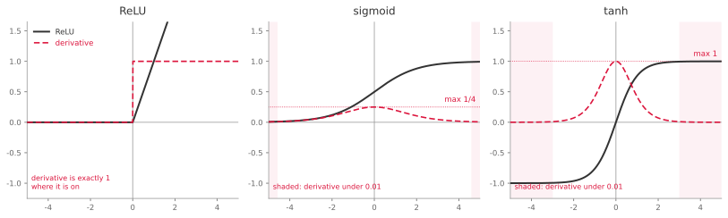
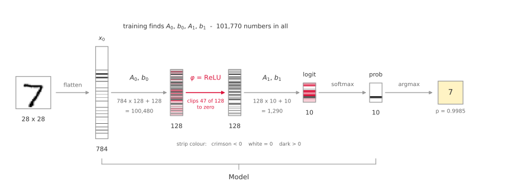
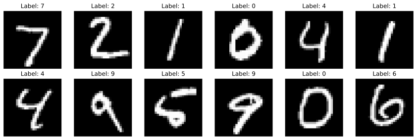
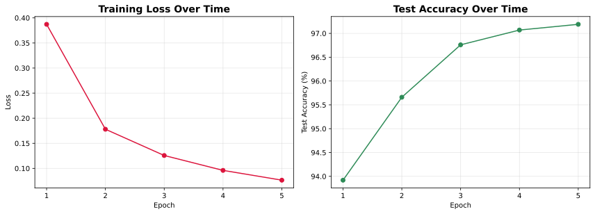
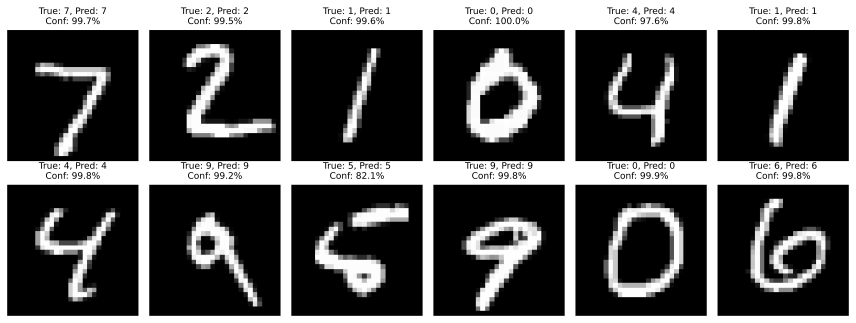
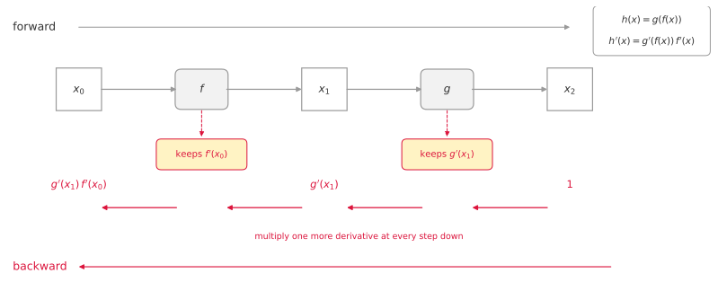

# 다층 퍼셉트론

[2단계](../linear_softmax/06_implementation.md)의 선형 모델은 92.51%에서 멈췄다. 결정 경계가 선형이라는 제약 때문이다. 자연스러운 다음 수는 층을 하나 더 쌓는 것이다. 784 → 128 → 10으로 가면 매개변수가 7850개에서 10만 개 남짓으로 늘어나니, 표현력도 그만큼 늘 것 같다.

그런데 층만 쌓아서는 **아무것도 얻지 못한다.** 이 절은 먼저 그 사실을 보이고, 무엇을 더해야 하는지를 밝힌다.

## 1. 왜 활성화 함수가 필요한가

### 선형 변환을 겹쳐도 선형 변환이다

층을 두 개 쌓되 그 사이에 아무것도 넣지 않으면 이렇게 된다.

$$
y = (x W_1 + b_1) W_2 + b_2
$$

괄호를 풀어 정리해 보자.

$$
y = x (W_1 W_2) + (b_1 W_2 + b_2)
$$

$W_1 W_2$은 그냥 하나의 행렬이고 $b_1 W_2 + b_2$은 그냥 하나의 벡터이다. 이를 각각 $W'$과 $b'$이라 두면 다음과 같다.

$$
y = x W' + b'
$$

**층 두 개짜리 신경망이 층 하나짜리 신경망과 정확히 같아졌다.** 곧 2단계의 모델과 표현력이 완전히 동일하다. 층을 백 개 쌓아도 마찬가지다. 선형 변환을 아무리 겹쳐도 그 합성은 여전히 선형 변환이다. $\square$

매개변수 수를 세어 보면 이 사실이 더 또렷해진다. 784 → 128 → 10에 저장되는 수는 101,770개이지만, 위 식이 말하듯 실제로 쓰이는 자유도는 $W' \in \mathbb{R}^{784 \times 10}$과 $b' \in \mathbb{R}^{10}$, 곧 **7850개**뿐이다. 2단계와 정확히 같은 수이다. 나머지 9만여 개는 서로를 상쇄하며 아무 일도 하지 않는다.

### 실제로 확인해 보기

말로만 볼 것이 아니라 재어 보자. 같은 784 → 128 → 10 신경망을 ReLU만 넣고 빼서 5 에포크씩 학습시킨 결과이다.

| 구조 | 저장된 매개변수 | 실효 자유도 | 시험 정확도 |
|---|---|---|---|
| 784 → 128 → 10, 활성화 **없음** | 101,770 | 7,850 | **91.58%** |
| 784 → 128 → 10, ReLU **있음** | 101,770 | 101,770 | **97.53%** |

활성화가 없으면 91.58%로, 2단계의 선형 모델(92.51%)과 사실상 같은 자리에 머문다. 매개변수를 13배 저장하고 학습에 그만큼 시간을 쓰고도 얻은 것이 없다.

학습이 끝난 무활성화 모델의 두 가중치 행렬을 실제로 곱해 $W' = W_1 W_2$을 만들고, 그 하나의 아핀 변환과 원래 2층 신경망의 출력을 견주면 최대 오차가 $7.6 \times 10^{-6}$이다. 부동소수점 오차 수준이며, 두 모델이 같은 함수라는 뜻이다.

### ReLU가 하는 일

$$
\mathrm{ReLU}(z) = \max(0, z)
$$

음수를 0으로 자르는 것이 전부이다. 이 단순한 꺾임 하나가 위의 상쇄를 깨뜨린다. $\mathrm{ReLU}(xW_1 + b_1)W_2$는 어떤 $W'$으로도 다시 쓸 수 없다.

기하로 보면 이렇다. 은닉 뉴런 하나하나가 입력 공간을 직선으로 가르고, ReLU가 그 한쪽을 0으로 눌러 조각을 만든다. 은닉 뉴런이 128개이면 입력 공간이 여러 조각으로 나뉘고, 조각마다 다른 선형 함수가 적용된다. 전체로 보면 여러 개의 선형 조각을 이어 붙인 함수가 되어, 곡선 모양의 결정 경계를 그릴 수 있다.

MNIST에서 이것이 중요한 까닭은 한 숫자를 쓰는 방식이 여럿이기 때문이다. 가로줄이 있는 `7`과 없는 `7`은 화소 공간에서 서로 멀리 떨어져 있어, 하나의 선형 경계로는 둘 다 `7`쪽에 두기 어렵다. 은닉 뉴런이 여럿이면 서로 다른 필체를 각기 다른 뉴런이 맡을 수 있다.

### 시그모이드와 tanh

ReLU만 있는 것은 아니다. 신경망이 오래 써 온 활성화 함수는 시그모이드였다.

$$
\sigma(x) = \frac{1}{1 + e^{-x}}
$$

실수 전체를 $(0, 1)$ 안으로 눌러 담는 S자 곡선이다. tanh도 같은 모양인데, 사실 **둘은 같은 곡선이다.** 축을 늘이고 옮겼을 뿐이다.

$$
\tanh(x) = 2\,\sigma(2x) - 1
$$

확인은 한 줄로 끝난다.

$$
2\,\sigma(2x) - 1 = \frac{2}{1 + e^{-2x}} - 1 = \frac{2 - (1 + e^{-2x})}{1 + e^{-2x}} = \frac{1 - e^{-2x}}{1 + e^{-2x}} = \tanh(x)
$$

곧 tanh는 시그모이드를 가로로 절반으로 좁히고, 세로로 두 배 늘린 뒤 1만큼 내린 것이다. 입력에 한 번, 출력에 한 번, 아핀 변환을 걸었을 뿐이다. 안쪽의 2를 빠뜨리면 다른 함수가 된다(연습문제 15).

그런데도 tanh를 따로 두는 까닭은 출력의 중심이 0이라는 데 있다. 시그모이드의 출력은 늘 양수여서 다음 층에 들어가는 신호가 한쪽으로 치우친다.

**두 함수가 함께 안고 있는 약점은 양끝이다.** 도함수를 보자.

$$
\sigma'(x) = \sigma(x)\big(1 - \sigma(x)\big), \qquad \tanh'(x) = 1 - \tanh(x)^2
$$

둘 다 곡선이 평평해지는 양끝에서 0으로 사그라든다. $\sigma'(6) = 0.0025$이고, 가장 가파른 $x = 0$에서조차 $\sigma'(0) = 1/4$이다. 시그모이드는 **어디서도 기울기를 $1/4$보다 크게 흘려보내지 못한다.**

세 함수를 나란히 놓고 보면 차이가 분명하다. 실선이 함수, 점선이 그 도함수다.



읽을 곳은 함수가 아니라 **점선**이다. ReLU의 점선은 양수 쪽에서 1에 붙어 평평하다. 시그모이드의 점선은 아무리 높아야 $1/4$이고, tanh의 점선은 1까지 오른다. 역전파가 이 값들을 곱해 내려가므로(3절), 이 높이 차이가 층을 쌓을수록 벌어진다.

옅게 칠한 구간은 도함수가 $0.01$보다 작아지는 자리, 곧 학습 신호가 거의 흐르지 않는 자리다. 여기서 한 가지는 정확히 짚어 두자. **tanh의 칠한 구간이 시그모이드보다 오히려 넓다.** tanh가 더 좁은 $|x|$에서 포화하기 때문이다. 그런데도 tanh가 나은 까닭은 포화하지 않는 구간에서의 높이가 네 배이기 때문이다. 곱으로 쌓이는 것은 폭이 아니라 높이다.

ReLU 칸에는 칠이 없다. 음수 쪽 도함수가 0인 것은 마찬가지이지만 그것은 포화가 아니라 **꺼진 것**이고, 켜진 쪽에서는 도함수가 줄지 않고 정확히 1이기 때문이다. 이 차이가 연습문제 12와 16의 주제다.

층을 쌓으면 이것이 곱으로 쌓인다. 역전파는 층마다의 도함수를 곱해 내려가므로(3절), 시그모이드 층 $k$개를 지나는 동안 **활성화 함수가 기여하는 몫**만 보아도 $4^{-k}$ 이하로 줄어든다. 여섯 층이면 $1/4096$이다. 가중치가 그만큼을 되메워 주지 않는 한, 앞쪽 층에 닿을 무렵에는 학습 신호가 사실상 사라진다.

ReLU에는 이 문제가 없다. 양수 쪽에서 도함수가 **정확히 1**이라 곱해도 줄지 않는다. ReLU가 표준이 된 까닭은 표현력이 더 좋아서가 아니라 기울기를 잃지 않고 흘려보내서다(연습문제 6, 16).

ReLU, 시그모이드, tanh 말고도 GELU 등 여러 활성화 함수가 있고 저마다 성질이 다르다. 그 비교와 선택 기준은 [6장의 활성화 함수](../../ch06/index.md)에서 다룬다. 여기서 중요한 것은 **무엇을 쓰느냐가 아니라 반드시 있어야 한다는 것**이다.

---

## 2. 코드

코드를 읽기 전에 모델의 생김새를 한눈에 보아 두자.



띠의 색은 그려 넣은 것이 아니라 **실제로 잰 값**이다. 학습을 마친 모델에 시험 집합의 첫 이미지(숫자 7)를 넣고 단계마다의 값을 그대로 칠했다. 784짜리 기둥에 가로줄이 비치는 것은 이미지를 행 단위로 이어 붙였기 때문이고, 이 기둥이 곧 화소의 이웃 관계가 사라지는 자리다.

바뀐 곳은 가운데뿐이다. [3.2절](../linear_softmax/06_implementation.md)에서는 784차원에서 곧바로 10차원으로 갔다. 여기서는 128차원을 한 번 거치고, 그 사이에 ReLU가 놓인다. 그 붉은 화살표 하나가 이 절이 더하는 전부이며, 그것이 없으면 1절에서 본 대로 두 선형 변환이 하나로 합쳐져 3.2절과 똑같은 모델이 된다.

ReLU가 하는 일이 두 128짜리 띠 사이에서 눈에 보인다. 왼쪽 띠의 붉은 칸이 음수인데 오른쪽에서는 모두 흰색이다. 이 이미지 하나에 대해 128개 가운데 **47개**가 0으로 잘렸다. 시험 집합 전체로 보면 그 비율이 40.5%이며, 그것이 왜 손실이 아니라 기능인지는 연습문제 9에서 다룬다.

끝의 두 띠도 읽어 둘 값이 있다. 로짓에는 음수가 섞여 있어 붉은 칸이 보이지만, 소프트맥스를 지난 확률 띠에는 짙은 칸이 하나뿐이다. 이 이미지에서 모델이 7에 준 확률이 0.9985이다. 소프트맥스와 argmax는 모델 바깥이 아니라 안쪽의 마지막 두 걸음이다. 다만 코드에서는 소프트맥스가 따로 보이지 않는다. `nn.CrossEntropyLoss`가 안에 품고 있기 때문이다.

(그림을 만든 실행의 시험 정확도는 97.27%였다. 본문이 보고하는 97.42%와 마지막 자리가 다른 까닭은 아래 연습문제 안내에 적은 실행마다의 흔들림이다.)

```python
"""
================================================================================
03_mnist_basic.py - 완전한 MNIST 숫자 분류기
================================================================================

이 예제는 손글씨 숫자(0~9)로 이루어진 유명한 MNIST 데이터셋을 써서
완전한 이미지 분류 파이프라인을 구현한다.

데이터셋: MNIST
    - 학습 이미지 60,000장
    - 시험 이미지 10,000장
    - 28×28 화소 회색조 이미지
    - 클래스 10개 (숫자 0~9)

구조:
    입력 (784) → ReLU를 쓰는 은닉 (128) → 소프트맥스를 쓰는 출력 (10)

이것이 첫 실전 딥러닝 과제이다!

학습 목표:
    1. 실제 데이터셋을 불러오고 전처리하기
    2. 완전한 학습 파이프라인 만들기
    3. 알맞은 학습/시험 분할 구현하기
    4. 모델 성능 평가하기
    5. GPU 가속 쓰기
    6. 예측 시각화하기
    7. 모델 체크포인트 저장하고 다시 불러오기

난이도: ⭐⭐⭐☆☆ (초급~중급)
소요 시간: 30~45분
================================================================================
"""

import torch
import torch.nn as nn
import torch.optim as optim
import torchvision
import torchvision.transforms as transforms
import matplotlib.pyplot as plt
import numpy as np
import os

# ================================================================================
# 1부: 설정과 장치 준비
# ================================================================================
print("=" * 80)
print("STEP 1: Configuration and Device Setup")
print("=" * 80)

# 재현성을 위해 난수 씨앗 고정
# 이렇게 하면 실행할 때마다 같은 결과가 나온다
torch.manual_seed(42)
np.random.seed(42)

# 체크포인트를 저장할 디렉터리 만들기
# exist_ok=True는 이미 있으면 그냥 넘어가라는 뜻이다
checkpoint_dir = './checkpoints'
os.makedirs(checkpoint_dir, exist_ok=True)
print(f"Checkpoint directory: {checkpoint_dir}")

# 장치 설정
# PyTorch는 CPU에서도 GPU(CUDA)에서도 돌 수 있다
# GPU를 쓰면 학습이 크게 빨라진다 (10~100배)
device = torch.device('cuda' if torch.cuda.is_available() else 'cpu')
print(f"Using device: {device}")
if device.type == 'cuda':
    print(f"GPU Name: {torch.cuda.get_device_name(0)}")
    print(f"GPU Memory: {torch.cuda.get_device_properties(0).total_memory / 1e9:.2f} GB")

# 초매개변수
# 이들이 학습 과정과 모델 구조를 좌우한다
config = {
    'input_size': 784,        # 28×28 = 펼친 화소 784개
    'hidden_size': 128,       # 은닉층의 뉴런 수
    'num_classes': 10,        # 숫자 0~9
    'num_epochs': 5,          # 데이터셋 전체를 몇 번 볼지
    'batch_size': 100,        # 학습 단계마다의 표본 수
    'learning_rate': 0.001,   # 최적화기의 걸음 크기
}

print(f"\nHyperparameters:")
for key, value in config.items():
    print(f"  {key:15s}: {value}")

# ================================================================================
# 2부: 데이터 불러오기와 전처리
# ================================================================================
print("\n" + "=" * 80)
print("STEP 2: Loading MNIST Dataset")
print("=" * 80)

# 변환: PIL 이미지를 PyTorch 텐서로 바꾼다
# ToTensor()는 화소값을 [0, 255]에서 [0, 1]로 자동 조정한다
transform = transforms.Compose([
    transforms.ToTensor(),  # 텐서로 바꾸고 [0, 1]로 조정
])

# 학습 데이터 내려받아 불러오기
# 데이터가 없으면 './data'에 자동으로 내려받는다
print("Loading training data...")
train_dataset = torchvision.datasets.MNIST(
    root='./data',           # 데이터를 저장할 곳
    train=True,              # 학습 분할 불러오기
    transform=transform,     # 변환 적용
    download=True            # 없으면 내려받기
)

# 시험 데이터 불러오기
print("Loading test data...")
test_dataset = torchvision.datasets.MNIST(
    root='./data',
    train=False,             # 시험 분할 불러오기
    transform=transform,
    download=True
)

print(f"\nDataset Statistics:")
print(f"  Training samples: {len(train_dataset)}")
print(f"  Test samples: {len(test_dataset)}")
print(f"  Image shape: {train_dataset[0][0].shape}")  # (채널, 높이, 너비)
print(f"  Number of classes: {len(train_dataset.classes)}")

# 데이터 로더 만들기
# DataLoader가 배치 묶기, 섞기, 병렬 적재를 처리한다
train_loader = torch.utils.data.DataLoader(
    dataset=train_dataset,
    batch_size=config['batch_size'],
    shuffle=True,            # 에포크마다 학습 데이터 섞기
    num_workers=2,           # 데이터 적재에 하위 프로세스 2개 쓰기
    pin_memory=True          # CPU-GPU 전송 속도 높이기
)

test_loader = torch.utils.data.DataLoader(
    dataset=test_dataset,
    batch_size=config['batch_size'],
    shuffle=False,           # 시험 데이터는 섞지 않는다
    num_workers=2,
    pin_memory=True
)

print(f"\nDataLoader Info:")
print(f"  Training batches: {len(train_loader)}")
print(f"  Test batches: {len(test_loader)}")

# ================================================================================
# 3부: 표본 데이터 시각화
# ================================================================================
print("\n" + "=" * 80)
print("STEP 3: Visualizing Sample Images")
print("=" * 80)

# 시험 이미지 배치 하나 가져오기
examples = iter(test_loader)
example_data, example_labels = next(examples)

# 표본 이미지 12장 그리기
fig, axes = plt.subplots(2, 6, figsize=(12, 4))
for i, ax in enumerate(axes.flat):
    # 그리기 위해 (1, 28, 28)을 (28, 28)로 바꾼다
    image = example_data[i].squeeze()
    ax.imshow(image, cmap='gray')
    ax.set_title(f'Label: {example_labels[i]}')
    ax.axis('off')

plt.tight_layout()
plt.savefig('03_mnist_samples.png', dpi=150, bbox_inches='tight')
print("Sample images saved as '03_mnist_samples.png'")
plt.close()

# ================================================================================
# 4부: 신경망 정의
# ================================================================================
print("\n" + "=" * 80)
print("STEP 4: Building the Neural Network")
print("=" * 80)

class MNISTClassifier(nn.Module):
    """
    MNIST 분류를 위한 순방향 신경망.
    
    구조:
        입력 (784) → ReLU를 쓰는 은닉 (128) → 출력 (10)
    
    참고: CrossEntropyLoss가 내부에서 소프트맥스를 적용하므로
    여기서는 쓰지 않는다(그 편이 수치적으로 더 안정하다).
    """
    
    def __init__(self, input_size, hidden_size, num_classes):
        super().__init__()
        
        # 1층: 입력 → 은닉
        # 784 → 128 변환
        self.fc1 = nn.Linear(input_size, hidden_size)
        
        # ReLU 활성화
        # 비선형성을 넣어 복잡한 양상을 배울 수 있게 한다
        self.relu = nn.ReLU()
        
        # 2층: 은닉 → 출력
        # 128 → 10 변환 (숫자 클래스마다 출력 하나)
        self.fc2 = nn.Linear(hidden_size, num_classes)
    
    def forward(self, x):
        """
        신경망을 통과하는 순전파.
        
        인수:
            x: 모양이 (batch_size, 1, 28, 28)인 입력 텐서
        
        반환값:
            모양이 (batch_size, 10)인 출력 로짓
        """
        # 이미지 펼치기
        # (batch_size, 1, 28, 28)에서 (batch_size, 784)로
        # -1은 "이 차원은 알아서 정하라"는 뜻이다
        x = x.reshape(x.size(0), -1)
        
        # 1층: 선형 → ReLU
        hidden = self.fc1(x)           # (batch_size, 128)
        hidden = self.relu(hidden)     # (batch_size, 128)
        
        # 2층: 선형 (활성화 없음 - CrossEntropyLoss는 로짓을 받는다)
        output = self.fc2(hidden)      # (batch_size, 10)
        
        return output
    
    def predict(self, x):
        """
        예측하기 (로짓이 아니라 클래스 레이블을 돌려준다).
        
        인수:
            x: 모양이 (batch_size, 1, 28, 28)인 입력 텐서
        
        반환값:
            모양이 (batch_size,)인 예측 클래스 레이블
        """
        logits = self(x)
        # argmax는 로짓이 가장 큰 자리, 곧 확률이 가장 높은 클래스를 돌려준다
        return torch.argmax(logits, dim=1)

# 모델을 만들어 장치로 옮기기
model = MNISTClassifier(
    config['input_size'],
    config['hidden_size'],
    config['num_classes']
).to(device)

# 매개변수 세기
total_params = sum(p.numel() for p in model.parameters())
trainable_params = sum(p.numel() for p in model.parameters() if p.requires_grad)

print(f"Model: MNISTClassifier")
print(f"  Total parameters: {total_params:,}")
print(f"  Trainable parameters: {trainable_params:,}")
print(f"  Parameters breakdown:")
print(f"    Layer 1: {config['input_size']} × {config['hidden_size']} + {config['hidden_size']} = {config['input_size'] * config['hidden_size'] + config['hidden_size']:,}")
print(f"    Layer 2: {config['hidden_size']} × {config['num_classes']} + {config['num_classes']} = {config['hidden_size'] * config['num_classes'] + config['num_classes']:,}")

# ================================================================================
# 5부: 손실과 최적화기 정의
# ================================================================================
print("\n" + "=" * 80)
print("STEP 5: Setting Up Training Components")
print("=" * 80)

# 손실 함수: 교차 엔트로피 손실
# 다중 클래스 분류에 안성맞춤이다
# LogSoftmax와 NLLLoss를 한 단계로 합친다
# 날것의 로짓을 받는다 (소프트맥스를 적용하지 않는다)
criterion = nn.CrossEntropyLoss()

# 최적화기: Adam
# 적응형 학습률 최적화기
# 대부분의 문제에서 별다른 손질 없이 잘 통한다
optimizer = optim.Adam(model.parameters(), lr=config['learning_rate'])

print(f"Loss function: CrossEntropyLoss")
print(f"Optimizer: Adam")
print(f"Learning rate: {config['learning_rate']}")

# ================================================================================
# 체크포인트 저장·적재 함수
# ================================================================================
def save_checkpoint(model, epoch, accuracy, loss):
    """
    모델 체크포인트를 저장한다.

    저장 항목:
        - 모델 가중치 (state_dict)
        - 에포크 번호
        - 정확도
        - 손실값

    모델 객체 자체가 아니라 state_dict를 저장한다.
    클래스 정의에 묶이지 않아 나중에 불러오기가 수월하다.
    """
    checkpoint = {
        'epoch': epoch,
        'model_state_dict': model.state_dict(),
        'accuracy': accuracy,
        'loss': loss,
    }

    checkpoint_path = os.path.join(checkpoint_dir, f'model_epoch_{epoch+1}.pt')
    torch.save(checkpoint, checkpoint_path)
    print(f"  ✓ Saved checkpoint: {checkpoint_path}")


def load_checkpoint(model, checkpoint_path):
    """
    저장해 둔 체크포인트를 불러온다.

    map_location=device는 GPU에서 저장한 가중치를
    CPU만 있는 기계에서도 읽을 수 있게 한다.
    """
    checkpoint = torch.load(checkpoint_path, map_location=device)
    model.load_state_dict(checkpoint['model_state_dict'])
    print(f"✓ Loaded model from: {checkpoint_path}")
    print(f"  Epoch: {checkpoint['epoch'] + 1}")
    print(f"  Accuracy: {checkpoint['accuracy']:.2f}%")
    print(f"  Loss: {checkpoint['loss']:.4f}")
    return model, checkpoint

# ================================================================================
# 6부: 학습 루프 (에포크마다 체크포인트를 남긴다)
# ================================================================================
print("\n" + "=" * 80)
print("STEP 6: Training the Model (with Checkpoint Saving)")
print("=" * 80)

# 학습 기록
train_losses = []
train_accuracies = []

# 가장 좋았던 에포크 추적
best_accuracy = 0
best_checkpoint_path = None

# 전체 단계 수
total_steps = len(train_loader)

print(f"\nStarting training for {config['num_epochs']} epochs...")
print(f"Steps per epoch: {total_steps}")
print("-" * 80)

for epoch in range(config['num_epochs']):
    # 모델을 학습 모드로
    # 드롭아웃이나 배치 정규화 같은 층에 영향을 준다 (여기서는 안 쓰지만 좋은 습관이다)
    model.train()
    
    epoch_loss = 0
    correct = 0
    total = 0
    
    for batch_idx, (images, labels) in enumerate(train_loader):
        # 데이터를 장치(GPU/CPU)로 옮긴다
        images = images.to(device)
        labels = labels.to(device)
        
        # ----------------------------------------
        # 순전파
        # ----------------------------------------
        outputs = model(images)
        loss = criterion(outputs, labels)
        
        # ----------------------------------------
        # 역전파와 최적화
        # ----------------------------------------
        optimizer.zero_grad()  # 이전 기울기 지우기
        loss.backward()         # 기울기 계산
        optimizer.step()        # 가중치 갱신
        
        # ----------------------------------------
        # 통계 기록
        # ----------------------------------------
        epoch_loss += loss.item()
        
        # 예측을 얻는다
        predicted = torch.argmax(outputs, dim=1)
        total += labels.size(0)
        correct += (predicted == labels).sum().item()
        
        # 100 배치마다 진행 상황 출력
        if (batch_idx + 1) % 100 == 0:
            current_acc = 100 * correct / total
            print(f"Epoch [{epoch+1}/{config['num_epochs']}], "
                  f"Step [{batch_idx+1}/{total_steps}], "
                  f"Loss: {loss.item():.4f}, "
                  f"Accuracy: {current_acc:.2f}%")
    
    # 에포크 통계 계산
    avg_loss = epoch_loss / total_steps
    epoch_accuracy = 100 * correct / total
    train_losses.append(avg_loss)
    train_accuracies.append(epoch_accuracy)
    
    print(f"\nEpoch [{epoch+1}/{config['num_epochs']}] Summary:")
    print(f"  Average Loss: {avg_loss:.4f}")
    print(f"  Training Accuracy: {epoch_accuracy:.2f}%")

    # 에포크마다 체크포인트를 남긴다
    save_checkpoint(model, epoch, epoch_accuracy, avg_loss)

    # 가장 좋았던 에포크의 경로를 기억해 둔다
    if epoch_accuracy > best_accuracy:
        best_accuracy = epoch_accuracy
        best_checkpoint_path = os.path.join(checkpoint_dir, f'model_epoch_{epoch+1}.pt')
        print(f"  🌟 New best accuracy! Saving as best model...")

    print("-" * 80)

print("\nTraining completed!")
print(f"Best training accuracy: {best_accuracy:.2f}%")

# ================================================================================
# 6.5부: 가장 좋았던 모델 되살리기
# ================================================================================
print("\n" + "=" * 80)
print("STEP 6.5: Loading Best Model")
print("=" * 80)

# 학습이 끝난 시점의 가중치가 늘 가장 좋은 것은 아니다
# 저장해 둔 체크포인트 가운데 가장 좋았던 것을 다시 올린다
if best_checkpoint_path:
    model, best_checkpoint = load_checkpoint(model, best_checkpoint_path)
else:
    print("Warning: No checkpoint found!")

# ================================================================================
# 7부: 시험 집합에서의 평가
# ================================================================================
print("\n" + "=" * 80)
print("STEP 7: Evaluating on Test Set (Using Best Model)")
print("=" * 80)

# 모델을 평가 모드로 바꾼다
# 드롭아웃을 끄고, 배치 정규화는 이동 통계를 쓰게 한다
model.eval()

# 효율을 위해 기울기 계산 끄기
# 추론 중에는 기울기가 필요 없다
with torch.no_grad():
    correct = 0
    total = 0
    
    # 클래스별 정확도 기록
    class_correct = [0] * config['num_classes']
    class_total = [0] * config['num_classes']
    
    for images, labels in test_loader:
        images = images.to(device)
        labels = labels.to(device)
        
        outputs = model(images)
        predicted = torch.argmax(outputs, dim=1)
        
        total += labels.size(0)
        correct += (predicted == labels).sum().item()
        
        # 클래스별 정확도
        c = (predicted == labels).squeeze()
        for i in range(len(labels)):
            label = labels[i]
            class_correct[label] += c[i].item()
            class_total[label] += 1

# 전체 정확도
overall_accuracy = 100 * correct / total
print(f"Overall Test Accuracy: {overall_accuracy:.2f}%")
print(f"Correct predictions: {correct}/{total}")

# 클래스별 정확도
print("\nPer-Class Accuracy:")
print("-" * 40)
for i in range(config['num_classes']):
    class_acc = 100 * class_correct[i] / class_total[i]
    print(f"  Digit {i}: {class_acc:.2f}% ({class_correct[i]}/{class_total[i]})")
print("-" * 40)

# ================================================================================
# 8부: 예측 시각화
# ================================================================================
print("\n" + "=" * 80)
print("STEP 8: Visualizing Predictions")
print("=" * 80)

# 시험 이미지 배치 하나 가져오기
model.eval()
examples = iter(test_loader)
example_data, example_labels = next(examples)
example_data = example_data.to(device)
example_labels = example_labels.to(device)

with torch.no_grad():
    outputs = model(example_data)
    predictions = torch.argmax(outputs, dim=1)
    
    # 확률 얻기 (로짓의 소프트맥스)
    probabilities = torch.nn.functional.softmax(outputs, dim=1)

# 그림을 그리기 위해 CPU로 되돌린다
example_data = example_data.cpu()
example_labels = example_labels.cpu()
predictions = predictions.cpu()
probabilities = probabilities.cpu()

# 예측 그리기
fig, axes = plt.subplots(3, 6, figsize=(15, 8))
for i, ax in enumerate(axes.flat):
    if i < 18:
        image = example_data[i].squeeze()
        true_label = example_labels[i].item()
        pred_label = predictions[i].item()
        confidence = probabilities[i][pred_label].item() * 100
        
        ax.imshow(image, cmap='gray')
        
        # 색 규칙: 맞으면 초록, 틀리면 빨강
        color = 'green' if pred_label == true_label else 'red'
        ax.set_title(f'True: {true_label}, Pred: {pred_label}\nConf: {confidence:.1f}%',
                    color=color, fontsize=10)
        ax.axis('off')

plt.tight_layout()
plt.savefig('03_mnist_predictions.png', dpi=150, bbox_inches='tight')
print("Predictions saved as '03_mnist_predictions.png'")
plt.close()

# ================================================================================
# 9부: 학습 과정 시각화
# ================================================================================
print("\n" + "=" * 80)
print("STEP 9: Training Progress Visualization")
print("=" * 80)

fig, (ax1, ax2) = plt.subplots(1, 2, figsize=(14, 5))

# 손실 그리기
ax1.plot(range(1, config['num_epochs'] + 1), train_losses, 'b-', linewidth=2, marker='o')
ax1.set_xlabel('Epoch', fontsize=12)
ax1.set_ylabel('Average Loss', fontsize=12)
ax1.set_title('Training Loss Over Time', fontsize=14, fontweight='bold')
ax1.grid(True, alpha=0.3)

# 정확도 그리기
ax2.plot(range(1, config['num_epochs'] + 1), train_accuracies, 'g-', linewidth=2, marker='s')
ax2.set_xlabel('Epoch', fontsize=12)
ax2.set_ylabel('Accuracy (%)', fontsize=12)
ax2.set_title('Training Accuracy Over Time', fontsize=14, fontweight='bold')
ax2.grid(True, alpha=0.3)
ax2.set_ylim([0, 100])

plt.tight_layout()
plt.savefig('03_mnist_training_progress.png', dpi=150, bbox_inches='tight')
print("Training progress saved as '03_mnist_training_progress.png'")
plt.show()

# ================================================================================
# 핵심 정리
# ================================================================================
print("\n" + "=" * 80)
print("KEY TAKEAWAYS")
print("=" * 80)
print(f"""
1. 완전한 기계학습 파이프라인:
   ✓ 자료 불러오기와 미리 다듬기
   ✓ 모델 구조 설계
   ✓ 감시를 곁들인 학습 루프
   ✓ 따로 떼어 둔 시험 집합에서의 평가
   ✓ 결과 시각화

2. 모델 체크포인트 저장과 적재
   ✓ 에포크마다 가중치를 파일로 남긴다
   ✓ 가장 좋았던 에포크를 따로 추적한다
   ✓ 평가 전에 그 가중치를 다시 올린다
   ✓ 체크포인트 디렉터리: {checkpoint_dir}

3. 단순한 2층 신경망으로 약 {overall_accuracy:.1f}%의 정확도를 얻었다!
   - 최고 수준의 CNN은 약 99.7%에 이른다
   - 이 기준선도 꽤 훌륭하다

4. 다중 클래스 분류에 쓰는 CrossEntropyLoss
   - LogSoftmax와 NLLLoss를 합친다
   - 따로 계산하는 것보다 수치적으로 안정적이다

5. GPU 가속은 학습을 훨씬 빠르게 한다
   - 모델과 데이터를 모두 장치로 옮겨야 한다
   - 텐서와 모델에는 .to(device)를 쓴다

6. 학습 모드와 평가 모드:
   - model.train(): 드롭아웃과 배치 정규화의 학습 동작을 켠다
   - model.eval(): 추론을 위해 그것들을 끈다

다음: 4단계 합성곱 신경망에서는 화소의 이웃 관계를 되찾는다!
""")

# ================================================================================
# 학생을 위한 연습문제
# ================================================================================
print("=" * 80)
print("EXERCISES TO TRY")
print("=" * 80)
print("""
1. hidden_size를 256이나 512로 늘려 보라. 정확도가 나아지는가?
2. 은닉층을 하나 더 넣어 3층 신경망을 만들어 보라
3. SGD, RMSprop, AdaGrad 등 여러 최적화기를 써 보라
4. 학습률 0.0001, 0.01, 0.1로 실험해 보라
5. 더 많은 에폭(10~20)으로 학습해 보라. 과적합을 살피라
6. 검증 손실을 기준으로 조기 종료를 구현해 보라
7. 최적화기의 state_dict도 체크포인트에 함께 담아, 멈춘 자리에서
   학습을 이어 갈 수 있게 해 보라
8. 무작위 회전과 이동 같은 데이터 증강을 더해 보라
9. 첫 층의 가중치를 그려 신경망이 배운 것을 살펴보라
10. 혼동 행렬을 만들어 어떤 숫자가 헷갈리는지 보라

체크포인트 쓰는 법:
    # 특정 체크포인트 불러오기
    model, checkpoint = load_checkpoint(model, './checkpoints/model_epoch_3.pt')

    # 저장된 체크포인트 모두 보기
    print(sorted(os.listdir('./checkpoints')))
""")


if __name__ == "__main__":
    pass
```


**출력:**

```
Overall Test Accuracy: 97.42%
```

2단계의 92.51%에서 **97.42%**로 올랐다. 더한 것은 은닉층 하나와 ReLU뿐이다. 그 하나로 결정 경계가 선형이라는 제약이 풀리면서, 한 클래스 안의 서로 다른 필체를 각기 다른 은닉 뉴런이 맡을 수 있게 된다.

남은 약점은 첫 줄에 있다. 이 모델도 이미지를 784차원 벡터로 펼치고 시작하므로 화소의 이웃 관계를 쓰지 못한다. 마지막 걸음이 그것을 되찾는다.

### 그림으로 보기

위 코드가 그리는 그림 셋을 차례로 본다. 아래 그림들은 같은 코드를 다시 돌려 얻은 것이며, 그때의 마지막 정확도는 97.19%였다(실행마다 조금씩 흔들린다).

먼저 넣는 자료다.



다음은 학습이 진행되는 모습이다. 실무에서 가장 자주 보게 되는 그림이 이쪽이다.



| 에포크 | 1 | 2 | 3 | 4 | 5 |
|---|---|---|---|---|---|
| 학습 손실 | 0.3872 | 0.1780 | 0.1257 | 0.0960 | 0.0765 |
| 시험 정확도 | 93.92% | 95.66% | 96.76% | 97.07% | 97.19% |

두 곡선이 서로 다른 이야기를 한다. **손실은 계속 가파르게 내려가는데 정확도는 거의 평평해진다.** 1에포크에서 이미 93.92%이고, 남은 네 에포크가 3.3%포인트를 더할 뿐이다.

어긋나 보이지만 그렇지 않다. 손실은 정답에 준 **확률**을 재고 정확도는 **가장 큰 로짓이 맞았는지**만 센다. 이미 맞힌 표본의 확률이 0.8에서 0.95로 올라가면 손실은 뚜렷하게 줄지만 정확도는 한 톨도 움직이지 않는다. 곧 뒤쪽 에포크에서 모델이 하는 일은 새로 맞히는 것이 아니라 **이미 맞힌 것을 더 확신하게 되는 것**이다.

여기서 실무의 요령이 하나 나온다. 손실만 보고 있으면 아직 좋아지는 중이라고 착각하기 쉽다. 두 값을 함께 보아야 하며, 정확도가 평평해졌다면 에포크를 늘리는 것으로는 얻을 것이 적다.

마지막은 예측 결과다. 확신도를 함께 적었고, 틀린 것이 있으면 제목이 붉게 나온다.



맞힌 예측의 확신도가 대부분 99%를 넘는다. [3.2절 연습문제 8](../linear_softmax/02_softmax.md)에서 선형 모델의 확신도를 재었을 때 맞힌 예측의 평균이 0.9420이었던 것과 견주면, 층 하나를 더한 모델이 훨씬 단호해졌음을 알 수 있다.

## 3. 학습 루프를 한 줄씩

위 코드에서 실제로 학습이 일어나는 곳은 여섯 줄뿐이다.

```python
model.train()                      # 1. 학습 모드로
outputs = model(images)            # 2. 순전파
loss = criterion(outputs, labels)  # 3. 손실
optimizer.zero_grad()              # 4. 지난 기울기 지우기
loss.backward()                    # 5. 기울기 계산
optimizer.step()                   # 6. 가중치 갱신
```

3.2절에서도 같은 여섯 줄을 썼고 3.4절에서도 그대로 쓴다. 모델이 무엇이든 바뀌지 않는다. 그러니 여기서 한 번 제대로 뜯어보아 둘 값이 있다.

### model(images)는 왜 함수처럼 불리는가

`model`은 함수가 아니라 `MNISTClassifier` 객체이다. 그런데도 `model(images)`라고 부른다. 파이썬에서 객체를 괄호로 부르면 그 클래스의 `__call__`이 불리기 때문이고, `nn.Module`이 그 `__call__` 안에서 우리가 쓴 `forward`를 부른다.

그렇다면 `model.forward(images)`라고 직접 불러도 되는가. **된다. 다만 그러면 안 된다.** `__call__`은 `forward`만 부르는 것이 아니라 그 앞뒤에 걸어 둔 훅(hook)도 함께 처리한다. 직접 부르면 그 과정이 통째로 건너뛰어진다(연습문제 17).

### loss.backward()가 하는 일

이 한 줄이 매개변수 101,770개 **각각**에 대한 편미분

$$
\frac{\partial \,\text{loss}}{\partial (A_\ell)_{ij}}
$$

을 구해 `.grad`에 채워 넣는다. 스칼라 하나에서 시작해 101,770개의 수를 얻는 것이다.

방법은 **사슬 규칙**이다. 함수 두 개를 이어 붙인 가장 작은 경우로 보자.

$$
h(x) = g(f(x)), \qquad h'(x) = g'\big(f(x)\big) \cdot f'(x)
$$

순전파에서 $x_0 \to x_1 = f(x_0) \to x_2 = g(x_1)$로 값이 앞으로 흐를 때, PyTorch는 값만 계산하는 것이 아니라 **나중에 도함수를 구하는 데 필요한 것을 마디마다 붙들어 둔다.** 그래야 되돌아올 때 $f'(x_0)$과 $g'(x_1)$을 만들 수 있다.

역전파는 그 반대 방향으로 간다. 출력 쪽에서 1로 시작해 $g'(x_1)$을 곱하고, 한 마디 더 내려가 $f'(x_0)$을 곱한다. **내려가면서 곱을 쌓아 가는 것**이 전부이며, 층이 $L$개이면 도함수 $L$개의 곱이 된다. 이름이 역전파(backpropagation)인 까닭이다.

그림으로 보면 이렇다.



위아래 두 줄의 방향이 반대라는 것, 그리고 아래쪽에서 곱해지는 값이 위쪽에서 미리 붙들어 둔 것이라는 두 가지가 이 그림의 요점이다.

여기서 두 가지가 따라 나온다.

첫째, **순전파를 먼저 하지 않으면 역전파를 할 수 없다.** $g'(x_1)$을 구하려면 $x_1$이 있어야 하는데, 그 값은 순전파가 만든다. 코드에서 `model(images)`가 `loss.backward()`보다 반드시 먼저 오는 까닭이다.

둘째, 1절에서 시그모이드를 걱정한 까닭이 여기서 분명해진다. 층마다의 도함수가 **곱해지므로**, 그 값이 늘 $1/4$ 이하이면 층을 지날 때마다 기울기가 4분의 1 이하로 줄어든다. 앞쪽 층에 닿을 무렵에는 남는 것이 없다(연습문제 16).

값싸다는 점도 눈여겨볼 만하다. 이 모델에서 역전파는 순전파의 약 두 배 시간이 든다. 매개변수가 10만 개든 1억 개든 이 비율은 그대로다. 매개변수마다 손실을 다시 재어 기울기를 어림하려 했다면 순전파를 101,770번 해야 했을 것이다(연습문제 19).

### .item()이 없으면 벌어지는 일

```python
epoch_loss += loss.item()
```

`loss`는 값 하나짜리 텐서이고 `.item()`은 거기서 파이썬 수를 꺼낸다. 단순한 형 변환처럼 보이지만 그렇지 않다. `loss`에는 **자기를 만든 계산 그래프 전체가 달려 있다.** `.item()`으로 수만 꺼내면 그 연결이 끊어지고, 묶음 하나를 처리한 뒤 그래프가 버려진다.

`.item()` 없이 `epoch_loss += loss`라고 적으면 묶음마다의 그래프가 모두 손에 남는다. 한 에포크 600묶음을 돌고 나면 그래프가 604마디 길이로 이어지고 메모리가 45MB 늘어난다. `.item()`을 쓴 쪽은 6MB이다. 이 모델에서는 견딜 만하지만, 큰 모델에서 학습이 몇 분 만에 메모리 부족으로 죽는 흔한 까닭이 바로 이것이다(연습문제 18).

### model.eval()과 torch.no_grad()는 다른 일을 한다

```python
model.eval()
with torch.no_grad():
    ...
```

나란히 붙어 다녀서 한 가지 일로 보이기 쉽지만 서로 상관이 없다.

`model.eval()`은 **깃발 하나를 내린다.** 드롭아웃이나 배치 정규화처럼 학습할 때와 평가할 때 다르게 굴어야 하는 층이 그 깃발을 본다. 이 모델에는 그런 층이 하나도 없으므로 `model.eval()`이 실제로 바꾸는 것은 아무것도 없다. 그래도 적는다. 나중에 드롭아웃을 하나 끼워 넣는 날, 이 줄이 없으면 평가할 때도 뉴런이 무작위로 꺼져 정확도가 이유 없이 출렁인다([3.2절 연습문제 8](../linear_softmax/06_implementation.md)).

`torch.no_grad()`는 **순전파에게 도함수 준비를 하지 말라고 이른다.** 앞에서 본 대로 순전파는 마디마다 $f'(x_0)$, $g'(x_1)$을 만들 재료를 붙들어 두는데, 시험할 때는 역전파를 하지 않으니 그것이 다 낭비다. `no_grad` 안에서 나온 텐서는 `grad_fn`이 없고 `backward()`를 부를 수도 없다.

| | `model.eval()` | `torch.no_grad()` |
|---|---|---|
| 무엇을 바꾸는가 | 층의 동작(드롭아웃·배치 정규화) | 그래프를 쌓을지 말지 |
| 이 모델에서 효과 | 없음 | 메모리와 시간을 아낌 |
| 빠뜨리면 | 평가값이 흔들림 | 느려지고 메모리를 더 씀 |

그래서 둘 다 적어야 한다. 하나가 다른 하나를 대신하지 못한다.

---

## 4. 논의

`MNISTClassifier` 클래스는 PyTorch의 `nn.Module` 인터페이스를 사용하여 모델 구조를 감싼다. `__init__`에 층을 두고 `forward`에 그 층들을 지나는 길을 적으면, 그 길이 곧 3절에서 본 계산 그래프가 된다. 이런 모듈식 설계 덕분에 개별 구성 요소를 고치거나 모델을 더 큰 파이프라인에 넣기가 쉬워진다.

에폭에 걸쳐 지표를 추적하는 대목도 눈여겨볼 값이 있다. 수렴 양상이 드러나고 과소적합이나 과적합 같은 문제를 진단하는 데 도움이 된다. 손실과 정확도를 함께 보아야 하는 까닭은 앞의 그림에서 본 그대로다.

체크포인트를 남기는 대목은 결과를 바꾸지 않지만 습관으로 익혀 둘 값어치가 있다. 저장하는 것은 모델 객체가 아니라 `state_dict`, 곧 층 이름에서 가중치 텐서로 가는 사전이다. 클래스 정의에 묶이지 않으므로 나중에 같은 구조를 다시 만들어 `load_state_dict`로 부어 넣기만 하면 된다. 불러올 때 `map_location=device`를 주는 까닭도 같다. GPU에서 저장한 텐서를 CPU만 있는 기계에서 읽으려면 어디로 올릴지 일러 주어야 한다.

다만 여기서 "가장 좋은" 모델을 고르는 기준이 **학습** 정확도라는 점은 짚어 두어야 한다. 학습 정확도는 에포크마다 거의 어김없이 오르므로, 이 코드가 되살리는 것은 사실상 마지막 에포크다. 체크포인트가 제값을 하는 것은 기준이 **검증** 정확도일 때다. 그때는 곡선이 한 번 꺾여 내려가고, 꺾이기 전의 가중치를 붙들어 두는 일이 곧 조기 종료가 된다. 여기서는 그 장치를 미리 갖추어 둔 셈이다. 검증 집합을 기준으로 삼는 체크포인트는 [5장의 모델 체크포인트](../../ch05/logistic_regression/03_model_checkpointing.md)에서 자세히 다룬다.

시각화는 모델의 거동을 이해하고 학습 문제를 진단하는 데 중요한 역할을 한다. 그림을 그리는 코드는 학습된 표현, 수렴의 움직임, 평가 지표에 대한 통찰을 주어 추상적인 계산을 손에 잡히게 만든다.

여기서 보인 방식은 더 복잡한 상황으로 자연스럽게 확장된다. 초매개변수, 구조의 변형, 여러 데이터셋을 두루 실험해 보면 이해가 깊어지고 딥러닝의 기초 과제에 대한 실용적인 직관이 쌓인다.

## 연습문제

!!! note "아래 풀이의 수치에 대하여"
    풀이에 적힌 값은 모두 이 쪽의 설정(ToTensor만 적용, 묶음 100, Adam $10^{-3}$, 5 에포크, 씨앗 42)으로 실제로 재어 얻은 것이다. 초기 가중치와 자료를 섞는 차례가 실행마다 달라 정확도는 0.1~0.4%포인트쯤 흔들리므로, 본문이 보고하는 97.42%와 마지막 자리가 다를 수 있다. 한 표 안의 값들은 모두 같은 조건에서 잰 것이므로 서로 견주는 데에는 문제가 없다.

<div class="drillbox" markdown>

**연습문제 1.** <span class="diff easy" title="쉬움"></span>
784 → 128 → 10 신경망의 매개변수를 층별로 세어 101,770개가 되는지 확인하라.

</div>

??? success "연습문제 1 풀이"
    ```python
    for name, p in model.named_parameters():
        print(f"{name:12s} {tuple(p.shape)}  {p.numel():>7,}")
    ```

    | 층 | 가중치 | 편향 | 합 |
    |---|---|---|---|
    | 1층 (784→128) | $784 \times 128 = 100{,}352$ | 128 | $100{,}480$ |
    | 2층 (128→10) | $128 \times 10 = 1{,}280$ | 10 | $1{,}290$ |
    | 합 | | | **$101{,}770$** |

    1층이 전체의 98.7%를 차지한다. 입력이 784차원이라 크기 때문이다.

    [3.2절](../linear_softmax/01_linear_model.md)의 7,850개와 견주면 약 13배다.
    그런데 활성화 함수가 없으면 이 13배가 아무 구실도 하지 못한다는 것이 1절의
    요점이었다. 연습문제 3과 5에서 그 까닭을 다시 본다.

---

<div class="drillbox" markdown>

**연습문제 2.** <span class="diff easy" title="쉬움"></span>
ReLU를 식으로 적고 도함수를 구하라. $z = 0$에서 미분할 수 있는가? PyTorch는 그 자리에서 무엇을 돌려주는가?

</div>

??? success "연습문제 2 풀이"
    $$\mathrm{ReLU}(z) = \max(0, z), \qquad
      \mathrm{ReLU}'(z) = \begin{cases} 1 & z > 0 \\ 0 & z < 0 \end{cases}$$

    $z = 0$에서는 **미분할 수 없다.** 왼쪽에서 온 기울기는 0이고 오른쪽에서 온
    기울기는 1이어서 둘이 맞지 않는다. 꺾인 점이기 때문이다.

    PyTorch는 그 자리에서 **0**을 돌려준다.

    ```python
    x = torch.zeros(1, requires_grad=True)
    torch.relu(x).backward()
    print(x.grad)      # tensor([0.])
    ```

    이것이 문제가 되지 않는 까닭은, 부동소수점에서 $z$가 **정확히** 0이 되는 일이
    거의 없기 때문이다. 설령 생겨도 한 점에서 어느 값을 고르든 경사 하강법의
    진행에는 영향이 없다. 이렇게 꺾인 점에서 아무 값이나 하나 고른 것을
    **하위 기울기**(subgradient)라 부르며, ReLU를 비롯한 여러 함수가 이 방식으로
    잘 학습된다.

    ReLU가 미분 불가능한 점을 가진다는 사실이 오히려 이 장의 요점이다. 그 꺾임이
    바로 선형 상쇄를 깨뜨리는 장치다.

---

<div class="drillbox" markdown>

**연습문제 3.** <span class="diff easy" title="쉬움"></span>
활성화 함수가 없는 784 → 128 → 10 신경망은 매개변수를 101,770개 저장하는데 실효 자유도는 7,850개뿐이다. 이 7,850이라는 수가 어디서 나오는가?

</div>

??? success "연습문제 3 풀이"
    1절에서 보았듯 활성화가 없으면 두 층이 하나로 합쳐진다.

    $$y = (x W_1 + b_1) W_2 + b_2 = x \underbrace{(W_1 W_2)}_{W'} + \underbrace{(b_1 W_2 + b_2)}_{b'}$$

    모델이 실제로 내놓는 함수는 $(W', b')$으로 완전히 결정된다. 그런데
    $W' \in \mathbb{R}^{784 \times 10}$이고 $b' \in \mathbb{R}^{10}$이므로
    $784 \times 10 + 10$, 곧 **7,850**이다.

    곧 저장한 101,770개의 수가 서로 다른 함수 101,770개어치를 만들지 않는다.
    $(W_1, W_2)$를 다르게 고르고도 곱이 같으면 같은 함수다. 예컨대 $W_1$을 2배
    하고 $W_2$를 절반으로 하면 완전히 같은 모델이다.

    이 7,850이 3.2절의 선형 모델과 **정확히 같은 수**라는 점이 요점이다. 층을
    쌓아도 활성화가 없으면 3.2절에서 한 걸음도 나아가지 못한다. 연습문제 4와 5에서
    이를 수치로 확인하고, 연습문제 11에서 이 진술에 붙는 예외를 찾는다.

---

<div class="drillbox" markdown>

**연습문제 4.** <span class="diff med" title="중간"></span>
활성화 없이 학습시킨 2층 신경망의 두 가중치를 실제로 곱해 $W' = W_1 W_2$을 만들고, 그 하나의 아핀 변환이 원래 신경망과 같은 값을 내는지 확인하라.

</div>

??? success "연습문제 4 풀이"
    ```python
    W1, b1 = model[1].weight.detach(), model[1].bias.detach()
    W2, b2 = model[2].weight.detach(), model[2].bias.detach()
    Wp, bp = W2 @ W1, W2 @ b1 + b2

    x = X_test[:2000].flatten(1)
    print((model(X_test[:2000]) - (x @ Wp.T + bp)).abs().max())
    ```

    최대 오차가 **$1.3 \times 10^{-5}$**이다. `float32`로 100,352번의 곱셈을
    누적한 결과이므로 이 정도는 반올림 오차이며, 두 계산이 **같은 함수**라는
    뜻이다.

    눈여겨볼 것은 $W'$의 꼴이 $(10, 784)$라는 점이다. 128차원 은닉층을 거쳤는데도
    남는 것은 $784 \to 10$ 변환 하나다. 은닉층은 계산 도중에 잠깐 들렀다 가는
    자리일 뿐 표현력을 더하지 않는다.

    이 확인이 중요한 까닭은, 1절의 증명이 **학습이 끝난 실제 가중치에도** 적용됨을
    보이기 때문이다. 이론상 같은 것과 코드가 실제로 같은 것은 다른 이야기이고,
    이 실험은 후자를 확인한다.

---

<div class="drillbox" markdown>

**연습문제 5.** <span class="diff med" title="중간"></span>
연습문제 4에서 만든 $W'$의 계수(rank)를 구하라. 왜 그 값이 되는가? 이 사실이 연습문제 3의 7,850과 어떻게 이어지는가?

</div>

??? success "연습문제 5 풀이"
    ```python
    print(torch.linalg.matrix_rank(Wp))          # 10
    print((torch.linalg.svdvals(Wp) > 1e-4).sum())   # 10
    ```

    계수는 **10**이고 특이값 10개가 모두 0에서 떨어져 있다.

    까닭은 간단하다. $W' = W_2 W_1$에서 $W_2 \in \mathbb{R}^{10 \times 128}$이므로

    $$\mathrm{rank}(W') \le \min\big(\mathrm{rank}(W_1), \mathrm{rank}(W_2)\big)
      \le \min(128, 10) = 10$$

    이고, $(10, 784)$ 행렬의 계수는 어차피 10을 넘을 수 없다. 곧 **은닉층이
    아무 제약도 걸지 않는다.** 은닉 너비가 10 이상이면 $W'$이 가질 수 있는
    행렬의 범위는 $784 \to 10$ 아핀 변환 전체와 같고, 자유도가 7,850이 된다.

    그렇다면 은닉 너비가 10보다 **작으면** 어떻게 되는가? 그때는 계수가 진짜로
    묶인다. 연습문제 11이 그 경우를 다룬다.

---

<div class="drillbox" markdown>

**연습문제 6.** <span class="diff med" title="중간"></span>
ReLU 자리에 시그모이드와 tanh를 넣어 보고, 활성화가 아예 없는 경우와 함께 견주어라.

</div>

??? success "연습문제 6 풀이"
    | 활성화 | 없음 | 시그모이드 | tanh | ReLU |
    |---|---|---|---|---|
    | 시험 정확도 | 92.11% | 95.78% | **97.10%** | **97.06%** |

    무엇을 쓰든 **있는 것이 없는 것보다 훨씬 낫다**는 것이 첫째 관찰이다. 5%포인트
    가까운 차이가 활성화의 존재 자체에서 온다.

    둘째, tanh와 ReLU가 사실상 같고 시그모이드가 1.3%포인트 뒤진다. 시그모이드는
    출력이 $(0, 1)$이라 중심이 0이 아니고, 양끝에서 도함수가 0에 가까워져 기울기가
    잘 흐르지 않는다. tanh는 출력이 $(-1, 1)$로 중심이 0이라 그 문제가 덜하다.

    이 두 줄짜리 층에서는 차이가 작다. 층을 깊이 쌓을수록 벌어져서, 시그모이드를
    여러 겹 쌓으면 기울기가 곱해지며 사그라들어 학습이 아예 되지 않는다. ReLU가
    표준이 된 까닭은 표현력이 더 좋아서가 아니라 **기울기를 잘 흘려보내서**다.
    자세한 비교는 [6장](../../ch06/index.md)에 있다.

---

<div class="drillbox" markdown>

**연습문제 7.** <span class="diff med" title="중간"></span>
은닉층의 너비를 16, 32, 64, 128, 256, 512, 1024로 바꾸어 정확도를 재어라. 매개변수를 늘리는 값어치가 어떻게 변하는가?

</div>

??? success "연습문제 7 풀이"
    | 너비 | 16 | 32 | 64 | 128 | 256 | 512 | 1024 |
    |---|---|---|---|---|---|---|---|
    | 매개변수 | 12,730 | 25,450 | 50,890 | 101,770 | 203,530 | 407,050 | 814,090 |
    | 정확도 | 93.72% | 95.34% | 96.53% | 97.14% | 97.40% | 97.62% | 97.79% |

    오르기는 계속 오르지만 **값어치가 빠르게 준다.** 매개변수를 두 배씩 늘릴 때
    얻는 양을 보자.

    | 두 배 | 16→32 | 32→64 | 64→128 | 128→256 | 256→512 | 512→1024 |
    |---|---|---|---|---|---|---|
    | 얻은 양 | +1.62 | +1.19 | +0.61 | +0.26 | +0.22 | +0.17 |

    16에서 32로 갈 때 얻는 1.62%포인트를 512에서 1024로 갈 때는 0.17%포인트밖에
    얻지 못한다. 매개변수 40만 개를 더 넣고 얻은 값이다.

    이것이 다음 걸음이 필요한 까닭이다. 너비를 늘려 97%대 후반까지는 갈 수 있지만
    99%로 가려면 매개변수를 천문학적으로 늘려야 한다. [3.4 합성곱 신경망](04_cnn.md)은
    매개변수를 42만 개만 쓰면서 99.2%에 이른다. **모델을 키우는 것과 모델을 알맞게
    만드는 것은 다른 일이다.**

---

<div class="drillbox" markdown>

**연습문제 8.** <span class="diff med" title="중간"></span>
은닉층을 하나 더 쌓아 784 → 128 → 128 → 10, 그리고 하나 더 쌓아 784 → 128 → 128 → 128 → 10으로 만들어 보라. 깊이가 늘면 좋아지는가?

</div>

??? success "연습문제 8 풀이"
    | 은닉층 수 | 1 | 2 | 3 |
    |---|---|---|---|
    | 시험 정확도 | 97.14% | 97.19% | **97.02%** |

    좋아지지 않는다. 2층에서 0.05%포인트 오르고 3층에서는 오히려 내려간다.
    실행마다 생기는 흔들림 안에 들어가는 차이다.

    뜻밖으로 보일 수 있다. 깊은 신경망이 강하다고들 하니 말이다. 그러나 깊이가
    저절로 이득을 주지는 않는다. MNIST에서 이 얼개로는 얻을 것이 이미 거의 다
    나왔고, 층을 더하면 오히려 최적화가 어려워진다. 기울기가 지나갈 길이 길어지고
    매개변수가 늘어 과적합할 여지도 커진다.

    깊이가 값어치를 내려면 층마다 **뜻이 있는 특징**을 쌓아 올려야 한다. 날것의
    화소를 펼쳐 넣은 완전 연결층을 여러 겹 쌓는 것으로는 그렇게 되지 않는다.
    3.4절의 합성곱 신경망은 층마다 점점 넓은 영역의 무늬를 보게 되어 깊이가
    뜻을 갖는다. 깊이를 살리는 장치(잔차 연결, 정규화)는 뒤의 장들에서 다룬다.

---

<div class="drillbox" markdown>

**연습문제 9.** <span class="diff med" title="중간"></span>
학습이 끝난 뒤 은닉 뉴런 128개 가운데 몇 개가 **모든** 시험 입력에 대해 0을 내놓는지 세어라. 또 은닉 활성값 전체에서 0의 비율은 얼마인가?

</div>

??? success "연습문제 9 풀이"
    ```python
    with torch.no_grad():
        h = torch.relu(model[1](X_test.flatten(1)))
    alive = (h > 0).any(dim=0).sum()
    print(alive, (h == 0).float().mean())
    ```

    - 완전히 죽은 뉴런: **128개 중 1개**
    - 은닉 활성값 가운데 0인 비율: **40.9%**

    두 수를 구별해서 읽어야 한다.

    **죽은 뉴런**은 어떤 입력에도 반응하지 않으므로 매개변수를 785개 낭비하고 있고,
    기울기가 0이라 되살아날 길도 없다. 이것이 "죽은 ReLU" 문제다. 다행히 여기서는
    1개뿐이다. 학습률이 크거나 층이 깊으면 훨씬 많아진다.

    반면 활성값의 40.9%가 0인 것은 **문제가 아니라 기능**이다. 입력마다 다른
    뉴런 집합이 반응한다는 뜻이며, 이를 희소성(sparsity)이라 한다. 입력에 따라
    서로 다른 선형 함수가 적용되는 것이 바로 ReLU 망이 비선형인 방식이다.
    1절에서 "은닉 뉴런이 입력 공간을 조각으로 나눈다"고 한 것을 수치로 본 것이다.

    같은 40.9%를 뒤집어 보면 입력 하나가 평균 76개 뉴런을 켠다는 뜻이다.

---

<div class="drillbox" markdown>

**연습문제 10.** <span class="diff med" title="중간"></span>
활성화가 없는 2층 신경망(92.11%)이 3.2절의 단층 선형 모델보다 오히려 조금 낮다. 같은 설정에서 단층 선형 모델은 92.34%다. 두 모델이 같은 함수 모둠을 가진다면 왜 값이 다른가?

</div>

??? success "연습문제 10 풀이"
    | 모델 | 매개변수 | 표현할 수 있는 함수 | 정확도 |
    |---|---|---|---|
    | 단층 선형 | 7,850 | $784 \to 10$ 아핀 전체 | **92.34%** |
    | 2층, 활성화 없음 | 101,770 | $784 \to 10$ 아핀 전체 (같음) | 92.11% |

    표현할 수 있는 함수의 모둠이 **같다.** 그러므로 차이는 표현력이 아니라
    **최적화**에서 온다.

    같은 함수를 $W'$으로 직접 나타내느냐 $W_1 W_2$로 쪼개어 나타내느냐에 따라
    경사 하강법이 지나가는 길이 달라진다. 쪼개어 놓으면

    - 손실면이 **비볼록**해진다. 단층 선형의 교차 엔트로피는 볼록인데, 곱으로
      나타내면 그렇지 않다(연습문제 13).
    - 기울기가 사슬 규칙으로 곱해지므로 두 층의 크기 균형에 따라 실효 학습률이
      달라진다.
    - 초기화가 곱으로 들어가 출력의 크기가 달라진다.

    그래서 같은 5 에포크 안에 도달하는 자리가 조금 다르다. 0.23%포인트는 작은
    차이이며 이 방향이 늘 같다고 말할 수도 없다. 요점은 **표현력이 같아도 학습
    결과가 같지 않다**는 것이다.

    뒤집어 말하면, 모델을 볼 때 "무엇을 나타낼 수 있는가"와 "경사 하강법으로
    거기에 닿을 수 있는가"를 따로 물어야 한다. 딥러닝에서 이 둘이 어긋나는 일이
    아주 흔하다.

---

<div class="drillbox" markdown>

**연습문제 11.** <span class="diff hard" title="어려움"></span>
연습문제 5는 은닉 너비가 10 이상이면 활성화 없는 2층 모델이 단층 선형 모델과 같은 함수 모둠을 가진다고 했다. 너비가 10보다 **작으면** 어떻게 되는가? 계수 논증으로 예측한 뒤 너비 2, 5, 10에서 실제로 재어라.

</div>

??? success "연습문제 11 풀이"
    **예측.** $W' = W_2 W_1$에서 은닉 너비를 $h$라 하면

    $$\mathrm{rank}(W') \le \min(h, 10)$$

    이다. $h \ge 10$이면 이 한계가 $(10, 784)$ 행렬의 원래 한계와 같아 아무
    제약이 아니지만, $h < 10$이면 **계수가 $h$로 묶인다.** 곧 로짓 10개를
    $h$차원 공간을 거쳐 만들어야 하므로, 표현할 수 있는 아핀 변환이 진짜로
    줄어든다. 이때 은닉층은 **병목**이다.

    **측정.**

    | 은닉 너비 $h$ | 2 | 5 | 10 | 128 |
    |---|---|---|---|---|
    | $\mathrm{rank}(W')$ 상한 | 2 | 5 | 10 | 10 |
    | 활성화 없음 | **68.46%** | **89.56%** | **92.40%** | 92.11% |

    예측대로다. $h = 2$에서 68.46%로 무너지고, $h = 5$에서 89.56%, $h = 10$에서
    92.40%로 단층 선형 모델(92.34%)을 따라잡는다. 그 뒤로는 더 넓혀도 오르지
    않는다(128에서 92.11%).

    이 실험이 값진 까닭은 1절의 "층을 쌓아도 얻는 것이 없다"는 말에 **정확한
    조건**을 붙여 주기 때문이다. 정확히 말하면 이렇다. 활성화 없는 2층 모델은
    은닉 너비가 출력 차원 이상일 때 단층 모델과 같고, 그보다 좁으면 단층 모델보다
    **약하다.** 층을 쌓아 얻는 것이 없거나, 있으면 손해다.

    계수가 묶인 선형 변환은 그 자체로 쓸모가 있다. 이것이 저계수 근사이며,
    큰 모델을 줄이는 LoRA 같은 기법이 바로 이 구조를 일부러 쓴다. 다만 그것은
    표현력을 **줄이려는** 의도일 때의 이야기다.

---

<div class="drillbox" markdown>

**연습문제 12.** <span class="diff hard" title="어려움"></span>
연습문제 11에서 너비 2일 때 활성화 없는 모델이 68.46%였다. 같은 너비에서 ReLU를 넣으면 56.86%로 오히려 **더 낮아진다.** 너비 128에서는 ReLU가 5%포인트 이득을 주었는데 왜 여기서는 해로운가?

</div>

??? success "연습문제 12 풀이"
    | 은닉 너비 | 2 | 5 | 10 | 128 |
    |---|---|---|---|---|
    | 활성화 없음 | **68.46%** | 89.56% | 92.40% | 92.11% |
    | ReLU | **56.86%** | 89.07% | 92.49% | **97.06%** |
    | ReLU의 이득 | **−11.6** | −0.5 | +0.1 | **+5.0** |

    ReLU의 이득이 너비에 따라 부호를 바꾼다.

    까닭은 ReLU가 **공짜가 아니라는** 데 있다. ReLU는 음수를 0으로 버린다.
    은닉 뉴런 128개 가운데 40%가 0이 되는 것은(연습문제 9) 감당할 수 있는 손실이며,
    그 대가로 비선형성을 얻으니 남는 장사다.

    그런데 은닉 뉴런이 2개뿐이라면, 그중 하나가 어떤 입력에 대해 0이 되는 순간
    그 입력에 대해 쓸 수 있는 정보 통로의 **절반**이 막힌다. 통로가 두 개뿐인데
    수시로 하나가 닫힌다. 게다가 닫힌 뉴런은 기울기도 0이라 학습 신호가 끊긴다.
    비선형성으로 얻는 것보다 용량으로 잃는 것이 크다.

    정리하면 ReLU의 값어치는 **남는 용량이 있을 때만** 실현된다. 이 표는 그
    맞바꿈이 너비 5~10 사이에서 균형을 이루고 그 위에서 이득으로 돌아서는 것을
    보여 준다.

    실무의 규칙 하나가 여기서 나온다. 좁은 병목층에는 ReLU를 두지 않는 것이
    보통이다. 자기 부호기의 가장 좁은 층이나 어텐션의 사영층이 흔히 선형으로
    남는 까닭이다. 좁은 곳에서 절반을 버릴 여유가 없기 때문이다.

---

<div class="drillbox" markdown>

**연습문제 13.** <span class="diff hard" title="어려움"></span>
활성화가 없는 2층 모델의 손실이 매개변수에 대해 **비볼록**임을 보여라. $W' = W_1 W_2$이라는 곱셈 구조만으로 충분하다. 가장 간단한 반례를 만들어라.

</div>

??? success "연습문제 13 풀이"
    스칼라 두 개로 줄여도 곱셈 구조는 그대로 남는다. 목표를 $w_1 w_2 = 1$이라 하고
    손실을 다음과 같이 두자.

    $$f(w_1, w_2) = (w_1 w_2 - 1)^2$$

    이제 두 점을 잡는다.

    $$A = (1, 1), \qquad B = (-1, -1)$$

    둘 다 $w_1 w_2 = 1$이므로 $f(A) = f(B) = 0$으로 **전역 최소점**이다.
    그런데 중점은 $\left(\tfrac{1-1}{2}, \tfrac{1-1}{2}\right) = (0, 0)$이고

    $$f(0, 0) = (0 \cdot 0 - 1)^2 = 1$$

    이다. 볼록함수라면

    $$f\!\left(\frac{A+B}{2}\right) \le \frac{f(A) + f(B)}{2} = 0$$

    이어야 하는데 $1 > 0$이다. 따라서 $f$는 볼록하지 않다. $\square$

    ```python
    f = lambda a, b: (a * b - 1) ** 2
    print(f(1, 1), f(-1, -1), f(0, 0))      # 0.0 0.0 1.0
    ```

    헤세 행렬로도 확인된다. $(0.5, 0.5)$에서

    $$\nabla^2 f = \begin{pmatrix} 0.5 & -1 \\ -1 & 0.5 \end{pmatrix},
      \qquad \text{고윳값} = -0.5,\ 1.5$$

    로 부호가 섞여 있다. 볼록하다면 모든 고윳값이 0 이상이어야 한다.

    이 반례는 딥러닝의 손실면이 왜 비볼록인지를 가장 단순하게 보여 준다. 원인은
    활성화 함수가 아니라 **층을 곱으로 쌓는다는 사실 자체**다. 활성화를 모두
    없애도 비볼록하다. 그래서 두 개의 전역 최소점을 이은 선분 위에 더 나쁜 점이
    있을 수 있고, 3.2절과 달리 "극소점이면 최소점"이라는 보장이 사라진다.

    연습문제 10에서 표현력이 같은데도 결과가 달랐던 까닭이 바로 이것이다.

---

<div class="drillbox" markdown>

**연습문제 14.** <span class="diff hard" title="어려움"></span>
보편 근사 정리는 은닉층 하나로 충분히 넓으면 어떤 연속 함수든 원하는 만큼 가깝게 흉내 낼 수 있다고 말한다. 그렇다면 3.4절의 합성곱 신경망은 왜 필요한가?

</div>

??? success "연습문제 14 풀이"
    정리를 먼저 정확히 적어 두자. 대략 이렇다. $K \subset \mathbb{R}^n$이 옹골찬
    집합이고 $f: K \to \mathbb{R}$이 연속이며 활성화 $\sigma$가 다항식이 아니면,
    임의의 $\varepsilon > 0$에 대해 은닉층 하나를 가진 신경망 $g$가 있어

    $$\sup_{x \in K} |f(x) - g(x)| < \varepsilon$$

    을 만족한다. 곧 연습문제 7에서 너비를 늘린 것이 원리상 끝까지 통한다는 말이다.

    그런데도 합성곱이 필요한 까닭은, 이 정리가 말하지 **않는** 것이 셋이나 되기
    때문이다.

    첫째, **너비를 말해 주지 않는다.** 존재만 보장하고 몇 개가 필요한지는 함수에
    따라 지수적으로 커질 수 있다. 연습문제 7의 표가 그 실상이다. 너비를 64배
    늘려 얻은 것이 4%포인트였다.

    둘째, **찾을 수 있다고 말하지 않는다.** 그런 가중치가 존재한다는 것과 경사
    하강법이 유한한 시간에 거기 닿는다는 것은 전혀 다른 진술이다. 연습문제 10과
    13이 보인 것처럼 손실면은 비볼록하다.

    셋째, 그리고 가장 중요하게, **일반화를 말하지 않는다.** 정리는 학습 자료 위에서
    함수를 흉내 내는 이야기다. 우리가 원하는 것은 **처음 보는** 숫자를 맞히는
    것이다. 매개변수를 늘려 학습 자료에 맞추는 힘을 키우면 외우기 쉬워진다.

    합성곱이 이기는 곳이 정확히 셋째다. 이미지에는 공간 구조가 있다는 참인 가정을
    미리 심어 두어, 같은 매개변수로 **더 잘 일반화**한다. 3.4절 연습문제 9에서
    매개변수가 같은 다층 퍼셉트론이 1.5%포인트 뒤지는 것이 그 증거다.

    그러니 이 정리는 "무엇이 가능한가"의 답이고, 딥러닝의 실제 물음은 "무엇이
    적은 자료와 적은 계산으로 배워지는가"다. 보편 근사 정리는 후자에 대해 아무
    말도 하지 않는다.

---

<div class="drillbox" markdown>

**연습문제 15.** <span class="diff med" title="중간"></span>
$\tanh(x) = 2\sigma(2x) - 1$임을 보여라. 안쪽의 2를 빠뜨려 $2\sigma(x) - 1$이라고 적으면 무엇이 달라지는가? 두 함수의 도함수가 가질 수 있는 가장 큰 값도 각각 구하라.

</div>

??? success "연습문제 15 풀이"
    **유도.** $\sigma(x) = 1/(1 + e^{-x})$이므로

    $$2\sigma(2x) - 1 = \frac{2}{1 + e^{-2x}} - 1
      = \frac{2 - (1 + e^{-2x})}{1 + e^{-2x}}
      = \frac{1 - e^{-2x}}{1 + e^{-2x}}$$

    이다. 한편 분자와 분모에 $e^{x}$를 곱하면

    $$\frac{e^{x} - e^{-x}}{e^{x} + e^{-x}} = \tanh(x)$$

    이다. $\square$

    **안쪽의 2를 빠뜨리면.** 가로로 늘이는 정도가 달라져 **다른 함수**가 된다.

    | $x$ | $-2$ | $-1$ | $0$ | $1$ | $2$ |
    |---|---|---|---|---|---|
    | $\tanh(x)$ | $-0.9640$ | $-0.7616$ | $0$ | $0.7616$ | $0.9640$ |
    | $2\sigma(2x) - 1$ | $-0.9640$ | $-0.7616$ | $0$ | $0.7616$ | $0.9640$ |
    | $2\sigma(x) - 1$ | $-0.7616$ | $-0.4621$ | $0$ | $0.4621$ | $0.7616$ |

    ```python
    x = torch.linspace(-4, 4, 9)
    print((torch.tanh(x) - (2 * torch.sigmoid(2 * x) - 1)).abs().max())  # 1.2e-07
    print((torch.tanh(x) - (2 * torch.sigmoid(x) - 1)).abs().max())      # 0.2995
    ```

    첫 줄의 $1.2 \times 10^{-7}$은 `float32`의 반올림 오차이고, 둘째 줄의
    $0.2995$는 진짜로 다른 함수라는 뜻이다. $2\sigma(x) - 1$은 $\tanh(x/2)$이다.
    두 곡선이 $x = 0$에서 만나고 양끝에서 같은 값으로 가므로, 눈으로는 구별하기
    어렵지만 기울기가 두 배 다르다.

    **도함수의 최댓값.**

    $$\sigma'(x) = \sigma(x)\big(1 - \sigma(x)\big) \le \tfrac14, \qquad
      \tanh'(x) = 1 - \tanh(x)^2 \le 1$$

    각각 $x = 0$에서 최댓값을 얻는다. 첫 식은 $t(1-t)$가 $t = 1/2$에서 최대이기
    때문이고, 둘째 식은 $\tanh(0) = 0$이기 때문이다. 앞의 관계식에서 바로
    나오기도 한다. $\tanh'(x) = 2 \cdot 2 \cdot \sigma'(2x) \le 4 \cdot \frac14 = 1$이다.

    이 $1/4$이 다음 문제의 주인공이다.

---

<div class="drillbox" markdown>

**연습문제 16.** <span class="diff med" title="중간"></span>
시그모이드의 도함수가 $1/4$을 넘지 못한다는 사실이 깊은 신경망에서 무엇을 뜻하는가? 은닉층을 1, 2, 4, 6개로 늘려 가며 **첫 층**의 기울기 크기를 재고, 은닉층 8개에서 시그모이드·tanh·ReLU의 정확도를 견주어라.

</div>

??? success "연습문제 16 풀이"
    **예측.** 역전파는 층마다의 도함수를 곱해 내려간다(3절). 시그모이드 층 $k$개를
    지나면 그 곱에 $\sigma'$이 $k$번 들어가고 $\sigma' \le 1/4$이므로, 활성화가
    기여하는 몫은

    $$\prod_{\ell=1}^{k} \sigma'(z_\ell) \;\le\; \Big(\tfrac14\Big)^{k}$$

    이다. 층이 늘 때마다 최소 4분의 1로 줄어든다는 뜻이다. 사이에 낀 가중치
    행렬도 함께 곱해지지만, 그것이 매번 4배씩 키워 주지 않는 한 이 감소는
    그대로 남는다.

    **측정.** 초기화 직후 묶음 하나로 `loss.backward()`를 부르고 첫 `Linear`의
    `weight.grad` 크기를 쟀다.

    | 은닉층 수 | 1 | 2 | 4 | 6 |
    |---|---|---|---|---|
    | 시그모이드 | $2.0 \times 10^{-1}$ | $2.8 \times 10^{-2}$ | $5.9 \times 10^{-4}$ | $\mathbf{1.2 \times 10^{-5}}$ |
    | tanh | $8.1 \times 10^{-1}$ | $4.1 \times 10^{-1}$ | $1.5 \times 10^{-1}$ | $4.9 \times 10^{-2}$ |
    | ReLU | $5.7 \times 10^{-1}$ | $2.3 \times 10^{-1}$ | $3.5 \times 10^{-2}$ | $6.2 \times 10^{-3}$ |

    시그모이드만 네 자릿수가 무너진다. 층 여섯 개를 지나는 동안 기울기가 1만
    6천분의 1로 줄었다. tanh와 ReLU도 줄기는 하지만 한 자릿수 안팎이다.

    이 표에서 마지막 층의 기울기는 세 경우 모두 $10^{-1}$ 언저리로 비슷하다는
    점을 함께 보아야 한다. 곧 **뒤쪽 층은 멀쩡히 배우는데 앞쪽 층만 멈춘다.**

    **정확도.** 5 에포크 학습한 결과다.

    | 은닉층 수 | 1 | 4 | 8 |
    |---|---|---|---|
    | 시그모이드 | 95.87% | 95.88% | **60.01%** |
    | tanh | 96.87% | 97.16% | 96.28% |
    | ReLU | 97.27% | 97.35% | 97.06% |

    (은닉층 1개 줄은 연습문제 6의 표와 같은 설정을 다시 돌린 것이라 마지막
    자리가 조금 다르다. 위 안내에 적은 흔들림 범위 안이다.)

    은닉층 8개에서 시그모이드가 60%로 주저앉는다. 표현력이 모자라서가 아니다.
    같은 구조에 tanh를 넣으면 96%를 넘긴다. **앞쪽 층에 학습 신호가 닿지 않아
    거의 초기값 그대로 남은 것**이다. 이것이 기울기 소실(vanishing gradient)이며,
    ReLU가 표준이 된 실질적인 까닭이다.

    학습이 끝난 1층 신경망에서 은닉 뉴런의 도함수를 재어 보면 포화가 눈에 보인다.

    | 활성화 | 도함수 평균 | 도함수가 $0.01$보다 작은 비율 |
    |---|---|---|
    | 시그모이드 | 0.0908 | 25.2% |
    | tanh | 0.3346 | 20.0% |

    시그모이드 쪽은 평균이 이미 $1/4$의 절반도 되지 않는다. 전활성값 $|z|$의 평균이
    3.36이라 곡선의 평평한 자리에 자주 놓이기 때문이다.

    (ReLU도 활성값의 40%가 0이지만 그것은 다른 이야기다. 연습문제 9와 12를 보라.
    ReLU는 **켜진 쪽에서는 도함수가 정확히 1**이라 곱해도 줄지 않는다.)

---

<div class="drillbox" markdown>

**연습문제 17.** <span class="diff med" title="중간"></span>
`model`은 함수가 아니라 객체인데 `model(images)`라고 부를 수 있다. 어떻게 된 일인가? `model.forward(images)`라고 직접 부르면 무엇이 달라지는가?

</div>

??? success "연습문제 17 풀이"
    파이썬에서 `obj(...)`는 `type(obj).__call__(obj, ...)`이다. `nn.Module`이 그
    `__call__`을 정의해 두었고, 그 안에서 우리가 쓴 `forward`를 부른다.

    ```python
    print(type(model).__call__)
    # <function Module._wrapped_call_impl at ...>
    ```

    두 방식은 **값은 같게 나오지만** 하는 일이 다르다. `__call__`은 `forward`
    앞뒤에 등록된 훅(hook)을 함께 돌린다.

    ```python
    seen = []
    h = model.register_forward_hook(lambda m, i, o: seen.append('hook ran'))

    model(x);          print(seen)   # ['hook ran']
    seen.clear()
    model.forward(x);  print(seen)   # []   ← 훅이 돌지 않았다
    h.remove()
    ```

    훅은 값을 바꾸지 않지만 PyTorch의 여러 기능이 그 위에 얹혀 있다. 중간 활성값
    들여다보기, 양자화, 일부 분산 학습 방식이 모두 훅을 쓴다. 지금 이 코드에서는
    차이가 없더라도 `model(x)`로 적는 것이 규칙이다.

    같은 이유로, `forward` 안에서 다른 부분 모듈을 부를 때도 `self.fc1(x)`라고
    적지 `self.fc1.forward(x)`라고 적지 않는다.

---

<div class="drillbox" markdown>

**연습문제 18.** <span class="diff med" title="중간"></span>
`epoch_loss += loss.item()`에서 `.item()`을 빼고 `epoch_loss += loss`라고 적으면 무엇이 잘못되는가? 한 에포크 동안 무엇이 쌓이는지 세어 보라.

</div>

??? success "연습문제 18 풀이"
    `loss`는 값 하나짜리 텐서이지만 **자기를 만든 계산 그래프를 손에 쥐고 있다.**
    `.item()`은 값만 꺼내 그 연결을 끊는다. 빼먹으면 묶음마다의 그래프가 모두
    살아남아 서로 이어진다.

    ```python
    running = torch.zeros(())
    for images, labels in train_loader:          # 600묶음
        running = running + criterion(model(images), labels)   # .item() 없음

    depth, fn = 0, running.grad_fn
    while fn is not None:
        depth += 1
        nxt = [n for n, _ in fn.next_functions if n is not None]
        fn = nxt[0] if nxt else None
    print(depth)        # 604
    ```

    | | `.item()` 있음 | `.item()` 없음 |
    |---|---|---|
    | `running`의 정체 | 파이썬 `float` | 그래프를 단 텐서 |
    | 살아 있는 그래프 마디 | 0 | **604** |
    | 한 에포크 동안 늘어난 메모리 | +6MB | **+45MB** |

    묶음 600개를 돌면 `AddBackward` 마디가 600개 사슬로 이어지고, 그 각각이
    붙들고 있는 중간 활성값이 함께 살아남는다. 에포크가 끝나야 풀린다.

    이 모델에서는 45MB라 견딜 만하다. 그러나 이 수는 **묶음 크기 × 활성값 크기 ×
    묶음 수**로 커진다. 큰 모델에서 학습이 몇 분 만에 `CUDA out of memory`로
    죽는다면 이 줄부터 의심하는 것이 좋다.

    규칙으로 적어 두면 이렇다. **기록하려고 꺼내는 값에는 예외 없이 `.item()`을
    붙인다.** 손실, 정확도, 무엇이든 마찬가지다. 기울기를 흘려보낼 값이 아니라면
    텐서로 들고 있을 까닭이 없다.

---

<div class="drillbox" markdown>

**연습문제 19.** <span class="diff hard" title="어려움"></span>
`loss.backward()`는 스칼라 하나에서 시작해 편미분 101,770개를 만든다. 매개변수마다 손실을 다시 재는 유한 차분으로 같은 일을 하려면 비용이 얼마나 드는가? 실제로 순전파와 역전파의 시간을 재어 견주어라.

</div>

??? success "연습문제 19 풀이"
    **유한 차분.** 매개변수 하나 $\theta_i$의 편미분을 어림하려면

    $$\frac{\partial \,\text{loss}}{\partial \theta_i} \approx
      \frac{\text{loss}(\theta + \varepsilon e_i) - \text{loss}(\theta)}{\varepsilon}$$

    이므로 순전파가 한 번 더 든다. 매개변수가 101,770개이니 기울기 한 번에
    **순전파 101,770번**이다. 중심 차분을 쓰면 두 배가 된다.

    **역전파.** 순전파 한 번과 역전파 한 번이면 끝이다. 재어 보면 이렇다.

    ```python
    # 묶음 100, 600번 반복
    ```

    | | 시간 | 순전파 대비 |
    |---|---|---|
    | 순전파 (`no_grad`) | 0.039초 | 1.0 |
    | 순전파 (그래프 쌓음) | 0.049초 | 1.3 |
    | 순전파 + 역전파 | 0.138초 | **3.5** |

    역전파만 떼어 보면 0.089초로 `no_grad` 순전파의 약 2.3배다. 흔히 말하는
    "역전파는 순전파의 두 배쯤"이 이것이다.

    곧 유한 차분 대비 **약 3만 배** 싸다. 더 중요한 것은 이 비율이 매개변수 수와
    **무관**하다는 점이다. 매개변수를 1억 개로 늘려도 역전파는 여전히 순전파의
    두 배쯤이다. 유한 차분은 1억 배가 된다. 딥러닝이 가능한 것은 이 한 가지
    사실 덕분이라고 해도 지나치지 않다.

    이 공짜가 완전히 공짜는 아니다. 값은 메모리로 치른다. 사슬 규칙으로 되돌아
    오려면 순전파가 마디마다 남긴 중간값이 있어야 하기 때문이다. 묶음 10,000장을
    한 번에 넣으면 그래프가 붙들고 있는 중간값이 10.25MB이다.

    ```python
    with torch.no_grad():
        out = model(X)
    print(out.grad_fn)          # None
    out.sum().backward()
    # RuntimeError: element 0 of tensors does not require grad ...
    ```

    `no_grad`가 아끼는 것이 바로 그 메모리다. 시간도 조금 아끼지만(위 표의 1.0 대
    1.3), 시험 루프 전체로 보면 자료를 읽어 오는 시간에 묻혀 잘 드러나지 않는다.
    `no_grad`를 쓰는 진짜 까닭은 속도가 아니라 **시험할 때 묶음을 크게 잡을 수
    있다**는 데 있다.

## 정리하며

**다룬 것** — 왜 활성화 함수가 필요한가

층을 쌓는 것만으로는 아무것도 얻지 못한다. 선형 변환을 겹치면 그 합성이 다시 선형 변환이므로, 784 → 128 → 10 신경망은 매개변수를 101,770개 저장하고도 실효 자유도가 3.2절과 똑같은 7,850개다. 학습된 두 가중치를 실제로 곱해 보면 단일 아핀 변환과 오차 $10^{-5}$ 안에서 같다.

ReLU의 꺾임 하나가 그 상쇄를 깨뜨린다. 같은 구조에 ReLU만 넣어 97%대로 올라가며, 그 이득의 크기는 5%포인트에 이른다. 곧 이 절이 더한 생각은 **비선형성**이다.

그러나 여기서 두 가지를 함께 배워 두는 것이 좋다. 첫째, 비선형성은 공짜가 아니다. 은닉층이 좁으면 ReLU가 오히려 해롭다. 둘째, 너비를 늘려 얻는 값어치는 빠르게 줄어든다. 너비를 64배 늘려 얻는 것이 4%포인트뿐이다.

활성화 함수를 고르는 기준도 표현력이 아니다. 시그모이드와 tanh는 축을 늘여 옮긴 같은 곡선이고($\tanh(x) = 2\sigma(2x) - 1$), 둘 다 양끝에서 도함수가 0으로 사그라든다. 시그모이드는 어디서도 $1/4$을 넘지 못한다. 역전파가 층마다의 도함수를 곱해 내려가므로 이것이 그대로 쌓여, 은닉층 여덟 개에서 시그모이드는 60%로 주저앉는다. ReLU가 표준이 된 까닭은 켜진 쪽에서 도함수가 정확히 1이어서 **기울기를 잃지 않고 흘려보낸다**는 것뿐이다.

**함께 익힌 것** — 학습 루프 여섯 줄

3절에서 뜯어본 여섯 줄은 3.2절에서도 3.4절에서도 그대로 쓰인다. `model(images)`가 `__call__`을 거쳐 `forward`를 부르고, `loss.backward()`가 사슬 규칙으로 되돌아오며 편미분 101,770개를 채우고, `optimizer.step()`이 그만큼 움직인다. 순전파가 반드시 먼저 와야 하는 까닭도, `.item()`을 빠뜨리면 메모리가 새는 까닭도, `no_grad`가 정확히 무엇을 끄는 것인지도 모두 그 되돌아오는 길에서 나온다.

그래서 다음 걸음은 모델을 더 키우는 쪽이 아니다. 이 절의 모델은 여전히 첫 줄에서 이미지를 펼쳐 화소의 이웃 관계를 버리고 있다. [3.4 합성곱 신경망](04_cnn.md)이 그것을 되찾는다.

앞의 연습문제 19개로 직접 확인할 수 있다.
