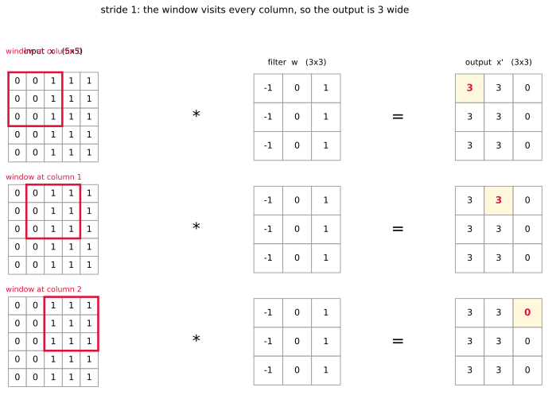
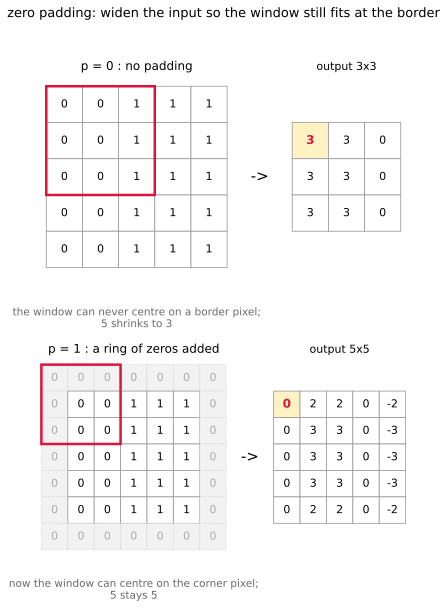
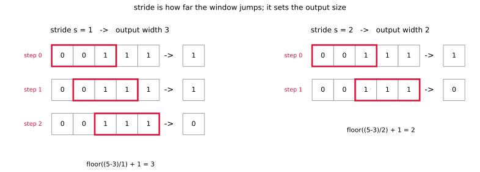
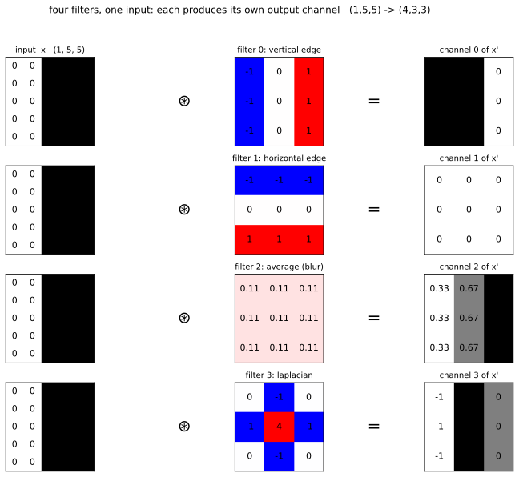
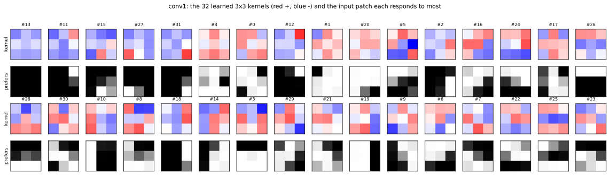
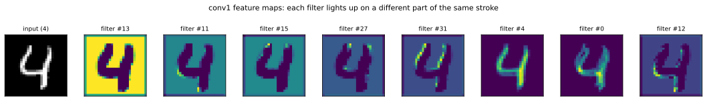

# 합성곱 신경망

[3단계](03_mlp.md)의 다층 퍼셉트론은 층을 쌓아 비선형성을 얻었지만, 여전히 첫 줄에서 이미지를 784차원 벡터로 펼친다. 그 순간 어느 화소가 어느 화소 옆에 있었는지가 사라진다. 화소를 무작위로 뒤섞어 놓아도(모든 이미지에 같은 순서라면) 결과가 똑같다는 뜻이다.

합성곱 신경망은 그 잃어버린 이웃 관계를 되찾는다. 작은 필터를 이미지 위로 미끄러뜨리며 국소적인 무늬를 읽고, 그 필터를 모든 위치에서 공유한다. 덕분에 숫자가 조금 옆으로 밀려도 같은 특징이 잡히며, 이것이 [1단계](01_template_learning.md)의 템플릿 학습이 가장 약했던 지점이다.

아래 코드는 합성곱 층 두 개와 완전 연결층 두 개만으로 이 장의 네 걸음을 마무리한다. 그 전에 합성곱이라는 연산 자체를 먼저 본다.

## 1. 합성곱은 무엇을 하는가

### 필터 한 장

작은 가중치 판 하나를 **필터**(filter) 또는 **커널**(kernel)이라 한다. 이 판을 입력 위에 얹고, 겹치는 자리끼리 곱해서 모두 더한다. 그 값 하나가 출력의 한 자리가 된다. 그런 다음 판을 한 칸 옮겨 같은 일을 되풀이한다.

식으로 적으면 이렇다. 필터가 $k \times k$이면

$$
x'[i, j] = \sum_{u=0}^{k-1} \sum_{v=0}^{k-1} w[u, v] \; x[i+u,\; j+v]
$$

곧 **입력 조각과 필터의 내적**이다. [3.2절의 선형 모델](../linear_softmax/01_linear_model.md)이 이미지 전체와 가중치 전체를 내적했다면, 합성곱은 $k \times k$짜리 조각과만 내적하되 그것을 모든 자리에서 되풀이한다.

작은 예로 보자. 왼쪽은 0이고 오른쪽은 1인 $5 \times 5$ 입력이 있다. 가운데에 세로 경계가 하나 있는 셈이다.



왼쪽 위 창에서 벌어지는 일을 그대로 적으면 이렇다.

$$
\begin{pmatrix} 0&0&1 \\ 0&0&1 \\ 0&0&1 \end{pmatrix}
\;\odot\;
\begin{pmatrix} -1&0&1 \\ -1&0&1 \\ -1&0&1 \end{pmatrix}
\;\longrightarrow\;
\begin{pmatrix} 0&0&1 \\ 0&0&1 \\ 0&0&1 \end{pmatrix},
\qquad \text{합} = 3
$$

창을 오른쪽으로 한 칸 옮기면 조각의 왼쪽 열만 0이고 나머지가 1이므로 줄마다 $0 \cdot (-1) + 1 \cdot 0 + 1 \cdot 1 = 1$, 합이 3이다. 한 칸 더 옮기면 조각이 전부 1이라 $-1 + 0 + 1 = 0$이 세 번, 곧 합이 0이다.

창은 오른쪽으로만 가는 것이 아니라 아래로도 내려간다. $5 \times 5$ 입력에 $3 \times 3$ 창을 온전히 얹을 수 있는 자리가 가로 세 곳, 세로 세 곳이므로 **모두 아홉 자리**다. 그림의 아홉 칸이 그 아홉 자리이며, **한 자리가 출력의 한 칸을 채운다.** 아홉 번 얹으면 $3 \times 3$ 출력이 빠짐없이 메워진다.

이 입력은 세로로는 변하지 않으므로 같은 열의 세 자리가 모두 같은 값을 낸다. 그래서 출력의 세 줄이 똑같다.

$$
x = \begin{pmatrix}
0&0&1&1&1 \\ 0&0&1&1&1 \\ 0&0&1&1&1 \\ 0&0&1&1&1 \\ 0&0&1&1&1
\end{pmatrix}
\;\longrightarrow\;
x' = \begin{pmatrix} 3&3&0 \\ 3&3&0 \\ 3&3&0 \end{pmatrix}
$$

출력이 말해 주는 바가 분명하다. **경계가 있는 자리에서 3, 없는 자리에서 0이다.** 이 필터는 "왼쪽은 어둡고 오른쪽은 밝은 자리"를 찾는다.

두 가지를 눈여겨보아야 한다.

- **출력이 작아졌다.** $5 \times 5$에서 $3 \times 3$이 되었다. $3 \times 3$ 창을 온전히 얹을 수 있는 자리가 가로세로 세 곳씩뿐이기 때문이며, 테두리를 채우지 않고 한 칸씩 옮기면 $H \to H - k + 1$이 된다. 이것을 되돌리는 방법이 다음에 나오는 **여백**이다.
- **필터 한 장은 출력 한 장을 만든다.** 어느 자리에 그 무늬가 있는지를 적은 지도 하나다. 이를 **특징 맵**(feature map)이라 한다.

### 여백 — 테두리를 0으로 두르기

출력이 $5 \times 5$에서 $3 \times 3$으로 줄어든 것이 늘 반가운 일은 아니다. 줄어드는 까닭은 분명하다. **창을 테두리 화소에 가운데 맞출 수 없기** 때문이다. 왼쪽 위 모서리에 창의 한가운데를 놓으려면 입력 바깥이 필요한데, 그곳에는 아무것도 없다.

그래서 없는 자리를 0으로 채워 준다. 이를 **여백**(padding), 특히 0으로 채우므로 **제로 패딩**이라 한다.



$5 \times 5$ 입력을 0으로 한 줄 둘러 $7 \times 7$로 만들면 창을 얹을 수 있는 자리가 가로세로 다섯 곳씩으로 늘어, 출력이 다시 $5 \times 5$가 된다. **입력과 출력의 크기가 같아진다.**

이것이 앞의 표에서 셋째 줄만 크기가 유지되는 까닭이다. 위의 두 줄은 $p = 0$이라 $5 \to 3$으로 줄고, `conv1`은 `padding=1`이라 $28 \to 28$로 남는다. 코드가 `nn.Conv2d(1, 32, kernel_size=3, padding=1)`로 적힌 이유가 여기 있다.

여백을 주는 까닭이 둘이다.

**첫째, 층을 쌓을 수 있다.** 여백 없이 $3 \times 3$ 합성곱을 쌓으면 층마다 2씩 줄어든다. 28에서 시작하면 26, 24, 22, ... 로 내려가 **14층이면 0이 되어 더 쌓을 수 없다.** 깊은 신경망을 만들려면 크기를 지켜야 하며, 요즘 구조가 거의 언제나 여백을 주는 까닭이다.

**둘째, 테두리 화소가 덜 홀대받는다.** 여백이 없으면 화소마다 창에 참여하는 횟수가 크게 다르다. $5 \times 5$에 $3 \times 3$ 창을 쓸 때 각 화소가 몇 번이나 쓰이는지 세어 보면 이렇다.

| | 모서리 화소 | 가운데 화소 | 차이 |
|---|---|---|---|
| $p = 0$ | 1번 | 9번 | **9배** |
| $p = 1$ | 4번 | 9번 | 2배 |

여백이 없으면 모서리 화소가 딱 한 번 쓰인다. 가운데 화소의 9분의 1만큼만 출력에 영향을 주는 셈이다. 여백을 주면 그 불균형이 2배로 줄어든다. 이미지의 가장자리에도 뜻있는 것이 있을 수 있으므로 이 차이는 그냥 넘길 일이 아니다.

!!! note "0으로 채우는 것이 공짜는 아니다"
    테두리에 넣은 0은 **없는 자료를 지어낸 것**이다. 모서리 근처의 출력값은 실제 화소와 가짜 0을 섞어 셈한 값이라 안쪽 값만큼 믿을 수 없다.

    그래서 0 대신 테두리 화소를 복사해 채우거나(`replicate`) 거울처럼 접어 채우는(`reflect`) 방법도 쓰인다. MNIST처럼 배경이 이미 0(검정)인 자료에서는 제로 패딩이 자연스럽다. 숫자 둘레가 원래 검정이므로 지어낸 0이 사실과 어긋나지 않기 때문이다.

### 보폭 — 몇 칸씩 옮길 것인가

위에서 창을 **한 칸씩** 옮겼다. 말없이 그렇게 했을 뿐, 반드시 한 칸이어야 하는 것은 아니다. 이 걸음 폭을 **보폭**(stride) $s$라 한다.



$5$칸짜리 줄에 $3$칸 창을 얹는다고 하자. $s = 1$이면 창이 0, 1, 2번 자리를 모두 들러 출력이 3칸이 된다. $s = 2$이면 0번과 2번만 들르고 1번을 건너뛰어 출력이 2칸이 된다.

여백 $p$까지 넣어 일반적으로 적으면 다음과 같다.

$$
H' = \left\lfloor \frac{H + 2p - k}{s} \right\rfloor + 1
$$

`nn.Conv2d`의 기본값이 $s = 1$이라 코드에 적혀 있지 않을 뿐이다. 앞의 예는 $\lfloor (5 + 0 - 3)/1 \rfloor + 1 = 3$이고, `conv1`은 `padding=1` 덕분에 $\lfloor (28 + 2 - 3)/1 \rfloor + 1 = 28$로 크기가 그대로 남는다. 홀수 $k$에 $p = (k-1)/2$, $s = 1$을 주면 언제나 $H' = H$다.

!!! note "풀링도 같은 식이다"
    이 식이 값진 까닭은 합성곱에만 쓰이지 않기 때문이다. `MaxPool2d(2, 2)`는 $k = 2$, $s = 2$, $p = 0$이므로

    $$
    \left\lfloor \frac{28 - 2}{2} \right\rfloor + 1 = 14,
    \qquad
    \left\lfloor \frac{14 - 2}{2} \right\rfloor + 1 = 7
    $$

    이 되어 코드의 $28 \to 14 \to 7$이 나온다. 창을 얹고 옮긴다는 점에서 **합성곱과 풀링은 같은 연산**이며, 창 안에서 가중합을 하느냐 최댓값을 고르느냐만 다르다.

    그러니 보폭을 키워 크기를 줄이면 풀링을 대신할 수도 있다. $k=3$, $s=2$, $p=1$로 두면 $\lfloor (28+2-3)/2 \rfloor + 1 = 14$로 풀링과 같은 결과가 나오며, 요즘 구조가 풀링을 빼고 보폭 2 합성곱을 쓰는 까닭이 이것이다.

보폭을 키우면 계산이 빨라지고 출력이 작아지는 대신 **자리를 건너뛰므로 놓치는 곳이 생긴다.** 이 장의 코드는 합성곱에서 $s = 1$로 하나도 빠뜨리지 않고 훑고, 크기를 줄이는 일은 풀링에 맡긴다.

### 필터 여러 장

필터 한 장은 한 가지 무늬밖에 찾지 못한다. 위의 세로 모서리 필터를 **가로** 모서리 필터로 바꾸어 같은 입력에 걸면 출력이 **전부 0**이다. 가로 방향으로는 밝기가 변하지 않으니 찾을 것이 없다.

그러니 여러 장을 함께 쓴다. 필터마다 따로 훑고, 그 결과를 **채널로 쌓는다.**



같은 입력에서 네 장이 서로 다른 것을 읽어 낸다. 세로 모서리 필터는 경계에서 3을 내놓고, 가로 모서리 필터는 아무것도 찾지 못해 0만 내놓으며, 평균 필터는 밝기를 그대로 옮기고, 라플라시안은 경계의 양쪽을 서로 다른 부호로 표시한다.

!!! note "이 얼개는 고양이의 뇌에서 왔다"
    1959년 휴벌(Hubel)과 위즐(Wiesel)은 고양이의 시각 피질에 전극을 꽂고 어떤 자극에 신경세포가 반응하는지 쟀다. 어떤 세포는 특정 **기울기의 모서리**에만 세게 반응했고, 이웃한 세포는 다른 기울기에 반응했다. 그리고 그 반응은 자극이 시야의 어느 자리에 있든 비슷했다.

    합성곱 층의 생김새가 이 세 가지를 그대로 옮긴 것이다.

    | 고양이의 시각 피질 | 합성곱 층 |
    |---|---|
    | 한 세포가 한 가지 무늬에 반응한다 | 필터 한 장이 특징 맵 한 장을 만든다 |
    | 이웃 세포들이 서로 다른 기울기를 맡는다 | 필터 여러 장을 함께 둔다 |
    | 자리가 달라도 같은 세포가 반응한다 | 같은 필터를 모든 자리에 쓴다 (가중치 공유) |

    다만 **이 이야기를 이 장의 결과로 받아들이면 안 된다.** "첫 층의 필터는 무엇을 보는가" 절에서 학습이 끝난 필터를 실제로 재어 보면, MNIST에서는 무작위로 깔아 둔 필터와 거의 구별되지 않는다. 모서리 검출기가 뚜렷이 나타나는 것은 자연 사진을 학습할 때이며, 그 비교는 [4.2절](../../ch04/02_vgg16_transfer.md)에 있다.

    생물학은 **왜 이런 구조를 떠올렸는지**를 설명하지, 그 구조가 실제로 무엇을 배웠는지를 증명하지 않는다.

모양으로 정리하면 이렇다.

| | 입력 | 필터 | 여백 $p$ | 보폭 $s$ | 출력 |
|---|---|---|---|---|---|
| 한 장 | $(1, 5, 5)$ | $(1, 3, 3)$ 한 장 | 0 | 1 | $(\mathbf{1}, 3, 3)$ |
| 네 장 | $(1, 5, 5)$ | $(1, 3, 3)$ 네 장 | 0 | 1 | $(\mathbf{4}, 3, 3)$ |
| 코드의 `conv1` | $(1, 28, 28)$ | $(1, 3, 3)$ 32장 | 1 | 1 | $(\mathbf{32}, 28, 28)$ |

곧 **출력 채널 수는 필터의 개수와 같다.** `nn.Conv2d(1, 32, 3)`의 32가 바로 이 수다.

가로세로는 $H' = \lfloor (H + 2p - k)/s \rfloor + 1$이 정하며, 표의 세 줄 모두 $s = 1$이다. 여백 없는 두 줄은 $5 \to 3$으로 줄고, `conv1`은 `padding=1` 덕분에 $28 \to 28$로 남는다. 그 까닭은 앞의 여백 절에서 그림으로 보았다.

정리하면 세 가지가 서로 독립이다. **채널 수는 필터의 개수가, 가로세로는 여백과 보폭이, 필터 한 장의 크기는 입력 채널 수가 정한다.**

### 이 필터들은 손으로 고른 것이다

여기까지 쓴 필터는 모두 사람이 정해 넣은 것이다. 세로 모서리를 찾으라고 $(-1, 0, 1)$을 적어 넣었고, 라플라시안도 알려진 값을 그대로 썼다. 연산이 무엇을 하는지 보이려면 그편이 편하기 때문이다.

**실제 신경망에서는 이 수들이 전부 학습 대상이다.** `nn.Conv2d(1, 32, 3)`을 만들면 $32 \times 9$개의 가중치가 무작위로 깔리고, 경사 하강법이 그것을 움직인다. 어느 필터가 세로 모서리를 맡으라고 아무도 정해 주지 않는다. 손실을 줄이는 쪽으로 저절로 갈릴 뿐이다.

그래서 이 장에서 학습하는 것과 정해져 있는 것을 갈라 적으면 이렇다.

| 층 | 학습하는 것 | 개수 |
|---|---|---|
| `conv1` | 필터의 가중치와 편향 | 320 |
| `conv2` | 필터의 가중치와 편향 | 18,496 |
| `fc1` | 선형 변환의 $A$와 $b$ | 401,536 |
| `fc2` | 선형 변환의 $A$와 $b$ | 1,290 |
| ReLU, 최댓값 풀링, 펼치기 | **없음** — 정해진 연산이다 | 0 |

풀링과 ReLU에 학습할 것이 없다는 점을 눈여겨보라. 크기를 줄이고 음수를 자르는 일은 규칙이 정해져 있어 데이터를 보고 바뀌지 않는다. **모델이 데이터에서 배우는 것은 오직 필터와 선형 변환뿐이다.**

그렇다면 실제로는 무엇을 배우는가? 손으로 고른 것과 닮은 모서리 검출기가 나올까? "첫 층의 필터는 무엇을 보는가" 절이 학습이 끝난 `conv1`을 열어 재어 본다.

### 입력에 채널이 여럿일 때

`conv2`는 사정이 조금 다르다. 입력이 이미 32채널이기 때문이다.

이때 필터 한 장은 $3 \times 3$이 아니라 $32 \times 3 \times 3$이다. 32개 채널의 같은 자리를 **한꺼번에** 읽어 값 하나를 내놓는다. 채널마다 따로 출력을 만드는 것이 아니라 32개를 섞어 하나로 합친다는 점이 중요하다. 그래야 "세로 모서리와 가로 모서리가 여기서 만난다" 같은 것을 알아볼 수 있다.

일반형으로 적으면, 입력 채널이 $C_{\text{in}}$이고 출력 채널이 $C_{\text{out}}$일 때

$$
\text{필터 } C_{\text{out}} \text{장}, \quad
\text{필터 한 장의 크기 } C_{\text{in}} \times k \times k, \quad
\text{매개변수 } C_{\text{out}} \times (C_{\text{in}} \cdot k \cdot k + 1)
$$

이다. 코드의 두 층에 넣어 보면 다음과 같다.

| 층 | $C_{\text{in}}$ | $C_{\text{out}}$ | 필터 한 장 | 매개변수 |
|---|---|---|---|---|
| `conv1` | 1 | 32 | $1 \times 3 \times 3$ | $32 \times (9 + 1) = 320$ |
| `conv2` | 32 | 64 | $32 \times 3 \times 3$ | $64 \times (288 + 1) = 18{,}496$ |

연습문제 2의 표에 나오는 수가 이렇게 나온다.

### 왜 이렇게 하는가

이 연산의 값어치는 **같은 필터를 모든 자리에 쓴다**는 데 있다. 완전 연결층이라면 왼쪽 위의 세로 모서리와 오른쪽 아래의 세로 모서리를 따로 배워야 하지만, 합성곱은 한 번 배운 것을 모든 자리에서 다시 쓴다.

여기서 두 가지가 따라 나온다. 첫째, 매개변수가 입력 크기와 무관해진다(연습문제 3). 둘째, 숫자가 조금 옆으로 밀려도 같은 필터가 같은 무늬를 잡아낸다(연습문제 6과 11). 앞의 세 걸음이 이미지를 펼쳐 버려 잃었던 것이 바로 이 이웃 관계다.

---

## 2. 코드

```python
"""3.4절 CNN의 여섯 갈래를 씨 다섯 개씩 재어 견준다.

책의 규약 그대로: 정규화 (0.1307, 0.3081), 배치 128, Adam 1e-3, 5 에포크.
달라지는 것은 필터 크기, 팽창, 드롭아웃, 합성곱 뒤 ReLU뿐이다.
"""
import json, time
import torch, torch.nn as nn, torch.optim as optim
from torch.utils.data import DataLoader, TensorDataset
from torchvision import datasets, transforms

device = torch.device("cuda" if torch.cuda.is_available() else "cpu")
EPOCHS, BATCH, LR = 5, 128, 1e-3
SEEDS = [0, 1, 2, 3, 4]

tf = transforms.Compose([transforms.ToTensor(), transforms.Normalize((0.1307,), (0.3081,))])
tr = datasets.MNIST("./data", train=True, transform=tf)
te = datasets.MNIST("./data", train=False, transform=tf)
Xtr = torch.cat([x for x,_ in DataLoader(tr, batch_size=2000)])
ytr = torch.cat([y for _,y in DataLoader(tr, batch_size=2000)])
Xte = torch.cat([x for x,_ in DataLoader(te, batch_size=2000)])
yte = torch.cat([y for _,y in DataLoader(te, batch_size=2000)])


class CNN(nn.Module):
    def __init__(self, k=3, dilation=1, dropout=0.25, conv_relu=True):
        super().__init__()
        self.conv1 = nn.Conv2d(1, 32, kernel_size=k, dilation=dilation, padding="same")
        self.conv2 = nn.Conv2d(32, 64, kernel_size=k, dilation=dilation, padding="same")
        self.pool = nn.MaxPool2d(2, 2)
        self.drop = nn.Dropout(dropout) if dropout else nn.Identity()
        self.fc1 = nn.Linear(64*7*7, 128)
        self.fc2 = nn.Linear(128, 10)
        self.conv_relu = conv_relu

    def forward(self, x):
        x = self.conv1(x)
        if self.conv_relu: x = torch.relu(x)
        x = self.pool(x)
        x = self.conv2(x)
        if self.conv_relu: x = torch.relu(x)
        x = self.pool(x)
        x = self.drop(torch.relu(self.fc1(x.flatten(1))))
        return self.fc2(x)


class Stacked(nn.Module):
    """블록마다 3x3을 두 번. 받는 자리는 5x5와 같고 비선형성이 한 번 더 들어간다."""

    def __init__(self, dropout=0.25):
        super().__init__()
        self.c1a = nn.Conv2d(1, 32, 3, padding=1);  self.c1b = nn.Conv2d(32, 32, 3, padding=1)
        self.c2a = nn.Conv2d(32, 64, 3, padding=1); self.c2b = nn.Conv2d(64, 64, 3, padding=1)
        self.pool = nn.MaxPool2d(2, 2)
        self.drop = nn.Dropout(dropout) if dropout else nn.Identity()
        self.fc1 = nn.Linear(64*7*7, 128); self.fc2 = nn.Linear(128, 10)

    def forward(self, x):
        x = self.pool(torch.relu(self.c1b(torch.relu(self.c1a(x)))))
        x = self.pool(torch.relu(self.c2b(torch.relu(self.c2a(x)))))
        return self.fc2(self.drop(torch.relu(self.fc1(x.flatten(1)))))


def run(seed, cls=CNN, **kw):
    torch.manual_seed(seed)
    m = cls(**kw).to(device)
    n_par = sum(p.numel() for p in m.parameters())
    opt = optim.Adam(m.parameters(), lr=LR)
    crit = nn.CrossEntropyLoss()
    g = torch.Generator().manual_seed(seed)
    ld = DataLoader(TensorDataset(Xtr, ytr), batch_size=BATCH, shuffle=True, generator=g)
    for _ in range(EPOCHS):
        m.train()
        for xb, yb in ld:
            xb, yb = xb.to(device), yb.to(device)
            opt.zero_grad(); crit(m(xb), yb).backward(); opt.step()
    m.eval()
    with torch.no_grad():
        pred = torch.cat([m(Xte[i:i+1000].to(device)).argmax(1).cpu()
                          for i in range(0, len(Xte), 1000)])
    return 100.0*(pred == yte).float().mean().item(), n_par


VARIANTS = [
    ("3x3, 드롭아웃 (지금 책)",   dict(k=3, dropout=0.25)),
    ("3x3, 드롭아웃 없음",        dict(k=3, dropout=0.0)),
    ("5x5, 드롭아웃",             dict(k=5, dropout=0.25)),
    ("5x5, 드롭아웃 없음",        dict(k=5, dropout=0.0)),
    ("5x5 팽창2, 드롭아웃",       dict(k=5, dilation=2, dropout=0.25)),
    ("3x3 두 겹, 드롭아웃",       dict(cls=Stacked, dropout=0.25)),
    ("3x3 두 겹, 드롭아웃 없음",   dict(cls=Stacked, dropout=0.0)),
    ("5x5, 드롭아웃·ReLU 없음",   dict(k=5, dropout=0.0, conv_relu=False)),
]

out = {}
for tag, kw in VARIANTS:
    t0 = time.time(); accs = []
    for s in SEEDS:
        a, n_par = run(s, **kw); accs.append(a)
    mean = sum(accs)/len(accs)
    out[tag] = dict(mean=round(mean,3), lo=round(min(accs),2), hi=round(max(accs),2),
                    spread=round(max(accs)-min(accs),3), params=n_par,
                    runs=[round(a,2) for a in accs])
    print(f"  {tag:24s} {mean:6.2f}%  퍼짐 {max(accs)-min(accs):.2f} "
          f"({min(accs):.2f}~{max(accs):.2f})  매개변수 {n_par:,}  ({time.time()-t0:.0f}s)", flush=True)

```

**출력:**

```
  3x3, 드롭아웃 (지금 책)          99.07%  퍼짐 0.20 (98.97~99.17)  매개변수 421,642  (145s)
  3x3, 드롭아웃 없음              98.97%  퍼짐 0.23 (98.81~99.04)  매개변수 421,642  (143s)
  5x5, 드롭아웃                 99.14%  퍼짐 0.27 (98.98~99.25)  매개변수 454,922  (189s)
  5x5, 드롭아웃 없음              99.06%  퍼짐 0.21 (98.94~99.15)  매개변수 454,922  (190s)
  5x5 팽창2, 드롭아웃             99.02%  퍼짐 0.16 (98.93~99.09)  매개변수 454,922  (191s)
  3x3 두 겹, 드롭아웃             99.20%  퍼짐 0.38 (98.97~99.35)  매개변수 467,818  (232s)
  3x3 두 겹, 드롭아웃 없음          99.09%  퍼짐 0.13 (99.01~99.14)  매개변수 467,818  (223s)
  5x5, 드롭아웃·ReLU 없음         98.75%  퍼짐 0.52 (98.44~98.96)  매개변수 454,922  (169s)
```

### 여섯 갈래

| 갈래 | 평균 | 퍼짐 | 범위 | 매개변수 |
|---|---|---|---|---|
| **3×3, 드롭아웃** (이 절의 모델) | 99.07% | 0.20 | 98.97~99.17 | 421,642 |
| 3×3, 드롭아웃 없음 | 98.97% | 0.23 | 98.81~99.04 | 421,642 |
| 5×5, 드롭아웃 | **99.14%** | 0.27 | 98.98~99.25 | 454,922 |
| 5×5, 드롭아웃 없음 | 99.06% | 0.21 | 98.94~99.15 | 454,922 |
| 5×5 팽창 2, 드롭아웃 | 99.02% | 0.16 | 98.93~99.09 | 454,922 |
| 3×3 두 겹, 드롭아웃 | **99.20%** | 0.38 | 98.97~99.35 | 467,818 |
| 3×3 두 겹, 드롭아웃 없음 | 99.09% | **0.13** | 99.01~99.14 | 467,818 |
| 5×5, 드롭아웃·ReLU 없음 | 98.75% | **0.52** | 98.44~98.96 | 454,922 |

---

## 5. 앞의 일곱은 서로 구별되지 않는다

표의 위 일곱 줄을 보라. 평균이 98.97%에서 99.20%까지 흩어져 있는데, **갈래 하나 안의 퍼짐이 0.13에서 0.38이다.** 평균끼리의 차이(0.23%포인트)가 한 갈래를 다시 돌릴 때 생기는 흔들림보다 작다.

곧 **필터를 키우든, 팽창을 주든, 층을 겹치든, 드롭아웃을 빼든 이 조건에서는 아무 일도 일어나지 않는다.**

### 까닭은 이미 천장에 닿았기 때문이다

놀랄 일이 아니다. **남은 오차가 0.93%포인트뿐이다.**

99.07%라는 자리에서는 고칠 것이 1%포인트도 남아 있지 않은데, 씨만 바꾸어도 0.20%포인트가 흔들린다. **흔들림이 남은 오차의 5분의 1이 넘는다.** 이런 자리에서 어떤 손잡이가 눈에 띄려면 남은 오차의 상당 부분을 한꺼번에 먹어야 하는데, 필터 크기나 드롭아웃 따위가 그럴 리 없다.

같은 손잡이를 어려운 자료에서 돌리면 이야기가 달라진다.

| | 정확도 | 남은 오차 | 씨 퍼짐 | 퍼짐 ÷ 남은 오차 |
|---|---|---|---|---|
| MNIST 4걸음 | 99.07% | **0.93%p** | 0.20 | **22%** |
| [CIFAR-10 4걸음](../../ch04/01_two_ladders.md) | 71.78% | 28.22%p | 1.11 | 4% |

CIFAR-10에서는 흔들림이 남은 오차의 4%뿐이므로, 1%포인트짜리 개선도 또렷이 보인다. **잴 여지가 스물다섯 배 넓다.**

[4장](../../ch04/index.md)이 자료를 바꾸는 까닭이 이것이다. MNIST를 버려서가 아니라, **여기서는 다음 걸음을 잴 자가 없기 때문**이다. 이 절의 일곱 갈래가 그것을 손으로 만져 본 셈이다.

이것이 왜 놀라운지 씨별 값을 보면 안다.

| 갈래 | 씨 0 | 씨 1 | 씨 2 | 씨 3 | 씨 4 |
|---|---|---|---|---|---|
| 3×3, 드롭아웃 | 99.17 | 99.10 | 98.97 | 98.98 | 99.14 |
| 5×5, 드롭아웃 없음 | 99.06 | 98.94 | **99.14** | 99.03 | 99.15 |

한 번씩만 돌려 놓고 견주면 어떤 이야기든 지어낼 수 있다. 5×5 쪽에서 씨 4(99.15)를 뽑고 3×3 쪽에서 씨 2(98.97)를 뽑으면 "5×5가 0.18%포인트 낫다"가 되고, 반대로 뽑으면 "3×3이 0.23%포인트 낫다"가 된다. **같은 두 모델에서 정반대의 결론이 나온다.**

!!! note "이 함정은 흔하다"
    구조를 조금 바꾸고 한 번 돌려 좋아진 것을 보면 그 변경이 효과가 있었다고 믿게 된다. 그러나 흔들림이 0.2%포인트인 자리에서 0.1%포인트를 얻은 것은 **아무것도 얻지 않은 것**이다.

    [4.1절](../../ch04/01_two_ladders.md)이 이 규율을 본격적으로 다룬다. 여기서 미리 한 번 겪어 두면 그 절이 훨씬 쉬워진다.

---

### 3×3 두 겹은 왜 이기지 못하는가

표에서 평균이 가장 높은 것은 **3×3 두 겹 + 드롭아웃**(99.20%)이다. 오늘날 표준이 3×3인 까닭을 생각하면 그럴듯한 결과다. VGG가 큰 필터를 버린 논거가 이것이었다. 3×3을 두 번 쌓으면 5×5와 받는 자리가 같으면서 비선형성이 한 번 더 들어간다.

그런데 이 표에서는 **이기지 못한다.** 범위가 98.97~99.35로, 이 절 모델의 범위(98.97~99.17)를 통째로 품는다. 게다가 퍼짐이 0.38로 이 일곱 가운데 가장 넓다.

값은 또렷하다.

| | 매개변수 | 5번 돌리는 데 |
|---|---|---|
| 3×3 홑겹 | 421,642 | 145초 |
| 3×3 두 겹 | 467,818 (+11%) | 232초 (+60%) |

**11% 더 큰 모델로 60% 더 오래 돌려 얻은 것이 흔들림 안의 0.13%포인트다.**

!!! note "VGG의 논거는 조건부다"
    "3×3 두 겹이 5×5보다 매개변수가 적다"는 말을 흔히 듣는다. 채널 수가 그대로일 때는 맞다. $2 \times 9C^2 = 18C^2 < 25C^2$이기 때문이다.

    **이 모델에서는 틀리다.** 블록마다 채널을 늘리기 때문이다(1→32, 32→64). 두 겹으로 만들면 둘째 층이 32→32와 64→64로 통째로 더해진다.

    | 합성곱 매개변수 | 합 |
    |---|---|
    | 3×3 홑겹 | 18,816 |
    | 5×5 홑겹 | 52,096 |
    | 3×3 두 겹 | **64,992** |

    두 겹이 5×5보다 **많다.** 널리 쓰이는 논거라도 그것이 성립하는 조건을 따져야 하며, 여기서는 그 조건이 깨져 있다.

    덧붙이면 `fc1` 하나가 401,536개라 합성곱 몫은 어차피 전체의 일부다. 이 모델에서 매개변수를 줄이고 싶다면 손댈 곳은 필터가 아니라 완전 연결층이다.

---

## 6. 마지막 갈래만 다르다

여섯째 줄은 다르다. 합성곱 뒤의 ReLU를 없애자 **98.75%로 내려가고, 무엇보다 퍼짐이 0.52로 두 배 넘게 벌어진다.**

범위가 98.44~98.96이라 이 절 모델의 범위(98.97~99.17)와 **겨우 스치듯 갈린다.** 앞의 다섯과 달리 이것은 차이라고 부를 수 있다.

그런데 0.32%포인트는 생각보다 작다. 비선형성을 없앴는데 왜 무너지지 않는가?

**비선형성이 다 없어진 것이 아니기 때문이다.** 이 갈래에서도 두 가지가 남는다.

- **최댓값 풀링**은 그 자체로 비선형이다. 2×2 칸에서 가장 큰 값을 고르는 일은 선형 연산이 아니다
- **`fc1` 뒤의 ReLU**는 그대로 있다

그러므로 이 모델은 선형 모델이 아니다. 없앤 것은 **합성곱 층 사이의** 비선형성뿐이고, 그만큼이 0.32%포인트였다.

이 값을 [3걸음](03_mlp.md)과 견주면 뜻이 또렷해진다. 2걸음에서 3걸음으로 갈 때 비선형성을 **처음** 넣어 얻은 것은 4.91%포인트였다(92.51% → 97.42%). 여기서 합성곱 사이의 비선형성을 빼며 잃은 것은 0.32%포인트다.

**같은 생각이라도 몇 번째로 더하느냐에 따라 값어치가 다르다.** 처음 넣는 비선형성은 크게 벌고, 이미 비선형인 그물에 하나 더 넣는 것은 조금 번다. 사다리가 걸음마다 남은 오차로 값어치를 재야 한다고 한 까닭이 여기에도 있다.

---

## 7. 첫 층의 필터는 무엇을 보는가

`conv1`이 배운 것을 직접 들여다볼 수 있다. 필터가 32장이고 저마다 $3 \times 3$이므로 볼 것이 288개의 수뿐이다. 아래는 이 절의 코드를 그대로 5 에포크 돌린 뒤의 모습이며, 그때의 시험 정확도는 99.18%였다(본문이 보고하는 99.22%와 마지막 자리가 다른 것은 실행마다 생기는 흔들림이다).

### 필터 자체와, 그 필터가 좋아하는 것



윗줄이 필터의 가중치다. 빨강이 양수, 파랑이 음수이며, 평균 활성값이 큰 순서로 늘어놓았다. 아랫줄은 **그 필터가 실제로 무엇에 반응하는지**를 보인 것이다. 시험 이미지 2,000장에서 $3 \times 3$ 조각 156만 8천 개를 모두 뽑아 필터를 통과시킨 뒤, 반응이 가장 큰 200개를 평균 냈다.

두 줄이 서로 닮았다는 점이 먼저 눈에 띈다. 상관계수가 평균 **0.829**이고 32개 중 11개는 0.9를 넘는다. 놀랄 일은 아니다. 합성곱은 필터와 입력 조각의 내적이므로, 조각의 크기가 일정하다면 **필터와 같은 모양일 때 값이 가장 커진다.** 곧 필터는 자기 자신을 닮은 무늬를 찾는 **정합 필터**(matched filter)이며, 아랫줄은 그 사실을 확인해 준다.

!!! warning "필터 그림에서 너무 많은 것을 읽지 마라"
    첫 층이 모서리 검출기를 배운다는 이야기를 흔히 듣는다. 정말 그런지 재어 보자. 각 필터를 고전적인 소벨 모서리 검출기와 견주어 상관계수를 구하면 이렇다.

    | | 소벨과 $|상관| > 0.7$ | $> 0.5$ | 평균 상관 |
    |---|---|---|---|
    | 학습된 필터 | 4/32 | 16/32 | 0.472 |
    | **학습하지 않은 무작위 필터** | 1/32 | 13/32 | **0.440** |

    학습된 필터가 무작위 필터보다 **거의 나을 것이 없다.** 까닭은 $3 \times 3$ 가중치가 9개뿐이라 필터가 사는 공간이 9차원밖에 안 되기 때문이다. 그 좁은 공간에서는 아무렇게나 뽑은 가중치도 모서리 검출기와 어느 정도 닮는다.

    널리 알려진 "첫 층이 가보르 필터를 배운다"는 그림은 AlexNet처럼 $11 \times 11$ 컬러 필터를 쓰는 모델에서 나온 것이다. 가중치가 363개라 눈에 보이는 구조가 생길 여지가 있다. $3 \times 3$ 회색조 필터에서 같은 것을 기대하면 안 되며, **가중치 그림만 보고 무엇을 배웠는지 판단하는 것 자체가 미덥지 않은 방법**이다.

    믿을 만한 방법은 입력에 실제로 어떻게 반응하는지 재는 것이며, 아래가 그 이야기다.

### 같은 획을 서로 다르게 본다

숫자 하나를 넣고 32장의 특징 맵 가운데 여덟 장을 보면 무슨 일이 일어나는지 드러난다.



**같은 획인데 필터마다 밝아지는 자리가 다르다.** 어떤 필터는 세로획의 왼쪽 모서리에서, 어떤 필터는 오른쪽 모서리에서, 또 어떤 필터는 가로획이나 꺾이는 자리에서 밝아진다.

방향을 재어 보면 이 분업이 우연이 아님을 알 수 있다. 필터마다 가장 크게 반응하는 밝기 변화의 방향을 구해 $0^\circ$부터 $180^\circ$까지 30도씩 나누어 세면 4, 4, 6, 9, 5, 4로 **어느 방향에도 치우치지 않는다.** 32장이 방향 공간을 고르게 나누어 맡은 셈이다.

죽은 필터도 없다. 평균 활성값이 가장 작은 것도 0.096으로, 32장 모두가 무언가를 하고 있다.

### 3분의 1은 획이 아니라 빈 곳을 본다

획 위에서의 평균 활성값은 0.533이고 배경에서는 0.162로, 전체로 보면 획에 3.3배 세게 반응한다. 그런데 필터별로 보면 다르다.

**32장 가운데 10장은 획보다 배경에서 더 세게 반응한다.**

뜻밖으로 보이지만 당연한 일이다. 숫자를 가르는 데에는 획이 **있는** 자리만큼 **없는** 자리도 중요하다. 4와 9를 가르는 것은 위쪽 고리가 닫혔는가이고, 그 물음은 "여기에 획이 없다"를 알아보는 일이다.

[1단계](01_template_learning.md)에서 클래스 평균 템플릿이 약했던 까닭, 그리고 [3.2절](../linear_softmax/06_implementation.md)에서 학습된 가중치에 음수가 섞여 있던 까닭과 같은 이야기다. 클래스 평균은 "3은 이렇게 생겼다"만 담을 수 있었고, 학습은 "여기가 켜져 있으면 3이 아니다"를 담아 10%포인트를 벌었다. 합성곱의 첫 층도 같은 일을 국소적으로 한다.

### 그래서 첫 층이 하는 일은 무엇인가

$3 \times 3$ 필터가 한 번에 보는 것은 화소 아홉 개다. 그 안에서 할 수 있는 일은 **국소적인 밝기 대비를 재는 것**뿐이다. 고리가 닫혔는지, 획이 몇 개인지, 이것이 4인지는 아홉 개의 화소로 알 수 있는 것이 아니다.

그러므로 첫 층의 구실은 알아보는 것이 아니라 **다시 적는 것**이다. 들어온 $28 \times 28$ 회색조 이미지를, 자리마다 "여기에 이런 방향의 대비가 이만큼 있다"를 32가지로 적어 둔 $32 \times 28 \times 28$ 지도로 바꾼다. 판단은 그 뒤에서 이루어진다.

| 층 | 보는 범위 | 하는 일 |
|---|---|---|
| conv1 | $3 \times 3$ | 국소 대비를 32가지 방향·부호로 적는다 |
| conv2 | $8 \times 8$ | 그 대비들을 엮어 꺾임, 끝점, 이음을 만든다 |
| fc1 | 전체 | $7 \times 7$ 자리의 특징 3,136개를 종합한다 |

이 분업이 연습문제 10의 수용 영역 계산, 그리고 매개변수의 95%가 `fc1`에 있다는 연습문제 2의 결과와 맞물린다. 첫 층은 **적은 매개변수로 표현을 좋게 만들고**(320개), 뒤쪽은 **많은 매개변수로 그 표현을 읽는다**(401,536개).

그리고 이 모든 것을 가능하게 하는 것이 가중치 공유다. 필터 하나가 288개의 수로 이미지의 **모든** 자리를 훑기 때문에, 왼쪽 위에서 배운 "이런 대비"를 오른쪽 아래에서도 그대로 알아본다. 연습문제 11에서 보듯 이것이 평행 이동에 강해지는 까닭이며, 연습문제 5에서 화소를 섞었을 때 무너지는 까닭이기도 하다. 이웃한 아홉 개를 함께 본다는 가정이 깨지면 이 층은 아무 뜻도 없는 아홉 개의 수를 섞을 뿐이다.

---

## 연습문제

!!! note "아래 풀이의 수치에 대하여"
    풀이에 적힌 값은 모두 이 쪽의 설정(정규화 적용, 배치 128, Adam $10^{-3}$, 5 에포크)에 **씨앗 42를 고정해** 재어 얻은 것이다. 모델을 만들기 직전과 자료를 섞기 직전에 씨앗을 고정했으므로, 같은 기계에서 다시 돌리면 같은 값이 나오고 모든 표가 99.18%라는 하나의 바탕값을 함께 쓴다.

    본문이 보고하는 99.22%는 씨앗을 이렇게 묶지 않은 실행에서 나온 값이라 마지막 자리가 다르다. 초기 가중치와 섞는 차례가 달라지면 0.1%포인트쯤 흔들린다.

<div class="drillbox" markdown>

**연습문제 1.** <span class="diff easy" title="쉬움"></span>
모양이 $(1, 28, 28)$인 입력에서 시작하여 Conv2d(kernel=3, padding=1)과 MaxPool2d(2) 블록 두 개를 지나는 이 구조에서, 층마다 특징 맵의 공간 차원을 계산하라.

</div>

??? success "연습문제 1 풀이"
    입력 모양 $(1, 28, 28)$에서 시작하면 다음과 같다.

    - Conv2d(1, 32, 3, padding=1) 뒤: $(32, 28, 28)$ — padding=1이 공간 크기를 지킨다
    - MaxPool2d(2) 뒤: $(32, 14, 14)$ — 공간 차원이 절반이 된다
    - Conv2d(32, 64, 3, padding=1) 뒤: $(64, 14, 14)$ — padding=1이 공간 크기를 지킨다
    - MaxPool2d(2) 뒤: $(64, 7, 7)$ — 공간 차원이 다시 절반이 된다
    - 펼치기: 특징 $64 \times 7 \times 7 = 3{,}136$개
    - FC(3136, 128) 뒤: 특징 128개
    - FC(128, 10) 뒤: 로짓 10개 (숫자 부류마다 하나)

    `padding=1`이 크기를 지키는 까닭은 $3 \times 3$ 필터가 한 화소를 중심에 두려면
    테두리마다 한 줄이 더 필요하기 때문이다. 일반적으로 보폭이 1이면 홀수 커널 $k$에
    $p = (k-1)/2$을 주었을 때 크기가 보존된다. 보폭까지 넣은 일반형은 1절에 있다.

---

<div class="drillbox" markdown>

**연습문제 2.** <span class="diff easy" title="쉬움"></span>
네 층의 매개변수를 따로 세어 합이 421,642개가 되는지 확인하라. 어느 층이 가장 많이 차지하는가?

</div>

??? success "연습문제 2 풀이"
    ```python
    for name, mod in model.named_children():
        print(f"{name:8s} {sum(p.numel() for p in mod.parameters()):>7,}")
    ```

    | 층 | 매개변수 | 몫 |
    |---|---|---|
    | conv1 | $1 \times 32 \times 3 \times 3 + 32 = 320$ | 0.1% |
    | conv2 | $32 \times 64 \times 3 \times 3 + 64 = 18{,}496$ | 4.4% |
    | fc1 | $3136 \times 128 + 128 = 401{,}536$ | **95.2%** |
    | fc2 | $128 \times 10 + 10 = 1{,}290$ | 0.3% |
    | 합 | $421{,}642$ | |

    뜻밖의 결과다. **합성곱 신경망이라 부르는데 매개변수의 95%가 합성곱이 아닌
    완전 연결층에 있다.** 합성곱 층 둘을 합쳐도 18,816개, 곧 4.5%뿐이다.

    까닭은 가중치 공유다. conv1의 필터 32개는 이미지의 어느 자리에서나 같은
    가중치를 쓰므로 $3 \times 3$짜리 32장, 곧 288개면 끝난다. 반면 fc1은 3,136개
    입력과 128개 출력을 모두 잇는다.

    그런데 정확도를 끌어올린 것은 그 4.5%다. 연습문제 9와 13에서 이를 확인한다.

---

<div class="drillbox" markdown>

**연습문제 3.** <span class="diff easy" title="쉬움"></span>
conv1의 필터 하나가 한 번에 보는 화소는 몇 개인가? conv1의 매개변수가 320개인 까닭을 그 수로 설명하라.

</div>

??? success "연습문제 3 풀이"
    $3 \times 3$ 필터이므로 한 번에 **9개**를 본다. 입력 채널이 1개이므로
    필터 하나가 가진 가중치도 9개다.

    필터가 32장이므로 가중치는 $9 \times 32 = 288$개, 편향이 필터마다 하나씩
    32개다. 합쳐서 **320개**이다.

    여기서 눈여겨볼 것은 이 320개가 **입력 크기와 무관**하다는 점이다. $28 \times 28$이든
    $256 \times 256$이든 conv1의 매개변수는 320개다. 같은 필터를 모든 자리에 다시
    쓰기 때문이다. 완전 연결층이라면 입력이 커질 때 매개변수가 함께 커진다.

    이것이 합성곱이 이미지에 알맞은 첫째 까닭이다. 둘째 까닭은 평행 이동에
    강해진다는 것이며(연습문제 6, 11), 셋째는 이웃 관계를 쓴다는 것이다(연습문제 5).

---

<div class="drillbox" markdown>

**연습문제 4.** <span class="diff med" title="중간"></span>
분류 과제에서 평균 제곱 오차(MSE)보다 `CrossEntropyLoss`을 즐겨 쓰는 까닭을 설명하라. 모델의 예측이 크게 틀렸을 때의 기울기 거동을 살펴보라.

</div>

??? success "연습문제 4 풀이"
    `CrossEntropyLoss`은 `LogSoftmax`과 음의 로그 가능도를 합친 것이다. 모델이 옳은
    부류에 아주 낮은 확률을 매기면 손실 $-\log(p)$이 매우 커지고 기울기도 강해,
    잘못을 바로잡는 강력한 학습 신호를 준다. 반면 분류에 MSE를 쓰면 옳은 부류에
    대해 $(1 - p)^2$을 계산하는데, 예측이 아무리 틀려도 기울기가 $p \to 0$에서
    0으로 사그라진다.

    게다가 교차 엔트로피는 범주형 분포에 자연스러운 손실이다. 예측 분포와 참된
    원-핫 이름표 사이의 정보 이론적 거리를 잰다. MSE는 출력 값 10개를 서로 무관한
    회귀 표적으로 다루어, 그 값들이 합이 1이어야 하는 확률 분포를 나타낸다는
    사실을 무시한다.

    왜 교차 엔트로피가 임의로 고른 함수가 아니라 최대가능도 추정에서 저절로
    따라 나오는지는 [3.2 교차 엔트로피 손실](../linear_softmax/04_cross_entropy.md)에
    있다.

---

<div class="drillbox" markdown>

**연습문제 5.** <span class="diff med" title="중간"></span>
모든 이미지의 화소를 **같은 순서로** 뒤섞은 뒤 다시 학습시켜 보라. 이 절의 도입부는 다층 퍼셉트론이라면 결과가 똑같을 것이라고 했다. 정말 그런가? 합성곱 신경망은 어떤가?

</div>

??? success "연습문제 5 풀이"
    784개 자리의 고정된 순열 하나를 만들어 학습·시험 이미지에 똑같이 적용한다.

    ```python
    perm = torch.randperm(784, generator=torch.Generator().manual_seed(0))
    Xp = X.flatten(1)[:, perm].reshape(-1, 1, 28, 28)
    ```

    | 모델 | 화소 그대로 | 화소 섞음 | 차이 |
    |---|---|---|---|
    | 다층 퍼셉트론 (은닉 128) | 97.23% | **97.31%** | +0.08 |
    | 합성곱 신경망 | 99.18% | **96.60%** | **−2.58** |

    도입부의 주장이 그대로 확인된다. 다층 퍼셉트론은 **사실상 아무 영향도 받지
    않는다.** 첫 줄에서 펼쳐 버리므로 화소의 순서가 애초에 뜻이 없고, 순열은
    첫 층 가중치의 열을 맞바꾸는 것과 같다. 0.08%포인트 차이는 실행마다 생기는
    흔들림 수준이며, 섞은 쪽이 오히려 아주 조금 **높다**는 점이 그것을 잘 보여 준다.

    반면 합성곱 신경망은 2.58%포인트를 잃고, 다층 퍼셉트론보다도 낮아진다.
    $3 \times 3$ 필터가 읽는 아홉 자리가 더 이상 서로 이웃이 아니기 때문이다.
    이웃 관계를 쓰도록 만든 구조에서 이웃 관계를 없애면 남는 것은 제약뿐이다.

    이 실험이 값진 까닭은 **합성곱의 이득이 어디서 오는지를 분리해 내기** 때문이다.
    매개변수가 많아서도, 층이 깊어서도 아니다. 입력에 공간 구조가 있고 모델이
    그것을 가정하기 때문이다. 가정이 맞으면 이득이고 틀리면 손해다.

---

<div class="drillbox" markdown>

**연습문제 6.** <span class="diff med" title="중간"></span>
시험 이미지를 오른쪽으로 1, 2, 3화소 밀어 정확도를 재어라. 다층 퍼셉트론과, [1단계 템플릿 학습](../mnist/01_template_learning.md)의 결과와 나란히 놓아라. 합성곱이 평행 이동에 강하다는 말은 얼마나 사실인가?

</div>

??? success "연습문제 6 풀이"
    | 옮김 | 없음 | 1화소 | 2화소 | 3화소 |
    |---|---|---|---|---|
    | 1단계 템플릿 학습 | 82.03% | 80.46% | 63.23% | — |
    | 3단계 다층 퍼셉트론 | 97.23% | 95.24% | 83.37% | 58.95% |
    | 4단계 합성곱 신경망 | **99.18%** | **98.81%** | **96.72%** | **88.02%** |

    사실이다. 2화소를 밀었을 때 잃는 양을 보면 확연하다. 템플릿 학습은 19%포인트,
    다층 퍼셉트론은 14%포인트를 잃는데 합성곱 신경망은 **2.5%포인트**만 잃는다.

    그런데 "강하다"가 "끄떡없다"는 뜻은 아니다. 3화소에서는 합성곱 신경망도
    11%포인트를 잃는다. 왜 완전히 불변하지 않는지는 연습문제 12에서 다룬다.
    짧게 말하면, 합성곱 자체는 평행 이동에 **등변**(equivariant)이지만 뒤따르는
    완전 연결층이 특징이 어디에 있는지를 다시 따지기 때문이다.

    MNIST는 이미 질량 중심이 맞추어진 자료이므로(1단계 연습문제 15) 실제 자료에서는
    이 차이가 더 벌어진다. 그래서 실무에서는 무작위 평행 이동으로 자료를 늘려
    이 강함을 더 키운다.

---

<div class="drillbox" markdown>

**연습문제 7.** <span class="diff med" title="중간"></span>
`nn.Dropout(0.25)`을 빼고 다시 학습시켜 보라. 정확도가 얼마나 달라지는가? 5 에포크라는 조건에서 이 결과를 어떻게 읽어야 하는가?

</div>

??? success "연습문제 7 풀이"
    한 번만 돌려서는 답할 수 없는 물음이다. 이 쪽의 "손잡이를 돌려 보면" 절에서 씨 다섯 개로 재었다.

    | | 평균 | 퍼짐 | 범위 |
    |---|---|---|---|
    | 드롭아웃 0.25 | 99.07% | 0.20 | 98.97~99.17 |
    | 드롭아웃 없음 | 98.97% | 0.23 | 98.81~99.04 |

    **차이가 0.10%포인트인데 범위가 크게 겹친다.** 곧 이 조건에서는 드롭아웃이
    버는 것을 **잴 수 없다.** 도움이 되는지 아닌지조차 이 실험은 말해 주지
    못한다.

    까닭이 둘이다. 첫째, 5 에포크는 이 모델이 6만 장을 외울 만큼 긴 학습이
    아니다. 과적합이 아직 본격적으로 시작되지 않았으므로 그것을 막는 장치의
    값어치도 작다. 둘째, MNIST는 클래스마다 표본이 6,000장씩 있는 비교적 쉬운
    자료다.

    그러니 "드롭아웃은 쓸모없다"는 결론을 내리면 안 된다. 정확한 결론은
    **이 조건에서는 잴 수 없다**는 것이다. 에포크를 50으로 늘리거나 자료를
    클래스마다 100장으로 줄이면 차이가 드러난다.

    !!! note "이 책이 한때 적어 두었던 것"
        이 풀이는 본디 "0.59%포인트 낮아진다(99.18% 대 98.59%)"고 적고 있었다.
        씨 하나씩으로 잰 값이었고, 98.59%는 씨 다섯 개로 잰 범위(98.81~99.04)
        보다도 아래인 유난히 나쁜 뽑기였다.

        결론의 방향은 그때도 옳았으나(값어치가 작다), **수 하나를 믿고 한 칸
        더 밀어 "도움이 된다"고 단정한 것**이 잘못이었다. 흔들림을 재지 않으면
        이런 일이 생긴다.

    정칙화의 효과는 언제나 "얼마나 과적합할 상황인가"에 상대적이다. 과적합하지
    않는 상황에서 정칙화를 재면 늘 작게 나온다.

---

<div class="drillbox" markdown>

**연습문제 8.** <span class="diff med" title="중간"></span>
`MaxPool2d`를 `AvgPool2d`로 바꾸어 보라. 정확도가 달라지는가? 두 풀링이 하는 일의 차이는 무엇인가?

</div>

??? success "연습문제 8 풀이"
    | | 최댓값 풀링 | 평균 풀링 |
    |---|---|---|
    | 시험 정확도 | 99.18% | **99.02%** |

    0.16%포인트 차이로, 거의 같다.

    하는 일은 다르다. 최댓값 풀링은 $2 \times 2$ 안에서 **가장 센 반응 하나만**
    남기므로 "이 무늬가 이 근처에 있었다"를 지키고 정확히 어디였는지는 버린다.
    평균 풀링은 넷을 섞으므로 세기 정보를 지키는 대신 위치의 뭉개짐이 더 심하다.

    MNIST에서 차이가 작은 까닭은 획이 있는 자리와 없는 자리(배경 0)의 대비가
    뚜렷해서 최댓값이든 평균이든 획을 놓치지 않기 때문이다. 배경이 복잡한
    자연 이미지에서는 최댓값 풀링이 대체로 낫다. 평균이 배경으로 신호를
    희석시키기 때문이다.

    요즘 구조는 풀링을 아예 빼고 `stride=2` 합성곱으로 줄이거나, 마지막에
    전역 평균 풀링만 쓰는 쪽으로 많이 옮겨 갔다.

---

<div class="drillbox" markdown>

**연습문제 9.** <span class="diff med" title="중간"></span>
합성곱 신경망과 **매개변수 수가 같은** 다층 퍼셉트론을 만들어 견주어라. 은닉 너비를 530으로 두면 421,360개가 되어 거의 같아진다. 어느 쪽이 이기는가? 이 결과가 말하는 바는 무엇인가?

</div>

??? success "연습문제 9 풀이"
    | 모델 | 매개변수 | 시험 정확도 |
    |---|---|---|
    | 다층 퍼셉트론 784→530→10 | 421,360 | 97.68% |
    | 합성곱 신경망 | 421,642 | **99.18%** |

    매개변수가 0.07% 차이로 사실상 같은데 정확도는 1.50%포인트, 오차로 보면
    2.32% 대 0.82%로 **2.8배** 벌어진다.

    말하는 바는 분명하다. **합성곱의 이득은 모델을 키운 데서 오지 않는다.**
    같은 예산을 쓰면서도 그 예산을 어떻게 배치하느냐가 다르다. 합성곱은 예산을
    "작은 필터를 모든 자리에서 공유한다"는 데 쓰고, 완전 연결층은 "모든 입력과
    모든 출력을 잇는다"는 데 쓴다. 이미지에서는 앞쪽이 맞는 가정이다.

    이것을 **귀납적 편향**(inductive bias)이라 부른다. 모델에 미리 심어 둔 가정이며,
    가정이 자료와 맞으면 같은 예산으로 더 잘하고 어긋나면 더 못한다. 연습문제 5의
    화소 섞기가 바로 어긋난 경우였다.

    이 장의 네 걸음이 매개변수 수로는 설명되지 않는다는 점도 함께 보라.
    1단계와 2단계는 매개변수가 **똑같고**(7,850개) 10%포인트가 벌어졌으며,
    여기서는 매개변수가 같고 1.5%포인트가 벌어진다.

---

<div class="drillbox" markdown>

**연습문제 10.** <span class="diff hard" title="어려움"></span>
두 번의 `Conv2d(3, padding=1)`과 두 번의 `MaxPool2d(2)`를 지난 뒤, 마지막 특징 맵의 한 화소는 입력의 몇 × 몇 영역을 보는가? 이 값이 $28$에 못 미친다는 것은 무엇을 뜻하는가?

</div>

??? success "연습문제 10 풀이"
    수용 영역(receptive field)은 뒤에서 앞으로 되짚으며 키운다. 층을 지날 때마다

    $$r_{\text{new}} = r + (k - 1) \cdot s_{\text{accum}}, \qquad
      s_{\text{accum}} \leftarrow s_{\text{accum}} \cdot s$$

    으로 자란다. $r = 1$, $s_{\text{accum}} = 1$에서 시작한다.

    | 층 | $k$ | $s$ | $r$ | 누적 stride |
    |---|---|---|---|---|
    | 시작 | | | 1 | 1 |
    | conv1 ($3\times3$) | 3 | 1 | 3 | 1 |
    | pool1 ($2\times2$) | 2 | 2 | 4 | 2 |
    | conv2 ($3\times3$) | 3 | 1 | 8 | 2 |
    | pool2 ($2\times2$) | 2 | 2 | **10** | 4 |

    곧 $(64, 7, 7)$ 맵의 한 화소는 입력의 **$10 \times 10$** 영역을 본다.

    $10 < 28$이므로 **어떤 합성곱 특징도 숫자 전체를 한꺼번에 보지 못한다.**
    그럼에도 잘 되는 까닭은 그다음의 `fc1`이 $7 \times 7$ 자리의 특징 3,136개를
    모두 받아 전체를 종합하기 때문이다.

    여기서 이 구조의 분업이 드러난다. 합성곱 층은 **국소적인 무늬**를 자리마다
    읽고, 완전 연결층이 그것들을 **전역적으로** 엮는다. 그래서 매개변수의 95%가
    fc1에 있는 것이 낭비가 아니다(연습문제 2). 더 깊은 구조는 층을 늘려 수용
    영역을 키워서 이 종합하는 일까지 합성곱이 맡게 한다.

---

<div class="drillbox" markdown>

**연습문제 11.** <span class="diff hard" title="어려움"></span>
합성곱이 평행 이동에 **등변**(equivariant)임을 보여라. 곧 입력을 옮긴 뒤 합성곱한 것이 합성곱한 뒤 옮긴 것과 같음을 보여라. 이 성질이 이 구조에서 정확히 어디까지 성립하는가?

</div>

??? success "연습문제 11 풀이"
    1차원으로 적어도 본질은 같다. 필터 $w$와 입력 $x$의 교차상관을

    $$(w \star x)[n] = \sum_{m} w[m]\, x[n + m]$$

    로 두고, 옮김 연산자를 $(T_s x)[n] = x[n - s]$라 하자. 그러면

    $$(w \star T_s x)[n]
      = \sum_m w[m]\, (T_s x)[n + m]
      = \sum_m w[m]\, x[n + m - s]
      = (w \star x)[n - s]
      = \big(T_s (w \star x)\big)[n]$$

    곧 $w \star T_s x = T_s(w \star x)$이다. $\square$

    핵심은 $w[m]$이 $n$에 **의존하지 않는다**는 것, 곧 가중치 공유다. 자리마다
    다른 필터를 쓰면 이 계산의 둘째 등호가 성립하지 않는다.

    어디까지 성립하는가가 중요하다.

    - **conv 층**: 위와 같이 정확히 성립한다. 단 테두리에서는 깨진다.
      `padding=1`이 넣는 0은 옮김과 함께 움직이지 않으므로, 획이 테두리에
      닿으면 등변성이 어긋난다.
    - **ReLU**: 원소마다 적용되므로 옮김과 교환된다. 성립한다.
    - **MaxPool2d(2, 2)**: **stride가 2이므로 짝수 칸 옮김에만 성립한다.**
      1화소 옮김은 $2 \times 2$ 격자의 경계를 넘나들어 다른 값을 낸다
      (연습문제 12).
    - **fc1**: 펼친 뒤 모든 자리를 구별해 가중치를 매기므로 **전혀 성립하지 않는다.**

    그러므로 이 모델은 등변도 불변도 아니다. 앞부분이 등변이고 뒷부분이 그
    등변성을 깨뜨린다. 연습문제 6에서 평행 이동에 "강하지만 끄떡없지는 않은"
    까닭이 여기 있다. 끝을 전역 평균 풀링으로 바꾸면 옮김에 대한 불변성이
    훨씬 좋아진다.

---

<div class="drillbox" markdown>

**연습문제 12.** <span class="diff hard" title="어려움"></span>
최댓값 풀링이 작은 평행 이동을 흡수한다고들 한다. $4 \times 4$ 입력에 점 하나를 두고 `MaxPool2d(2, 2)`를 적용해, 이 말이 성립하는 경우와 깨지는 경우를 각각 찾아라.

</div>

??? success "연습문제 12 풀이"
    점 하나만 켜 두고 1화소 옮겨 본다.

    ```python
    x = torch.zeros(1, 1, 4, 4); x[0, 0, 0, 0] = 1.0
    print(nn.MaxPool2d(2, 2)(x).flatten())        # 같은 창 안에서 움직일 때
    x2 = torch.roll(x, 1, dims=3)                 # (0,0) -> (0,1)
    print(nn.MaxPool2d(2, 2)(x2).flatten())
    ```

    **흡수되는 경우.** 점이 $(0,0)$에서 $(0,1)$로 가는 것은 같은 $2 \times 2$ 창
    안의 이동이다. 두 경우 모두 출력이 `[1, 0, 0, 0]`으로 **똑같다.** 풀링이
    창 안의 위치를 버리므로 옮김이 사라진다.

    **깨지는 경우.** 점이 $(1,1)$에서 $(1,2)$로 가면 창의 경계를 넘는다.
    출력이 `[1, 0, 0, 0]`에서 `[0, 1, 0, 0]`으로 **바뀐다.** 1화소 옮김인데
    결과가 달라진다.

    그러므로 정확한 진술은 이렇다. `MaxPool2d(2, 2)`는 **같은 창 안의 옮김에만**
    불변하고, 창 경계를 넘는 옮김에는 불변하지 않다. 임의의 1화소 옮김 가운데
    절반쯤이 경계를 넘으므로, 풀링은 평행 이동 불변성을 **주는** 것이 아니라
    **거칠게 만들어 줄이는** 것이다.

    풀링을 두 번 겹치면 누적 stride가 4가 되어 4화소 주기로만 정확히 불변해진다.
    연습문제 6에서 3화소 옮김이 유독 아팠던 것과 맞물린다. 층을 더 쌓으면
    점점 나아지지만 근본적으로 완전한 불변성은 이런 식으로 얻어지지 않는다.
    그것이 필요하면 자료 늘리기나 애초에 불변하게 설계한 구조를 쓴다.

---

<div class="drillbox" markdown>

**연습문제 13.** <span class="diff hard" title="어려움"></span>
연습문제 2는 매개변수의 95%가 `fc1`에 있음을 보였고, 연습문제 9는 같은 예산의 다층 퍼셉트론이 1.5%포인트 뒤진다는 것을 보였다. 이 둘을 함께 놓고, 합성곱 신경망의 이득이 어디서 오는지 논하라.

</div>

??? success "연습문제 13 풀이"
    두 사실은 겉보기에 어긋난다. 매개변수의 95%가 완전 연결층에 있는데 이득은
    합성곱에서 온다고 하니 말이 안 되는 듯하다. 그러나 어긋나지 않는다. 매개변수의
    **수**와 그것이 하는 **일**이 비례하지 않기 때문이다.

    세 실험을 나란히 놓으면 논증이 완성된다.

    | 실험 | 결과 | 말해 주는 것 |
    |---|---|---|
    | 같은 예산 MLP (연습 9) | 97.68% 대 99.18% | 이득이 매개변수 수에서 오지 않는다 |
    | 화소 섞기 (연습 5) | CNN 99.18% → 96.60% | 이득이 **공간 구조**에서 온다 |
    | 평행 이동 (연습 6) | CNN −2.5%p, MLP −14%p | 그 구조를 쓰는 방식이 가중치 공유다 |

    첫 실험이 "더 크기 때문"을 지운다. 둘째가 "이웃 관계를 쓰기 때문"을 남긴다.
    셋째가 그것이 구체적으로 가중치 공유로 이루어짐을 보인다.

    그러면 fc1의 401,536개는 무엇인가. **합성곱이 이미 좋은 특징을 만들어 준 뒤에
    그것을 종합하는 일**을 한다. 연습문제 10에서 보았듯 합성곱 부분이 보는 것은
    $10 \times 10$ 영역까지이므로, 전체를 엮는 일은 누군가 해야 한다.

    곧 합성곱 층은 **적은 매개변수로 표현을 좋게 만들고**, 완전 연결층은
    **많은 매개변수로 그 표현을 읽는다.** 같은 401,536개를 날것의 화소에
    쓰면(연습문제 9의 MLP) 훨씬 못하다. 매개변수의 값어치는 그 앞에 무엇이
    있느냐에 달려 있다.

    이 생각을 밀고 나가면 요즘 구조가 나온다. 합성곱을 더 깊이 쌓아 수용 영역을
    입력 전체로 키우고, 마지막 완전 연결층은 전역 평균 풀링으로 갈아 치워
    매개변수를 거의 없앤다. ResNet-18이 MNIST 크기 입력에서 이 CNN보다 적은
    완전 연결 매개변수로 더 잘하는 까닭이다.

## 정리하며

**다룬 것** — 화소의 이웃 관계

작은 필터를 모든 자리에서 공유하며 미끄러뜨리는 것만으로 97.42%에서 99.22%로 오른다. 남은 오차의 3분의 2가 사라진 셈이다.

이 절의 이득이 어디서 오는지는 세 실험으로 못박을 수 있다. 매개변수가 같은 다층 퍼셉트론은 1.5%포인트 뒤지므로 **모델을 키운 덕이 아니다.** 화소를 고정된 순서로 섞으면 합성곱 신경망만 2.6%포인트를 잃고 다층 퍼셉트론은 꿈쩍도 하지 않으므로, 이득은 **입력의 공간 구조**에서 온다. 그리고 시험 이미지를 2화소 밀었을 때 잃는 양이 14%포인트 대 2.5%포인트로 갈리므로, 그 구조를 쓰는 방식은 **가중치 공유**다.

이렇게 미리 심어 둔 가정을 귀납적 편향이라 한다. 가정이 자료와 맞으면 같은 예산으로 더 잘하고, 어긋나면 오히려 못한다. 화소를 섞은 실험이 바로 어긋난 경우였다.

### 네 걸음이 남긴 것

| 걸음 | 더한 생각 | 정확도 |
|---|---|---|
| 1 템플릿 학습 | — | 82.03% |
| 2 선형 + 소프트맥스 | 가중치를 학습한다 | 92.51% |
| 3 다층 퍼셉트론 | 비선형성 | 97.42% |
| 4 합성곱 신경망 | 이웃 관계 | 99.22% |

1단계와 2단계는 매개변수가 똑같고, 3단계와 4단계는 이 절의 연습문제 9에서 매개변수를 맞추어도 차이가 남는다. 곧 이 사다리의 어느 칸도 "모델을 키웠다"로 설명되지 않는다. 칸마다 더한 것은 **생각 하나**였다.

앞의 연습문제 13개로 직접 확인할 수 있다.
