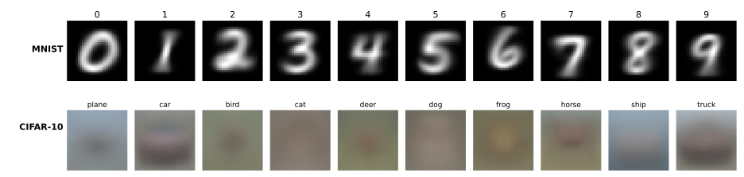

# 같은 사다리, 다른 데이터

[3장](../ch03/index.md)은 MNIST 하나를 붙들고 네 걸음을 걸었다. 걸음마다 생각을 하나씩만 더하고, 그때마다 정확도가 얼마나 오르는지를 쟀다. 사다리는 네 칸에서 끝났다.

끝난 까닭은 생각이 떨어져서가 아니다. **잴 것이 남지 않아서**다. 네 번째 칸에서 남은 오차가 1%포인트도 되지 않으니, 다섯 번째 생각이 아무리 좋아도 그것이 벌어들이는 몫을 흔들림과 구별할 수 없다. 자가 모자란 것이지 오를 곳이 없는 것이 아니다.

그래서 이 장은 모델을 바꾸는 대신 **데이터를 바꾼다**. 같은 네 걸음을 CIFAR-10 위에서 그대로 다시 걷는다. 32×32 색 사진 6만 장을 비행기·자동차·새·고양이·사슴·개·개구리·말·배·트럭 열 가지로 가르는 문제다.

---

## 1. 여덟 칸을 하나의 규약으로 잰다

두 사다리를 나란히 놓으려면 여덟 칸이 같은 조건에서 나와야 한다. 이 장은 다음을 **모든 칸에 똑같이** 건다.

| | 값 |
|---|---|
| 전처리 | `ToTensor` + `Normalize` (데이터셋별 채널 평균·표준편차) |
| 손실 | `CrossEntropyLoss` |
| 최적화기 | Adam, 학습률 $10^{-3}$ |
| 에포크 | 10 |
| 배치 크기 | 100 |
| 씨앗 | 42 |
| 기계 | Apple Silicon GPU (MPS) |

바뀌는 것은 **모델과 데이터셋뿐**이다. 그래야 칸과 칸의 차이를 모델의 차이 또는 데이터셋의 차이로 읽을 수 있다.

!!! note "3장과 이 장은 이제 **글자까지** 같은 값을 낸다"
    처음에는 그렇지 않았다. 3장은 걸음마다 설정이 조금씩 달랐다. 2걸음만 10 에포크였고 나머지는 5 에포크, 입력 정규화는 2걸음과 4걸음에만, 배치는 쪽마다 100과 128이 섞여 있었다. 각 쪽이 따로 쓰였으니 자연스러운 일이지만, 네 값을 **나란히 견주는** 자리에서는 그 차이가 곧 교란 요인이 된다.

    그래서 3장의 네 걸음을 이 장의 규약(10 에포크, 입력 정규화, 배치 100, Adam $10^{-3}$, 씨앗 42)으로 모두 고쳤다. 그런데 **규약을 맞추는 것만으로는 값이 같아지지 않았다.** 세 가지를 더 맞추고서야 같아졌고, 그 셋이 이 상자에서 배울 것이다.

    | 걸음 | 3장 | 이 장 |
    |---|---|---|
    | 1 템플릿 | 82.03% | 82.03% |
    | 2 선형 | 92.35% | 92.35% |
    | 3 MLP | 97.90% | 97.90% |
    | 4 CNN | 99.21% | 99.21% |

    **첫째, `DataLoader`는 훑기 시작할 때마다 난수를 하나 꺼내 쓴다 — 섞지 않는 로더도 그렇다.** 3장은 에포크마다 시험 집합을 훑어 진행을 찍고 이 장은 마지막에만 훑는다. 그 차이만으로 열 번의 난수가 더 빠져나가 **다음 에포크의 섞는 차례가 달라졌다.** 곧 "중간에 몇 번 들여다보았는가"가 결과를 바꾼다. 학습용 로더에 `generator=`를 따로 주어 끊었다.

    **둘째, 그림 한 장을 그리려고 자료를 엿본 것도 값을 치른다.** 3장의 3걸음 쪽은 표본 그림을 그리려고 `iter(test_loader)`를 한 번 부르는데, 그 한 줄이 위와 같은 까닭으로 난수를 먹는다. 그래서 그 뒤에 만든 모델의 **처음 가중치**가 이 장의 것과 달라졌다. 모델을 만들기 직전에 씨앗을 다시 박아 맞추었다.

    **셋째, 장치가 달랐다.** 3장의 쪽들은 `cuda`가 없으면 곧장 `cpu`로 떨어지도록 적혀 있었고, 이 장은 `mps`를 쓴다. 맥에서는 3장이 CPU로, 이 장이 GPU로 돈 것이다. 2걸음과 4걸음은 두 장치에서 우연히 같은 값이 나왔지만 3걸음은 어긋났다(아래 6절이 0.03%포인트로 잰다). 세 쪽 모두 이 장과 같은 장치 고르기를 쓰도록 고쳤다.

    셋 다 **난수를 쓰지 않는 것처럼 보이는 자리**였다는 점이 핵심이다. 시험 집합을 훑는 일, 그림 한 장을 그리는 일, 장치를 고르는 일 — 어느 것도 "학습"이 아니다. 그런데 셋이 모두 값을 움직였다.

    그러므로 "씨앗을 고정했다"는 말은 생각보다 약한 약속이다. 같은 씨앗이 같은 수열을 내는 것은 맞지만, **그 수열을 누가 먼저 얼마나 꺼내 쓰는지**까지 맞추어야 값이 같아진다.


---

## 2. 네 걸음, 두 데이터셋

| 걸음 | 더한 생각 | MNIST 매개변수 | MNIST | CIFAR-10 매개변수 | CIFAR-10 |
|---|---|---|---|---|---|
| 1 템플릿 학습 | — (평균낼 뿐) | 7,850 (고정) | 82.03% | 30,730 (고정) | 27.69% |
| 2 선형 + 소프트맥스 | 가중치를 학습한다 | 7,850 | 92.35% | 30,730 | 37.18% |
| 3 다층 퍼셉트론 | 비선형성 | 101,770 | 97.90% | 394,634 | 50.94% |
| 4 합성곱 신경망 | 이웃 관계 | 421,642 | 99.21% | 545,098 | 72.58% |

CNN의 구조는 3장에서 쓴 것 **그대로**다. 입력 채널이 1에서 3으로, 펼친 뒤의 길이가 $64 \times 7 \times 7 = 3{,}136$에서 $64 \times 8 \times 8 = 4{,}096$으로 바뀔 뿐이다. 새 사다리가 아니라 **같은 사다리를 다른 벽에 기대어 놓은 것**이다.

그리고 3장의 요점이던 매개변수 일치가 여기서도 그대로 산다.

$$
\underbrace{10 \times 3072 + 10}_{\text{1걸음 템플릿}} \;=\; \underbrace{3072 \times 10 + 10}_{\text{2걸음 선형}} \;=\; 30{,}730
$$

MNIST에서 7,850이었던 그 수가 CIFAR-10에서는 30,730이 된다. 수는 달라졌지만 이야기는 같다. **같은 개수의 수를 평균으로 못박느냐 데이터에 맞추어 움직이느냐**, 그 하나로 9.49%포인트가 갈린다.

---

## 3. 코드

한 스크립트가 여덟 칸을 모두 낸다. `name`만 바꾸면 사다리가 통째로 옮겨 간다.

```python
"""네 걸음 사다리를 MNIST와 CIFAR-10 양쪽에서 같은 규약으로 잰다."""

import torch
import torch.nn as nn
import torch.optim as optim
from torch.utils.data import DataLoader
import torchvision
import torchvision.transforms as transforms

SEED, EPOCHS, BATCH, LR = 42, 10, 100, 1e-3
device = torch.device("mps" if torch.backends.mps.is_available() else "cpu")

# === 데이터셋마다 다른 것은 이 두 줄뿐이다 ===================================
# 정규화 상수는 그 데이터셋 학습 집합의 채널별 평균과 표준편차다.
# MNIST는 회색조라 채널이 하나, CIFAR-10은 색이라 셋이다
STATS = {
    "MNIST":   ((0.1307,), (0.3081,)),
    "CIFAR10": ((0.4914, 0.4822, 0.4465), (0.2470, 0.2435, 0.2616)),
}
SHAPE = {"MNIST": (1, 28), "CIFAR10": (3, 32)}   # (채널 수, 한 변)


# 섞는 차례만 따로 맡는 난수 발생기. 전역 난수와 갈라 두는 것이 핵심이다.
#
# 까닭: DataLoader 는 훑기 시작할 때마다 난수를 하나 꺼내 쓴다. **섞지 않는
# 로더도 그렇다.** 그래서 학습 중간에 시험 집합을 한 번 훑어보는 것만으로
# 다음 에포크의 섞는 차례가 달라진다. 전역 난수에 매어 두면 "몇 번 평가했는가"
# 가 결과를 바꾸는 셈이다. 발생기를 따로 주면 그 고리가 끊긴다.
shuffle_gen = torch.Generator()


def loaders(name):
    mean, std = STATS[name]
    tf = transforms.Compose([transforms.ToTensor(),
                             transforms.Normalize(mean, std)])
    cls = getattr(torchvision.datasets, name)     # datasets.MNIST 또는 .CIFAR10
    tr = cls(root="./data", train=True, download=True, transform=tf)
    te = cls(root="./data", train=False, download=True, transform=tf)
    # 학습용 로더는 섞고, 평가용 로더는 섞지 않는다.
    # tr_eval은 1걸음이 클래스 평균을 낼 때 쓴다 (평균은 순서와 무관하다)
    return (DataLoader(tr, batch_size=BATCH, shuffle=True, generator=shuffle_gen),
            DataLoader(tr, batch_size=1000, shuffle=False),
            DataLoader(te, batch_size=1000, shuffle=False))


# === 1걸음: 템플릿 학습 — 학습이 없다 ========================================
def step1_templates(tr_eval, te, C, S):
    # 합과 개수를 따로 모아 마지막에 한 번 나눈다. 배치마다 평균을 내어
    # 그 평균들을 다시 평균 내면 안 된다 (배치마다 클래스별 장수가 다르다)
    tot = torch.zeros(10, C, S, S, device=device)
    cnt = torch.zeros(10, device=device)
    for x, y in tr_eval:
        x, y = x.to(device), y.to(device)
        tot.index_add_(0, y, x)                   # y[i]번 칸에 x[i]를 더한다
        cnt.index_add_(0, y, torch.ones_like(y, dtype=torch.float))
    tmpl = tot / cnt[:, None, None, None]         # (10, C, S, S)

    correct = n = 0
    for x, y in te:
        x, y = x.to(device), y.to(device)
        # x를 (B,1,C,S,S)로, tmpl을 (1,10,C,S,S)로 놓고 빼면 (B,10,C,S,S).
        # 뒤 세 축을 제곱합하면 이미지마다 템플릿 10개까지의 거리가 나온다
        d = ((x[:, None] - tmpl[None]) ** 2).flatten(2).sum(2)
        correct += (d.argmin(1) == y).sum().item()
        n += y.numel()
    return 100.0 * correct / n


# === 2~4걸음: 모델 세 개 =====================================================
def step2_linear(C, S):
    return nn.Sequential(nn.Flatten(), nn.Linear(C * S * S, 10))


def step3_mlp(C, S):
    return nn.Sequential(nn.Flatten(), nn.Linear(C * S * S, 128),
                         nn.ReLU(), nn.Linear(128, 10))


class Step4CNN(nn.Module):
    """3장의 구조 그대로. C와 S만 데이터셋을 따른다."""

    def __init__(self, C, S):
        super().__init__()
        self.conv1 = nn.Conv2d(C, 32, kernel_size=3, padding=1)
        self.conv2 = nn.Conv2d(32, 64, kernel_size=3, padding=1)
        self.pool = nn.MaxPool2d(2, 2)
        self.dropout = nn.Dropout(0.25)
        # 풀링을 두 번 지나 한 변이 S//4가 된다. MNIST는 28->7, CIFAR-10은 32->8
        self.fc1 = nn.Linear(64 * (S // 4) * (S // 4), 128)
        self.fc2 = nn.Linear(128, 10)

    def forward(self, x):
        x = self.pool(torch.relu(self.conv1(x)))
        x = self.pool(torch.relu(self.conv2(x)))
        x = self.dropout(torch.relu(self.fc1(x.flatten(1))))
        return self.fc2(x)      # 소프트맥스는 CrossEntropyLoss가 품고 있다


def train_and_test(model, tr, te):
    model = model.to(device)
    crit = nn.CrossEntropyLoss()
    opt = optim.Adam(model.parameters(), lr=LR)
    for _ in range(EPOCHS):
        model.train()                    # 드롭아웃을 켠다
        for x, y in tr:
            x, y = x.to(device), y.to(device)
            opt.zero_grad()              # 경사는 누적되므로 매번 0으로 지운다
            crit(model(x), y).backward()
            opt.step()

    model.eval()                         # 드롭아웃을 끈다
    correct = n = 0
    with torch.no_grad():                # 추론에는 경사가 필요 없다
        for x, y in te:
            x, y = x.to(device), y.to(device)
            correct += (model(x).argmax(1) == y).sum().item()
            n += y.numel()
    return 100.0 * correct / n


# === 여덟 칸 ================================================================
for name in ["MNIST", "CIFAR10"]:
    C, S = SHAPE[name]
    torch.manual_seed(SEED)
    tr, tr_eval, te = loaders(name)

    print(f"{name} 1 템플릿  {step1_templates(tr_eval, te, C, S):.2f}%")
    for label, build in [("2 선형", step2_linear),
                         ("3 MLP", step3_mlp),
                         ("4 CNN", Step4CNN)]:
        torch.manual_seed(SEED)          # 칸마다 같은 자리에서 다시 출발한다
        shuffle_gen.manual_seed(SEED)    # 섞는 차례도 칸마다 되돌린다
        model = build(C, S)
        acc = train_and_test(model, tr, te)
        p = sum(q.numel() for q in model.parameters())
        print(f"{name} {label}  {acc:.2f}%  매개변수 {p:,}")
```

**출력:**

```
MNIST 1 템플릿  82.03%
MNIST 2 선형  92.35%  매개변수 7,850
MNIST 3 MLP  97.90%  매개변수 101,770
MNIST 4 CNN  99.21%  매개변수 421,642
Files already downloaded and verified
Files already downloaded and verified
CIFAR10 1 템플릿  27.69%
CIFAR10 2 선형  37.18%  매개변수 30,730
CIFAR10 3 MLP  50.94%  매개변수 394,634
CIFAR10 4 CNN  72.58%  매개변수 545,098
```

여덟 줄이 이 절의 표 전부다. 1걸음의 두 값만 소수점까지 되풀이되고, 나머지 여섯은 씨앗을 바꾸면 흔들린다. 얼마나 흔들리는지가 아래 "이 표를 믿어도 되는가"의 주제다.

---

## 4. 두 사다리는 모양이 다르다

값을 그대로 늘어놓으면 두 사다리가 서로 반대로 움직인다.

| 걸음 사이 | MNIST가 버는 몫 | CIFAR-10이 버는 몫 |
|---|---|---|
| 1 → 2 | +10.32%p | +9.49%p |
| 2 → 3 | +5.55%p | +13.76%p |
| 3 → 4 | +1.31%p | **+21.64%p** |

**MNIST에서는 걸음마다 버는 몫이 줄고, CIFAR-10에서는 늘어난다.** 첫 칸에서는 MNIST가 오히려 더 번다(10.32 대 9.49). 마지막 칸에 이르면 16배 넘게 뒤집힌다.

같은 이야기를 남은 오차로 보면 더 또렷하다.

| 걸음 | MNIST 남은 오차 | 지운 몫 | CIFAR-10 남은 오차 | 지운 몫 |
|---|---|---|---|---|
| 1 | 17.97%p | | 72.31%p | |
| 2 | 7.65%p | 57% | 62.82%p | 13% |
| 3 | 2.10%p | 73% | 49.06%p | 22% |
| 4 | 0.79%p | 62% | 27.42%p | **44%** |

MNIST에서는 걸음마다 남은 오차의 60~70%를 꾸준히 지운다. 일정한 비율로 줄어드니 절대값으로 버는 몫은 빠르게 작아진다. CIFAR-10에서는 지우는 **비율 자체가** 13% → 22% → 44%로 커진다.

여기서 이 장이 하려는 말이 나온다. **어떤 생각이 얼마를 벌어 주는가는 문제가 얼마나 어려운가에 달려 있다.** MNIST만 보면 딥러닝은 거의 풀린 문제를 조금씩 다듬는 일처럼 보인다. 같은 네 걸음을 조금 더 어려운 데이터에 놓으면, 다듬기로 보이던 것들이 사실은 문제의 대부분을 쥐고 있었음이 드러난다.

3장에서 합성곱이 벌어 준 1.31%포인트는 작아 보였다. 같은 합성곱이 CIFAR-10에서는 21.64%포인트를 번다. 달라진 것은 합성곱이 아니라 **이웃 관계를 쓸 줄 아는 것이 얼마나 중요한 데이터인가**이다.

---

## 5. 1걸음이 CIFAR-10에서 말해 주는 것

두 데이터셋의 클래스 평균을 나란히 놓으면 무슨 일이 벌어졌는지 눈으로 보인다.



윗줄은 읽힌다. 흐릿하지만 0은 0으로, 3은 3으로 보인다. 아랫줄은 읽히지 않는다. `plane`은 푸른 하늘빛 얼룩이고 `deer`와 `bird`는 풀빛 얼룩이며, `cat`과 `dog`는 서로 구별되지 않는 갈색 얼룩이다.

까닭은 간단하다. 숫자는 **가운데 놓인 채 같은 방향으로 쓰인다**. 그래서 평균을 내도 모양이 남는다. 고양이 사진 6천 장은 저마다 다른 자세, 다른 크기, 다른 자리에 고양이가 있다. 평균을 내면 고양이는 사라지고 **배경의 평균색만** 남는다.

그런데 그 얼룩이 27.69%를 맞힌다. 우연이 10%이니 꽤 오른 것이다. 무엇이 이 17.69%포인트를 벌고 있는가? 두 가지를 재어 보면 답이 나온다.

<div class="exbox" markdown>

**보기 1.** <span class="diff easy" title="쉬움"></span>
이미지 한 장을 **평균 색 세 개**(R, G, B의 공간 평균)로 줄인 뒤, 똑같이 최근접 클래스 평균으로 분류하면 몇 %를 맞히는가? 반대로 **색을 없애고**(세 채널을 평균) 모양만 남기면?

</div>

??? success "풀이"
    앞의 코드에서 템플릿을 만드는 자리만 바꾸면 된다.

    ```python
    # 평균 색 세 개만 쓰기: (B, 3, 32, 32) -> (B, 3)
    feat = x.mean(dim=(2, 3))

    # 색을 없애고 모양만 쓰기: (B, 3, 32, 32) -> (B, 32, 32)
    feat = x.mean(dim=1)
    ```

    | 무엇을 쓰는가 | 이미지당 수 | 정확도 | 우연을 넘어선 몫 |
    |---|---|---|---|
    | 우연 | — | 10.00% | — |
    | 평균 색 셋 | 3 | 19.50% | 54% |
    | 모양만 (색 없음) | 1,024 | 24.69% | 83% |
    | 전부 | 3,072 | 27.69% | 100% |

    **이미지 한 장을 수 세 개로 줄여도 절반이 넘게 남는다.** 3,072개를 3개로, 곧 1,024분의 1로 줄였는데 우연을 넘어선 몫의 54%가 그대로다.

    두 줄을 더하면 100%를 넘는다는 점도 눈여겨보라(54 + 83 = 137). 색과 모양이 서로 다른 것을 재고 있는 것이 아니라 **같은 것을 겹쳐 재고 있다**는 뜻이다. 평균 이미지의 "모양"이라는 것이 대체로 밝기의 분포이고, 그 분포는 배경색이 정한다.

이것이 1걸음의 27.69%가 말해 주는 것이다. 이 분류기는 고양이를 알아보고 있지 않다. **사진의 평균색을 보고 있다.** 하늘이 넓게 보이면 비행기나 배, 풀빛이 많으면 사슴이나 새, 갈색이면 고양이나 개나 말이라고 부른다.

3장에서 1걸음의 82.03%는 "기본만 해도 이만큼은 된다"는 든든한 바닥이었다. CIFAR-10에서 같은 1걸음의 27.69%는 다른 말을 한다. **원시 화소는 이 문제에 맞는 표현이 아니다.** 나머지 세 걸음이 하는 일은 정확도를 조금씩 올리는 것이 아니라, 화소를 버리고 더 나은 표현을 찾아가는 것이다.

---

## 6. 이 표를 믿어도 되는가

이 장이 하는 모든 주장은 **두 수의 비교**다. 합성곱이 21.64%포인트를 번다는 것도, CIFAR-10의 이득이 커진다는 것도, 두 값을 빼서 얻은 말이다. 그러니 한 가지를 먼저 물어야 한다. 씨앗을 바꾸기만 해도 값이 얼마나 움직이는가? 그 움직임이 걸음 사이의 차이만 하다면, 사다리는 아무것도 재고 있지 않은 것이다.

그래서 여섯 칸을 각각 **씨앗 다섯 개**(0~4)로 다시 돌렸다.

| 걸음 | MNIST 가장 낮음~가장 높음 | 퍼짐 | CIFAR-10 가장 낮음~가장 높음 | 퍼짐 |
|---|---|---|---|---|
| 1 템플릿 | 82.03 (하나뿐) | **0** | 27.69 (하나뿐) | **0** |
| 2 선형 | 91.93 ~ 92.76 | 0.83 | 35.37 ~ 37.48 | **2.11** |
| 3 MLP | 97.51 ~ 97.77 | 0.26 | 50.07 ~ 51.80 | 1.73 |
| 4 CNN | 99.23 ~ 99.36 | 0.13 | 72.36 ~ 73.25 | 0.89 |

### 1걸음에는 오차 막대가 없다

1걸음만 값이 하나다. 씨앗을 천 번 바꾸어도 82.03%와 27.69%가 그대로 나온다. 까닭은 이 걸음에 **난수가 쓰이는 자리가 없기** 때문이다. 초기화할 가중치가 없고, 드롭아웃이 없고, 평균은 더하는 차례와 무관하니 섞어도 달라질 것이 없다.

사다리의 맨 아래 칸만 완전히 재현된다는 사실은 그저 신기한 성질이 아니다. **학습을 들여오는 순간 값이 흔들리기 시작한다**는 뜻이며, 2걸음부터의 모든 값은 하나의 수가 아니라 분포에서 뽑은 한 장이라는 뜻이다.

### 신호가 흔들림보다 큰가

걸음이 버는 몫을 그 언저리의 퍼짐으로 나누어 보면 사다리를 믿을 수 있는 정도가 나온다.

| 걸음 사이 | MNIST 이득 ÷ 퍼짐 | CIFAR-10 이득 ÷ 퍼짐 |
|---|---|---|
| 1 → 2 | 10.32 ÷ 0.83 = **12** | 9.49 ÷ 2.11 = **4.5** |
| 2 → 3 | 5.55 ÷ 0.83 = **6.7** | 13.76 ÷ 2.11 = **6.5** |
| 3 → 4 | 1.31 ÷ 0.26 = **5.0** | 21.64 ÷ 1.73 = **12** |

여기서 흔한 오해 하나가 깨진다. CIFAR-10은 걸음 사이가 10%포인트씩 벌어지니 흔들림 따위는 무시해도 될 것 같지만, **퍼짐도 함께 크다**(2.11~0.89로 MNIST의 두세 배). 두 사다리의 가장 빠듯한 칸을 보면 4.5 대 5.0으로 거의 같다. 쉬운 데이터라고 재기 쉬운 것이 아니다.

진짜 차이는 **방향**이다. MNIST에서는 이 비가 12 → 6.7 → 5.0으로 **떨어지고**, CIFAR-10에서는 4.5 → 6.5 → 12로 **올라간다.**


그리고 이것이 3장이 네 칸에서 멈춘 까닭이다. 아래 연습문제 5의 셈처럼 MNIST에서 다섯째 걸음이 남은 0.79%포인트의 60%를 지운다면 버는 몫은 0.47%포인트이고, 그 자리의 퍼짐은 0.13이다. 비가 **3.6**이다. 같은 다섯째 걸음이 CIFAR-10에서 20%포인트쯤을 번다면 비는 **22**에 이른다.

!!! warning "이 수는 규약을 고치면서 달라졌다"
    앞선 판에서는 이 비가 **1.3**이었다. "씨앗을 바꾸는 것만으로 생기는 움직임과 구별할 수 없다"고 적었고, 그것이 3장이 멈춘 까닭이라 했다.

    섞는 차례를 발생기로 떼어 내자 4걸음의 퍼짐이 0.44에서 **0.13**으로 줄었다. 흔들림의 일부는 모델의 성질이 아니라 **재는 방법**에서 왔던 것이다. 그래서 비가 3.6이 되었고, 다섯째 걸음을 잴 수 없다는 말은 더 이상 못 한다.

    그래도 방향은 남는다. 3.6은 이 사다리에서 가장 낮은 비이고 CIFAR-10의 22에 견주면 6분의 1이다. **자가 아예 없는 것이 아니라 무디다.** 자가 무딘 쪽을 버리고 잘 드는 쪽으로 옮겨 온 것이 이 장이다.

!!! note "선형 걸음의 퍼짐이 가장 크다"
    두 자료 모두 2걸음의 퍼짐이 가장 크다. MNIST는 0.83으로 3걸음(0.26)의 세 배, CIFAR-10은 2.11로 4걸음(0.89)의 두 배가 넘는다. 걸음이 올라갈수록 퍼짐이 **줄어든다.**

    까닭을 하나로 잘라 말하지는 않겠다. 처음에는 "선형 모델이 일찍 할 일을 끝내고 외우기 시작해서"라고 적었다가 재어 보고 지웠다. 에포크를 5에서 10으로 늘리면 2걸음도 **오른다**(MNIST 92.14 → 92.35, CIFAR-10 36.42 → 37.18). 외우느라 나빠지는 것이 아니다.

    확실한 것은 이것뿐이다. **덜 쓰는 모델일수록 어느 자료를 어느 차례로 보았는지에 더 흔들린다.** 그 까닭을 밝히려면 이 절이 하지 않은 실험이 더 필요하다.

### 씨앗 하나가 정하는 세 가지

`torch.manual_seed(42)`는 난수 발생기 **하나**를 맞춘다. 그런데 그 하나에서 셋이 차례로 뽑아 쓴다.

| 무엇 | 언제 뽑는가 |
|---|---|
| 가중치 초기화 | 모델을 만들 때 (`nn.Linear`가 생성자 안에서 뽑는다) |
| 섞는 차례 | `DataLoader(shuffle=True)`가 에포크마다 뽑는다 |
| 드롭아웃 가리개 | 학습 중 순전파마다 뽑는다 |

셋이 한 줄기를 나누어 쓰므로 서로 얽힌다. 어느 것이 얼마나 흔드는지 보려면 줄기를 셋으로 갈라야 한다.

```python
torch.manual_seed(init_seed)                   # (1) 초기화
model = build_model()

g = torch.Generator(); g.manual_seed(shuffle_seed)
loader = DataLoader(ds, shuffle=True, generator=g)   # (2) 섞기

torch.manual_seed(drop_seed)                   # (3) 드롭아웃
train(model, loader)
```

이렇게 갈라 놓고 CIFAR-10 CNN에서 하나씩만 풀어 보았다.

| 무엇만 바꾸었나 | 퍼짐 |
|---|---|
| 초기화만 | 1.56 |
| 섞기만 | 1.25 |
| 드롭아웃만 | 0.97 |
| 셋 다 | 1.24 |

!!! warning "여기서 결론을 내리면 안 된다"
    네 값이 모두 1.0~1.6이다. 하나만 풀었을 때가 셋 다 풀었을 때보다 **커 보이기까지** 한다(1.56 대 1.24). 이것을 "초기화가 가장 크게 흔든다"로 읽으면 틀린다.

    까닭은 간단하다. **다섯 번으로 잰 퍼짐 자체가 흔들리는 값**이기 때문이다. 최솟값과 최댓값은 표본에서 가장 극단인 두 점이라 표본이 작을수록 불안정하다. 네 줄의 차이는 그 불안정함보다 작다.

    정직한 결론은 이것이다. **셋 가운데 어느 하나가 지배하지 않으며, 다섯 번으로는 셋을 줄 세울 수 없다.** 다섯 번이면 셋을 가릴 수 있을 것처럼 보이지만 그렇지 않다는 것이 여기서 얻는 교훈이다.

!!! note "이 장의 사다리 코드에도 이 얽힘이 있다"
    3절의 코드는 걸음마다 `torch.manual_seed(SEED)`를 부른 **뒤에** 모델을 만든다. 그런데 모델을 만드는 일이 난수를 소비하고, 소비하는 개수는 구조마다 다르다. 그래서 선형 모델과 CNN은 같은 씨앗 42를 써도 **섞는 차례가 서로 다르다.**

    곧 "모델만 바꾸었다"는 말이 엄밀하게는 "모델과 데이터 순서를 함께 바꾸었다"는 뜻이다. 위의 `generator=g`가 그 고리를 끊는 방법이다.

    이 장의 결론은 그대로 선다. 섞는 차례가 달라지는 것은 **치우침을 만들지 않고 흔들림만 더하며**, 그 흔들림의 크기가 곧 위의 퍼짐표이고, 걸음 사이의 이득은 그보다 서너 배 이상 크기 때문이다. 다만 퍼짐을 1%포인트 아래로 좁혀 재고 싶다면 이 고리부터 끊어야 한다.

### 같은 기계에서는 똑같이 되풀이된다

세 씨앗을 모두 못박고 CIFAR-10 CNN을 두 번 돌리면 **72.58%와 72.58%**가 나온다. 소수점까지 같다. 흔히 GPU 연산은 어차피 제멋대로라고들 하지만, 적어도 이 작업과 이 기계에서는 그렇지 않다.

### 기계가 바뀌면 달라진다

같은 씨앗으로 MNIST MLP를 MPS와 CPU에서 각각 돌리면 이렇다.

| 기계 | 정확도 |
|---|---|
| MPS (Apple Silicon GPU) | 97.90% |
| CPU | 97.87% |

**0.03%포인트가 어긋난다.** 어긋나는 자리가 어디인지가 중요하다. 난수가 아니다. 파이토치의 난수 발생기는 정해진 알고리즘이라 씨앗 42는 어느 기계에서나 **똑같은 수열**을 낸다. 게다가 모델은 CPU에서 만들어 `.to(device)`로 옮기므로 **출발 가중치가 비트 단위로 같고**, 섞는 차례도 같다. 같은 자리에서 같은 자료를 같은 차례로 본 셈이다.

어긋나는 것은 **덧셈**이다. 부동소수점 덧셈은 결합법칙을 지키지 않아 $(a+b)+c$와 $a+(b+c)$가 마지막 자리에서 다르다. 배치의 손실을 더하든 합성곱을 누적하든, 병렬 계산은 부분합을 하드웨어가 정하는 차례로 묶는다. 기계가 다르면 묶는 차례가 다르고, 반올림이 다르다. 그 $10^{-7}$ 언저리의 차이가 6,000번의 갱신을 거치며 눈에 보이는 크기로 자란다.

그러므로 이 쪽의 표는 **이 기계에서 잰 값**이다. 다른 기계에서 99.21%를 정확히 얻으려 하면 안 된다. 얻어야 하는 것은 **퍼짐 안에 드는 값**이다.

### 난수를 쓰지 않는 것처럼 보이는 자리들

앞의 표는 난수를 쓰는 자리 셋을 적었다. 그런데 **그 표에 없는 자리**가 값을 움직인다. 3장과 이 장이 규약을 맞추고도 서로 다른 값을 내던 까닭이 모두 여기 있었다.

**`DataLoader`는 훑기 시작할 때마다 난수를 하나 꺼내 쓴다.** 섞지 않는 로더도 그렇다. 시험 집합을 훑는 것은 학습이 아니지만, 그 한 번이 전역 난수를 한 칸 밀어 놓는다.

```python
dl = DataLoader(ds, batch_size=5, shuffle=False)   # 섞지 **않는다**

torch.manual_seed(0); a = torch.randn(1)
torch.manual_seed(0)
for _ in dl: pass                                   # 한 바퀴 훑기만 한다
b = torch.randn(1)
# a != b
```

그래서 **에포크마다 시험 정확도를 찍어 보는 것만으로** 다음 에포크의 섞는 차례가 달라진다. 3장은 그렇게 찍고 이 장은 마지막에만 찍었는데, 그 차이만으로 2걸음이 92.44%와 92.15%로 갈렸다. 학습에 손을 댄 것이 하나도 없는데 말이다.

같은 까닭으로 **그림 한 장을 그리려고 자료를 엿보는 것**도 값을 치른다. 3장의 3걸음 쪽은 표본 숫자를 그리려고 `iter(test_loader)`를 한 번 부르는데, 그 뒤에 만든 모델은 처음 가중치부터 달라진다.

**장치도 값을 바꾼다.** 같은 씨앗, 같은 코드라도 CPU와 GPU는 덧셈을 묶는 차례가 달라 마지막 자리가 어긋난다. 이 장의 쪽들은 `mps`를 쓰고 3장의 쪽들은 `cuda`가 없으면 곧장 `cpu`로 떨어지게 적혀 있었다 — 맥에서는 두 장이 서로 다른 장치에서 돌고 있었던 셈이다.

!!! tip "그래서 어떻게 하면 되는가"
    **섞는 차례를 전역 난수에서 떼어 낸다.** 학습용 로더에 발생기를 따로 준다.

    ```python
    g = torch.Generator().manual_seed(SEED)
    train_loader = DataLoader(ds, shuffle=True, generator=g)
    ```

    이렇게 하면 중간에 몇 번을 들여다보든 섞는 차례가 흔들리지 않는다. 이 장과 3장이 이제 소수점까지 같은 값을 내는 것이 그 덕이다.

    **모델을 만들기 직전에 씨앗을 박는다.** 그 앞에서 무엇을 했든 처음 가중치가 같아진다.

    **장치를 고르는 줄을 쪽마다 같게 둔다.** 그리고 어느 장치에서 잰 값인지를 적어 둔다.

### 되풀이할 수 있다는 말의 세 층

이 절이 지나온 것을 정리하면 "되풀이된다"는 말에 층이 셋 있다.

| 층 | 무엇을 약속하는가 | 무엇이 깨뜨리는가 |
|---|---|---|
| **같은 기계, 같은 코드** | 소수점까지 같다 | 난수를 꺼내 쓰는 차례가 달라지면 깨진다 |
| **다른 기계, 같은 코드** | 퍼짐 안에 든다 | 부동소수점 덧셈의 차례 (CPU 대 GPU) |
| **같은 결론** | 걸음 사이의 차이가 퍼짐보다 크면 선다 | 아무것도 — 이것이 우리가 지켜야 할 층이다 |

첫째 층은 생각보다 약하다. 씨앗을 고정해도 **그 수열을 누가 먼저 얼마나 꺼내 쓰는지**까지 같아야 한다. 둘째 층은 아예 보장할 수 없다. 남는 것은 셋째 층이고, 그것을 지키는 방법이 이 절의 주제인 **퍼짐을 함께 재는 일**이다.

### 실천으로 옮기면

- **씨앗을 고정하는 것과 값을 믿는 것은 다른 일이다.** 고정은 되풀이할 수 있게 해 줄 뿐, 그 한 장이 분포의 어디쯤인지는 말해 주지 않는다. 씨앗을 고정한 99.21%는 고정하지 않은 99.21%와 똑같이 불확실하다.
- **디버깅과 그림 재현에는 씨앗을 고정한다.** 어제와 오늘이 달라지면 무엇을 고쳤는지 알 수 없다.
- **두 모델을 견준다고 주장할 때는 퍼짐을 함께 적는다.** 이 쪽이 하는 일이 그것이다.
- **퍼짐보다 작은 차이는 차이가 아니다.** 이 절의 걸음 사이 이득이 퍼짐의 몇 배인지를 늘 함께 본다.
- **섞는 차례에는 발생기를 따로 준다.** 그러지 않으면 "중간에 몇 번 들여다보았는가"가 결과를 바꾼다.
- **어느 장치에서 잰 값인지 적어 둔다.** 다른 기계에서 소수점까지 같기를 바라면 안 된다. 퍼짐 안에 들면 된 것이다.

---

## 7. 4걸음 CNN의 좋은 점과 아쉬운 점

이 절이 세운 **4걸음 CNN의 72.58%**가 남은 다섯 절의 바닥이다. 그 바닥이 무엇을 주고 무엇을 주지 못하는지 적어 둔다.

### 좋은 점

**빌리지 않고 번 것 가운데 가장 큰 몫이다.** 3걸음에서 4걸음으로 가며 **21.64%포인트**를 번다. 뒤의 네 절이 **저마다 제 바닥에서** 버는 몫은 2.68~5.96%포인트다(앙상블 +3.40, 증류 +2.68, 깊이 +3.98, 증강 +5.96). 넷은 서로 포개는 수법이 아니라 바꿔 쓰는 수법이지만, 억지로 다 더해도 16.02%포인트로 **21.64%포인트에 못 미친다.** 이보다 크게 버는 자리는 [4.6절](03_vgg16_transfer.md)뿐이고, 그것은 남의 데이터 120만 장을 빌려서 버는 값이다.

**부품이 적다.** 합성곱 둘과 완전 연결 둘, 매개변수 545,098개다. 이 장에서 이보다 작은 모델은 없고, 이 작은 모델이 CIFAR-10의 네 장 가운데 세 장을 맞힌다.

**문제가 어려울수록 더 번다.** 같은 합성곱이 MNIST에서는 1.31%포인트를 벌고 CIFAR-10에서는 21.64%포인트를 번다. 남은 오차로 보면 지우는 **비율 자체가** 13% → 22% → 44%로 커진다. 쉬운 데이터에서 다듬기처럼 보이던 것이 어려운 데이터에서는 문제의 대부분을 쥐고 있다.

**이 절의 규약이 뒤의 모든 표를 읽을 수 있게 만든다.** 여덟 칸을 한 규약으로 재고 씨앗 퍼짐까지 재어 두었기 때문에, 뒤의 절들이 "0.3%포인트를 벌었다"고 적을 때 그것이 이득인지 흔들림인지 판정할 수 있다.

### 아쉬운 점

**네 걸음을 다 걸어도 네 장 가운데 한 장을 틀린다.** 남은 오차가 **27.42%포인트**다. MNIST에서 같은 사다리를 끝까지 걸으면 0.79%포인트만 남는 것과 견주면 서른 배가 넘는다.

**퍼짐이 0.89라 작은 차이를 판정할 수 없다.** 씨앗만 바꾸어도 1%포인트 가까이 움직이므로, 이 자리에서 "0.5%포인트 좋아졌다"는 말은 아무것도 말하지 않는다. 뒤의 절들이 씨앗을 다섯씩 돌리고 퍼짐 열을 함께 적는 까닭이 그것이다.

**사다리가 여기서 끝난다.** 다섯째 걸음이 무엇인지는 이 네 걸음 안에 없다. 더 쌓을지, 자료를 불릴지, 남의 표현을 빌릴지 — 이 절은 그 물음을 열어 두기만 하고 답하지 않는다.

**추세를 밀어 다음 걸음을 맞히려 하면 빗나간다.** 연습문제 5가 지운 몫 13 → 22 → 44의 추세를 밀어 다섯째 걸음을 92~94%로 짚었는데, [4.6절](03_vgg16_transfer.md)이 **실제로 재어 보면 84.93%**다. 7~9%포인트 높게 빗나갔고 지운 몫도 47%에 그쳤다. **세 점으로 그린 추세는 네 번째 점을 맞히지 못한다.**

<div class="defn" markdown>

그러므로 이 절의 몫은 **가장 좋은 모델을 내놓는 것이 아니라 잴 자리를 만드는 것**이다. 72.58%라는 바닥과 0.89라는 퍼짐이 있어야, 뒤의 다섯 절이 재는 수가 뜻을 가진다.

</div>

---

## 연습문제

<div class="drillbox" markdown>

**연습문제 1.** <span class="diff easy" title="쉬움"></span>
CIFAR-10의 1걸음과 2걸음이 모두 30,730개의 수를 쓴다. 두 값을 각각 층별로 세어 확인하고, MNIST의 7,850과 견주어 두 수의 비가 무엇으로 정해지는지 말하라.

</div>

??? success "연습문제 1 풀이"
    1걸음은 클래스마다 평균 이미지 한 장씩이므로 $10 \times (3 \times 32 \times 32) = 30{,}720$개이고, 여기에 [3.2절](../ch03/linear_softmax/01_linear_model.md)이 보인 대로 편향에 해당하는 $-\tfrac{1}{2}\lVert \overline{x}_k \rVert^2$ 열 개가 붙어 30,730개가 된다.

    2걸음은 `nn.Linear(3072, 10)`이므로 $3072 \times 10 + 10 = 30{,}730$개다.

    ```python
    m = nn.Sequential(nn.Flatten(), nn.Linear(3 * 32 * 32, 10))
    print(sum(p.numel() for p in m.parameters()))     # 30730
    ```

    MNIST에서는 $784 \times 10 + 10 = 7{,}850$이었다. 비는 $30730 / 7850 \approx 3.91$이고, 이는 화소 수의 비 $3072 / 784 \approx 3.92$와 같다. **이 두 걸음의 매개변수 수는 오직 입력 화소 수가 정한다.** 클래스 수가 같으니 달라질 것이 그것뿐이다.

---

<div class="drillbox" markdown>

**연습문제 2.** <span class="diff easy" title="쉬움"></span>
CIFAR-10 CNN의 매개변수 545,098개를 층별로 세어라. 3장의 MNIST CNN은 421,642개였다. 늘어난 123,456개는 어느 층에서 왔는가?

</div>

??? success "연습문제 2 풀이"
    | 층 | MNIST | CIFAR-10 | 차이 |
    |---|---|---|---|
    | conv1 | $1 \times 32 \times 9 + 32 = 320$ | $3 \times 32 \times 9 + 32 = 896$ | +576 |
    | conv2 | $18{,}496$ | $18{,}496$ | 0 |
    | fc1 | $3136 \times 128 + 128 = 401{,}536$ | $4096 \times 128 + 128 = 524{,}416$ | **+122,880** |
    | fc2 | $1{,}290$ | $1{,}290$ | 0 |
    | 합 | $421{,}642$ | $545{,}098$ | +123,456 |

    늘어난 123,456개 가운데 122,880개, 곧 **99.5%가 `fc1` 하나**에서 왔다. 입력이 색이 되면서 conv1이 얻는 것은 576개뿐이다.

    3장 연습문제 2의 결론이 여기서도 되풀이된다. 합성곱 층은 가중치를 공유하므로 입력이 커져도 거의 늘지 않고, 완전 연결층만 입력 크기를 따라 커진다. CIFAR-10 CNN에서도 매개변수의 96.2%가 합성곱이 아닌 `fc1`에 있다.

---

<div class="drillbox" markdown>

**연습문제 3.** <span class="diff med" title="중간"></span>
3장에서 합성곱은 1.31%포인트를 벌었고 CIFAR-10에서는 21.64%포인트를 벌었다. 이 차이를 "CIFAR-10이 더 어렵기 때문"이라고만 설명하면 부족하다. **어떤 성질** 때문에 이웃 관계가 CIFAR-10에서 더 값진지 두 가지를 들어라.

</div>

??? success "연습문제 3 풀이"
    **첫째, 물체의 자리가 고정되어 있지 않다.** MNIST의 숫자는 가운데 맞추어져 있어 "몇 번째 화소가 켜져 있는가"만으로도 꽤 갈린다. CIFAR-10의 고양이는 어디에나 있을 수 있다. 가중치를 공유하는 필터는 어느 자리에서든 같은 무늬를 알아보므로, 자리가 흔들리는 데이터에서 훨씬 크게 이긴다. 1걸음의 얼룩이 바로 이 흔들림이 평균을 뭉갠 결과다.

    **둘째, 판별에 필요한 것이 국소 무늬의 조합이다.** 숫자는 획 몇 개의 배치로 갈리지만, 고양이와 개는 털의 결, 귀의 모서리, 눈의 대비 같은 국소 무늬가 어떻게 모이는가로 갈린다. 이미지를 펼쳐 버리면 이웃한 화소가 서로 멀어져 이런 무늬를 만들 방법이 사라진다.

    두 성질 모두 MNIST에도 있지만 정도가 약하다. 그래서 같은 합성곱이 한쪽에서는 1.31%포인트, 다른 쪽에서는 21.64%포인트를 번다.

---

<div class="drillbox" markdown>

**연습문제 4.** <span class="diff med" title="중간"></span>
1걸음의 CIFAR-10 템플릿은 평균색을 보고 있었다. 그렇다면 **각 이미지에서 그 이미지의 평균색을 빼고** 템플릿 학습을 다시 하면 어떻게 되겠는가? 먼저 예상한 뒤 재어 보라.

</div>

??? success "연습문제 4 풀이"
    ```python
    x = x - x.mean(dim=(2, 3), keepdim=True)   # 이미지마다 제 평균색을 뺀다
    ```

    이 한 줄이 본문 표의 "평균 색 셋"이 쥐고 있던 단서를 정확히 없앤다. 남는 것은 평균 주위의 변화, 곧 모양과 대비뿐이다.

    예상은 두 갈래로 갈릴 수 있다. 평균색이 우연을 넘어선 몫의 54%를 설명했으니 크게 떨어지리라 볼 수도 있고, 색과 모양이 겹쳐 재고 있었으니 (풀이의 54 + 83 = 137을 떠올리면) 생각보다 덜 떨어지리라 볼 수도 있다. 뒤쪽이 실제에 가깝다. 겹쳐 있던 단서이므로 하나를 없애도 다른 하나가 상당 부분 메운다.

    중요한 것은 어느 쪽으로 떨어지든 **여전히 30% 언저리를 넘지 못한다**는 사실이다. 원시 화소 위에서 클래스 평균을 내는 한, 전처리를 어떻게 바꾸어도 이 벽을 넘지 못한다. 벽을 넘는 것은 2걸음부터 시작되는 학습이다.

---

<div class="drillbox" markdown>

**연습문제 5.** <span class="diff hard" title="어려움"></span>
본문 4절은 CIFAR-10에서 걸음마다 지우는 오차의 **비율이 커진다**고 했다(13% → 22% → 44%). 이 추세가 계속된다면 다섯 번째 걸음은 남은 27.42%포인트의 얼마를 지워야 하는가? 그 값이 현실적인지 논하라.

</div>

??? success "연습문제 5 풀이"
    비율이 13 → 22 → 44로 한 걸음마다 1.7배, 2.0배씩 커졌다. 그대로면 다섯째 걸음은 남은 오차의 70~80%를 지워야 하고, 27.42%포인트에서 5~8%포인트가 남아 정확도는 **92~94%** 언저리가 된다.

    이 외삽을 곧이곧대로 믿을 까닭은 없다. 세 점으로 추세를 말하는 것부터 위태롭고, 비율은 100%를 넘을 수 없으니 언젠가 꺾일 수밖에 없다. 무엇보다 각 걸음이 버는 몫은 그 걸음이 **더한 생각**이 정하는 것이지 수열이 정하는 것이 아니다.

    그럼에도 이 계산은 쓸모가 있다. 기대치를 미리 적어 두어야 실제로 재었을 때 그 생각이 기대에 값하는지를 판단할 자가 생긴다.

    **실제로 재어 보면 84.93%다**([4.6절](03_vgg16_transfer.md)). 외삽이 7~9%포인트 높게 빗나갔다. 지운 몫도 70~80%가 아니라 45%였다. 세 점으로 그린 추세를 밀지 말라는 경고가 맞았던 셈이며, 이런 외삽은 **다음 걸음을 판단할 눈금으로 쓸 것이지 예측으로 믿을 것이 아니다.**

    3장의 사다리로 같은 계산을 해 보면 대비가 뚜렷하다. MNIST에서 다섯째 걸음이 남은 0.79%포인트의 60%를 지운다면 버는 몫은 0.47%포인트다. 그 자리의 퍼짐이 0.13이니 비가 3.6이다. 앞의 "이 표를 믿어도 되는가"가 이 수를 다룬다.

---

<div class="drillbox" markdown>

**연습문제 6.** <span class="diff med" title="중간"></span>
본문은 초기화·섞기·드롭아웃의 퍼짐(1.56, 1.25, 0.97)을 다섯 번으로는 줄 세울 수 없다고 했다. 줄 세우려면 몇 번쯤 돌려야 하는지 어림하라.

</div>

??? success "연습문제 6 풀이"
    최솟값과 최댓값의 차이는 표본에서 가장 극단인 두 점이라 불안정하다. **얼마나 불안정한지는 같은 실험을 한 번 더 돌려 보면 그대로 드러난다.**

    | 무엇만 바꾸었나 | 본문이 잰 퍼짐 | 씨앗을 바꾸어 다시 잰 퍼짐 |
    |---|---|---|
    | 초기화만 | **1.56** | 1.23 |
    | 섞기만 | 1.25 | **1.55** |
    | 드롭아웃만 | 0.97 | 1.15 |

    **두 번 재었더니 가장 큰 것이 바뀌었다.** 본문에서는 초기화가 가장 컸는데 다시 재니 섞기가 가장 크다. 셋을 줄 세울 수 없다는 답은 사실 이 한 줄로 이미 나온다. 그래도 몇 번이면 되는지까지 셈해 보자.

    퍼짐 대신 표준편차로 재는 편이 낫다. 아래는 다시 잰 쪽의 값이다.

    ```python
    import statistics
    statistics.stdev([72.23, 71.00, 71.61, 71.74, 71.97])   # 초기화만 -> 0.46
    ```

    | 무엇만 바꾸었나 | 퍼짐(최대−최소) | 표준편차 $s$ |
    |---|---|---|
    | 초기화만 | 1.23 | 0.46 |
    | 섞기만 | 1.55 | 0.65 |
    | 드롭아웃만 | 1.15 | 0.49 |

    가장 큰 것과 가장 작은 것의 비가 $0.65 / 0.46 \approx 1.4$다. 이만한 차이를 가리려면 $s$ 자체를 그보다 훨씬 정확히 알아야 한다.

    표본 표준편차의 상대 오차는 대략 다음과 같다.

    $$
    \frac{\text{오차}(s)}{\sigma} \approx \frac{1}{\sqrt{2(n-1)}}
    $$

    $n = 5$이면 $1/\sqrt{8} \approx 0.35$, 곧 **35%**다. 가리려는 차이가 40%인데 재는 자의 오차가 35%이니 가릴 수 없다. 오차를 10%로 줄이려면 $1/\sqrt{2(n-1)} = 0.1$에서 $n \approx 51$이 된다.

    곧 **쉰 번 남짓**이다. 다섯 번은 퍼짐이 "대략 1 언저리"임을 아는 데에는 넉넉하지만, 셋을 줄 세우는 데에는 열 배가 더 필요하다. 본문이 줄 세우기를 삼간 까닭이다.

---

<div class="drillbox" markdown>

**연습문제 7.** <span class="diff hard" title="어려움"></span>
본문은 3절의 사다리 코드에서 구조가 다르면 섞는 차례도 달라진다고 했다. 이를 코드로 확인하라. 그리고 `generator=`를 주었을 때 정말로 고리가 끊기는지도 확인하라.

</div>

??? success "연습문제 7 풀이"
    첫 배치의 라벨을 찍어 보면 바로 드러난다.

    ```python
    def first_labels(build, use_generator):
        torch.manual_seed(42)
        model = build(3, 32)                     # 난수를 여기서 소비한다
        if use_generator:
            g = torch.Generator(); g.manual_seed(42)
            ld = DataLoader(ds, batch_size=8, shuffle=True, generator=g)
        else:
            ld = DataLoader(ds, batch_size=8, shuffle=True)
        return next(iter(ld))[1]

    print(first_labels(step2_linear, False))     # 선형
    print(first_labels(Step4CNN,     False))     # CNN  -> 다른 라벨이 나온다
    print(first_labels(step2_linear, True))      # 선형 + generator
    print(first_labels(Step4CNN,     True))      # CNN  + generator -> 같아진다
    ```

    `generator`를 주지 않으면 두 줄이 다르다. 선형 모델은 가중치 30,730개를 뽑고 CNN은 545,098개를 뽑으므로, 섞을 차례를 뽑을 때 전역 난수 줄기가 서로 다른 자리에 가 있기 때문이다.

    `generator`를 주면 두 줄이 같아진다. `DataLoader`가 전역 줄기 대신 제 발생기에서 뽑으므로 모델이 무엇을 얼마나 소비했든 영향을 받지 않는다.

    **이 차이가 결과를 얼마나 바꾸는가**까지 재어 보면 좋다. 섞는 차례가 달라지는 것은 치우침을 만들지 않고 흔들림만 더하므로, 본문 퍼짐표의 폭 안에서 움직인다. 그래서 이 장의 결론은 그대로 서지만, 퍼짐을 더 좁혀 재고 싶다면 가장 먼저 끊어야 할 고리다.
