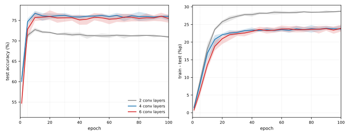

# 깊이 — 3×3을 쌓는다

[4.1절](01_two_ladders.md)의 4걸음 CNN은 CIFAR-10에서 71.78%였다. **남은 오차가 28.22%포인트다.**

[3.4절](../ch03/mnist/04_cnn.md)은 MNIST에서 같은 모델의 손잡이를 여덟 가지로 돌려 보았고, 아무것도 움직이지 않았다. 남은 오차가 0.93%포인트뿐이라 잴 여지가 없었기 때문이다.

여기서는 그 여지가 서른 배다. **같은 손잡이를 돌리면 이번에는 무엇이 일어나는가?**

---

## 1. 무엇을 바꾸고 무엇을 고정하는가

분류기 머리(`fc1`, `fc2`)를 모든 갈래에서 똑같이 둔다. 풀링을 두 번 지나 $8 \times 8 \times 64$가 되는 것도 같다. **바뀌는 것은 합성곱 더미뿐**이므로, 정확도 차이를 깊이와 필터 크기의 몫으로만 읽을 수 있다.

| 갈래 | 합성곱 더미 |
|---|---|
| 2겹 3×3 | `[conv(3→32), pool]`, `[conv(32→64), pool]` — 4.1절 그대로 |
| 2겹 5×5 | 같은 깊이, 필터만 5×5 |
| 4겹 3×3 | 블록마다 두 번 — `[conv, conv, pool]` ×2 |
| 6겹 3×3 | 블록마다 세 번 |

규약은 [4.1절](01_two_ladders.md) 그대로다. 배치 100, Adam $10^{-3}$, 5 에포크이며 씨 다섯 개로 재어 퍼짐을 함께 적는다.

### 코드

```python
"""CIFAR-10에서 같은 손잡이를 돌린다. 4.1절 규약 그대로: 배치 100, Adam 1e-3, 5 에포크.

분류기 머리(fc1, fc2)는 모든 갈래에서 같다. 바뀌는 것은 합성곱 더미뿐이라
정확도 차이를 깊이와 필터 크기의 몫으로 읽을 수 있다.
"""
import json, time
import torch, torch.nn as nn, torch.optim as optim
from torch.utils.data import DataLoader, TensorDataset
from torchvision import datasets, transforms

device = torch.device("cuda" if torch.cuda.is_available() else "cpu")
EPOCHS, BATCH, LR, SEEDS = 5, 100, 1e-3, [0,1,2,3,4]

tf = transforms.Compose([transforms.ToTensor(),
      transforms.Normalize((0.4914,0.4822,0.4465),(0.2470,0.2435,0.2616))])
tr = datasets.CIFAR10("./data", train=True, transform=tf)
te = datasets.CIFAR10("./data", train=False, transform=tf)
Xtr = torch.cat([x for x,_ in DataLoader(tr, batch_size=2000)])
ytr = torch.cat([y for _,y in DataLoader(tr, batch_size=2000)])
Xte = torch.cat([x for x,_ in DataLoader(te, batch_size=2000)])
yte = torch.cat([y for _,y in DataLoader(te, batch_size=2000)])


class Net(nn.Module):
    """블록마다 3x3을 n_per번 쌓고 풀링한다. n_per=1이면 4.1절의 4걸음이다."""
    def __init__(self, n_per=1, k=3, dropout=0.25):
        super().__init__()
        layers, cin = [], 3
        for cout in (32, 64):
            for _ in range(n_per):
                layers += [nn.Conv2d(cin, cout, k, padding=k//2), nn.ReLU()]
                cin = cout
            layers += [nn.MaxPool2d(2, 2)]
        self.features = nn.Sequential(*layers)
        self.drop = nn.Dropout(dropout) if dropout else nn.Identity()
        self.fc1 = nn.Linear(64*8*8, 128)      # 모든 갈래에서 같다
        self.fc2 = nn.Linear(128, 10)
    def forward(self, x):
        x = self.features(x)
        return self.fc2(self.drop(torch.relu(self.fc1(x.flatten(1)))))


def run(seed, **kw):
    torch.manual_seed(seed)
    m = Net(**kw).to(device)
    n_par = sum(p.numel() for p in m.parameters())
    n_conv = sum(1 for mod in m.features if isinstance(mod, nn.Conv2d))
    opt = optim.Adam(m.parameters(), lr=LR); crit = nn.CrossEntropyLoss()
    g = torch.Generator().manual_seed(seed)
    ld = DataLoader(TensorDataset(Xtr, ytr), batch_size=BATCH, shuffle=True, generator=g)
    for _ in range(EPOCHS):
        m.train()
        for xb, yb in ld:
            xb, yb = xb.to(device), yb.to(device)
            opt.zero_grad(); crit(m(xb), yb).backward(); opt.step()
    m.eval()
    with torch.no_grad():
        pred = torch.cat([m(Xte[i:i+1000].to(device)).argmax(1).cpu() for i in range(0,len(Xte),1000)])
    return 100.0*(pred==yte).float().mean().item(), n_par, n_conv


VARIANTS = [
    ("합성곱 2겹 3x3 (4.1절)",  dict(n_per=1, k=3)),
    ("합성곱 2겹 5x5",          dict(n_per=1, k=5)),
    ("합성곱 4겹 3x3",          dict(n_per=2, k=3)),
    ("합성곱 6겹 3x3",          dict(n_per=3, k=3)),
    ("합성곱 4겹 3x3, 드롭아웃 없음", dict(n_per=2, k=3, dropout=0.0)),
]
out={}
for tag, kw in VARIANTS:
    t0=time.time(); accs=[]
    for s in SEEDS:
        a,n_par,n_conv = run(s, **kw); accs.append(a)
    mean=sum(accs)/len(accs)
    out[tag]=dict(mean=round(mean,3), lo=round(min(accs),2), hi=round(max(accs),2),
                  spread=round(max(accs)-min(accs),3), params=n_par, n_conv=n_conv,
                  runs=[round(a,2) for a in accs])
    print(f"  {tag:26s} {mean:6.2f}%  퍼짐 {max(accs)-min(accs):.2f} "
          f"({min(accs):.2f}~{max(accs):.2f})  합성곱 {n_conv}층  매개변수 {n_par:,}  ({time.time()-t0:.0f}s)", flush=True)
```

**출력:**

```
  합성곱 2겹 3x3 (4.1절)          71.33%  퍼짐 1.11 (70.68~71.79)  합성곱 2층  매개변수 545,098  (147s)
  합성곱 2겹 5x5                 71.53%  퍼짐 2.29 (70.21~72.50)  합성곱 2층  매개변수 579,402  (289s)
  합성곱 4겹 3x3                 74.69%  퍼짐 1.37 (74.05~75.42)  합성곱 4층  매개변수 591,274  (421s)
  합성곱 6겹 3x3                 72.84%  퍼짐 3.25 (70.68~73.93)  합성곱 6층  매개변수 637,450  (392s)
  합성곱 4겹 3x3, 드롭아웃 없음        75.24%  퍼짐 1.23 (74.62~75.85)  합성곱 4층  매개변수 591,274  (242s)
```

---

## 2. 필터를 키우는 것은 여기서도 안 된다

| 갈래 | 평균 | 퍼짐 | 범위 | 매개변수 |
|---|---|---|---|---|
| 2겹 3×3 ([4.1절](01_two_ladders.md)) | 71.33% | 1.11 | 70.68~71.79 | 545,098 |
| 2겹 5×5 | 71.53% | **2.29** | 70.21~72.50 | 579,402 |

**+0.20%포인트, 퍼짐 안이다.** 그리고 퍼짐이 두 배로 벌어진다.

[3.4절](../ch03/mnist/04_cnn.md)에서 5×5가 아무것도 못 했을 때는 "잴 여지가 없어서"라고 읽을 수 있었다. 여기서는 그 변명이 통하지 않는다. **여지가 28%포인트나 있는데도 필터를 키우는 것으로는 그것을 먹지 못한다.**

---

## 3. 깊이는 먹는다

| 합성곱 | 평균 | 퍼짐 | 범위 | 매개변수 |
|---|---|---|---|---|
| 2겹 3×3 | 71.33% | 1.11 | 70.68~71.79 | 545,098 |
| **4겹 3×3** | **74.69%** | 1.37 | **74.05~75.42** | 591,274 |
| 6겹 3×3 | 72.84% | **3.25** | 70.68~73.93 | 637,450 |

**4겹에서 범위가 갈린다.** 가장 나쁜 실행(74.05)이 기준선의 가장 좋은 실행(71.79)보다 2.26%포인트 높다. [3.4절](../ch03/mnist/04_cnn.md)과 이 절을 통틀어 **처음으로 퍼짐을 넘는 차이**다.

### 얻은 것은 넓게 보기가 아니다

여기가 이 절의 요점이다. **5×5 한 겹과 3×3 두 겹은 받는 자리가 같다.**

3×3을 두 번 지나면 한 자리가 보는 범위가 5×5가 된다. 그런데 결과는 71.53%와 74.69%로 3.16%포인트 갈린다. 같은 넓이를 보는데 한쪽만 번다.

**다른 것은 그 사이에 ReLU가 하나 더 있다는 것뿐이다.** 곧 깊이가 버는 것은 넓게 보는 힘이 아니라 **한 번 더 굽힐 기회**다.

이것이 VGG가 큰 필터를 버리고 3×3만 쌓은 논거이며, 오늘날 표준이 3×3인 까닭이다. [다음 절](03_vgg16_transfer.md)의 VGG16에 합성곱이 13층 있는 것도 같은 생각을 끝까지 밀어붙인 결과다.

!!! note "매개변수는 근거가 되지 못한다"
    "3×3 두 겹이 5×5보다 매개변수가 적다"는 말을 흔히 듣는다. 채널 수가 그대로일 때는 맞지만($2 \times 9C^2 < 25C^2$), 이 블록은 채널을 늘리므로 성립하지 않는다. 4겹이 591,274개로 2겹 5×5의 579,402개보다 **많다.**

    게다가 `fc1` 하나가 524,416개라 세 갈래 모두 매개변수의 대부분이 거기 있다. **이 실험에서 갈린 것은 크기가 아니라 짜임이다.**

---

## 4. 예산을 늘리면 — 곡선을 본다

6겹은 4겹보다 **못하다**(72.84% 대 74.69%). 그리고 퍼짐이 3.25로 터진다. 가장 나쁜 실행(70.68)은 기준선의 가장 나쁜 실행과 똑같다 — 어떤 씨에서는 층을 네 개 더 얹고 아무것도 얻지 못했다.

깊을수록 낫다는 이야기와 어긋난다. **예산을 의심할 자리다.**

그런데 예산을 늘려 5 에포크와 30 에포크 두 점만 견주면 또 같은 함정에 빠진다. 이 절이 여기까지 보인 것이 **점 몇 개로는 모양을 알 수 없다**는 것이었다. 그러니 점이 아니라 **곡선**을 재자. 100 에포크까지 돌리되 5 에포크마다 학습·시험 정확도를 함께 적는다. 재는 값은 이미 손에 있으므로 덧짐이 8%뿐이다.



!!! note "곡선은 어떻게 재는가"
    위 코드의 `run()`에서 에포크 반복문 안에 재는 줄을 넣으면 된다. 모델을 다시
    학습할 필요가 없고, 어차피 돌아가는 학습에 평가만 얹는 것이다.

    ```python
    CHECK = [1] + list(range(5, 101, 5))       # 재는 지점

    @torch.no_grad()
    def acc(m, X, y, bs=1000):
        m.eval()
        ok = sum((m(X[i:i+bs].to(device)).argmax(1).cpu() == y[i:i+bs]).sum().item()
                 for i in range(0, len(X), bs))
        return 100.0 * ok / len(X)

    for ep in range(1, EPOCHS + 1):
        ...                                     # 한 에포크 학습
        if ep in CHECK:
            curve.append(dict(epoch=ep,
                              train=acc(m, Xtr, ytr),   # 5만 장
                              test=acc(m, Xte, yte)))   # 1만 장
    ```

    값은 5에포크마다만 재므로 덧짐이 8%다. 시험 평가는 한 에포크의 6.7%,
    학습 평가는 33.3%이며, 그것을 스무 번 남짓 하는 셈이다.

띠는 씨 다섯 개의 **가장 낮음~가장 높음**이다. [4.1절](01_two_ladders.md)이 쓴 `퍼짐`이 바로 그 정의이므로, 그림의 띠 두께와 표의 퍼짐이 같은 자다.

### 꼭대기는 10 에포크다

| 합성곱 | 5ep | **10ep** | 30ep | 100ep |
|---|---|---|---|---|
| 2겹 | 71.33% | **72.76%** | 71.70% | 70.95% |
| 4겹 | 74.69% | **76.74%** | 76.25% | 75.99% |
| 6겹 | 72.84% | 75.74% | 75.64% | 75.48% |

**셋 다 10 에포크 언저리에서 가장 높고, 그 뒤로는 오르지 않는다.**

이 절이 처음에 쓴 5 에포크는 **꼭대기에 닿기 전**이고, 30 에포크는 **이미 지난 뒤**다. 두 점만 보면 "예산을 늘려 좋아졌다"로 읽히지만, 곡선을 보면 그 사이에 봉우리가 있었다.

**6겹이 5 에포크에서 뒤처진 것은 늦게 출발하기 때문이다.** 1 에포크에서 54.72%로 셋 중 가장 낮게 시작해(2겹 60.68%, 4겹 60.06%) 10 에포크에 75.74%로 따라잡는다. 깊을수록 첫걸음이 느리다.

### 100 에포크를 주어도 6겹은 4겹을 넘지 못한다

| 100 에포크 | 평균 | 퍼짐 | 범위 |
|---|---|---|---|
| 4겹 | 75.99% | 1.52 | 74.95~76.47 |
| 6겹 | 75.48% | 1.86 | 74.46~76.32 |

범위가 크게 겹친다. 5 에포크에서 **스무 배**로 늘려도 여섯째 층이 버는 것은 없다.

### 2겹만 진짜로 나빠진다

| 30ep → 100ep | 평균 변화 | 30ep 범위 | 100ep 범위 |
|---|---|---|---|
| **2겹** | **−0.75** | 71.31~72.15 | **70.71~71.24** |
| 4겹 | −0.26 | 75.66~76.84 | 74.95~76.47 |
| 6겹 | −0.16 | 74.70~76.56 | 74.46~76.32 |

4겹과 6겹은 범위가 겹치므로 평평하다고 읽어야 한다. **2겹만 겹치지 않는다** — 100 에포크에서 가장 좋은 실행(71.24)이 30 에포크에서 가장 나쁜 실행(71.31)보다 낮다. 얕은 그물은 예산을 더 주면 **나빠진다.**

---

## 5. 막는 것은 예산이 아니라 과적합이다

그림의 오른쪽 칸이 까닭을 말한다.

| 학습 − 시험 틈 | 5ep | 30ep | 100ep |
|---|---|---|---|
| 2겹 | 8.8 | 27.3 | **28.8** |
| 4겹 | 8.0 | 22.8 | 23.7 |
| 6겹 | **6.0** | 22.4 | 23.9 |

**5 에포크에서는 셋 다 틈이 6~9%포인트뿐이다.** 과적합은 그 뒤에 일어나며, 꼭대기와 거의 같은 자리에서 시작된다. 곧 **정확도가 멈추는 지점과 외우기 시작하는 지점이 같다.**

그리고 **얕을수록 더 심하게 외운다.** 2겹의 틈이 28.8로 가장 크다. [4.4절](04_augmentation.md)이 같은 설정에서 학습 정확도 99.05%를 보고하므로, 2겹은 10 에포크에 이미 천장에 닿고 남은 90 에포크를 통째로 외우는 데 썼다.

이것이 이 절의 결론을 바꾼다. 앞에서 "깊이는 천장을 올리는 동시에 거기 닿는 값도 올린다"고 적을 뻔했지만, 곡선은 다른 말을 한다. **세 깊이 모두 10 에포크면 닿는다.** 값이 다른 것이 아니라 **천장이 다르고, 그 천장을 정하는 것은 과적합**이다.

그러면 길이 둘로 갈린다. 과적합을 막아 천장을 올리거나([4.4절](04_augmentation.md)의 증강), 아예 남이 올려 둔 천장을 빌려 오거나([다음 절](03_vgg16_transfer.md)의 전이).

---

## 6. 그래서 다음 절이 필요하다

여기까지가 맨바닥에서 얻을 수 있는 것이다.

| | 정확도 |
|---|---|
| [4.1절](01_two_ladders.md) 4걸음 | 71.78% |
| 4겹 3×3, 10 에포크 | **76.74%** |

약 5%포인트를 벌었고, 값은 층 두 개와 두 배의 시간이었다.

그런데 더 깊이 가려니 벽이 있다. 6겹은 100 에포크를 주고도 4겹을 넘지 못했다. 층을 더 얹는 것으로는 이 천장을 뚫지 못한다.

**이 벽을 누가 이미 넘어 두었다면?** [다음 절](03_vgg16_transfer.md)의 VGG16은 합성곱이 13층이며, ImageNet 120만 장으로 학습되어 있다. 우리가 치르지 못한 예산을 남이 치른 것이다.

---

## 연습문제

<div class="drillbox" markdown>

**연습문제 1.** <span class="diff normal" title="중간"></span>
본문은 5×5 한 겹과 3×3 두 겹이 "받는 자리가 같다"고 했다. 이를 확인하라. 그리고 3×3 세 겹은 몇 ×몇에 해당하는가?

</div>

??? success "연습문제 1 풀이"
    3×3 합성곱을 한 번 지나면 한 자리가 보는 범위가 한 쪽으로 1칸씩 늘어난다. 곧 받는 자리의 한 변이 $3 \to 5 \to 7$로 2씩 커진다.

    | 3×3을 겹친 수 | 받는 자리 | 매개변수(채널 $C$ 고정) |
    |---|---|---|
    | 1 | 3×3 | $9C^2$ |
    | 2 | **5×5** | $18C^2$ |
    | 3 | **7×7** | $27C^2$ |

    일반형은 $k$겹일 때 $2k+1$이다.

    채널이 고정이라면 3겹($27C^2$)이 7×7 한 겹($49C^2$)보다 싸다. VGG 논문이 든 근거가 이것이며, 겹칠수록 이득이 커진다. 다만 본문이 짚었듯 **채널을 늘리는 블록에서는 성립하지 않는다.**

---

<div class="drillbox" markdown>

**연습문제 2.** <span class="diff hard" title="어려움"></span>
곡선을 보면 6겹은 1 에포크에서 54.72%로 가장 낮게 출발해 10 에포크에 따라잡는다. "깊을수록 늦게 출발한다"는 말로 이 일을 설명했는데, 무엇이 그렇게 만드는가? 다른 설명은 없는가?

</div>

??? success "연습문제 2 풀이"
    적어도 셋이 그럴듯하다.

    **하나, 기울기가 깊이를 통과하기 어렵다.** 층이 여섯이면 되짚기가 지나야 할 길이 길어지고, 첫 층에 닿는 신호가 약해진다. 늦게 출발하다 결국 따라잡는 모양과 어긋나지 않는다. 느리게라도 흐르면 오래 돌릴수록 나아지기 때문이다. 가려내려면 층마다 기울기의 크기를 재어 뒤로 갈수록 줄어드는지 보면 된다.

    **둘, 무게를 처음 깔아 둔 자리가 나쁘다.** 층이 늘수록 곱해지는 것이 많아져 초기 활성화의 크기가 층을 지나며 커지거나 작아진다. 배치 정규화가 흔히 이 자리를 푼다.

    **셋, 학습률이 맞지 않는다.** 깊은 그물은 흔히 더 작은 학습률을 원한다. 이 실험은 규약을 지키려고 $10^{-3}$으로 고정했으므로 6겹에만 불리했을 수 있다.

    **가려내는 법은 하나씩 푸는 것이다.** [4.7절](07_distillation.md)이 대조군으로 이득을 둘로 나눈 것과 같은 방식이다. 다만 배치 정규화를 넣으면 첫째와 둘째가 함께 풀리므로, 그 실험 하나로는 어느 쪽이 원인이었는지 여전히 가릴 수 없다.

    **이 절은 이 물음에 답하지 않았다.** 곡선은 6겹이 늦게 출발한다는 *사실*을 보였을 뿐, 까닭을 가린 것이 아니다.
