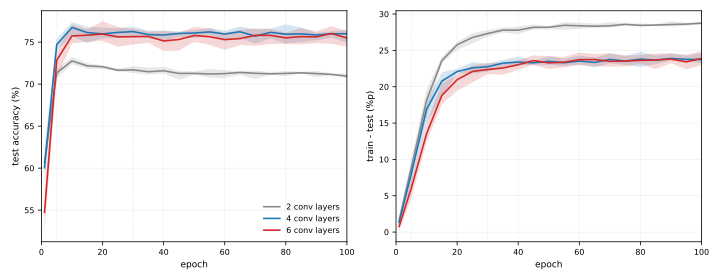

# 깊이 — 3×3을 쌓는다

[4.1절](01_two_ladders.md)의 4걸음 CNN은 CIFAR-10에서 72.58%였다. **남은 오차가 27.42%포인트다.**

[3.4절](../ch03/mnist/04_cnn.md)은 MNIST에서 같은 모델의 손잡이를 여덟 가지로 돌려 보았고, 아무것도 움직이지 않았다. 남은 오차가 0.93%포인트뿐이라 잴 여지가 없었기 때문이다.

여기서는 그 여지가 서른 배다. **같은 손잡이를 돌리면 이번에는 무엇이 일어나는가?**

---

## 1. 무엇을 바꾸고 무엇을 고정하는가

분류기 머리(`fc1`, `fc2`)를 모든 갈래에서 똑같이 둔다. 풀링을 두 번 지나 $8 \times 8 \times 64$가 되는 것도 같다. **바뀌는 것은 합성곱 더미뿐**이므로, 정확도 차이를 깊이와 필터 크기의 몫으로만 읽을 수 있다.

| 갈래 | 합성곱 더미 |
|---|---|
| 2겹 3×3 | `[conv(3→32), pool]`, `[conv(32→64), pool]` — 4.1절 그대로 |
| 2겹 5×5 | 같은 깊이, 필터만 5×5 |
| 4겹 3×3 | 블록마다 두 번 — `[conv, conv, pool]` ×2 |
| 6겹 3×3 | 블록마다 세 번 |

규약은 [4.1절](01_two_ladders.md)과 **같다**. 10 에포크, 배치 100, Adam $10^{-3}$이며 씨 다섯 개로 재어 퍼짐을 함께 적는다. 두 절의 수를 곧바로 견줄 수 있다는 뜻이다.

에포크를 10으로 두는 것은 아래 4절이 그 자리가 꼭대기임을 보이기 때문이다. 다만 **에포크 자체도 이 절의 손잡이 가운데 하나**이므로, 4절에서는 5와 10과 30과 100을 모두 재어 곡선을 그린다. 그러니 아래 표는 그 곡선의 꼭대기에서 자른 한 단면으로 읽으면 된다.

### 코드

```python
"""CIFAR-10에서 같은 손잡이를 돌린다. 배치 100, Adam 1e-3, 10 에포크.
(4.1절과 같은 규약이다. 이 절은 에포크도 손잡이로 보므로 4절에서 100까지 올린다.)

분류기 머리(fc1, fc2)는 모든 갈래에서 같다. 바뀌는 것은 합성곱 더미뿐이라
정확도 차이를 깊이와 필터 크기의 몫으로 읽을 수 있다.

실험 규모: 갈래 5개 x 씨앗 5개 = 학습 25번, 각 10 에포크.
"""
import json
import time

import torch
import torch.nn as nn
import torch.optim as optim
from torch.utils.data import DataLoader, TensorDataset
from torchvision import datasets, transforms


# =============================================================================
# 1. 실험 설정
# =============================================================================
device = torch.device("cuda" if torch.cuda.is_available()
                      else "mps" if torch.backends.mps.is_available()
                      else "cpu")

NUM_EPOCHS    = 10
BATCH_SIZE    = 100
LEARNING_RATE = 1e-3
SEEDS         = [0, 1, 2, 3, 4]   # 씨앗마다 초기 가중치와 섞는 순서가 달라진다
RESULTS_FILE  = "cifar10_depth_filter_results.json"


# =============================================================================
# 2. 데이터: 변환을 한 번만 하고 메모리에 올려 둔다
# =============================================================================
# 보통은 DataLoader가 배치를 꺼낼 때마다 ToTensor와 Normalize를 다시 한다.
# 아래 CIFAR10(...) 에 transform 을 넘겨도 마찬가지다. 그 인수는 변환을 지금
# 해 두라는 뜻이 아니라 꺼낼 때마다 이렇게 하라는 뜻이기 때문이다.
# 이 실험은 학습을 25번 돌리므로 같은 변환을 250번(25번 x 10 에포크) 반복하게 된다.
# 그래서 처음에 전체를 한 번 변환해 큰 텐서로 만들어 두고,
# 이후에는 그 텐서를 잘라 쓰기만 한다.
#
# 이 방법이 통하는 조건:
#   - 데이터가 메모리에 다 들어간다 (CIFAR-10 학습 이미지: float32로 약 600MB)
#   - 변환이 고정되어 있다 (무작위 자르기, 뒤집기 같은 증강을 쓰면
#     에포크마다 새로 변환해야 하므로 이 방법을 쓸 수 없다)

# CIFAR-10 학습 데이터의 채널별 평균과 표준편차
CIFAR10_MEAN = (0.4914, 0.4822, 0.4465)
CIFAR10_STD  = (0.2470, 0.2435, 0.2616)

transform = transforms.Compose([
    transforms.ToTensor(),                          # PIL 이미지 -> [0,1] 범위 텐서, 모양 (3, 32, 32)
    transforms.Normalize(CIFAR10_MEAN, CIFAR10_STD) # 채널마다 평균 0, 표준편차 1로 맞춘다
])

# 아래 두 줄은 변환을 **하지 않는다.** 어떻게 변환할지를 적어 둘 뿐이다.
# 생성자가 끝난 시점에 데이터셋이 들고 있는 것은 여전히 (50000, 32, 32, 3) 꼴의
# uint8 numpy 배열이고, 변환은 한 장을 꺼낼 때마다 __getitem__ 안에서 일어난다.
train_dataset = datasets.CIFAR10("./data", train=True,  download=True, transform=transform)
test_dataset  = datasets.CIFAR10("./data", train=False, download=True, transform=transform)


def dataset_to_tensors(dataset):
    """데이터셋을 한 번 훑어 (이미지 텐서, 정답 텐서)로 **구워 둔다.**

    이 함수가 필요한 까닭은 위의 `transform=transform`이 **게으르기** 때문이다.
    그 인수는 변환을 지금 하지 않고 "이렇게 변환하라"고 적어 두기만 하며,
    torchvision은 한 장을 꺼낼 때마다 `Image.fromarray` 로 PIL을 만들고 거기에
    변환을 다시 건다. 같은 장을 두 번 꺼내면 변환도 두 번 일어난다.

    그러므로 데이터셋을 그대로 쓰면 에포크마다 5만 장을 처음부터 다시 변환한다.
    여기서 한 번 구워 두면 그 뒤로는 텐서를 잘라 쓰기만 하면 된다. 만 장으로 재면
    한 바퀴가 0.38초에서 0.03초로 줄고, 굽는 데 드는 0.87초는 세 에포크면 갚는다.

    DataLoader는 학습용이 아니라 2000장씩 나눠 변환을 돌리는 도구로만 쓴다.
    섞지 않으므로 순서가 그대로다.
    """
    image_batches = []
    label_batches = []
    for images, labels in DataLoader(dataset, batch_size=2000):
        image_batches.append(images)                # (2000, 3, 32, 32) 한 뭉치
        label_batches.append(labels)                # (2000,)

    # 뭉치 25개를 첫 축으로 이어 붙인다: 2000 x 25 = 50000
    return torch.cat(image_batches), torch.cat(label_batches)


train_images, train_labels = dataset_to_tensors(train_dataset)  # (50000, 3, 32, 32), (50000,)
test_images,  test_labels  = dataset_to_tensors(test_dataset)   # (10000, 3, 32, 32), (10000,)


# =============================================================================
# 3. 모형
# =============================================================================
class Net(nn.Module):
    """블록 두 개(32채널, 64채널)에 합성곱을 쌓고, 블록 끝마다 풀링한다.

    convs_per_block : 블록 하나에 쌓는 합성곱 수. 전체 합성곱 수 = 2 * convs_per_block.
                      convs_per_block=1이면 4.1절의 4걸음(합성곱-풀링-합성곱-풀링)이다.
    filter_size     : 합성곱 필터의 가로세로 크기 (홀수: 3 또는 5).
    dropout         : fc1 뒤 드롭아웃 비율. 0이면 드롭아웃을 쓰지 않는다.

    모양 변화 (convs_per_block=2 예):
        3x32x32 -> 합성곱(3->32) -> 32x32x32 -> 합성곱(32->32) -> 32x32x32 -> 풀링 -> 32x16x16
                -> 합성곱(32->64) -> 64x16x16 -> 합성곱(64->64) -> 64x16x16 -> 풀링 -> 64x8x8
                -> 펼치기 -> 4096 -> fc1 -> 128 -> fc2 -> 10
    """

    def __init__(self, convs_per_block=1, filter_size=3, dropout=0.25):
        super().__init__()

        layers = []
        in_channels = 3                         # 첫 입력은 RGB 3채널

        for out_channels in (32, 64):           # 블록 두 개
            for _ in range(convs_per_block):
                # padding='same': 가로세로 크기를 그대로 둔다.
                # 홀수 필터에서는 padding=filter_size//2 와 똑같다 (3x3 -> 1, 5x5 -> 2).
                layers += [nn.Conv2d(in_channels, out_channels, filter_size, padding="same"),
                           nn.ReLU()]
                # 다음 합성곱의 입력 채널은 방금 만든 합성곱의 출력 채널이다.
                # 이미 만든 층은 생성 시점의 in_channels 값을 저장해 두므로
                # 여기서 값을 바꿔도 그 층에는 영향이 없다.
                in_channels = out_channels
            layers += [nn.MaxPool2d(2, 2)]      # 가로세로를 절반으로: 32->16, 16->8

        self.features = nn.Sequential(*layers)

        # 분류기 머리: 모든 갈래에서 같다.
        # 합성곱은 크기를 바꾸지 않고 풀링만 두 번 절반으로 줄이므로
        # 깊이나 필터 크기와 상관없이 합성곱 더미의 출력은 언제나 64x8x8 = 4096이다.
        self.dropout = nn.Dropout(dropout) if dropout else nn.Identity()
        self.fc1 = nn.Linear(64 * 8 * 8, 128)
        self.fc2 = nn.Linear(128, 10)           # CIFAR-10 부류 10개

    def forward(self, x):
        x = self.features(x)                    # (배치, 64, 8, 8)
        x = torch.relu(self.fc1(x.flatten(1)))  # (배치, 4096) -> (배치, 128)
        return self.fc2(self.dropout(x))        # (배치, 10): 소프트맥스 전 점수(로짓)


# =============================================================================
# 4. 학습 한 번: 씨앗 하나, 갈래 하나
# =============================================================================
def train_and_evaluate(seed, **model_kwargs):
    """모형을 새로 만들어 학습하고, 시험 정확도(%)와 모형 정보를 돌려준다."""

    # 씨앗을 두 곳에 고정한다.
    #   torch.manual_seed : 가중치 초기값, 드롭아웃 가면
    #   shuffle_generator : 에포크마다 배치를 섞는 순서
    # 그래서 같은 씨앗이면 갈래가 달라도 같은 순서의 배치를 본다.
    # 갈래 사이의 차이는 모형 구조에서만 온다.
    torch.manual_seed(seed)
    model = Net(**model_kwargs).to(device)

    num_params = sum(p.numel() for p in model.parameters())
    num_conv_layers = sum(1 for layer in model.features if isinstance(layer, nn.Conv2d))

    optimizer = optim.Adam(model.parameters(), lr=LEARNING_RATE)
    loss_fn = nn.CrossEntropyLoss()             # 로짓을 받아 내부에서 소프트맥스를 계산한다

    # 이미 변환해 둔 텐서를 감싸므로 배치를 꺼내는 일은 텐서를 자르는 것뿐이다.
    shuffle_generator = torch.Generator().manual_seed(seed)
    train_loader = DataLoader(TensorDataset(train_images, train_labels),
                              batch_size=BATCH_SIZE, shuffle=True,
                              generator=shuffle_generator)

    # 학습
    for _ in range(NUM_EPOCHS):
        model.train()                           # 드롭아웃 켜기
        for images, labels in train_loader:
            images, labels = images.to(device), labels.to(device)
            optimizer.zero_grad()               # 지난 배치의 기울기 지우기
            loss = loss_fn(model(images), labels)
            loss.backward()                     # 기울기 계산
            optimizer.step()                    # 가중치 갱신

    # 평가: 시험 이미지 10000장을 1000장씩 나눠 예측한다.
    # 테스트용 DataLoader(shuffle=False, batch_size=1000)와 같은 일을 직접 자르기로 한다.
    model.eval()                                # 드롭아웃 끄기
    with torch.no_grad():                       # 기울기 계산 안 함: 빠르고 메모리 절약
        predictions = torch.cat([
            model(test_images[i:i + 1000].to(device)).argmax(dim=1).cpu()
            for i in range(0, len(test_images), 1000)
        ])
    accuracy = 100.0 * (predictions == test_labels).float().mean().item()

    return accuracy, num_params, num_conv_layers


# =============================================================================
# 5. 갈래: 깊이, 필터 크기, 드롭아웃을 하나씩 바꾼다
# =============================================================================
# 비교 읽는 법:
#   1번 vs 2번 : 필터 크기 (3x3 -> 5x5), 깊이는 같다
#   1번 vs 3번 vs 4번 : 깊이 (합성곱 2 -> 4 -> 6겹), 필터는 같다
#   3번 vs 5번 : 드롭아웃 유무, 나머지는 같다
VARIANTS = [
    ("합성곱 2겹 3x3 (4.1절)",        dict(convs_per_block=1, filter_size=3)),
    ("합성곱 2겹 5x5",                dict(convs_per_block=1, filter_size=5)),
    ("합성곱 4겹 3x3",                dict(convs_per_block=2, filter_size=3)),
    ("합성곱 6겹 3x3",                dict(convs_per_block=3, filter_size=3)),
    ("합성곱 4겹 3x3, 드롭아웃 없음", dict(convs_per_block=2, filter_size=3, dropout=0.0)),
]


# =============================================================================
# 6. 실행: 갈래마다 씨앗 5개로 돌려 평균과 퍼짐을 본다
# =============================================================================
# 씨앗 하나의 결과는 운이 섞여 있다. 퍼짐(최댓값 - 최솟값)보다 작은 평균 차이는
# 구조의 차이라고 말하기 어렵다.
results = {}

for label, model_kwargs in VARIANTS:
    start_time = time.time()
    accuracies = []

    for seed in SEEDS:
        accuracy, num_params, num_conv_layers = train_and_evaluate(seed, **model_kwargs)
        accuracies.append(accuracy)

    mean_acc = sum(accuracies) / len(accuracies)
    min_acc, max_acc = min(accuracies), max(accuracies)
    spread = max_acc - min_acc

    results[label] = dict(
        mean=round(mean_acc, 3),
        lo=round(min_acc, 2),
        hi=round(max_acc, 2),
        spread=round(spread, 3),
        params=num_params,                      # 매개변수 수는 씨앗과 상관없이 같다
        n_conv=num_conv_layers,
        runs=[round(a, 2) for a in accuracies],
    )

    print(f"  {label:26s} {mean_acc:6.2f}%  퍼짐 {spread:.2f} "
          f"({min_acc:.2f}~{max_acc:.2f})  합성곱 {num_conv_layers}층  "
          f"매개변수 {num_params:,}  ({time.time() - start_time:.0f}s)", flush=True)

# 결과를 파일로 남겨 표나 그림을 만들 때 다시 돌리지 않아도 되게 한다.
with open(RESULTS_FILE, "w", encoding="utf-8") as f:
    json.dump(results, f, ensure_ascii=False, indent=2)
```

**출력:**

```
Files already downloaded and verified
Files already downloaded and verified
  합성곱 2겹 3x3 (4.1절)           72.76%  퍼짐 0.89 (72.36~73.25)  합성곱 2층  매개변수 545,098  (328s)
  합성곱 2겹 5x5                  72.93%  퍼짐 1.65 (71.92~73.57)  합성곱 2층  매개변수 579,402  (587s)
  합성곱 4겹 3x3                  76.74%  퍼짐 1.67 (75.69~77.36)  합성곱 4층  매개변수 591,274  (758s)
  합성곱 6겹 3x3                  75.74%  퍼짐 2.21 (74.85~77.06)  합성곱 6층  매개변수 637,450  (1209s)
  합성곱 4겹 3x3, 드롭아웃 없음         74.58%  퍼짐 2.56 (73.14~75.70)  합성곱 4층  매개변수 591,274  (582s)
```

!!! note "`transform=` 은 변환하지 않는다"

    위 코드에서 `dataset_to_tensors`가 왜 있는지 의아할 수 있다. 데이터셋을 만들 때
    이미 `transform=transform`을 넘겼으니 변환은 그때 끝난 것 아닌가?

    아니다. **그 인수는 변환을 해 두라는 뜻이 아니라, 꺼낼 때마다 이렇게 하라는
    뜻이다.** 생성자가 끝난 시점에 데이터셋이 들고 있는 것은 아직 `uint8` numpy
    배열이고, torchvision은 한 장을 꺼낼 때마다 `Image.fromarray`로 PIL을 만든 뒤
    거기에 변환을 다시 건다. 세어 보면 이렇다.

    | 무엇을 했는가 | 변환이 불린 횟수 |
    |---|---|
    | 데이터셋을 만든 직후 | 0 |
    | `ds[0]` 한 번 | 1 |
    | 같은 `ds[0]`을 또 한 번 | 2 |

    같은 장을 두 번 꺼내면 두 번 변환된다. 그러므로 데이터셋을 그대로 학습에 쓰면
    **에포크마다 5만 장을 처음부터 다시 변환한다.** 이 실험은 그것을 125번 되풀이하게
    된다.

    한 번 구워 두면 그 값이 사라진다. 만 장으로 재면 한 바퀴가 0.38초에서 0.03초로
    줄고, 굽는 데 드는 0.87초는 세 에포크면 갚는다.

    다만 **증강을 쓰면 이 수를 못 쓴다.** 무작위 자르기나 뒤집기는 에포크마다 다른
    그림이 나와야 하는데, 구워 두면 같은 그림만 되풀이된다. 게으른 것이 그때는
    버그가 아니라 기능이다.

---

## 2. 필터를 키우는 것은 여기서도 안 된다

| 갈래 | 평균 | 퍼짐 | 범위 | 매개변수 |
|---|---|---|---|---|
| 2겹 3×3 ([4.1절](01_two_ladders.md)) | 72.76% | 0.89 | 72.36~73.25 | 545,098 |
| 2겹 5×5 | 72.93% | **1.65** | 71.92~73.57 | 579,402 |

!!! note "4.1절의 72.58%는 이 표의 범위 안에 있다"
    4.1절은 같은 2겹 모델을 씨 하나로 한 번 돌려 **72.58%**를 얻었다. 이 표는 같은 규약으로 씨 다섯을 돌려 평균 72.76%, 범위 72.36~73.25를 얻었다.

    72.58은 그 범위 안이다. 두 절이 어긋나지 않는다는 뜻이고, 4.1절의 한 번 잰 값이 운이 좋거나 나쁜 쪽에 치우친 값이 아니었다는 뜻이기도 하다.

    그래도 **이 절부터 퍼짐 열이 붙는다.** 4.1절은 사다리의 칸을 보이는 자리라 한 번씩 재어도 됐지만, 여기서부터는 0.2%포인트짜리 차이를 다툰다. 한 번 잰 수로는 그런 차이를 판정할 수 없다.

**+0.17%포인트, 퍼짐 안이다.** 그리고 퍼짐이 0.89에서 1.65로 거의 두 배가 된다. 이겼다고 할 수 없을 뿐 아니라, 더 들쭉날쭉해졌다.

[3.4절](../ch03/mnist/04_cnn.md)에서 5×5가 아무것도 못 했을 때는 "잴 여지가 없어서"라고 읽을 수 있었다. 여기서는 그 변명이 통하지 않는다. **여지가 27%포인트나 있는데도 필터를 키우는 것으로는 그것을 먹지 못한다.**

---

## 3. 깊이는 먹는다

| 합성곱 | 평균 | 퍼짐 | 범위 | 매개변수 |
|---|---|---|---|---|
| 2겹 3×3 | 72.76% | 0.89 | 72.36~73.25 | 545,098 |
| **4겹 3×3** | **76.74%** | 1.67 | **75.69~77.36** | 591,274 |
| 6겹 3×3 | 75.74% | 2.21 | 74.85~77.06 | 637,450 |

**4겹에서 범위가 갈린다.** 가장 나쁜 실행(75.69)이 기준선의 가장 좋은 실행(73.25)보다 2.44%포인트 높다. [3.4절](../ch03/mnist/04_cnn.md)과 이 절을 통틀어 **처음으로 퍼짐을 넘는 차이**다. 다섯 번을 돌려 다섯 번 다 이겼다는 뜻이므로, 이것은 운으로 설명되지 않는다.

### 얻은 것은 넓게 보기가 아니다

여기가 이 절의 요점이다. **5×5 한 겹과 3×3 두 겹은 받는 자리가 같다.**

3×3을 두 번 지나면 한 자리가 보는 범위가 5×5가 된다. 그런데 결과는 72.93%와 76.74%로 3.81%포인트 갈린다. 두 갈래의 범위는 스치지도 않는다(71.92~73.57 대 75.69~77.36). 같은 넓이를 보는데 한쪽만 번다.

**다른 것은 그 사이에 ReLU가 하나 더 있다는 것뿐이다.** 곧 깊이가 버는 것은 넓게 보는 힘이 아니라 **한 번 더 굽힐 기회**다.

이것이 VGG가 큰 필터를 버리고 3×3만 쌓은 논거이며, 오늘날 표준이 3×3인 까닭이다. [다음 절](03_vgg16_transfer.md)의 VGG16에 합성곱이 13층 있는 것도 같은 생각을 끝까지 밀어붙인 결과다.

!!! note "매개변수는 근거가 되지 못한다"
    "3×3 두 겹이 5×5보다 매개변수가 적다"는 말을 흔히 듣는다. 채널 수가 그대로일 때는 맞지만($2 \times 9C^2 < 25C^2$), 이 블록은 채널을 늘리므로 성립하지 않는다. 4겹이 591,274개로 2겹 5×5의 579,402개보다 **많다.**

    게다가 `fc1` 하나가 524,416개라 세 갈래 모두 매개변수의 대부분이 거기 있다. **이 실험에서 갈린 것은 크기가 아니라 짜임이다.**

---

## 4. 예산을 늘리면 — 곡선을 본다

여섯째 층은 다르다. 6겹은 75.74%로 4겹의 76.74%보다 1.00%포인트 낮은데, **이 차이는 퍼짐 안이다.** 범위가 74.85~77.06과 75.69~77.36으로 크게 겹치고, 6겹이 가장 잘 나온 실행(77.06)은 4겹의 평균보다도 높다.

그러니 여기서 할 수 있는 말은 **"6겹이 더 못하다"가 아니라 "6겹이 더 낫지 않다"**이다. 둘은 다른 말이다. 앞의 것은 층을 얹는 것이 해롭다는 주장이고, 뒤의 것은 **얻는 것이 멈추었다**는 관찰이다. 다섯 번 재어 겹치는 두 수로 주장할 수 있는 것은 뒤의 것뿐이다.

<div class="defn" markdown>

넷째 층은 퍼짐을 넘어 벌었고, 여섯째 층은 넘지 못했다. 깊이가 버는 구간이 **끝나는 자리**가 이 데이터에서는 4와 6 사이에 있다.

</div>

멈춘 까닭이 예산일 수 있다. 깊은 그물은 천천히 출발하니, 10 에포크가 6겹에게는 아직 이른 자리일지도 모른다. **예산을 의심할 자리다.**

그런데 10 에포크와 30 에포크 두 점만 견주면 또 같은 함정에 빠진다. 이 절이 여기까지 보인 것이 **점 몇 개로는 모양을 알 수 없다**는 것이었다. 그러니 점이 아니라 **곡선**을 재자. 100 에포크까지 돌리되 5 에포크마다 학습·시험 정확도를 함께 적는다. 재는 값은 이미 손에 있으므로 덧짐이 8%뿐이다.



!!! note "곡선은 어떻게 재는가"
    위 코드의 `train_and_evaluate()`에서 에포크 반복문 안에 재는 줄을 넣으면 된다. 모델을 다시
    학습할 필요가 없고, 어차피 돌아가는 학습에 평가만 얹는 것이다.

    ```python
    CHECK = [1] + list(range(5, 101, 5))       # 재는 지점

    @torch.no_grad()
    def acc(model, X, y, bs=1000):
        model.eval()
        ok = sum((model(X[i:i+bs].to(device)).argmax(1).cpu() == y[i:i+bs]).sum().item()
                 for i in range(0, len(X), bs))
        return 100.0 * ok / len(X)

    for ep in range(1, NUM_EPOCHS + 1):
        ...                                     # 한 에포크 학습
        if ep in CHECK:
            curve.append(dict(epoch=ep,
                              train=acc(model, train_images, train_labels),   # 5만 장
                              test=acc(model, test_images, test_labels)))    # 1만 장
    ```

    값은 5에포크마다만 재므로 덧짐이 8%다. 시험 평가는 한 에포크의 6.7%,
    학습 평가는 33.3%이며, 그것을 스무 번 남짓 하는 셈이다.

띠는 씨 다섯 개의 **가장 낮음~가장 높음**이다. [4.1절](01_two_ladders.md)이 쓴 `퍼짐`이 바로 그 정의이므로, 그림의 띠 두께와 표의 퍼짐이 같은 자다.

### 꼭대기는 10 에포크다

| 합성곱 | 5ep | **10ep** | 30ep | 100ep |
|---|---|---|---|---|
| 2겹 | 71.33% | **72.76%** | 71.70% | 70.95% |
| 4겹 | 74.69% | **76.74%** | 76.25% | 75.99% |
| 6겹 | 72.84% | 75.74% | 75.64% | 75.48% |

**셋 다 10 에포크 언저리에서 가장 높고, 그 뒤로는 오르지 않는다.**

5 에포크는 **꼭대기에 닿기 전**이고, 30 에포크는 **이미 지난 뒤**다. 이 절이 규약으로 삼은 10 에포크가 바로 그 봉우리다. 5와 30 두 점만 보면 "예산을 늘려 좋아졌다"로 읽히지만, 곡선을 보면 그 사이에 봉우리가 있었다.

**그리고 이 곡선이 앞 절의 의심에 답한다.** 6겹이 4겹을 따라잡지 못한 것은 예산이 모자라서가 아니다. 깊을수록 첫걸음이 느린 것은 사실이어서, 6겹은 1 에포크에서 54.72%로 셋 중 가장 낮게 출발한다(2겹 60.68%, 4겹 60.06%). 하지만 10 에포크면 75.74%까지 올라와 이미 제 꼭대기에 닿는다. **늦게 출발할 뿐 늦게 끝나지는 않는다.**

만약 5 에포크에서 멈추어 재었다면 6겹은 72.84%로 4겹(74.69%)에 1.85%포인트 뒤졌을 것이고, 그때는 범위마저 갈라져(70.68~73.93 대 74.05~75.42) "6겹이 더 못하다"고 적을 뻔했다. **그 문장은 구조에 대한 관찰이 아니라 예산이 모자란 자리를 잘못 읽은 것이었다.** 꼭대기에서 다시 재면 두 범위는 겹친다.

### 100 에포크를 주어도 6겹은 4겹을 넘지 못한다

| 100 에포크 | 평균 | 퍼짐 | 범위 |
|---|---|---|---|
| 4겹 | 75.99% | 1.52 | 74.95~76.47 |
| 6겹 | 75.48% | 1.86 | 74.46~76.32 |

범위가 크게 겹친다. 10 에포크에서 **열 배**로 늘려도 여섯째 층이 버는 것은 없다. 4절 첫머리에서 퍼짐 안이라 판정을 미뤘던 그 차이는, 예산을 열 배 주고도 퍼짐 안에 머문다.

### 2겹만 진짜로 나빠진다

| 30ep → 100ep | 평균 변화 | 30ep 범위 | 100ep 범위 |
|---|---|---|---|
| **2겹** | **−0.75** | 71.31~72.15 | **70.71~71.24** |
| 4겹 | −0.26 | 75.66~76.84 | 74.95~76.47 |
| 6겹 | −0.16 | 74.70~76.56 | 74.46~76.32 |

4겹과 6겹은 범위가 겹치므로 평평하다고 읽어야 한다. **2겹만 겹치지 않는다** — 100 에포크에서 가장 좋은 실행(71.24)이 30 에포크에서 가장 나쁜 실행(71.31)보다 낮다. 얕은 그물은 예산을 더 주면 **나빠진다.**

---

## 5. 막는 것은 예산이 아니라 과적합이다

그림의 오른쪽 칸이 까닭을 말한다.

| 학습 − 시험 틈 | 5ep | 30ep | 100ep |
|---|---|---|---|
| 2겹 | 8.8 | 27.3 | **28.8** |
| 4겹 | 8.0 | 22.8 | 23.7 |
| 6겹 | **6.0** | 22.4 | 23.9 |

**5 에포크에서는 셋 다 틈이 6~9%포인트뿐이다.** 과적합은 그 뒤에 일어나며, 꼭대기와 거의 같은 자리에서 시작된다. 곧 **정확도가 멈추는 지점과 외우기 시작하는 지점이 같다.**

그리고 **얕을수록 더 심하게 외운다.** 2겹의 틈이 28.8로 가장 크다. [4.4절](04_augmentation.md)이 같은 설정에서 학습 정확도 99.05%를 보고하므로, 2겹은 10 에포크에 이미 천장에 닿고 남은 90 에포크를 통째로 외우는 데 썼다.

이것이 이 절의 결론을 바꾼다. 앞에서 "깊이는 천장을 올리는 동시에 거기 닿는 값도 올린다"고 적을 뻔했지만, 곡선은 다른 말을 한다. **세 깊이 모두 10 에포크면 닿는다.** 값이 다른 것이 아니라 **천장이 다르고, 그 천장을 정하는 것은 과적합**이다.

### 드롭아웃이 그 천장을 올린다 — 예산이 충분할 때만

위 표의 다섯째 갈래가 이것을 직접 잰다. 4겹에서 드롭아웃만 빼고 나머지를 그대로 둔 것이다.

| 4겹 3×3 | 5 에포크 | 10 에포크 | 퍼짐(10ep) | 범위(10ep) |
|---|---|---|---|---|
| 드롭아웃 0.25 | 74.69% | **76.74%** | 1.67 | 75.69~77.36 |
| 드롭아웃 없음 | **75.24%** | 74.58% | 2.56 | 73.14~75.70 |

**부호가 뒤집힌다.** 5 에포크에서는 드롭아웃을 뺀 쪽이 0.55%포인트 높고, 10 에포크에서는 드롭아웃을 둔 쪽이 2.16%포인트 높다. 예산을 두 배로 준 사이에 드롭아웃 없는 갈래는 오히려 **내려갔다**(75.24 → 74.58).

앞 문단이 말한 것이 그대로 보인다. 과적합은 꼭대기 언저리에서 시작되므로, 거기 닿기 전인 5 에포크에서는 막을 것이 아직 없다. 드롭아웃은 그 자리에서 **학습을 방해하기만 한다.** 10 에포크가 되어 외우기 시작하면 그때부터 값을 한다.

퍼짐도 1.67 대 2.56으로 드롭아웃 없는 쪽이 더 들쭉날쭉하다. 다만 두 범위는 75.69와 75.70에서 **0.01%포인트 차이로 스친다.** 이 책의 규칙대로라면 아슬아슬하게 겹치는 것이니, 2.16%포인트를 확정된 차이로 읽기보다 **부호가 뒤집혔다는 사실**을 읽는 편이 안전하다. 그 뒤집힘은 두 예산 사이에서 일관되게 나타난다.

!!! note "5 에포크 열과 10 에포크 열은 다른 장치에서 쟀다 — 그래도 견줄 수 있다"
    이 표의 두 열은 한 번에 나온 값이 아니다. 10 에포크 열은 위 코드가 지금 내는 값이고, 5 에포크 열은 이 절이 처음 쓰였을 때 **CPU에서** 잰 값이다(그때의 코드는 `mps`를 고르지 않았다). 예산과 장치가 함께 바뀌었으니 곧바로 견주면 [4.1절](01_two_ladders.md) 6절이 경고한 바로 그 함정이다.

    그래서 두 갈래를 **5 에포크로, 지금 코드 그대로 MPS에서** 다시 쟀다.

    ```
    합성곱 4겹 3x3              74.69%  퍼짐 1.37 (74.05~75.42)
    합성곱 4겹 3x3, 드롭아웃 없음  75.24%  퍼짐 1.23 (74.62~75.85)
    ```

    평균도 퍼짐도 범위도 CPU에서 잰 값과 **소수점 둘째 자리까지 같다.** 이 설정에서는 장치가 결과를 바꾸지 않으므로 두 열을 나란히 놓아도 된다.

    3장에서는 장치가 값을 바꾸었는데 여기서는 바꾸지 않는다. 장치가 바꾸는 것은 덧셈의 차례가 낳는 마지막 자리의 흔들림인데, 정확도는 `argmax`가 맞았는지를 세는 값이라 그 흔들림이 어느 표본의 판정을 뒤집을 만큼 클 때만 움직인다. **장치를 바꿔도 안전하다고 미리 단정하지 말고, 견주기 전에 이렇게 한 번 재어 보는 것이 옳다.**

<div class="defn" markdown>

규제는 언제나 좋은 것이 아니라 **과적합이 있을 때만** 좋은 것이다. 같은 드롭아웃이 5 에포크에서는 손해였고 10 에포크에서는 이득이었다. 무엇을 켤지는 모델만 보고 정할 수 없고, 예산까지 함께 보아야 정해진다.

</div>

그러면 길이 둘로 갈린다. 과적합을 막아 천장을 올리거나([4.4절](04_augmentation.md)의 증강, 그리고 방금 본 드롭아웃), 아예 남이 올려 둔 천장을 빌려 오거나([다음 절](03_vgg16_transfer.md)의 전이).

---

## 6. 그래서 다음 절이 필요하다

여기까지가 맨바닥에서 얻을 수 있는 것이다.

| | 정확도 |
|---|---|
| [4.1절](01_two_ladders.md) 4걸음 | 72.58% |
| 4겹 3×3, 10 에포크 | **76.74%** |

4.16%포인트를 벌었고, 값은 층 두 개와 두 배가 넘는 시간(328초 → 758초)이었다.

그런데 더 깊이 가려니 벽이 있다. 6겹은 100 에포크를 주고도 4겹을 넘지 못했다. 층을 더 얹는 것으로는 이 천장을 뚫지 못한다.

**이 벽을 누가 이미 넘어 두었다면?** [다음 절](03_vgg16_transfer.md)의 VGG16은 합성곱이 13층이며, ImageNet 120만 장으로 학습되어 있다. 우리가 치르지 못한 예산을 남이 치른 것이다.

---

## 연습문제

<div class="drillbox" markdown>

**연습문제 1.** <span class="diff med" title="중간"></span>
본문은 5×5 한 겹과 3×3 두 겹이 "받는 자리가 같다"고 했다. 이를 확인하라. 그리고 3×3 세 겹은 몇 ×몇에 해당하는가?

</div>

??? success "연습문제 1 풀이"
    3×3 합성곱을 한 번 지나면 한 자리가 보는 범위가 한 쪽으로 1칸씩 늘어난다. 곧 받는 자리의 한 변이 $3 \to 5 \to 7$로 2씩 커진다.

    | 3×3을 겹친 수 | 받는 자리 | 매개변수(채널 $C$ 고정) |
    |---|---|---|
    | 1 | 3×3 | $9C^2$ |
    | 2 | **5×5** | $18C^2$ |
    | 3 | **7×7** | $27C^2$ |

    일반형은 $k$겹일 때 $2k+1$이다.

    채널이 고정이라면 3겹($27C^2$)이 7×7 한 겹($49C^2$)보다 싸다. VGG 논문이 든 근거가 이것이며, 겹칠수록 이득이 커진다. 다만 본문이 짚었듯 **채널을 늘리는 블록에서는 성립하지 않는다.**

---

<div class="drillbox" markdown>

**연습문제 2.** <span class="diff hard" title="어려움"></span>
곡선을 보면 6겹은 1 에포크에서 54.72%로 가장 낮게 출발해 10 에포크에 따라잡는다. "깊을수록 늦게 출발한다"는 말로 이 일을 설명했는데, 무엇이 그렇게 만드는가? 다른 설명은 없는가?

</div>

??? success "연습문제 2 풀이"
    적어도 셋이 그럴듯하다.

    **하나, 기울기가 깊이를 통과하기 어렵다.** 층이 여섯이면 되짚기가 지나야 할 길이 길어지고, 첫 층에 닿는 신호가 약해진다. 늦게 출발하다 결국 따라잡는 모양과 어긋나지 않는다. 느리게라도 흐르면 오래 돌릴수록 나아지기 때문이다. 가려내려면 층마다 기울기의 크기를 재어 뒤로 갈수록 줄어드는지 보면 된다.

    **둘, 무게를 처음 깔아 둔 자리가 나쁘다.** 층이 늘수록 곱해지는 것이 많아져 초기 활성화의 크기가 층을 지나며 커지거나 작아진다. 배치 정규화가 흔히 이 자리를 푼다.

    **셋, 학습률이 맞지 않는다.** 깊은 그물은 흔히 더 작은 학습률을 원한다. 이 실험은 규약을 지키려고 $10^{-3}$으로 고정했으므로 6겹에만 불리했을 수 있다.

    **가려내는 법은 하나씩 푸는 것이다.** [4.7절](07_distillation.md)이 대조군으로 이득을 둘로 나눈 것과 같은 방식이다. 다만 배치 정규화를 넣으면 첫째와 둘째가 함께 풀리므로, 그 실험 하나로는 어느 쪽이 원인이었는지 여전히 가릴 수 없다.

    **이 절은 이 물음에 답하지 않았다.** 곡선은 6겹이 늦게 출발한다는 *사실*을 보였을 뿐, 까닭을 가린 것이 아니다.
