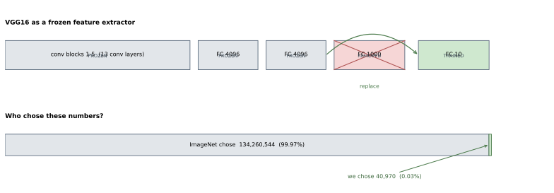
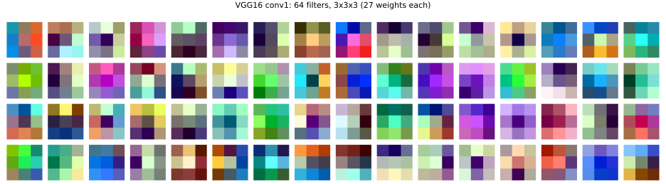

# VGG16 전이 — 다섯째 걸음

앞의 네 걸음은 모두 맨바닥에서 시작했다. 가중치를 무작위로 깔고, CIFAR-10 5만 장만 보고, 처음부터 배웠다. 다섯째 걸음은 처음으로 **남이 배운 것을 가져온다.**

가져올 것은 VGG16이다. ImageNet 사진 120만 장을 1,000가지로 가르도록 학습된 모델이며, 우리는 그 가운데 **분류하는 머리만 떼어내고 나머지를 얼려서** 특징 뽑개로 쓴다.

---

## 1. VGG16은 4걸음에서 만든 것을 깊게 쌓은 것이다

VGG16을 고른 까닭이 있다. 이 모델은 **$3 \times 3$ 합성곱과 최댓값 풀링을 번갈아 쌓은 것이 전부**다. 4걸음에서 만든 구조와 부품이 같고, 다만 두 겹이 아니라 열세 겹일 뿐이다.

| | 4걸음 CNN | VGG16 |
|---|---|---|
| 합성곱 층 | 2 | 13 |
| 필터 크기 | $3 \times 3$ | $3 \times 3$ |
| 풀링 | $2 \times 2$ 최댓값, 2회 | $2 \times 2$ 최댓값, 5회 |
| 매개변수 | 545,098 | 138,357,544 |
| 학습에 쓴 그림 | 5만 장 | 120만 장 |


??? note "이 그림은 어디서 왔는가 — 그리고 무엇을 고쳤는가"

    층을 아래에서 위로 쌓고 왼쪽에 이름을 붙이는 이 배치는 datahacker.rs의 [VGG 16 vs VGG 19](https://datahacker.rs/deep-learning-vgg-16-vs-vgg-19/)에 실린 그림에서 가져왔다. 널리 퍼진 배치이고 읽기 좋다. 다만 그대로 옮기지 않고 세 군데를 고쳤다.

    **첫째, `conv3-3`을 되살렸다.** 돌아다니는 그림 가운데 `conv3`을 두 층으로만 그린 것이 많다. 그러면 합성곱이 열두 층이 되어 이름의 16(=13+3)과 맞지 않는다. 블록마다 2-2-3-3-3이다.

    **둘째, 모양을 채널 먼저로 적었다.** 원 그림을 비롯해 대부분이 `224×224×3`처럼 텐서플로 차례로 적는데, 이 책은 PyTorch를 쓰므로 `3×224×224`다. 이 책의 다른 쪽이 찍는 `(1, 28, 28)`, `(64, 1, 28, 28)`과 같은 차례여야 한다.

    **셋째, `AdaptiveAvgPool2d((7,7))`를 넣었다.** 원 그림에는 없지만 torchvision의 VGG16에는 있고, 224를 넣을 때는 하는 일이 없어 빠뜨리기 쉽다. 그러나 이 절이 32를 넣어 보는 순간 그 층이 전부를 좌우한다.

    그리고 오른쪽의 모양 열 셋은 원 그림에 없던 것으로, 이 책이 더한 것이다.

가운데 열이 **구조**이고 오른쪽 세 열이 **모양**이다. 셋 가운데 **맨 왼쪽이 이 절이 실제로 돌리는 길**이다 — `transforms.Resize(224)`로 $32 \times 32$를 키워 넣는다. 나머지 둘은 쓰라고 둔 것이 아니라 견주려고 둔 것이다 — 가운데는 `Resize`를 아예 뺐을 때로 아래 상자가 재는 함정이고, 오른쪽은 반대로 $448$까지 키웠을 때다.

넷을 짚어 둔다.

첫째, **새로 등장한 부품이 하나도 없다.** 가운데 열에 있는 것은 $3 \times 3$ 합성곱과 $2 \times 2$ 풀링, 그리고 완전 연결층뿐이다. 위의 표가 말한 대로, 4걸음에서 만든 것과 다른 것은 부품이 아니라 **몇 번 쌓았는가**다.

둘째, **합성곱이 블록마다 2-2-3-3-3으로 열세 층**이고 여기에 완전 연결 세 층을 더해 열여섯이다. 이름의 16이 그 수다. 인터넷에 도는 VGG16 그림 가운데 `conv3`을 두 층으로만 그려 둔 것이 적지 않은데, 그러면 합성곱이 열두 층이 되어 이름과 맞지 않는다.

셋째, **풀링만 크기를 바꾼다.** 합성곱은 `padding=1`이라 한 변을 그대로 두고 채널만 바꾸므로, 오른쪽 열에서 한 변이 줄어드는 자리는 언제나 `Pool` 줄이다. $224 \to 112 \to 56 \to 28 \to 14 \to 7$로 다섯 번 반으로 접힌다. 이것이 곧 $3 \times 224 \times 224 \to 512 \times 7 \times 7$이라는 맞바꿈이다 — **자리를 버리고 뜻을 얻는다.** 4걸음 CNN도 $32 \to 16 \to 8$로 같은 일을 두 번 할 뿐이다.

넷째, 풀링 다섯 번 뒤에 **`AdaptiveAvgPool2d((7,7))`가 하나 더 있다.** 오른쪽 세 열을 나란히 둔 것이 이 층 때문이다.

$224$ 열만 보면 이 줄은 $512 \times 7 \times 7$을 받아 $512 \times 7 \times 7$을 내놓는, **아무 일도 하지 않는 줄**이다. 실제로 그렇다. 하는 일이 보이는 것은 옆의 두 열에서이며, **방향이 서로 반대**다.

$32$ 열에서는 다섯 번 접히는 동안 $32 \to 16 \to 8 \to 4 \to 2 \to 1$로 줄어 합성곱 더미가 $512 \times 1 \times 1$을 내놓는다. 모자라므로 이 층이 **늘려서** $7 \times 7$로 맞춘다. $448$ 열에서는 반대로 $448 \to 224 \to 112 \to 56 \to 28 \to 14$로 줄어 $512 \times 14 \times 14$가 되고, 남으므로 이 층이 $2 \times 2$씩 **평균내어 줄인다.** 세 열이 층마다 다른 모양을 적다가 **처음으로 모두 같아지는 줄**이 여기다.

까닭은 그 위에 있다. `fc6`은 $512 \times 7 \times 7 = 25{,}088$개의 수를 받도록 가중치가 정해져 있고, 그 수가 틀리면 행렬 곱이 성립하지 않는다. 그러니 무엇이 들어오든 $7 \times 7$로 만들어 주는 자리가 하나 필요하다. 이 층은 크기를 **재는** 것이 아니라 **맞추는** 것이며, 만지는 것도 그림이 아니라 이미 합성곱을 다 지나온 특징 맵이다.

덕분에 $32 \times 32$를 넣어도 오류가 나지 않는다. 다만 그때 $7 \times 7$ 마흔아홉 칸은 서로 다른 자리를 보는 것이 아니라 **값 하나를 마흔아홉 번 베낀 것**이다. 아래 상자가 그 대가를 잰다.

??? note "베끼는 것은 $1 \times 1$일 때뿐이다 — 이 층이 실제로 하는 일"

    이름 그대로 **평균 풀링**이다. 나오는 칸마다 들어온 칸의 한 구역을 맡아 그 평균을 낸다. 구역을 나누는 방식이 고정이 아니라 들어온 크기에 맞추어 정해지므로 "적응"이다. 그래서 들어온 것이 클 때와 작을 때 하는 일이 달라진다.

    | 들어온 것 | 나온 $7 \times 7$의 서로 다른 값 | 하는 일 |
    |---|---|---|
    | $1 \times 1$ | 1개 | 값 하나를 마흔아홉 번 **베낀다** |
    | $2 \times 2$ | 7개 | 사이를 **메워 늘린다** |
    | $7 \times 7$ | 49개 | 아무것도 안 한다 |
    | $14 \times 14$ | 49개 | 네 칸씩 **평균낸다** |

    $2 \times 2$를 보면 베끼기가 아님이 드러난다. `[[0, 1], [2, 3]]`을 넣으면 첫 줄이 이렇게 나온다.

    ```
    [0.0, 0.0, 0.0, 0.5, 1.0, 1.0, 1.0]
    ```

    가운데 `0.5`는 들어온 곳에 없던 값이다. 두 칸에 걸친 구역이 둘을 평균냈기 때문이다. 나온 값 전체는 `0, 0.5, 1, 1.5, 2, 2.5, 3` 일곱 가지다.

    그러므로 정확히 말하면 이 층은 **베끼는 것도 평균내는 것도 아니라, 구역을 다시 나누는 것**이다. 들어온 것이 $1 \times 1$일 때는 모든 구역이 같은 칸 하나를 가리키게 되어, 결과가 베끼기가 되는 것뿐이다. $32 \times 32$를 넣었을 때가 바로 그 경우다.

새로운 생각이 들어온 자리는 구조가 아니라 **어디서 배웠는가**다. 그래서 이 걸음이 재는 것도 "더 깊은 모델이 더 낫다"가 아니라 **"남의 데이터에서 배운 표현이 얼마를 벌어 주는가"**이다.

!!! note "이 걸음에서만 규약이 하나 바뀐다"
    1~4걸음은 CIFAR-10 자체의 채널 통계로 정규화하고 $32 \times 32$를 그대로 넣었다. 5걸음은 다르다.

    - 입력을 $224 \times 224$로 키운다. VGG16이 그 크기로 학습되었고, 다섯 번의 풀링을 지나야 하므로 $32 \times 32$를 넣으면 마지막 특징 맵이 $1 \times 1$로 뭉개진다. 다만 **터지지는 않는다** — 아래 상자에서 다룬다.
    - 정규화 상수를 ImageNet의 것으로 바꾼다. 얼린 가중치가 그 분포를 기대하기 때문이다.

    곧 $32 \times 32$ 그림을 49배로 늘려 넣는 셈이며, 없던 화소를 만들어 채우는 일이다. 공짜가 아니라는 점을 적어 둔다. 나머지 규약(Adam $10^{-3}$, 5 에포크, 배치 100, 씨앗 42)은 그대로다.


!!! warning "키우지 않아도 터지지 않는다 — 조용히 22%포인트를 잃을 뿐"

    먼저 두 가지를 갈라 두어야 한다. **자리가 다르고 하는 일이 다르다.**

    | | 어디에 | 무엇을 |
    |---|---|---|
    | `transforms.Resize(N)` | 그물에 **넣기 전, 그림에** | $32 \times 32$를 겹선형으로 **$N \times N$까지 지어낸다** |
    | `AdaptiveAvgPool2d((7,7))` | 합성곱 더미와 분류기 **사이, 특징 맵에** | 나온 것이 무엇이든 $7 \times 7$로 맞춘다 |

    CIFAR-10의 자료는 언제나 $32 \times 32$다. 아래 표의 "넣은 크기"는 자료의 크기가 아니라 **`Resize`가 지어낸 크기**이며, 그림이 커지는 일은 모두 그물 바깥에서 보간으로 일어난다. 적응 풀링은 그림을 키우지 않는다 — 그것이 만지는 것은 이미 합성곱을 다 지나온 특징 맵이다.

    그 적응 풀링 덕분에 **어느 크기를 넣어도 오류가 나지 않는다.** $32 \times 32$를 `Resize` 없이 그대로 넣으면 다섯 번의 풀링을 지나 합성곱 더미가 $512 \times 1 \times 1$을 내놓는데, 그때 적응 풀링이 값 하나를 49칸에 복사해 $7 \times 7$로 부풀리고 4,096차원 특징이 멀쩡히 나온다. 학습도 되고 정확도도 찍힌다.

    | 넣은 크기 | 만든 방법 | 정확도 | 특징 뽑는 데 |
    |---|---|---|---|
    | $32 \times 32$ | 그대로 (보간 없음) | 62.45% | 16초 |
    | $64 \times 64$ | `Resize(64)` | 74.91% | 79초 |
    | $96 \times 96$ | `Resize(96)` | 81.61% | 165초 |
    | $128 \times 128$ | `Resize(128)` | **84.23%** | 305초 |
    | $224 \times 224$ | `Resize(224)` | 84.93% | 693초 |

    **22.48%포인트가 아무 말 없이 사라진다.** 이 걸음이 벌어들이는 12.35%포인트보다 큰 값이다. 터지는 잘못이 차라리 낫다는 것을 보여 주는 자리다.

    $128 \times 128$이 눈에 띈다. $224$와 0.70%포인트밖에 차이 나지 않는데, 이는 이 걸음의 씨앗 퍼짐 0.80보다 **작다.** 계산은 절반이 안 든다. 곧 $224$는 마지막 한 점을 아주 비싸게 사고 있다.

!!! example "그렇다면 늘리지 말고 **덧대면** 어떤가"

    좋은 물음이다. $32 \times 32$를 검은 테두리로 감싸 $224 \times 224$로 만들면, VGG16이 배운 크기의 칸을 주면서 **원래 화소를 하나도 건드리지 않는다.** 늘리기는 화소의 98%를 사이에서 지어내는데 말이다.

    | | 정확도 | 화소 |
    |---|---|---|
    | `Resize(224)` — 늘린다 | **84.93%** | 98%가 지어낸 것 |
    | `Pad(96)` — 덧댄다 | **59.64%** | 100% 원래 것 |

    덧댄 쪽이 **25.29%포인트 낮다.** $32 \times 32$를 그대로 넣은 62.45%보다도 낮다.

    그러므로 VGG16에게 필요했던 것은 **칸의 크기가 아니라 물체의 크기**였다. 224칸 한가운데 32화소짜리 물체가 떠 있으면, 그 필터들에게는 ImageNet에서 한 번도 본 적 없는 그림이다. 사이를 지어내 채우는 것이 원래 화소를 고스란히 지키는 것보다 나은 까닭이 여기 있다.

    쪽 앞의 설명("$1 \times 1$로 뭉개진다")은 맞지만 참된 까닭은 아니다. 덧댄 쪽은 특징 맵이 $7 \times 7$로 멀쩡한데도 진다.

!!! danger "맥에서는 중간 크기가 아예 돌지 않는다"

    `AdaptiveAvgPool2d((7,7))`는 MPS에서 **구역이 고르게 나뉠 때만** 돈다. 곧 들어온 크기 $s$와 나올 크기 7 가운데 **하나가 다른 하나로 나누어떨어져야** 한다. 재어 보면 이렇다.

    | 들어온 $s$ | 1 | 2 | 3 | 4 | 7 | 10 | 14 | 21 | 28 |
    |---|---|---|---|---|---|---|---|---|---|
    | MPS | ✅ | ❌ | ❌ | ❌ | ✅ | ❌ | ✅ | ✅ | ✅ |

    이 절이 쓰는 범위에서는 특징 맵이 $1 \sim 7$이므로 $s$가 7을 나누어야 하고, 7을 나누는 수는 1과 7뿐이다. 그래서 $32$(→$1 \times 1$)와 $224$(→$7 \times 7$)는 되고 $64, 96, 128$(→$2, 3, 4$)은 `RuntimeError`가 난다. 반대쪽도 같은 규칙이라 $448$(→$14 \times 14$)은 다시 돈다 — 7이 14를 나누기 때문이다.

    고르지 않다는 것이 무슨 뜻인지는 구역을 적어 보면 바로 보인다. $10 \to 7$이면 구역이 `[0,2) [1,3) [2,5) [4,6) [5,8) [7,9) [8,10)`으로 크기가 2, 2, 3, 2, 3, 2, 2이고 서로 겹치기까지 한다. CPU는 이것을 처리하지만 MPS 커널은 아직 못 한다.

    위 표를 맥에서 다시 재려면 그 한 연산만 CPU로 보내면 된다. 배치마다 몇 MB를 옮길 뿐이다.

    ```python
    f = net.features(x)                      # MPS
    a = net.avgpool(f.cpu()).to(x.device)    # 이 한 줄만 CPU
    y = net.classifier(a.flatten(1))         # MPS
    ```

---

## 2. 코드

얼린 층은 학습 내내 값이 변하지 않는다. 그러므로 **특징을 한 번만 뽑아 두고 재활용**하면 된다. 이렇게 하면 무거운 VGG16 순전파를 5만 장에 대해 다섯 번이 아니라 한 번만 돌린다.

```python
"""5걸음: ImageNet에서 학습한 VGG16을 CIFAR-10에 옮겨 쓴다."""

import torch
import torch.nn as nn
import torch.optim as optim
from torch.utils.data import DataLoader, TensorDataset
import torchvision
import torchvision.transforms as transforms
from torchvision.models import vgg16, VGG16_Weights

device = torch.device("mps" if torch.backends.mps.is_available() else "cpu")

# === 1. ImageNet 규약에 맞춘 전처리 =========================================
transform = transforms.Compose([
    # 보간이 일어나는 자리는 여기 한 줄뿐이다. 기본값이 겹선형(bilinear)이라
    # 화소 사이를 지어내 채운다. 나오는 50,176칸 가운데 원래 값은 1,024칸,
    # 곧 2%뿐이다. ToTensor 앞에 두었으므로 텐서가 아니라 PIL 그림을 키운다
    transforms.Resize(224),                    # 3x32x32 -> 3x224x224
    transforms.ToTensor(),
    # 상수가 4장 앞부분과 다르다. CIFAR-10의 통계가 아니라 ImageNet의 것이다
    transforms.Normalize((0.485, 0.456, 0.406), (0.229, 0.224, 0.225)),
])

train_ds = torchvision.datasets.CIFAR10("./data", train=True,
                                        download=True, transform=transform)
test_ds = torchvision.datasets.CIFAR10("./data", train=False,
                                       download=True, transform=transform)

# === 2. 사전 학습된 VGG16을 특징 뽑개로 만들기 ==============================
net = vgg16(weights=VGG16_Weights.IMAGENET1K_V1).to(device).eval()

# classifier의 마지막 Linear(4096, 1000)을 떼면 4096차원 특징이 나온다.
# ImageNet의 1,000개 클래스 점수는 우리에게 쓸모가 없고, 그 직전 층이
# "이 그림에 무엇이 있는가"를 4,096개 수로 적어 둔 것이다
net.classifier = nn.Sequential(*list(net.classifier.children())[:-1])


@torch.no_grad()                               # 얼린 층이므로 경사가 필요 없다
def extract(ds):
    """VGG16을 한 번만 통과시켜 특징을 모아 둔다.

    **32 -> 224로 키우는 자리가 이 함수 안에 보이지 않는다.** 위에서 만든
    `transform`이 데이터셋에 붙어 있고, torchvision은 그것을 미리 적용해 두는
    것이 아니라 표본을 꺼낼 때마다 적용한다. 곧 아래 `for x, y in loader`가
    한 바퀴 돌 때 `ds[i]`가 불리고, 그 안에서 Resize(224)가 일어난다.
    루프에 닿은 x는 이미 (100, 3, 224, 224)다.

    num_workers=0인 까닭: macOS는 작업자 프로세스를 spawn으로 띄우므로
    스크립트를 다시 import 한다. __main__ 가드가 없으면 전체가 재실행된다.
    """
    loader = DataLoader(ds, batch_size=100, shuffle=False, num_workers=0)
    feats, labels = [], []
    for x, y in loader:                        # 여기서 비로소 Resize가 돈다.
        assert x.shape[1:] == (3, 224, 224)    # 3x32x32가 아니라 이것이 들어간다
        feats.append(net(x.to(device)).cpu())
        labels.append(y)
    return torch.cat(feats), torch.cat(labels)


X_train, y_train = extract(train_ds)           # (50000, 4096)
X_test, y_test = extract(test_ds)              # (10000, 4096)

# === 3. 머리만 학습한다 =====================================================
# 4,096개 특징을 10개 클래스로 잇는 선형 층 하나뿐이다.
# 규약은 2걸음과 같다: CrossEntropyLoss + Adam(1e-3) + 5 에포크
torch.manual_seed(42)
head = nn.Linear(4096, 10).to(device)
opt = optim.Adam(head.parameters(), lr=1e-3)
crit = nn.CrossEntropyLoss()

g = torch.Generator().manual_seed(42)          # 섞는 차례를 따로 고정한다
loader = DataLoader(TensorDataset(X_train, y_train), batch_size=100,
                    shuffle=True, generator=g)

for _ in range(5):
    head.train()
    for xb, yb in loader:
        xb, yb = xb.to(device), yb.to(device)
        opt.zero_grad()
        crit(head(xb), yb).backward()
        opt.step()

head.eval()
with torch.no_grad():
    pred = head(X_test.to(device)).argmax(1).cpu()
print(f"5걸음 정확도 {100.0 * (pred == y_test).float().mean():.2f}%")
print(f"학습한 매개변수 {sum(p.numel() for p in head.parameters()):,}")
```

**출력:**

```
5걸음 정확도 84.93%
학습한 매개변수 40,970
```

!!! note "키우는 자리가 코드에 안 보이는 까닭"
    위 코드를 따라 읽으면 $32 \to 224$로 키우는 줄이 어디에도 없어 보인다. `extract()` 안에도 없고, 그림을 건드리는 문장이 하나도 없다. 그런데도 `net`에 들어가는 것은 $3 \times 224 \times 224$다.

    `transform`이 **데이터셋에 붙어 있기** 때문이다. torchvision의 데이터셋은 `transform`을 만들 때 한 번 적용해 두는 것이 아니라, `ds[i]`로 표본을 꺼낼 때마다 적용한다. 그 `ds[i]`를 부르는 것이 `DataLoader`이므로, 키우는 일은 `for x, y in loader` 한 바퀴마다 조용히 일어난다.

    ```python
    ds = datasets.CIFAR10(..., transform=None)          # (100, 3, 32, 32)
    ds = datasets.CIFAR10(..., transform=Resize(224))   # (100, 3, 224, 224)
    ```

    같은 자료, 같은 루프인데 나오는 모양이 다르다. 그래서 위 코드의 루프 첫 줄에 `assert`를 하나 두었다 — 눈에 보이지 않는 일이 정말 일어났는지는 그렇게 확인하는 수밖에 없다.

    게으르게 두는 것이 낭비처럼 보이지만 그 반대다. $224 \times 224$ 5만 장을 미리 만들어 두면 float32로 **28GB**이고, 꺼낼 때마다 만들면 배치 하나치인 **57MB**만 있으면 된다. 500배 차이다. 자료를 원래 크기로 두고 필요할 때 키우는 것이 이 걸음이 노트북에서 도는 까닭이다.

특징을 뽑는 데 5만 장에 750초, 1만 장에 150초가 든다. 머리를 학습하는 5 에포크는 그에 견주면 순식간이다.

---

## 3. 결과

**84.93%**이다. 씨앗 다섯 개로 재면 84.25~85.05로 퍼짐이 0.80이다.

| 걸음 | 모델 | 매개변수 | 정확도 | 이득 | 남은 오차 | 지운 몫 |
|---|---|---|---|---|---|---|
| 1 | 템플릿 | 30,730 (고정) | 27.69% | — | 72.31 | — |
| 2 | 선형 | 30,730 | 37.18% | +9.46 | 62.85 | 13% |
| 3 | MLP | 394,634 | 50.94% | +13.85 | 49.00 | 22% |
| 4 | CNN | 545,098 | 72.58% | +21.64 | 27.42 | 44% |
| 5 | **VGG16 전이** | 134,301,514 | **84.93%** | +12.35 | 15.07 | **45%** |

이득이 12.35%포인트이고 그 자리의 퍼짐이 0.80이니 비가 15다. 넉넉히 재고 있다.

### 두 가지를 정직하게 적어 둔다

**첫째, 절대 이득은 처음으로 줄었다.** 4걸음이 21.64%포인트를 벌었는데 5걸음은 12.35%포인트다. [4.1절](01_two_ladders.md)은 CIFAR-10에서 걸음마다 버는 몫이 **늘어난다**고 했고 네 걸음까지는 그랬지만, 다섯째에서 꺾였다. 남은 오차로 보면 44%에서 45%로 아직 오르고 있으나 그 폭이 크게 줄었다. CIFAR-10 사다리도 결국은 MNIST 사다리처럼 둔해진다. 다만 훨씬 늦게 그럴 뿐이다.

**둘째, 4.1절의 외삽은 빗나갔다.** 그 절 연습문제 5는 지운 몫이 11 → 24 → 45로 커진 추세를 밀어 다섯째 걸음을 92~94%로 어림했다. 실제는 84.93%다. 세 점으로 그린 추세를 믿지 말라던 그 풀이의 경고가 옳았고, 이것이 그 증거다.

### 매개변수를 어떻게 세는가

| | 개수 | 몫 |
|---|---|---|
| 얼린 부분 (ImageNet이 정했다) | 134,260,544 | 99.97% |
| 학습한 부분 (머리) | 40,970 | 0.03% |



떼어 내는 것은 **마지막 층 하나뿐**이다. `Linear(4096, 1000)`을 덜어 내면 $4096 \times 1000 + 1000 = 4{,}097{,}000$개가 빠지고, 그 자리에 `Linear(4096, 10)`을 달면 $4096 \times 10 + 10 = 40{,}970$개가 들어온다. 전체 138,357,544에서 앞의 것을 빼면 얼린 134,260,544가 나온다.

아래 막대가 이 절에서 가장 할 말이 많은 그림이다. 우리가 정한 몫은 너무 작아 **막대에서 거의 보이지 않는다.**

**우리가 정한 수는 만 개 남짓이고 나머지 1억 3천만 개는 남의 데이터가 정했다.** 이 장의 1걸음과 2걸음이 같은 30,730개를 "평균으로 못박느냐 학습하느냐"로 갈랐던 것과 같은 종류의 이야기다. 그때는 누가 정하느냐가 평균이냐 경사 하강법이냐였고, 여기서는 **내 데이터냐 남의 데이터냐**다.

---

## 4. 라벨이 1,000장뿐이라면

전이 학습의 값어치는 정확도 13%포인트가 아니다. 진짜 값어치는 **라벨이 모자랄 때** 드러난다.

클래스마다 100장씩, 모두 1,000장만 쓰고 두 방법을 견주었다. 시험 집합은 그대로 1만 장이다.

| 학습에 쓴 라벨 | 방법 | 정확도 |
|---|---|---|
| 1,000장 (2%) | 4걸음 CNN, 맨바닥 | 43.67% |
| 1,000장 (2%) | **5걸음 VGG16 전이** | **77.46%** |
| 50,000장 (100%) | 4걸음 CNN, 맨바닥 | 72.58% |

같은 1,000장으로 33.79%포인트가 벌어진다. 그런데 더 눈여겨볼 것은 셋째 줄이다.

> **라벨 1,000장을 쓴 전이 학습이, 라벨 5만 장을 쓴 맨바닥 학습을 이긴다.**

라벨을 50분의 1로 줄이고도 이긴다. 이것이 실무에서 전이 학습을 거의 언제나 먼저 시도하는 까닭이다. 라벨을 붙이는 일은 사람이 하는 일이라 비싸고, 사전 학습된 가중치는 공짜로 내려받을 수 있다.

<div class="exbox" markdown>

**보기 1.** <span class="diff easy" title="쉬움"></span>
위 표에서 4걸음 CNN은 라벨이 5만 장에서 1,000장으로 줄 때 72.58% → 43.67%로 29.35%포인트를 잃는다. 5걸음은 84.93% → 77.46%로 7.47%포인트만 잃는다. 왜 이렇게 다른가?

</div>

??? success "풀이"
    맨바닥 CNN은 545,098개의 수를 **오직 그 1,000장에서** 정해야 한다. 그림 한 장당 정할 수가 545개꼴이니 외우는 것 말고는 할 일이 없고, 시험 집합에서 무너진다.

    전이 학습은 그 1,000장으로 정하는 수가 **40,970개뿐**이다. 나머지 1억 3천만 개는 이미 정해져 있다. 그림 한 장당 41개를 정하는 셈이니 훨씬 수월하다.

    곧 전이 학습이 하는 일은 **정해야 할 것의 개수를 줄이는 것**이다. 라벨이 적을수록 이 절약이 크게 남는다.

---

## 5. 첫 층은 무엇을 배웠는가

여기서 [3장 4절](../ch03/mnist/04_cnn.md)이 MNIST CNN에 들이댔던 잣대를 그대로 꺼낸다. 그 절은 필터 그림을 눈으로 보고 판단하지 말라고 경고하면서, 학습된 $3 \times 3$ 필터가 소벨 모서리 검출기와 얼마나 닮았는지를 **무작위 필터와 견주어** 재었다. 같은 잣대를 VGG16에 들이대면 무엇이 나오는가?



눈으로 보면 **아무것도 아니다.** 흔히 보는 가보르 줄무늬 같은 것은 없고 알록달록한 얼룩일 뿐이다. 3장이 경고한 그대로다. 그러나 재어 보면 이야기가 다르다.

| conv1 필터 | 소벨과 $\lvert r \rvert > 0.7$ | $> 0.5$ | 평균 $\lvert r \rvert$ |
|---|---|---|---|
| 4걸음 CNN, CIFAR-10 학습 | 10/32 (31%) | 19/32 | 0.506 |
| 4걸음 CNN, 학습 전 | 1/32 (3%) | 8/32 | 0.397 |
| VGG16, ImageNet 학습 | **25/64 (39%)** | 38/64 | **0.585** |
| VGG16, 무작위 기준선 | 3/64 (5%) | 21/64 | 0.402 |

네 줄 모두 같은 코드로 쟀다. 두 학습된 줄이 제 무작위 기준선보다 **뚜렷이 위에 있다.** 눈으로는 구별되지 않던 것이 수로는 구별된다. 이것이 3장이 하려던 말이다. 그림이 미덥지 않은 것이지 현상이 없는 것이 아니다.

!!! note "3장의 MNIST 결과와 견줄 때"
    3장은 MNIST로 학습한 CNN에서 $\lvert r \rvert > 0.7$이 4/32, 무작위가 1/32, 평균이 0.472 대 0.440이라고 보고했다. 학습한 필터가 무작위와 **거의 다르지 않았다.**

    위 표의 첫 두 줄은 **같은 구조를 CIFAR-10으로 학습한** 것인데 10/32 대 1/32로 확실히 갈린다. 달라진 것은 구조도 필터 크기도 아니고 **데이터**다. MNIST는 가운데 놓인 회색조 획이라 국소 대비를 정교하게 나눌 까닭이 적고, CIFAR-10의 자연 사진은 그럴 까닭이 많다.

    다만 3장의 수치는 그 장의 스크립트로 잰 것이라 무작위 기준선의 평균이 조금 다르다(0.440 대 0.397). 위 표 안에서의 비교가 정확하고, 3장과의 비교는 방향만 읽는 것이 옳다.

### 색을 쓰는 방식도 다르다

필터 한 장 안에서 R, G, B 세 채널이 얼마나 닮았는지를 재면 그 필터가 색을 보는지 밝기만 보는지 알 수 있다. 세 채널이 똑같으면 사실상 흑백 필터다.

| | R,G,B 사이 평균 상관 | 사실상 흑백인 필터 |
|---|---|---|
| 4걸음 CNN (CIFAR-10) | 0.320 | 0/32 |
| VGG16 (ImageNet) | 0.534 | 18/64 |

**4걸음 CNN은 32장 모두가 색을 쓴다.** 뜻밖이 아니다. [4.1절](01_two_ladders.md)에서 보았듯 CIFAR-10은 평균색만으로도 우연을 넘어선 몫의 절반을 설명할 수 있는 데이터다. 필터가 색에 기대는 것이 이치에 맞는다.

VGG16은 64장 가운데 18장이 색을 버리고 밝기 변화만 본다. 1,000가지를 갈라야 하는 ImageNet에서는 색만으로 되는 일이 적어, 형태를 보는 필터를 따로 둘 값어치가 있기 때문이다.

이 차이가 왜 이 전이가 잘 통하는지를 말해 준다. **CIFAR-10과 ImageNet은 둘 다 색이 있는 자연 사진**이라 VGG16이 배운 것이 그대로 쓸모가 있다. 같은 VGG16을 MNIST에 가져다 쓴다면 첫 층의 절반 넘는 색 필터가 할 일을 잃는다.

---

## 6. 그래서 무엇을 가져온 것인가

첫 층은 아니다. 위의 표가 보이듯 **4걸음 CNN도 CIFAR-10 5만 장만으로 모서리 검출기를 스스로 배웠다.** 거기에 ImageNet은 필요하지 않았다.

가져온 것은 **그 위에 쌓인 것들**이다. 4걸음 CNN에는 합성곱 층이 둘뿐이라 $8 \times 8$ 범위밖에 보지 못한다. VGG16에는 열세 겹이 있어 모서리를 엮어 무늬를, 무늬를 엮어 부분을, 부분을 엮어 물체를 만든다. 그 중간 단계들은 5만 장으로는 배울 수 없고 120만 장이 있어야 배워진다.

그러므로 이 걸음이 말하는 것은 이렇다. **깊은 층이 무엇을 배우는가는 데이터의 양이 정하고, 그 배움은 데이터셋을 건너 옮겨진다.** 옮겨지는 조건은 두 데이터가 닮았다는 것이며, 여기서는 둘 다 자연 사진이라는 점이 그 조건이었다.

### 이것도 차원을 바꾸는 일이다 — 다만 방향이 반대다

얼린 VGG16이 하는 일을 한 줄로 적으면 이렇다. 그림 하나를 받아 수 4,096개로 다시 적는다. 이것은 오토인코더가 하는 일과 **형식이 같다.** 둘 다 부호를 만드는 장치이고, 둘 다 그 위에 작은 분류기를 얹는다.

그런데 수를 세어 보면 방향이 반대다.

| | 들어가는 수 | 나오는 수 | 방향 |
|---|---|---|---|
| 오토인코더 (부호 64) | 3,072 | 64 | 48배 **줄인다** |
| VGG16 fc7 | 3,072 | 4,096 | 1.33배 **늘린다** |

**VGG16은 차원을 줄이지 않는다. 오히려 늘린다.** 원래 그림이 3,072개의 수인데 4,096개로 적어 내놓는다.

까닭은 두 장치가 서로 다른 것을 목표로 배웠기 때문이다.

- 오토인코더는 **되살리기**를 배운다. 적은 수로 원본을 복원해야 하므로 버릴 것을 찾는다.
- VGG16은 **가르기**를 배웠다. 클래스가 선형으로 갈리는 자리를 찾으면 되므로, 차원을 늘려서라도 갈리게 만드는 편이 낫다.

이 둘은 어긋날 수 있다. 되살리는 데 중요하지 않은 성분이 가르는 데에는 결정적일 수 있고, 오토인코더는 바로 그것을 먼저 버린다. 반대로 차원을 늘려 선형으로 갈리게 만드는 수법은 [2장의 서포트 벡터 머신](../ch02/models/svm.md)이 커널로 하던 일과 같은 생각이다.

그러니 이 장의 5걸음과 오토인코더를 한데 묶는 이름은 "차원 줄이기"가 아니라 **"표현을 배우고 그 위에 선형 분류기를 얹기"**다. 차원은 줄 수도 늘 수도 있으며, 무엇을 목표로 배웠는지가 그 방향을 정한다.

---

## 연습문제

<div class="drillbox" markdown>

**연습문제 1.** <span class="diff easy" title="쉬움"></span>
5걸음이 학습하는 매개변수는 40,970개다. 이 수가 어떻게 나오는지 보이고, 2걸음의 30,730개와 견주어라.

</div>

??? success "연습문제 1 풀이"
    머리는 `nn.Linear(4096, 10)` 하나이므로 $4096 \times 10 + 10 = 40{,}970$이다.

    2걸음은 `nn.Linear(3072, 10)`으로 $3072 \times 10 + 10 = 30{,}730$이었다. 둘은 **거의 같은 크기의 선형 분류기**이며, 하는 일도 똑같이 "특징 벡터 하나를 받아 10개 점수를 낸다"이다.

    갈리는 것은 **무엇을 받느냐**뿐이다. 2걸음은 화소 3,072개를 날것으로 받아 37.18%, 5걸음은 VGG16이 적어 준 4,096개를 받아 84.93%다. 거의 같은 분류기가 47%포인트 차이를 낸다.

    이것이 이 장 전체가 하려는 말의 가장 짧은 꼴이다. **문제를 푸는 것은 분류기가 아니라 표현이다.**

---

<div class="drillbox" markdown>

**연습문제 2.** <span class="diff med" title="중간"></span>
$32 \times 32$ 그림을 $224 \times 224$로 키워 넣었다. 화소 수가 49배로 늘지만 정보는 하나도 늘지 않는다. 그런데도 이 방법이 통하는 까닭은 무엇인가? 키우지 않고 $32 \times 32$를 그대로 넣으면 무슨 일이 일어나는가?

</div>

??? success "연습문제 2 풀이"
    **키우지 않으면 특징 맵이 사라진다.** VGG16은 $2 \times 2$ 풀링을 다섯 번 지나므로 공간 크기가 $2^5 = 32$분의 1이 된다. $224 \to 7$이지만 $32 \to 1$이다. 마지막 특징 맵이 $1 \times 1$이 되어 공간 정보가 전부 뭉개지고, `classifier`가 기대하는 $512 \times 7 \times 7$ 모양도 맞지 않는다.

    **키우면 통하는 까닭**은 합성곱 필터의 크기가 고정되어 있기 때문이다. $3 \times 3$ 필터는 원본 $32 \times 32$에서라면 화소 아홉 개를 보지만, 7배로 늘린 그림에서는 원본으로 치면 반 화소 남짓한 영역을 본다. 곧 늘리는 것은 **필터를 상대적으로 잘게 만드는 일**이며, 그래야 열세 겹이 쌓일 여지가 생긴다.

    정보가 늘지 않는다는 지적은 옳고, 그래서 공짜가 아니다. 계산이 49배로 들고, 보간이 만들어 낸 매끄러움은 원본에 없던 것이다. CIFAR-10 전용으로 다시 설계한다면 풀링 횟수를 줄인 모델을 쓰는 편이 낫다.

---

<div class="drillbox" markdown>

**연습문제 3.** <span class="diff med" title="중간"></span>
본문은 "가져온 것은 첫 층이 아니라 그 위에 쌓인 것들"이라고 했다. 이 주장을 확인할 실험을 설계하라.

</div>

??? success "연습문제 3 풀이"
    **층을 어디까지 가져올지 바꾸어 가며 재면 된다.** VGG16의 `features`를 앞에서부터 $k$개 층만 쓰고, 그 출력에 선형 분류기를 붙여 정확도를 그린다.

    ```python
    trunc = nn.Sequential(*list(net.features.children())[:k])
    ```

    주장이 옳다면 곡선은 이런 모양이어야 한다. $k$가 작을 때(첫 블록만)는 4걸음 CNN과 큰 차이가 없어야 한다. 그 층이 배운 모서리 검출기는 CIFAR-10 5만 장으로도 얻을 수 있는 것이기 때문이다. $k$가 커지면서 벌어지기 시작하고, 그 벌어지는 구간이 곧 "120만 장이 있어야 배워지는 것"이 사는 자리다.

    한 가지 더 볼 것이 있다. 아주 깊은 층은 **다시 나빠질 수 있다.** 마지막 층들은 ImageNet의 1,000개 클래스에 맞추어 특화되어 있어 CIFAR-10의 열 가지와 어긋나기 때문이다. 곡선이 중간에서 가장 높다면 그것이 "너무 일반적이지도 너무 특화되지도 않은 자리"이며, 실무에서 어느 층을 잘라 쓸지 고르는 기준이 된다.

---

<div class="drillbox" markdown>

**연습문제 4.** <span class="diff hard" title="어려움"></span>
5걸음은 얼린 특징을 쓰는 **특징 뽑기**다. 얼리지 않고 VGG16 전체를 CIFAR-10으로 마저 학습하는 **미세 조정**을 하면 더 오를 것이다. 그런데도 이 절이 특징 뽑기를 먼저 보인 까닭을 셋 들어라.

</div>

??? success "연습문제 4 풀이"
    **첫째, 이 장의 규약을 지킬 수 있다.** 특징 뽑기는 머리 하나만 학습하므로 손실도 최적화기도 에포크도 1~4걸음과 똑같이 둘 수 있다. 미세 조정은 학습률을 훨씬 낮춰야 하고(얼린 가중치를 망가뜨리지 않으려고) 층마다 다른 학습률을 주기도 한다. 그러면 "모델만 바꾸었다"는 이 장의 전제가 깨진다.

    **둘째, 셈이 싸다.** 얼린 층은 값이 변하지 않으므로 특징을 한 번만 뽑아 두고 다시 쓸 수 있다. 5 에포크를 도는 데 VGG16 순전파가 5만 번이 아니라 1회분이면 된다. 미세 조정은 에포크마다 전체 역전파가 필요해 수십 배가 든다.

    **셋째, 무엇이 값어치를 냈는지가 또렷하다.** 84.93%가 나왔을 때 그 공은 전부 ImageNet이 배운 표현에 있다. 우리가 정한 수는 40,970개뿐이기 때문이다. 미세 조정을 하면 1억 3천만 개가 모두 움직이므로, 오른 몫이 사전 학습 덕인지 그저 큰 모델을 우리 데이터로 학습한 덕인지 가려내기 어려워진다.

    미세 조정 자체는 [15장](../ch14/index.md)이 다룬다.

---

<div class="drillbox" markdown>

**연습문제 5.** <span class="diff hard" title="어려움"></span>
본문은 VGG16의 첫 층 필터 64장 가운데 18장이 사실상 흑백이라고 했다. 이 사실을 근거로, 같은 전이를 **MNIST**에 적용하면 어떻게 될지 예상하라. 3장의 99.21%와 견주어 논하라.

</div>

??? success "연습문제 5 풀이"
    먼저 모양을 맞추는 일부터 걸린다. MNIST는 채널이 하나이므로 VGG16의 `conv1`이 기대하는 3채널로 늘려야 한다. 같은 회색조를 세 번 복사해 넣는 것이 보통인데, 그러면 **R, G, B가 완전히 같아진다.**

    그 순간 색을 보는 필터 46장이 하는 일이 사라진다. 세 채널이 같으면 색 대립을 재는 필터의 출력은 세 채널 가중치의 **합**에만 달리게 되어, 서로 다르던 필터들이 비슷한 것을 재기 시작한다. 쓸 수 있는 것은 사실상 흑백이던 18장 언저리뿐이다.

    거기에 더해 ImageNet의 자연 사진과 MNIST의 획은 통계가 크게 다르고, $28 \times 28$을 $224 \times 224$로 늘리면 64배다.

    그래서 이득이 거의 없거나 오히려 손해일 수 있다. 3장의 4걸음 CNN이 이미 99.21%이고 남은 오차가 0.82%포인트뿐이니, 잘해야 몇 십분의 1%포인트를 다투게 된다. 그 크기는 [4.1절](01_two_ladders.md)에서 본 씨앗 퍼짐 0.33보다도 작다.

    **곧 MNIST에서는 이 다섯째 걸음을 잰다는 것 자체가 불가능하다.** 이 장이 데이터셋을 바꾼 까닭이 여기서 다시 확인된다.
