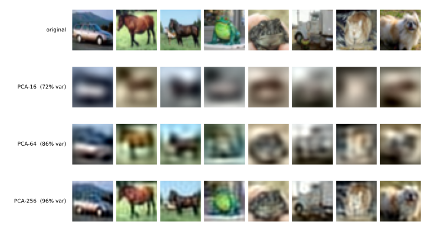

# 차원 줄이기 — 라벨 없이 표현을 배울 수 있는가

[4.2절](02_vgg16_transfer.md)의 다섯째 걸음은 남이 배운 표현을 빌려 84.93%에 닿았다. 빌린 것이 좋았다는 말은 곧 **표현이 문제를 푼다**는 말이다. 같은 선형 분류기가 화소를 받으면 37.15%, VGG16이 적어 준 수를 받으면 84.93%였으니 달라진 것은 분류기가 아니라 입력이었다.

그렇다면 물음이 하나 생긴다. **남에게 빌리지 않고, 라벨도 쓰지 않고, 내 손으로 좋은 표현을 만들 수 있는가?**

이 절은 그 물음을 가장 오래된 방법부터 차례로 시험한다. 그리고 답은 "거의 안 된다"이다. 왜 안 되는지가 이 절이 얻는 것이다.

---

## 1. 같은 네 걸음, 다른 목표

이 절이 걷는 네 걸음은 [4.1절](01_two_ladders.md)의 네 걸음과 **생각이 하나씩 짝을 이룬다.**

| | 분류 사다리 | 표현 사다리 | 더해지는 생각 |
|---|---|---|---|
| 1 | 템플릿 학습 | **PCA** | 없음 — 닫힌 꼴로 푼다 |
| 2 | 선형 + 소프트맥스 | **선형 AE** | 경사 하강법으로 학습한다 |
| 3 | 다층 퍼셉트론 | **깊은 AE** | 비선형성 |
| 4 | 합성곱 신경망 | **conv AE** | 이웃 관계 |

다른 것은 목표다. 분류 사다리는 **가르기**를 배웠고, 이 사다리는 **되살리기**를 배운다. 라벨을 한 번도 쓰지 않는다.

---

## 2. 재는 자가 둘이다

목표가 둘이니 자도 둘이어야 한다.

**복원 MSE** — 부호에서 원본을 얼마나 잘 되살리는가. 이 사다리가 실제로 최소화하는 값이다.

**탐침 정확도** — 부호를 얼려 두고 그 위에 분류기 하나만 학습해 얻는 정확도. 우리가 원하는 값이다. 선형 탐침과 MLP 탐침 둘 다 재며, 분류기의 규약은 4장의 다른 절과 같다(Adam $10^{-3}$, 5 에포크, 묶음 100).

이미 재어 둔 기준선은 이렇다.

| 표현 | 차원 | 선형 | MLP | CNN |
|---|---|---|---|---|
| 원시 화소 | 3,072 | 37.15% | 51.00% | 71.78% |
| VGG16 fc7 | 4,096 | **84.93%** | — | — |

!!! note "차이를 읽을 때 쓰는 자"
    [4.1절](01_two_ladders.md)에서 씨앗 다섯 개로 잰 퍼짐은 선형 2.49, MLP 2.74, CNN 1.11이었다. 아래 표에서 이보다 작은 차이는 **차이가 아니다.** 이 절에는 그런 칸이 많으니 눈여겨보아야 한다.

---

## 3. PCA — 닫힌 꼴이라 씨앗이 없다

주성분 분석은 학습하지 않는다. 자료의 공분산 행렬을 고유분해하여 분산이 큰 방향 $k$개를 고르면 끝이다. 경사 하강법도, 에포크도, 씨앗도 없다.

그래서 **이 사다리의 1걸음도 오차 막대가 없다.** [4.1절](01_two_ladders.md)의 템플릿 학습이 그랬던 것과 같은 까닭이며, 두 사다리가 똑같이 완전히 재현되는 바닥에서 출발한다.

```python
import numpy as np

mu = X.mean(0, keepdim=True)
Xc = X - mu
cov = (Xc.T @ Xc) / (Xc.shape[0] - 1)          # (3072, 3072)

# torch.linalg.eigh는 이 크기에서 실패하는 빌드가 있다(LAPACK 작업공간 문제).
# numpy의 경로를 float64로 쓰면 안정적이다
ev, evec = np.linalg.eigh(cov.double().numpy())
evec = torch.from_numpy(np.ascontiguousarray(evec[:, ::-1])).float()

V = evec[:, :k]                                 # 위에서 k개
Z = (X - mu) @ V                                # 부호로 줄이기
X_hat = Z @ V.T + mu                            # 되살리기
```



| | 설명 분산 | 복원 MSE | 부호기 매개변수 | 선형 | MLP |
|---|---|---|---|---|---|
| 원시 화소 (3,072) | 100% | 0 | — | 37.15% | 51.00% |
| PCA-16 | 71.6% | 0.2808 | 49,152 | 32.99% | 41.79% |
| PCA-64 | 86.5% | 0.1337 | 196,608 | 38.36% | 50.22% |
| PCA-256 | 95.8% | 0.0416 | 786,432 | 40.42% | 52.37% |

**PCA-64를 보라.** 3,072개를 64개로 줄였으니 48분의 1인데, 두 탐침 모두 원시 화소와 퍼짐 안에서 같다(−1.21과 +0.78, 자는 2.49와 2.74). **48배로 줄이는 것이 공짜다.**

그런데 그림을 보면 PCA-64는 눈에 띄게 뭉개져 있다. 자동차인 줄은 알겠지만 원본과는 한참 다르다. PCA-16은 아예 알아볼 수 없는 얼룩인데도 41.79%를 맞힌다(우연은 10%다).

**눈이 필요로 하는 것과 분류기가 필요로 하는 것이 다르다.** 사람이 보기에 망가진 그림이 분류에는 충분하다. 이 어긋남이 이 절 전체를 관통한다.

---

## 4. 선형 AE는 PCA를 다시 찾아낼 뿐이다

2걸음은 같은 부호 크기를 **경사 하강법으로** 찾는다. 활성화 함수 없이 층 두 개면 된다.

```python
enc = nn.Linear(3072, 64)      # 활성화가 없다 = 선형
dec = nn.Linear(64, 3072)
# 손실은 nn.functional.mse_loss(dec(enc(x)), x)
```

100 에포크를 돌린 결과는 이렇다.

| 부호 64 | 복원 MSE | 선형 | MLP |
|---|---|---|---|
| PCA (닫힌 꼴) | **0.1337** | 38.36% | 50.22% |
| 선형 AE (100 에포크) | 0.1369 | 38.93% | 51.62% |
| 차이 | +0.0032 | +0.57 | +1.40 |

**같은 것을 찾았다.** 복원 MSE가 2.4% 차이이고 탐침은 둘 다 퍼짐 안이다. 놀랄 일이 아니라 **당연한 일**이다. 활성화가 없는 자기 부호기가 찾을 수 있는 최선은 선형 부분공간이고, 제곱오차를 가장 작게 만드는 $k$차원 선형 부분공간은 PCA가 주는 것이기 때문이다. 경사 하강법은 `eigh`가 곧장 계산하는 답을 270초에 걸쳐 더듬어 찾은 셈이다.

MSE가 PCA보다 **조금 나쁜** 것도 이치에 맞는다. PCA는 정확한 최적해이고 Adam은 그 근처에서 멈추기 때문이다. 만약 선형 AE가 PCA보다 **좋게** 나왔다면 어딘가 잘못된 것이다.

### 두 사다리의 2걸음이 갈라진다

여기가 이 절의 요점이다.

| 사다리 | 1걸음 → 2걸음 | 얻은 것 |
|---|---|---|
| 분류 (4.1절) | 템플릿 → 선형, 학습 | **+9.46%p** |
| 표현 (이 절) | PCA → 선형 AE | **+0.57%p** (퍼짐 안) |

**똑같은 수법인데 한쪽은 9.46%포인트를 벌고 다른 쪽은 아무것도 벌지 못한다.**

까닭은 닫힌 꼴 해가 그 목표에 최적이었는가이다. 1걸음의 클래스 평균은 **분류에 최적이 아니었다.** 평균은 "3은 이렇게 생겼다"만 담을 뿐 "여기가 켜져 있으면 3이 아니다"를 담지 못하니, 학습이 채울 자리가 넓었다. PCA는 **제 목표에 이미 최적이다.** 학습이 채울 자리가 없다.

곧 **학습이 값어치가 있는 것은 닫힌 꼴 해가 없거나 그것이 목표와 어긋날 때뿐이다.** 어느 사다리에서든 "학습하면 좋아진다"고 말할 수 있는 것이 아니다.

---

## 5. 깊은 AE — 비선형성을 더해도

3걸음은 부호기와 복호기에 은닉층과 ReLU를 넣는다. 부호 크기는 64로 그대로다.

```python
enc = nn.Sequential(nn.Linear(3072, 512), nn.ReLU(), nn.Linear(512, 64))
dec = nn.Sequential(nn.Linear(64, 512), nn.ReLU(), nn.Linear(512, 3072))
```

부호기 매개변수가 1,606,208개로 선형 AE의 8배이고, [4.1절](01_two_ladders.md) 4걸음 CNN 전체(545,098개)의 세 배다.

| 부호 64 | 복원 MSE (시험) | 선형 | MLP |
|---|---|---|---|
| PCA | **0.1337** | 38.36% | 50.22% |
| 선형 AE | 0.1369 | 38.93% | 51.62% |
| 깊은 AE | 0.1341 | 39.09% | 51.17% |

**비선형성이 아무것도 벌지 못했다.** 복원 MSE가 0.1341로 PCA의 0.1337과 사실상 같고, 탐침 둘 다 퍼짐 안이다. 매개변수 8배와 비선형성이 시험 자료에서는 닫힌 꼴 해를 넘지 못했다.

### 덜 학습한 것이 아니다

이 결과를 처음 얻었을 때는 20 에포크였고, 그때 복원 MSE가 0.1394로 **선형 AE보다도 나빴다.** 용량이 더 큰 모델이 더 못한다는 것은 수렴하지 않았다는 뜻이므로 100 에포크로 다시 돌렸다.

| 깊은 AE | 복원 MSE | 선형 | MLP |
|---|---|---|---|
| 20 에포크 | 0.1394 | 39.14% | 50.72% |
| 100 에포크 | **0.1341** | 39.09% | 51.17% |

복원은 분명히 좋아졌다(3.8%). **그런데 분류는 꿈쩍도 하지 않았다**(−0.05와 +0.45). 같은 모델을 제 목표에서 확실히 더 잘하게 만들었는데 우리가 원하는 일에서는 그대로다.

이것이 이 절에서 가장 중요한 관찰이다. 서로 다른 구조를 견주어 얻은 것이 아니라 **같은 모델 하나를 개선해서 얻은 것**이라, 구조 차이나 덜 학습한 탓으로 돌릴 수 없다.

!!! note "학습 MSE와 시험 MSE"
    100 에포크에서 마지막 에포크의 **학습** MSE는 0.1298로 PCA의 0.1337보다 낮았다. 그런데 **시험** MSE는 0.1341로 도로 높다. 자기 부호기도 과적합한다. 라벨을 쓰지 않는다고 해서 과적합을 면하는 것이 아니며, 되살리기라는 목표에서도 본 것을 외울 수 있다.

    표에 적을 값은 언제나 시험 쪽이다.

---

## 6. conv AE — 이웃 관계를 지키면

4걸음은 납작하게 펴지 않는다. 병목을 $(32, 8, 8)$ 모양으로 두어 **공간 구조를 살린 채** 줄인다.

```python
enc = nn.Sequential(
    nn.Conv2d(3, 16, 3, padding=1), nn.ReLU(), nn.MaxPool2d(2),
    nn.Conv2d(16, 32, 3, padding=1), nn.ReLU(), nn.MaxPool2d(2))
dec = nn.Sequential(
    nn.ConvTranspose2d(32, 16, 2, stride=2), nn.ReLU(),
    nn.ConvTranspose2d(16, 3, 2, stride=2))
```

| | 차원 | 압축 | 복원 MSE | 부호기 매개변수 |
|---|---|---|---|---|
| PCA-256 | 256 | 12배 | 0.0416 | 786,432 |
| conv AE | 2,048 | 1.5배 | **0.0361** | **5,088** |

**부호기가 154배 작다.** 가중치 공유 덕이며, [4.2절](02_vgg16_transfer.md) 연습문제 2에서 잰 것과 같은 효과다.

다만 공정하게 적어 둔다. conv AE는 2,048개를 남기므로 **압축률이 1.5배뿐이다.** PCA-256보다 수를 여덟 배 많이 쥐고 있으니, 차원당으로 따지면 복원이 더 좋다고 말할 수 없다. 이 걸음이 이긴 것은 **매개변수**이지 압축률이 아니다.

### 같은 수, 다른 머리

병목의 2,048개 수를 그대로 두고 **머리만 바꾸어** 보았다. 하나는 납작하게 펴서 MLP에 넣고, 하나는 $(32, 8, 8)$ 모양 그대로 CNN에 넣는다. **들어가는 정보는 완전히 같다.**

| 머리 | 무엇을 가정하는가 | 머리 매개변수 | 정확도 |
|---|---|---|---|
| MLP (납작하게) | 없음 | 263,562 | 48.08% |
| CNN (공간으로) | 이웃한 자리는 관계가 있다 | **150,986** | **58.61%** |

**10.53%포인트 차이이고, 이긴 쪽이 매개변수를 43% 적게 쓴다.**

같은 수를 받고도 이렇게 갈리는 까닭은 [3장 4절](../ch03/mnist/04_cnn.md)이 말한 그대로다. 합성곱은 이웃한 자리를 함께 본다는 가정 위에 서 있고, 그 가정이 맞으면 크게 이기고 틀리면 아무 뜻 없는 수를 섞을 뿐이다. 병목이 $(32, 8, 8)$ 모양이라 그 가정이 맞았다.

뒤집어 말하면 **PCA나 깊은 AE의 부호에는 CNN을 붙일 수 없다.** 그 64개 수에는 이웃이라는 것이 없다. 주성분 3번과 4번은 분산 크기로 줄을 세운 것일 뿐 서로 이웃이 아니다. 그런 부호에는 MLP가 옳은 머리다.

---

## 7. 그래서 얻은 것은 무엇인가

네 걸음을 모두 걷고 얻은 최선이 **58.61%**다.

| | 정확도 |
|---|---|
| 이 절의 최선 (conv AE + CNN 머리) | 58.61% |
| 화소를 그냥 CNN에 넣기 ([4.1절](01_two_ladders.md) 4걸음) | **71.78%** |
| VGG16 전이 ([4.2절](02_vgg16_transfer.md) 5걸음) | **84.93%** |

**아무것도 하지 않는 것보다 나쁘다.** 라벨 없이 표현을 배우려고 한 네 걸음이, 화소를 그대로 합성곱에 넣는 것보다 13.17%포인트 못하다.

까닭은 목표가 어긋나 있기 때문이다. 되살리기를 잘하려면 **화소 분산이 큰 것**을 지켜야 한다. 그것은 대개 배경의 넓은 색면과 큰 밝기 변화다. 가르기를 잘하려면 **클래스를 나누는 것**을 지켜야 하는데, 그것은 분산이 작은 자리에 숨어 있을 수 있다. 자기 부호기는 그런 것을 먼저 버린다.

[4.2절](02_vgg16_transfer.md)이 VGG16을 두고 한 말이 여기서 확인된다. VGG16은 차원을 3,072에서 4,096으로 **늘렸다.** 줄이는 것이 목적이 아니라 **선형으로 갈리게 만드는 것**이 목적이었기 때문이다. 이 절의 네 걸음은 모두 줄이는 것이 목적이었고, 그래서 갈리게 만드는 데에는 보탬이 되지 않았다.

**그러므로 이 절의 결론은 "재구성은 표현을 배우는 데 쓸 수 없다"가 아니다.** 결론은 이것이다. **재구성은 분류에 쓸 표현을 만드는 목표로는 잘못되었다.** 라벨 없이 좋은 표현을 배우는 일 자체는 가능하며, 다만 되살리기가 아닌 다른 목표가 필요하다. 그 이야기는 [12장 자기 지도 학습](../ch12/index.md)이 다룬다.

그렇다면 되살리기는 무엇에 쓰는가. **만드는 데** 쓴다. 부호에서 원본을 되살릴 수 있다면, 있어 본 적 없는 부호를 넣어 **없던 그림을 만들** 수도 있다. 그것이 다음 장의 주제다.

---

## 연습문제

<div class="drillbox" markdown>

**연습문제 1.** <span class="diff easy" title="쉬움"></span>
선형 AE의 복원 MSE(0.1369)가 PCA(0.1337)보다 **높다.** 만약 어떤 선형 AE가 PCA보다 **낮은** MSE를 냈다면 무엇을 의심해야 하는가?

</div>

??? success "연습문제 1 풀이"
    **구현이 틀렸다고 의심해야 한다.**

    부호 크기가 $k$일 때 제곱오차를 가장 작게 만드는 선형 사영은 상위 $k$개 주성분이 만드는 부분공간이며, 이는 증명된 사실이다. 활성화가 없는 자기 부호기가 표현할 수 있는 것은 선형 사영뿐이므로, 그것이 PCA보다 잘할 방법이 없다.

    그런 값이 나왔다면 흔한 원인은 이렇다. 어딘가에 비선형이 섞였거나(활성화를 빼먹지 않았는지), MSE를 서로 다른 자료에서 쟀거나(한쪽은 학습, 한쪽은 시험), 정규화·중심화가 서로 달랐거나.

    **이론이 주는 값은 이렇게 점검 도구로 쓸 수 있다.** 이 절이 선형 AE를 굳이 학습시킨 까닭의 절반은 여기에 있다. 나머지 절반은 본문 4절의 대비다.

---

<div class="drillbox" markdown>

**연습문제 2.** <span class="diff normal" title="중간"></span>
PCA-64는 화소를 48분의 1로 줄이는데도 탐침 정확도가 원시 화소와 같다. 그렇다면 모델을 48분의 1로 작게 만들 수 있는가? 매개변수를 세어 답하라.

</div>

??? success "연습문제 2 풀이"
    **분류기는 작아지지만 전체는 작아지지 않는다.**

    | | 매개변수 |
    |---|---|
    | 원시 화소 + 선형 분류기 | 30,730 |
    | PCA-64 + 선형 분류기 | 650 |
    | PCA-64의 사영 행렬 | **196,608** |
    | PCA-64 전체 | **197,258** |

    분류기는 47배 작아졌지만, 그 부호를 만들려면 $3072 \times 64$짜리 행렬을 들고 다녀야 한다. 합치면 오히려 **6.4배 커졌다.**

    줄이는 장치 자체가 완전 연결층이면 그 비용이 입력 크기에 비례하므로, 이런 식의 "줄이기"는 매개변수를 없애는 것이 아니라 **옮기는 것**이다.

    conv AE의 부호기가 5,088개뿐인 것과 견주어 보라. 가중치를 공유하면 줄이는 장치도 싸진다. 모델을 정말 작게 만들고 싶다면 이쪽이 답이다.

---

<div class="drillbox" markdown>

**연습문제 3.** <span class="diff normal" title="중간"></span>
본문은 conv AE의 병목 2,048개를 MLP에 넣으면 48.08%, CNN에 넣으면 58.61%라고 했다. 그런데 병목의 채널 순서를 무작위로 섞은 뒤 다시 재면 어떻게 되겠는가? 자리(8×8)를 섞으면?

</div>

??? success "연습문제 3 풀이"
    **채널을 섞어도 거의 그대로다.** CNN의 첫 층은 32개 채널을 모두 한꺼번에 읽어 값 하나를 내므로, 채널이 어느 순서로 놓여 있든 상관이 없다. 가중치가 그에 맞게 재배열되어 학습될 뿐이다.

    **자리를 섞으면 무너진다.** $8 \times 8$의 64개 자리를 무작위로 재배치하면 이웃이 더 이상 이웃이 아니게 되어, CNN이 기대는 가정이 깨진다. MLP 수준인 48% 언저리까지 떨어질 것이다.

    두 답이 다른 까닭이 CNN이 무엇을 가정하는지를 말해 준다. **공간 축에서만 이웃을 가정하고 채널 축에서는 가정하지 않는다.** 3장 4절 연습문제 5의 화소 섞기와 같은 실험이며, 다만 한 층 위에서 하는 것이다.

---

<div class="drillbox" markdown>

**연습문제 4.** <span class="diff hard" title="어려움"></span>
이 절의 결론은 되살리기가 분류에 쓸 표현을 만드는 목표로 잘못되었다는 것이다. 그렇다면 라벨을 쓰지 않으면서 **가르기에 도움이 되는** 목표를 하나 설계해 보라.

</div>

??? success "연습문제 4 풀이"
    실제로 쓰이는 생각은 이렇다. **같은 그림을 두 가지로 흔들어 만든 두 부호는 서로 가깝고, 다른 그림에서 나온 부호와는 멀어야 한다.**

    ```text
    같은 고양이 사진 -> 자르기·뒤집기 두 번 -> 부호 z1, z2   : 가깝게
    다른 사진        -> 부호 z3                              : 멀게
    ```

    라벨은 한 번도 쓰지 않는다. 쓰는 것은 **"흔들어도 같은 것"이라는 앎**뿐이며, 이는 [4.3절](03_augmentation.md)의 증강이 쓰던 바로 그 앎이다. 거기서는 분류기를 튼튼하게 만드는 데 썼고 여기서는 표현을 배우는 데 쓴다.

    이 목표가 되살리기와 다른 점이 핵심이다. 되살리기는 **화소를 지키라**고 요구하므로 배경의 큰 색면을 소중히 여긴다. 이 목표는 **흔들어도 변하지 않는 것을 지키라**고 요구한다. 자르고 뒤집어도 변하지 않는 것은 배경의 정확한 색이 아니라 **무엇이 찍혀 있는가**이고, 그것이 바로 우리가 원하던 것이다.

    이 갈래가 자기 지도 학습이며 [12장](../ch12/index.md)이 다룬다. 이 절의 58.61%가 왜 아쉬운 수인지를 알고 나면 그 장이 무엇을 고치려는 것인지도 또렷해진다.
