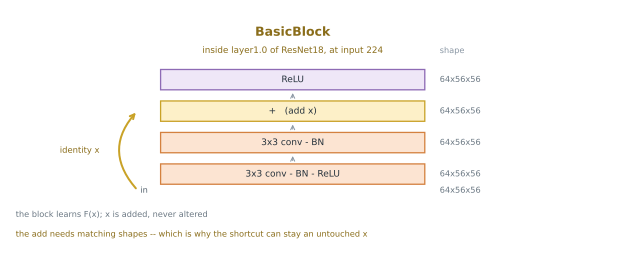

# ResNet 전이 — 지름길을 얹은 등뼈

[4.6절](03_vgg16_transfer.md)은 VGG16 하나로 전이의 구조를 세웠다. 크기를 키우고, ImageNet 상수로 정규화하고, 몸통을 얼려 특징을 한 번만 뽑아 두고, 그 위에 `nn.Linear(차원, 10)` 하나를 얹는다. 그 구조는 모델과 상관없다. 그러니 **모델만 갈아 끼우면** 다른 모델이 무엇을 들고 왔는지 잴 수 있다.

이 쪽이 갈아 끼우는 것은 ResNet18이다. 목적은 순위표가 아니다 — 이 모델이 들여온 **핵심 생각 하나**를 4.6절의 잣대 위에 올려 두고, 그것이 정확도와 셈과 매개변수에서 각각 무엇으로 나타나는지 보는 것이다. 잔차 연결 자체는 [11.2절](../ch10/residual/01_basic_residual_block.md)이 제대로 다루므로, 이 쪽은 그 생각을 **소개하고 넘긴다.**

---

## 1. 이 모델의 핵심 — 층이 배워야 할 목표를 바꾼다

그림 하나로 보면 이렇다. 층더미는 VGG16과 다를 것이 없고, **달라진 것은 더하는 자리 하나**다.


노란 줄 안이 이렇게 생겼다.



VGG16의 층 하나가 하는 일은 "들어온 것을 받아 나갈 것을 만든다"다. 나타내려는 사상을 $H(x)$라 하면 층더미가 $H$ 전체를 배운다. ResNet은 같은 층더미에 **더하기 하나**를 얹어 목표를 바꾼다.

<div class="defn" markdown>

**잔차 블록.** 블록의 주 경로가 $F(x)$를 셈하고, 들어온 $x$를 되더해 내놓는다.

$$H(x) = F(x) + x$$

그러므로 층더미가 배우는 것은 사상 전체 $H$가 아니라 **입력과의 차이** $F(x) = H(x) - x$, 곧 고쳐야 할 몫이다.

</div>

차이는 **아무것도 하지 않아야 할 때** 드러난다. 어떤 블록에서 항등 사상이 최적이라고 하자. 평범한 층더미는 비선형 층 여럿을 겹쳐 항등을 흉내내야 한다 — 만들 수는 있지만 맞히기 어려운 목표다. 잔차 블록은 가중치를 0 쪽으로 밀어 $F(x) = 0$을 만들면 끝난다. 곧 **깊이를 늘리는 값이 싸진다.** 쓸모가 없는 블록이 스스로 비켜서기 때문이다.

이 생각을 4.6절의 말로 옮기면 이렇다. VGG16이 "$3 \times 3$을 열세 번 쌓았다"였다면, ResNet18은 "$3 \times 3$을 열여섯 번 쌓되 두 겹마다 입력을 되더했다"다. 부품은 여전히 $3 \times 3$ 합성곱이다.

### 흔한 설명 하나를 덜어 낸다

잔차 연결을 두고 "기울기 소실을 막는다"는 말이 널리 돌아다닌다. **[11.2절](../ch10/residual/03_training_comparison.md)이 잰 것은 그것이 아니다.**

| | 평범한 층더미 | 잔차 층더미 |
|---|---|---|
| 블록 8의 기울기 노름 | 0.1571 ~ 0.2291 | 0.3642 ~ 0.4355 |
| 블록 1 ÷ 블록 8 | 5.945 ~ 12.302 | 2.022 ~ 2.934 |
| 깊이 16에서 입력 기울기 | 26,672 ~ 28,533 | 1,680 ~ 1,764 |

앞의 두 줄은 [학습 비교](../ch10/residual/03_training_comparison.md)가 블록 여덟 개짜리 그물에서, 셋째 줄은 [기본 잔차 블록](../ch10/residual/01_basic_residual_block.md)이 깊이 16 층더미에서 각각 씨앗 셋으로 잰 것이다. 서로 다른 실험이지만 말하는 것은 하나다.

**첫째, 사라지지 않는다.** 배치 정규화가 층마다 활성값의 크기를 다시 맞추므로, 평범한 층더미의 블록 8에서도 기울기 노름이 0.157~0.229다. 0에 가까운 수가 아니라 블록 1의 6~12분의 1일 뿐이다.

**둘째, 깊어지면 오히려 터진다.** 깊이 16에서 평범한 쪽의 입력 기울기는 26,672~28,533으로 잔차 쪽 1,680~1,764보다 **열다섯 배 넘게 크다.** 문제는 소실이 아니라 폭주다.

**셋째, 잔차 연결이 하는 일은 고르게 나누는 것이다.** 블록 1에서 블록 8로 가며 평범한 쪽은 5.9~12.3배 줄고 잔차 쪽은 2.0~2.9배만 준다. 두 범위가 씨앗 폭을 넘어 겹치지 않는다. 곧 이 구조가 붙드는 것은 기울기의 **크기**가 아니라 깊이에 걸친 **고르기**다.

까닭은 미분 한 줄에 있다. $\partial(F(x) + x)/\partial x = F'(x) + I$이므로 곱셈 사슬에 항등 항이 언제나 하나 끼어 있고, 그래서 층을 지날 때마다 곱해지는 배수가 1에서 멀어지기 어렵다. 사후 활성화의 마지막 ReLU 때문에 이 항등 경로가 참된 항등이 아니라는 점, 그것을 고친 사전 활성화 설계까지는 [항등 사상](../ch10/residual/identity_mapping.md)이 다룬다.

---

## 2. 코드 — 세 줄이 네 줄로 바뀐다

[4.6절](03_vgg16_transfer.md)의 프로그램에서 바뀌는 것은 이것뿐이다.

```diff
- from torchvision.models import vgg16, VGG16_Weights
+ from torchvision.models import resnet18, ResNet18_Weights

- net = vgg16(weights=VGG16_Weights.IMAGENET1K_V1).to(device).eval()
- net.classifier = nn.Sequential(*list(net.classifier.children())[:-1])
+ net = resnet18(weights=ResNet18_Weights.IMAGENET1K_V1).to(device).eval()
+ net.fc = nn.Identity()

- head = nn.Linear(4096, 10).to(device)
+ head = nn.Linear(512, 10).to(device)
```

전처리도, 특징을 한 번만 뽑아 두는 구조도, Adam $10^{-3}$·5 에포크·배치 100도 손대지 않는다. `extract()`가 돌려주는 것만 $(50000, 4096)$에서 $(50000, 512)$로 바뀐다.

**머리를 떼는 방법이 왜 다른가.** VGG16의 분류기는 `Linear(25088, 4096) → Linear(4096, 4096) → Linear(4096, 1000)` 셋이다. 마지막 하나만 덜어 내야 하므로 `Sequential`을 잘라 다시 묶는다. ResNet18에는 **전역 평균 풀링 뒤에 `Linear(512, 1000)` 하나뿐**이라 그 자리를 `nn.Identity()`로 갈아 놓으면 끝난다. `forward`는 여전히 `flatten` 다음에 `self.fc`를 부르고, 그것이 받은 것을 그대로 돌려준다.

차원이 4,096에서 512로 줄어드는 까닭도 거기 있다. 둘 다 $224$를 32분의 1로 접어 $512 \times 7 \times 7$ 언저리까지 온다.

| | 마지막 특징 맵 | 그 다음 | 나오는 특징 |
|---|---|---|---|
| VGG16 | $512 \times 7 \times 7$ | 펼쳐서 25,088 → 완전 연결 둘 | 4,096 |
| ResNet18 | $512 \times 7 \times 7$ | $7 \times 7$을 **평균으로 없앤다** | 512 |

VGG16은 49칸을 펼쳐 들고 가고, ResNet18은 평균내어 버린다. 그래서 머리도 40,970개에서 **5,130개**($512 \times 10 + 10$)로 여덟 분의 일이 된다.

---

## 3. 결과

**86.84%**다. 씨앗 0~4로 재면 86.52~87.16이고 퍼짐(최댓값 − 최솟값)이 0.64다.

4.6절과 똑같은 규약으로 여섯 모델을 잰 것을 나란히 둔다. Resize → ImageNet 정규화 → 얼리기 → 특징 한 번 뽑기 → `nn.Linear(차원, 10)`, Adam $10^{-3}$, 5 에포크, 배치 100, 씨앗 다섯.

| 모델 | 평균 | 퍼짐 | 범위 | 특징 차원 | 얼린 매개변수 | 머리 | 특징 뽑기 |
|---|---|---|---|---|---|---|---|
| VGG16 | 84.75% | 0.80 | 84.25 ~ 85.05 | 4,096 | 134,260,544 | 40,970 | 920초 |
| Inception v3 | 86.51% | 0.79 | 86.07 ~ 86.86 | 2,048 | 25,112,264 | 20,490 | 744초 |
| **ResNet18** | **86.84%** | **0.64** | **86.52 ~ 87.16** | **512** | **11,176,512** | **5,130** | **243초** |
| DenseNet121 | 89.58% | 0.17 | 89.46 ~ 89.63 | 1,024 | 6,953,856 | 10,250 | 552초 |
| MobileNetV3-L | 89.60% | 0.17 | 89.53 ~ 89.70 | 1,280 | 4,202,032 | 12,810 | 172초 |
| EfficientNet-B0 | 91.31% | 0.19 | 91.25 ~ 91.44 | 1,280 | 4,007,548 | 12,810 | 269초 |
| ConvNeXt-T | 94.12% | 0.33 | 93.98 ~ 94.31 | 768 | 27,820,128 | 7,690 | 1,027초 |
| ViT-B/16 | 95.34% | 0.29 | 95.15 ~ 95.44 | 768 | 85,798,656 | 7,690 | 2,234초 |

> 4.6절이 적은 84.93%는 씨앗 42 한 번의 값이고, 위의 84.75%는 같은 범위를 씨앗 다섯으로 다시 잰 평균이다. 범위(84.25~85.05)는 그 절이 적은 것과 같다.

### 정직하게 갈라 적어야 할 것

**VGG16과의 2.09%포인트는 실재한다.** 두 범위가 84.25~85.05와 86.52~87.16으로 **겹치지 않는다.** 이 책의 잣대로 이것은 재어진 차이다.

**Inception v3와는 구별되지 않는다.** 평균이 86.51%와 86.84%로 0.33%포인트 차이인데, 이는 두 모델의 퍼짐(0.79와 0.64)보다 작다. 범위도 86.52~86.86에서 겹친다. **퍼짐보다 작은 차이는 차이가 아니다**가 이 책의 규칙이므로, 여기서 할 수 있는 말은 "ResNet18이 Inception v3를 이겼다"가 아니라 **"이 규약에서 두 모델은 구별되지 않는다"**뿐이다.

아래 세 줄과는 반대 방향으로 갈린다. MobileNetV3-L의 89.53~89.70은 ResNet18의 87.16보다 위에 있어 겹치지 않고, EfficientNet-B0과 ViT-B/16은 그보다 더 위에 있다. **ResNet18은 이 표의 꼭대기가 아니다.** 이 쪽이 재려는 것은 순위가 아니라 생각 하나의 값어치이므로 그대로 적어 둔다.

### 값을 무엇으로 치렀는가

| | VGG16 | ResNet18 | 비 |
|---|---|---|---|
| 얼린 매개변수 | 134,260,544 | 11,176,512 | **12배 작다** |
| 특징 뽑기 (6만 장) | 920초 | 243초 | **3.8배 빠르다** |
| 머리 | 40,970 | 5,130 | 8배 작다 |
| 정확도 | 84.75% | 86.84% | **+2.09%포인트** |

몸통을 12분의 1로 줄이고 셈을 4분의 1로 줄이면서 정확도가 2.09%포인트 올랐다. 네 칸이 모두 같은 방향을 가리키는 일은 드물다.

얼린 11,176,512개는 세어 볼 수 있다. torchvision의 ResNet18 전체가 11,689,512개이고 그 가운데 `fc`가 $512 \times 1000 + 1000 = 513{,}000$개이므로, 그것을 덜어 내면 $11{,}689{,}512 - 513{,}000 = 11{,}176{,}512$다. 4.6절이 VGG16에서 한 셈과 같은 셈이다.

---

## 4. 어디에 잘 맞는가

### 좋은 점

**등뼈로 쓰기에 좋다.** 그림을 가르는 일만 하는 것이 아니라 물체를 알아내고 화소마다 갈래를 붙이는 일에도 몸통이 필요하다. [22장](../ch21/index.md)의 [더 빠른 R-CNN](../ch21/detection/38_faster_rcnn.md)과 [FCN](../ch21/segmentation/32_fcn.md)을 비롯한 여러 모델이 기본으로 고르는 몸통이 ResNet이다. 중간 단계마다 크기가 절반씩 줄어드는 네 단계 구조가 그런 일에 쓰기 좋게 짜여 있기 때문이고, 미리 학습된 가중치를 어디서나 구할 수 있기 때문이다.

**들어오는 크기를 가리지 않는다.** ResNet18은 마지막에 `AdaptiveAvgPool2d((1,1))`을 두어 $C \times h \times w$를 언제나 $C \times 1 \times 1$로 만든다. 나올 크기가 1이면 들어온 $h$가 무엇이든 고르게 나뉘므로, 4.6절이 맥에서 겪은 적응 풀링의 제약도 걸리지 않는다. VGG16은 `fc6`이 25,088개를 기다리므로 그 앞을 반드시 $7 \times 7$로 맞춰야 했다.

**깊이를 사서 정확도를 바꿀 수 있다.** 같은 블록을 더 쌓은 18 · 34 · 50 · 101 · 152가 모두 같은 얼굴로 준비되어 있어, 위의 코드에서 이름 두 개만 바꾸면 갈아 끼워진다. 50 이상은 병목 블록을 써서 특징 차원이 2,048이 되므로 머리의 입력만 함께 고친다. 만드는 법은 [ResNet 구현](../ch10/residual/02_resnet_implementation.md)에 있다.

### 아쉬운 점

**크기를 가리지 않는다는 것은 잘못을 숨긴다는 뜻이기도 하다.** 4.6절의 경고 상자가 재어 둔 것이 그것이다. VGG16에 `Resize`를 빼고 $32 \times 32$를 그대로 넣으면 오류가 나지 않고 84.93%에서 62.45%로 **22.48%포인트가 아무 말 없이 사라진다.** ResNet18도 똑같이 오류를 내지 않는다.

<div class="exbox" markdown>

**보기 1.** <span class="diff easy" title="쉬움"></span>
`Resize(224)`를 빼고 $32 \times 32$를 ResNet18에 그대로 넣으면 마지막 특징 맵의 크기가 얼마가 되는가? 오류가 나는가?

</div>

??? success "풀이"
    한 변이 줄어드는 자리는 다섯 곳이다. 줄기의 $7 \times 7$ 합성곱(`stride=2`), 최댓값 풀링(`stride=2`), 그리고 `layer2`·`layer3`·`layer4`의 첫 블록(`stride=2`)이다. `layer1`은 크기를 바꾸지 않는다.

    $$32 \to 16 \to 8 \to 8 \to 4 \to 2 \to 1$$

    $224$를 넣었을 때의 $224 \to 112 \to 56 \to 56 \to 28 \to 14 \to 7$과 같은 32분의 1이다. 그러므로 $32 \times 32$에서는 마지막 특징 맵이 $512 \times 1 \times 1$이 된다.

    **오류는 나지 않는다.** 전역 평균 풀링이 $1 \times 1$을 받아 $1 \times 1$을 내놓으므로 아무 일도 하지 않고 지나가고, 512차원 특징이 멀쩡히 나오며 학습도 되고 정확도도 찍힌다. 다만 그 512개 수는 $7 \times 7$ 마흔아홉 칸을 평균낸 것이 아니라 칸 하나를 그대로 읽은 것이다.

    이 쪽은 그때의 정확도를 재지 않았다. VGG16에서 22.48%포인트가 사라졌다는 사실이 ResNet18에서도 큰 손해를 예상하게 하지만, **예상은 측정이 아니다.**

**512차원은 좁을 수 있다.** 이 규약에서는 4,096차원 VGG16보다 잘했지만, 그것은 열 갈래를 가르는 일에서 그랬다는 뜻이다. 갈래가 훨씬 많거나 미세한 차이를 다투는 일에서는 평균으로 없애 버린 $7 \times 7$의 자리 정보가 아쉬울 수 있다.

**이 쪽이 잰 것은 특징 뽑기뿐이다.** 몸통을 얼리지 않고 마저 학습하는 미세 조정은 여기서 재지 않았다. 4.6절이 특징 뽑기를 먼저 보인 까닭이 그대로 여기에도 적용된다.

---

## 연습문제

<div class="drillbox" markdown>

**연습문제 1.** <span class="diff easy" title="쉬움"></span>
ResNet18 전이가 학습하는 매개변수는 5,130개, 얼린 것은 11,176,512개다. 두 수가 어떻게 나오는지 보이고 VGG16의 40,970개·134,260,544개와 견주어라.

</div>

??? success "연습문제 1 풀이"
    머리는 `nn.Linear(512, 10)` 하나이므로 $512 \times 10 + 10 = 5{,}130$이다.

    얼린 쪽은 전체에서 떼어 낸 층을 뺀다. ResNet18 전체가 11,689,512개이고 `fc`가 `Linear(512, 1000)`이므로 $512 \times 1000 + 1000 = 513{,}000$이다. 따라서 $11{,}689{,}512 - 513{,}000 = 11{,}176{,}512$다.

    VGG16은 머리가 40,970개, 얼린 것이 134,260,544개였다. 곧 **머리는 8배, 몸통은 12배 작다.** 그런데도 정확도는 84.75%에서 86.84%로 오른다. 4.6절이 "문제를 푸는 것은 분류기가 아니라 표현"이라고 한 말의 다음 줄이 이것이다 — 표현이 좋다는 것은 **길다는 뜻이 아니다.**

---

<div class="drillbox" markdown>

**연습문제 2.** <span class="diff easy" title="쉬움"></span>
VGG16에서는 `net.classifier`를 잘라 다시 묶었는데 ResNet18에서는 `net.fc = nn.Identity()` 한 줄로 끝난다. 왜 다른가? `net.fc`를 아예 지워 버리면 무슨 일이 일어나는가?

</div>

??? success "연습문제 2 풀이"
    떼어 낼 층의 **수가 다르다.** VGG16의 `classifier`는 `Linear(25088, 4096)`, `Linear(4096, 4096)`, `Linear(4096, 1000)` 셋을 담은 `Sequential`이고, 그 가운데 마지막 하나만 버려야 한다. 그래서 자식들을 꺼내 뒤에서 하나를 덜고 다시 묶는다. ResNet18은 전역 평균 풀링 뒤에 `Linear(512, 1000)` 하나뿐이라 그 자리를 항등으로 바꾸면 끝난다.

    **지워 버리면 `forward`가 깨진다.** ResNet의 `forward`는 평균 풀링과 `flatten` 다음에 `self.fc(x)`를 부르도록 적혀 있다. 그 속성을 없애면 `AttributeError`가 나고, 없앤 대신 `forward`를 다시 써야 한다. `nn.Identity()`는 받은 것을 그대로 돌려주므로 **호출은 그대로 두고 결과만 통과시키는** 방법이다. 층을 빼는 일을 코드 고치기 없이 하는 표준 수법이다.

---

<div class="drillbox" markdown>

**연습문제 3.** <span class="diff med" title="중간"></span>
표에서 ResNet18은 86.84%(86.52~87.16), Inception v3는 86.51%(86.07~86.86), VGG16은 84.75%(84.25~85.05)다. 세 쌍 가운데 "차이가 있다"고 말할 수 있는 것은 어느 것인가? 남은 쌍을 가리려면 무엇을 더 재야 하는가?

</div>

??? success "연습문제 3 풀이"
    **ResNet18 대 VGG16만 말할 수 있다.** 86.52~87.16과 84.25~85.05는 겹치지 않는다. 가장 나쁜 ResNet18 씨앗(86.52)이 가장 좋은 VGG16 씨앗(85.05)보다 1.47%포인트 위다. Inception v3 대 VGG16도 마찬가지로 86.07 > 85.05이니 겹치지 않는다.

    **ResNet18 대 Inception v3는 말할 수 없다.** 86.52~86.86 구간에서 두 범위가 겹친다. 평균의 차이는 0.33%포인트인데 각자의 퍼짐이 0.64와 0.79로 그 간격의 두 배 안팎이다. 곧 씨앗을 바꿀 때 생기는 흔들림이 두 모델 사이의 간격보다 크고, 씨앗을 골라 어느 쪽이든 이기게 만들 수 있다.

    더 재려면 두 가지다. 첫째, **씨앗을 늘린다.** 평균의 표준오차가 퍼짐의 절반보다 작아질 만큼 늘리면 0.33%포인트를 다툴 여지가 생긴다. 둘째, **씨앗을 짝지어 잰다.** 같은 씨앗끼리 차이를 내어 그 차이들의 부호가 한쪽으로 몰리는지를 보면, 모델 사이의 차이와 씨앗 잡음을 갈라낼 수 있다. 머리의 초기화와 섞는 차례가 씨앗을 공유하므로 이 짝짓기가 그대로 성립한다.

    그러나 가장 값싼 대답은 이것이다 — **두 모델이 구별되지 않는다고 적고 넘어간다.** 0.33%포인트를 가려서 얻는 것이 무엇인지 먼저 물어야 한다.

---

<div class="drillbox" markdown>

**연습문제 4.** <span class="diff med" title="중간"></span>
ResNet34로 바꾸려면 위의 코드에서 무엇을 고쳐야 하는가? 머리의 매개변수 수는 바뀌는가? ResNet50이라면?

</div>

??? success "연습문제 4 풀이"
    **ResNet34는 두 줄이다.** `resnet18`·`ResNet18_Weights`를 `resnet34`·`ResNet34_Weights`로 바꾸는 것뿐이다. `fc = nn.Identity()`도, `nn.Linear(512, 10)`도 그대로 둔다. ResNet34는 기본 블록을 더 쌓은 것이라 마지막 채널 수가 여전히 512이기 때문이다. 머리는 5,130개로 변하지 않는다.

    **ResNet50은 한 줄이 더 붙는다.** 50 이상은 병목 블록을 쓰고 그 마지막 단계의 출력 채널이 2,048이므로 머리를 `nn.Linear(2048, 10)`으로 고쳐야 한다. 그러면 $2048 \times 10 + 10 = 20{,}490$개다.

    표를 보면 Inception v3의 머리가 정확히 20,490개다. 그 모델의 특징 차원도 2,048이기 때문이다. 머리의 크기는 몸통이 무엇인지와 상관이 없고 **몸통이 몇 개의 수를 내놓는지**에만 달려 있다.

    바꾸어도 정확도가 오를지는 이 쪽이 재지 않았다. 깊은 변형이 ImageNet에서 더 잘한다는 것은 알려진 사실이지만, CIFAR-10으로 옮긴 뒤에도 그 순서가 유지되는지는 별개의 물음이고 위의 퍼짐 0.64가 그 물음의 잣대다.

---

<div class="drillbox" markdown>

**연습문제 5.** <span class="diff hard" title="어려움"></span>
ResNet18의 얼린 몸통은 VGG16의 12분의 1인데 특징 뽑는 시간은 3.8분의 1밖에 되지 않는다. 왜 매개변수의 비만큼 빨라지지 않는가? VGG16의 134,260,544개를 완전 연결층과 합성곱으로 갈라 세어 답하라.

</div>

??? success "연습문제 5 풀이"
    먼저 갈라 센다. VGG16의 얼린 부분은 합성곱 열세 층과 완전 연결 두 층(`fc6`, `fc7`)이다.

    | | 매개변수 | 몫 |
    |---|---|---|
    | `fc6` $25088 \times 4096 + 4096$ | 102,764,544 | 76.5% |
    | `fc7` $4096 \times 4096 + 4096$ | 16,781,312 | 12.5% |
    | 합성곱 열세 층 (나머지) | 14,714,688 | 11.0% |
    | 합 | 134,260,544 | 100% |

    **1억 3천만 개 가운데 89%가 완전 연결층 둘에 있다.** 그런데 완전 연결층은 그림 한 장에 행렬 곱 한 번이라 셈이 매개변수 수만큼만 든다. 반면 합성곱은 같은 가중치를 화소 자리마다 다시 쓰므로, 매개변수는 적어도 셈은 크기의 제곱에 비례해 든다. 시간을 정하는 것은 매개변수가 아니라 이 되풀이의 양이다.

    그러니 견주어야 할 것은 셋째 줄이다. VGG16의 합성곱 몫은 14,714,688개이고 ResNet18의 몸통 전체가 11,176,512개다. **1.3배 차이일 뿐이다.** 여기에 두 모델이 화소를 줄이는 속도가 더해진다. VGG16은 첫 두 층을 $224 \times 224$에서 채널 64로 돌리는데, ResNet18은 줄기의 $7 \times 7$ 합성곱과 최댓값 풀링으로 곧바로 $56 \times 56$까지 내려온다. 가장 비싼 해상도에 머무는 시간이 짧다.

    그래서 3.8배다. **12배는 저장 공간의 비이고 3.8배는 셈의 비다.** 두 수를 같은 것으로 읽으면 안 된다.

---

<div class="drillbox" markdown>

**연습문제 6.** <span class="diff hard" title="어려움"></span>
1절의 기울기 표만 근거로 삼아, "잔차 연결은 기울기 소실을 막는다"는 설명을 평가하라. 그 설명이 못 가리키는 것은 무엇이고, 표가 실제로 가리키는 것은 무엇인가? 배치 정규화가 있는데도 잔차 연결이 필요한 까닭을 그 위에서 말하라.

</div>

??? success "연습문제 6 풀이"
    **표는 그 설명을 뒷받침하지 않는다.** 소실이라는 말은 기울기가 $10^{-15}$ 같은 자릿수로 내려앉아 가중치가 움직이지 않는 사태를 가리킨다. 그런데 평범한 층더미의 블록 8에서도 노름이 0.1571~0.2291이다. 블록 1의 6~12분의 1일 뿐이고, 최적화가 멈출 크기가 아니다. 더구나 깊이 16에서는 26,672~28,533으로 잔차 쪽(1,680~1,764)보다 **열다섯 배 넘게 크다.** 이 방향은 소실의 반대다.

    까닭은 배치 정규화다. 층마다 활성값의 크기를 다시 맞추므로 신호가 깊이에 따라 기하급수로 줄어들 여지가 없다. 곧 **"기울기 소실"은 정규화가 없던 시절의 이야기**이고, 오늘의 층더미에서 그 말을 그대로 쓰면 재지 않은 것을 설명하는 셈이 된다.

    **표가 가리키는 것은 깊이에 걸친 고르기다.** 블록 1에서 블록 8로 가며 평범한 쪽은 5.945~12.302배 줄고 잔차 쪽은 2.022~2.934배만 준다. 두 범위가 씨앗 셋의 폭을 넘어 겹치지 않으므로 이 차이는 씨앗 잡음보다 크다. 곧 잔차 연결은 기울기를 **살려 내는** 것이 아니라 **층마다 비슷하게 나눈다.**

    그것이 왜 값어치가 있는가. 배치 정규화는 활성값의 크기를 맞추지만 **층마다 받는 학습 신호의 크기가 고르다는 것을 보장하지 않는다.** 한쪽으로 기울어져 있으면 학습률 하나로 모든 층을 맞출 수 없다 — 깊은 층에 맞춘 값이 얕은 층에는 너무 크거나 그 반대가 된다. 잔차 연결은 $F'(x) + I$의 항등 항으로 그 기울어짐을 눌러 하나의 학습률이 온 깊이에 통하게 만들고, 그 덕분에 층을 더 쌓는 일이 싸진다.

    다만 초기화 직후의 역전파 한 번은 학습이 아니므로, 이 표만으로 잔차 층더미가 더 잘 배운다고 말할 수는 없다. 같은 깊이에서 학습 곡선이 갈리는 모습은 [학습 비교](../ch10/residual/03_training_comparison.md)가 잰다.
