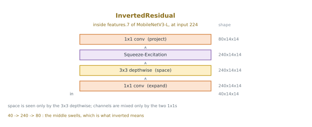

# MobileNet 전이 — 합성곱을 둘로 쪼갠다

[4.6절](03_vgg16_transfer.md)이 세운 틀은 그대로 둔다. $224 \times 224$로 키우고, ImageNet 상수로 정규화하고, 등뼈를 얼려 특징을 한 번만 뽑고, 그 위에 `nn.Linear` 하나를 얹어 Adam $10^{-3}$으로 5 에포크를 돈다. **바꾸는 것은 등뼈 하나뿐**이며, 코드에서는 네 줄이다.

갈아 끼우는 것은 MobileNetV3-Large다. 이 쪽이 하려는 일은 여섯 모델 가운데 누가 이기는지를 가리는 것이 아니다. 이기지도 않는다 — 아래 표에서 MobileNetV3-L보다 정확한 모델이 둘 있다. 하려는 일은 **이 모델이 들여온 생각 하나를 소개하는 것**이고, 그 생각은 이렇다.

> 합성곱 한 번이 하던 일을 두 번으로 쪼갠다.

---

## 1. 이 모델의 핵심 — 공간과 채널을 따로 다룬다

그림 하나로 보면 이렇다. 층더미는 여느 CNN과 같고, **달라진 것은 합성곱 한 번이 두 번으로 쪼개졌다는 것**이다.


노란 줄 안이 이렇게 생겼다.



표준 합성곱 하나는 서로 다른 두 가지를 **한꺼번에** 한다. $3 \times 3$ 필터 하나가 이웃 아홉 칸을 보면서(공간) 동시에 모든 입력 채널에 걸쳐 가중합을 한다(채널). 그래서 가중치가 $C_{in} \times C_{out} \times K^2$개, 곧 두 채널 수의 **곱**만큼 든다.

깊이별 분리 합성곱은 이 둘을 떼어 놓는다.

| 걸음 | 하는 일 | 가중치 |
|---|---|---|
| 1. 깊이별 ($K \times K$) | 채널마다 제 필터로 **공간만** 거른다. 채널 사이는 섞지 않는다 | $C_{in} \times K^2$ |
| 2. 점별 ($1 \times 1$) | 자리마다 채널을 **섞기만** 한다. 이웃은 보지 않는다 | $C_{in} \times C_{out}$ |

곱이 합으로 바뀐다. $C_{in} \times C_{out} \times K^2$가 $C_{in}(K^2 + C_{out})$이 되고, 줄어드는 비는 이렇다.

$$\frac{C_{in} C_{out} K^2}{C_{in}(K^2 + C_{out})} = \frac{1}{\frac{1}{C_{out}} + \frac{1}{K^2}}$$

$C_{in}$이 약분되어 사라지므로 비는 입력 채널 수와 무관하고, $1/K^2$이 늘 남으므로 $K = 3$에서는 $C_{out}$을 아무리 키워도 9배를 넘지 못한다. 흔히 쓰는 값에서 8~9배다.

이 유도와 그 **가중치와 층 전체를 갈라 세어야 하는 까닭**은 [11.1절](../ch10/cnn/depthwise_separable.md)에 있다. 편향은 채널 수에 비례할 뿐이어서 위 비만큼 줄지 않기 때문이다. 그 절이 재어 둔 대로 $C = 64$의 깊이별 합성곱에서 가중치는 정확히 64배 줄지만 층 전체는 57.7배 줄어들며, 여기서 소개하는 비는 모두 **가중치만 센 것**이다.

### 실제로 무게는 어디에 있는가

MobileNetV3-Large를 열어 세어 보면 뜻밖의 것이 나온다.

```python
import torch.nn as nn
from torchvision.models import mobilenet_v3_large

net = mobilenet_v3_large(weights=None)          # 세기만 하므로 가중치는 필요 없다
convs = [m for m in net.modules() if isinstance(m, nn.Conv2d)]
dw = [m for m in convs if m.groups > 1]         # groups > 1 이면 깊이별이다

w_all = sum(m.weight.numel() for m in convs)
w_dw = sum(m.weight.numel() for m in dw)
# 같은 모양을 표준 합성곱으로 두었다면 얼마였겠는가
w_dense = sum(m.in_channels * m.out_channels * m.kernel_size[0] * m.kernel_size[1]
              for m in dw)

print(f"합성곱 층        {len(convs)}개 (그 가운데 깊이별 {len(dw)}개)")
print(f"깊이별 핵 크기   {sorted(set(m.kernel_size[0] for m in dw))}")
print(f"합성곱 가중치    {w_all:,}")
print(f"  깊이별 몫      {w_dw:,} ({100 * w_dw / w_all:.2f}%)")
print(f"같은 자리를 표준 합성곱으로 두면 {w_dense:,} ({w_dense / w_dw:.1f}배)")
print(f"그러면 합성곱 가중치 전체가 {w_all - w_dw + w_dense:,} "
      f"({(w_all - w_dw + w_dense) / w_all:.1f}배)")
```

**출력:**

```
합성곱 층        62개 (그 가운데 깊이별 15개)
깊이별 핵 크기   [3, 5]
합성곱 가중치    2,942,472
  깊이별 몫      91,608 (3.11%)
같은 자리를 표준 합성곱으로 두면 65,930,688 (719.7배)
그러면 합성곱 가중치 전체가 68,781,552 (23.4배)
```

합성곱 62개 가운데 깊이별이 15개, $1 \times 1$이 46개, 나머지 하나는 맨 앞의 $3 \times 3$이다(가중치 $3 \times 16 \times 9 = 432$개). 곧 **공간을 보는 층은 열여섯 개뿐이고 나머지 마흔여섯은 채널만 섞는다.**

그리고 깊이별 열다섯 층이 가진 가중치가 전체의 **3.11%**다. **96.87%**는 $1 \times 1$ 마흔여섯 층이 쥐고 있고, 맨 앞 $3 \times 3$의 432개가 남은 0.01%다. 이것이 쪼개기가 한 일을 가장 짧게 말해 준다 — **공간 거르기를 거의 무게 없는 일로 만들었다.** 같은 자리를 표준 합성곱으로 되돌리면 719.7배로 불어난다.

!!! warning "719.7배는 위의 8~9배와 다른 수다"

    헷갈리기 쉬우니 갈라 둔다. 위 코드가 바꾼 것은 **깊이별 층 하나를 같은 입출력 채널의 표준 합성곱 하나로** 되돌린 것이고, 그 비는 $C \times C \times K^2 / (C \times K^2) = C$, 곧 채널 수다. MobileNetV3-L의 깊이별 층은 채널이 16에서 960까지이고 넓은 층이 가중치의 대부분을 쥐므로 가중치로 가중평균한 값이 719.7이 된다.

    8~9배는 그것이 아니라 **깊이별 + 점별 한 쌍을 표준 합성곱 하나로** 되돌릴 때의 비다. 두 비는 서로 다른 것을 재며, 719.7은 11.1절 3절의 이야기이고 8~9배는 그 절 4절의 이야기다. 아래 연습문제 5가 이 갈래를 다시 짚는다.

### MobileNetV3이 그 위에 더한 것

깊이별 분리 합성곱은 MobileNetV1(2017)의 것이다. V3까지 오는 사이에 셋이 더 붙었다.

- **뒤집은 잔차**(V2) — 좁게 들어와 넓게 부풀린 뒤 다시 좁게 내보낸다. 가운데를 넓게 둘 수 있는 까닭이 깊이별에 있다. 가중치가 채널 수의 제곱이 아니라 채널 수에 비례하기 때문이다.
- **압축-여기**(squeeze-and-excitation) — 채널마다 "지금 이 그림에서 얼마나 중요한가"를 재어 곱해 준다. 깊이별 층을 하나씩 품은 블록이 위에서 센 대로 열다섯 개인데, 그 가운데 여덟 개가 이것을 달고 있다. [11.3절](../ch10/vit/squeeze_excitation.md)이 다룬다.
- **찾아낸 구조** — 층의 폭과 핵 크기를 사람이 고른 것이 아니라 탐색으로 찾았다. 위 출력에서 핵 크기가 3과 5로 **섞여 있는 것**이 그 흔적이다. 채널 수도 16, 64, 72, 120, 240, 200, 184, 480, 672, 960처럼 고르지 않다 — 240 다음이 200이고 그 다음이 184로, 올라가다 내려온다. 손으로 쌓은 VGG16이 13층 모두 $3 \times 3$이고 채널이 64, 128, 256, 512로 두 배씩 오르는 것과 정반대다. 열다섯 층의 채널 수는 연습문제 5에 모두 적어 두었다.

이 쪽이 재는 것은 이 셋이 각각 얼마를 벌어 주는지가 아니다. 넷이 한 덩이로 붙어 있는 모델을 하나 가져와, 그것이 4.6절의 틀 안에서 무엇을 하는지를 잴 뿐이다.

---

## 2. 코드 — 네 줄만 바꾼다

[4.6절](03_vgg16_transfer.md)의 프로그램에서 바뀌는 곳은 이것뿐이다. 전처리, `extract()`, 머리 학습, 씨앗까지 나머지는 글자 하나 다르지 않다.

```diff
- from torchvision.models import vgg16, VGG16_Weights
+ from torchvision.models import mobilenet_v3_large, MobileNet_V3_Large_Weights

- net = vgg16(weights=VGG16_Weights.IMAGENET1K_V1).to(device).eval()
- net.classifier = nn.Sequential(*list(net.classifier.children())[:-1])
+ net = mobilenet_v3_large(weights=MobileNet_V3_Large_Weights.IMAGENET1K_V1).to(device).eval()
+ net.classifier[3] = nn.Identity()

- head = nn.Linear(4096, 10).to(device)
+ head = nn.Linear(1280, 10).to(device)
```

!!! note "왜 `fc`가 아니고 `classifier[3]`인가"

    torchvision의 모델은 마지막 층을 부르는 이름이 저마다 다르다. ResNet은 `net.fc` 하나이고, VGG16은 `net.classifier`가 `Linear-ReLU-Dropout`을 세 번 쌓은 여섯 층짜리라 4.6절이 마지막 하나를 목록에서 잘라냈다. MobileNetV3의 `classifier`는 넷뿐이다.

    ```
    (0): Linear(in_features=960, out_features=1280, bias=True)
    (1): Hardswish()
    (2): Dropout(p=0.2, inplace=True)
    (3): Linear(in_features=1280, out_features=1000, bias=True)
    ```

    떼어 낼 것은 `(3)`이고, 앞의 `(0)`은 남겨야 한다. 그것이 1,280차원 특징을 만드는 층이기 때문이다. 목록을 잘라 내는 대신 `nn.Identity()`로 갈아 끼우면 뒤의 번호가 밀리지 않아 안전하다.

    1280을 손으로 적는 것도 피할 수 있다. 갈아 끼우기 **전에** 읽어 두면 된다.

    ```python
    dim = net.classifier[3].in_features   # 1280
    net.classifier[3] = nn.Identity()
    head = nn.Linear(dim, 10).to(device)
    ```

    이렇게 두면 `mobilenet_v3_small`로 바꿀 때도 같은 코드가 돈다. 손으로 적은 1280은 조용히 틀린다 — 차원이 안 맞으면 터지지만, 맞으면서 틀린 층을 떼는 경우가 더 무섭다.

머리는 `nn.Linear(1280, 10)`이므로 학습하는 매개변수가 $1280 \times 10 + 10 = 12{,}810$개다. 얼린 등뼈는 4,202,032개다.

---

## 3. 결과

**89.60%**다. 씨앗 0~4로 다섯 번 재면 89.53~89.70으로 퍼짐이 **0.17**이다.

여섯 등뼈를 같은 규약으로 재어 한 표에 놓는다. 모두 Resize(224) → ImageNet 정규화 → 얼리고 특징 한 번 뽑기 → `nn.Linear(차원, 10)`, Adam $10^{-3}$, 5 에포크, 배치 100, 씨앗 0~4다.

| 등뼈 | 평균 | 퍼짐 | 범위 | 특징 차원 | 얼린 매개변수 | 머리 | 특징 뽑기 |
|---|---|---|---|---|---|---|---|
| VGG16 | 84.75% | 0.80 | 84.25~85.05 | 4096 | 134,260,544 | 40,970 | 920초 |
| Inception v3 | 86.51% | 0.79 | 86.07~86.86 | 2048 | 25,112,264 | 20,490 | 744초 |
| ResNet18 | 86.84% | 0.64 | 86.52~87.16 | 512 | 11,176,512 | 5,130 | 243초 |
| DenseNet121 | 89.58% | 0.17 | 89.46 ~ 89.63 | 1,024 | 6,953,856 | 10,250 | 552초 |
| **MobileNetV3-L** | **89.60%** | **0.17** | 89.53~89.70 | 1280 | **4,202,032** | 12,810 | **172초** |
| EfficientNet-B0 | 91.31% | 0.19 | 91.25~91.44 | 1280 | 4,007,548 | 12,810 | 269초 |
| ConvNeXt-T | 94.12% | 0.33 | 93.98 ~ 94.31 | 768 | 27,820,128 | 7,690 | 1,027초 |
| ViT-B/16 | 95.34% | 0.29 | 95.15~95.44 | 768 | 85,798,656 | 7,690 | 2234초 |

!!! note "4.6절의 84.93%와 이 표의 84.75%"
    4.6절이 적는 84.93%는 그 절의 규약인 씨앗 42 한 번의 값이고, 이 표의 84.75%는 씨앗 0~4 다섯 번의 **평균**이다. 84.93은 84.25~85.05 안에 있으므로 어긋나는 값이 아니다. 아래에서 견주는 차이는 모두 평균끼리다.

### 이 줄이 말하는 것

MobileNetV3-L이 **가장 정확한 모델은 아니다.** EfficientNet-B0이 1.71%포인트 위에 있고 ViT-B/16은 5.74%포인트 위에 있으며, 두 범위 모두 89.53~89.70과 겹치지 않으므로 그 차이는 재어진 것이다. 정확도만 필요하다면 이 표에서 고를 것은 MobileNetV3-L이 아니다.

말하는 것은 다른 줄과의 견줌이다.

| 무엇을 | MobileNetV3-L 대 VGG16 | 두 값 |
|---|---|---|
| 정확도 | **+4.85%포인트** | 89.60 대 84.75 |
| 얼린 매개변수 | **32.0배 작다** | 4,202,032 대 134,260,544 |
| 특징 뽑는 시간 | **5.3배 빠르다** | 172초 대 920초 |

세 줄이 같은 방향이라는 것이 이 모델의 요점이다. 보통 이 셋은 맞바꿈이다 — 더 작고 더 빠른 모델은 덜 맞힌다. 여기서는 **더 작고 더 빠르면서 더 맞힌다.** 여섯 가운데 가장 빠르고, 둘째로 작다.

차이가 재어진 것인지도 확인해 두어야 한다. 4.85%포인트는 두 퍼짐 0.80과 0.17을 합친 것보다 다섯 배 크고, 89.53~89.70과 84.25~85.05는 4.48%포인트 떨어져 있다. MobileNetV3-L의 범위는 **표의 다른 다섯 범위 어느 것과도 겹치지 않는다.** 씨앗 탓으로 볼 여지가 없다.

!!! note "퍼짐이 줄어드는 것은 짐작일 뿐이다"
    표를 정확도 순으로 읽으면 퍼짐이 0.80, 0.79, 0.64, 0.17, 0.19, 0.29로 움직인다. 위쪽 셋이 0.6~0.8이고 아래쪽 셋이 0.2 언저리다. MobileNetV3-L의 0.17이 여섯 가운데 가장 작다.

    그럴듯한 읽기는 이렇다. 특징이 클래스를 잘 갈라 놓을수록 선형 머리가 찾을 최적점이 뚜렷해지고, 그러면 머리의 초기값이 어디였는지가 결과에 덜 남는다. **다만 이 책에는 그것을 보일 측정이 없다.** 머리의 초기값만 바꾼 퍼짐과 데이터 차례만 바꾼 퍼짐을 따로 재어야 갈릴 일이고, 위 다섯 번은 둘을 같이 바꾼 것이다. 여섯 점으로 그린 추세이기도 하다. **짐작으로 적어 두고 근거로는 쓰지 않는다.**

---

## 4. 어디에 잘 맞는가

이 모델이 태어난 자리는 CIFAR-10을 재는 노트북이 아니라 **손전화와 붙박이 기기**다. 그곳에서 묶는 것은 정확도의 마지막 한 점이 아니라 메모리와 지연이다. 모델이 램에 들어가야 하고, 사진 한 장에 대한 답이 손가락을 뗀 뒤 몇십 밀리초 안에 나와야 한다. 그 제약 아래에서 설계된 모델이므로, 그 제약이 있는 곳에서 잘 맞는다.

**좋은 점**

- **작다.** 얼린 등뼈가 4,202,032개로 VGG16의 32분의 1이다. float32로 16MB 남짓이다.
- **빠르다.** 여섯 가운데 가장 빠르다. ViT-B/16보다 13.0배 빠르면서 5.74%포인트를 내준다.
- **곱은 돌려받는다.** 아낀 매개변수를 층을 더 쌓는 데 되돌려 쓴 결과가 위 89.60%다. 같은 크기의 표준 합성곱 모델보다 훨씬 깊게 갈 수 있다.
- **흔들림이 적다.** 퍼짐 0.17로 여섯 가운데 가장 작다. 다만 위에서 적은 대로 그 까닭은 재지 않았다.

**아쉬운 점**

- **셈을 센 수가 속도를 부풀려 말한다.** 이것이 가장 중요한 아쉬움이고 아래에서 따로 잰다.
- **천장이 낮다.** 셈이 제약이 아닌 곳에서는 더 큰 모델이 더 맞힌다. 위 표에서 ViT-B/16이 5.74%포인트 위에 있다. 손전화에 올릴 일이 없다면 이 모델을 고를 까닭이 줄어든다.
- **구조를 설명하기 어렵다.** 폭과 핵 크기를 탐색으로 찾았으므로 "왜 이 층은 $5 \times 5$인가"에 대한 답이 "찾아보니 그게 좋았다"다. VGG16이 13층 모두 $3 \times 3$인 것과 달리, 사람이 손으로 옮겨 적기에는 불친절한 모델이다.

### 셈을 센 수는 시간이 아니다

[11.1절](../ch10/cnn/depthwise_separable.md)은 매개변수와 곱셈·덧셈만 세어 두고 시간은 한 줄도 재지 않았다고 스스로 적으면서, 깊이별 합성곱은 가중치 하나당 하는 일이 적어 **셈이 아니라 메모리 대역폭에 발목이 잡힌다**고 경고했다. 3절의 표에는 시간이 있으므로 그 경고를 수로 확인할 수 있다.

두 등뼈에 $224 \times 224$ 한 장을 넣고 곱셈·덧셈 횟수(MAC)를 센다. 4.6절과 이 쪽의 규약대로 ImageNet 머리는 떼어 낸 상태다.

```python
import torch
import torch.nn as nn
from torchvision.models import vgg16, mobilenet_v3_large

def macs(model):
    """합성곱과 선형층의 곱셈·덧셈 횟수를 센다. 곱셈 한 번과 덧셈 한 번을 1 MAC으로
    세므로, 2를 곱해 FLOP으로 세는 관례와는 두 배 차이가 난다. 아래에서 쓰는 것은
    비뿐이고 비는 어느 쪽으로 세든 같다."""
    total = 0

    def hook(m, i, o):
        nonlocal total
        if isinstance(m, nn.Conv2d):
            h, w = o.shape[2:]
            total += (m.kernel_size[0] * m.kernel_size[1] * m.in_channels
                      * m.out_channels * h * w // m.groups)
        elif isinstance(m, nn.Linear):
            total += m.in_features * m.out_features

    hs = [m.register_forward_hook(hook) for m in model.modules()
          if isinstance(m, (nn.Conv2d, nn.Linear))]
    with torch.no_grad():
        model(torch.randn(1, 3, 224, 224))
    for h in hs:
        h.remove()
    return total

# 3절의 규약과 같은 상태로 만든다 — ImageNet 머리를 뗀 등뼈만 센다
v = vgg16(weights=None).eval()
v.classifier = nn.Sequential(*list(v.classifier.children())[:-1])
m = mobilenet_v3_large(weights=None).eval()
m.classifier[3] = nn.Identity()

a, b = macs(v), macs(m)
print(f"VGG16          {a:>15,} MAC")
print(f"MobileNetV3-L  {b:>15,} MAC")
print(f"셈의 비   {a / b:.1f}배")
print(f"시간의 비 {920 / 172:.1f}배  (3절의 920초와 172초)")
print(f"셈이 {a / b / (920 / 172):.1f}배 부풀려 말한다")
```

**출력:**

```
VGG16           15,466,168,320 MAC
MobileNetV3-L      215,309,760 MAC
셈의 비   71.8배
시간의 비 5.3배  (3절의 920초와 172초)
셈이 13.4배 부풀려 말한다
```

**71.8배 대 5.3배다.** 셈만 세었다면 MobileNetV3-L이 일흔 배 빠를 것이라고 적었을 텐데, 실제로는 다섯 배다. 11.1절이 시간을 재지 않은 채 경고해 둔 그 일이 여기서 수로 나온다.

두 가지를 덧붙여야 이 13.4배를 정직하게 읽을 수 있다.

**첫째, 172초와 920초는 등뼈만 잰 값이 아니다.** 두 값에는 CPU 쪽 `Resize(224)`와 텐서 변환, 정규화가 그대로 섞여 있고, 그 비용은 두 모델이 똑같이 치른다. 고정 비용이 양쪽에 같은 양 얹히면 비는 1에 가까워지므로, **그 몫이 13.4배 가운데 얼마인지 이 쪽은 모른다.** 가려내려면 같은 배치를 램에 올려 두고 등뼈 순전파만 반복해 재야 한다.

**둘째, 71.8배도 5.3배도 기계 하나의 값이다.** 대역폭에 묶인다는 말은 곧 기계가 바뀌면 비가 바뀐다는 말이다. 깊이별 커널이 잘 최적화된 기계에서는 5.3배보다 커질 것이고, 배치를 1로 줄이면 또 달라진다.

그러니 이 절에서 가져갈 것은 13.4라는 수가 아니라 방향이다. **셈을 센 수는 속도의 상한을 말해 줄 뿐이며, 깊이별 합성곱에서는 그 상한이 특히 멀다.**

---

## 연습문제

<div class="drillbox" markdown>

**연습문제 1.** <span class="diff easy" title="쉬움"></span>
이 쪽이 학습하는 매개변수는 12,810개다. 이 수가 어떻게 나오는지 보이고, [4.6절](03_vgg16_transfer.md)의 40,970개와 견주어라.

</div>

??? success "연습문제 1 풀이"
    머리는 `nn.Linear(1280, 10)` 하나이므로 $1280 \times 10 + 10 = 12{,}810$이다. 4.6절은 `nn.Linear(4096, 10)`이라 $4096 \times 10 + 10 = 40{,}970$이었다.

    $40{,}970 / 12{,}810 = 3.198$, 곧 이 쪽의 머리가 **3.2배 작다.** 그런데 정확도는 4.85%포인트 높다.

    까닭은 특징 차원이 표현의 품질이 아니기 때문이다. 3절의 표에서 차원을 정확도 순으로 읽으면 4096, 2048, 512, 1280, 1280, 768로 아무 방향이 없다. 가장 높은 4096의 VGG16이 가장 낮게 맞히고, 가장 정확한 ViT-B/16은 768차원이다. **차원은 같은 것을 몇 개의 수로 적었는지일 뿐이고, 갈리는 것은 그 수들이 무엇을 적었는지다.**

---

<div class="drillbox" markdown>

**연습문제 2.** <span class="diff easy" title="쉬움"></span>
3절의 표만 보고 MobileNetV3-L과 ViT-B/16의 맞바꿈을 세 수로 적어라. 어느 쪽을 고를지는 무엇이 정하는가?

</div>

??? success "연습문제 2 풀이"
    표에서 그대로 나눈다.

    - 정확도: $95.34 - 89.60 = 5.74$%포인트 ViT가 높다
    - 크기: $85{,}798{,}656 / 4{,}202{,}032 = 20.4$배 ViT가 크다
    - 시간: $2234 / 172 = 13.0$배 ViT가 느리다

    고르는 기준은 표 안에 없다. **어느 자원이 묶여 있는지**가 정한다. 램이 넉넉하고 한 번 돌려 두면 되는 일이라면 5.74%포인트를 사는 편이 낫고, 손전화 위에서 초당 서른 장을 처리해야 한다면 13배가 곧 불가능이다.

    표가 말해 주지 않는 것도 적어 둘 만하다. 두 시간은 노트북 한 대에서 배치 100으로 잰 것이므로, 배치 1로 손전화에서 잴 때의 비는 이와 다를 수 있다. 4절이 적은 대로 깊이별 합성곱은 대역폭에 묶이고, 대역폭은 기계마다 다르다.

---

<div class="drillbox" markdown>

**연습문제 3.** <span class="diff med" title="중간"></span>
"MobileNetV3-L이 VGG16보다 좋은 모델이다"라고 3절의 표를 읽어도 되는가? 이 표가 재지 **않은** 것을 셋 들어라.

</div>

??? success "연습문제 3 풀이"
    안 된다. 표가 재는 것은 한 가지뿐이다. **등뼈를 얼린 채 뽑은 특징 위에 선형 머리 하나를 얹어 CIFAR-10을 가를 때의 정확도**다. 재지 않은 것으로 이런 것들이 있다.

    1. **미세 조정했을 때.** 얼리지 않고 등뼈까지 CIFAR-10으로 마저 학습하면 순서가 바뀔 수 있다. 1억 3천만 개를 움직일 수 있는 VGG16과 420만 개를 움직일 수 있는 MobileNetV3-L은 그 자리에서 서로 다른 처지에 놓인다.
    2. **다른 데이터.** CIFAR-10 열 가지는 ImageNet 1,000가지의 부분집합에 가깝다. 의료 영상이나 위성 사진처럼 ImageNet에서 멀어질수록 순서가 지켜질 까닭이 줄어든다.
    3. **원래 태어난 자리에서의 성능.** 손전화 위의 지연과 램 사용량은 이 표에 한 칸도 없다. MobileNetV3이 설계된 목적이 바로 그것인데, 이 쪽은 노트북에서 배치 100으로 쟀다.

    한 가지 더 있다. 두 모델은 **5년 떨어져 있다.** VGG16은 2014년, MobileNetV3은 2019년이다. 그 사이에 잔차 연결, 배치 정규화의 정착, 새 활성화, 구조 탐색, 더 나은 학습 방법이 모두 들어왔다. 4.85%포인트를 "깊이별 분리 합성곱이 번 몫"으로 읽으면 안 된다. 그 몫을 가려내려면 다른 것을 모두 묶어 놓고 합성곱만 바꾸어 재야 한다.

---

<div class="drillbox" markdown>

**연습문제 4.** <span class="diff med" title="중간"></span>
3절은 퍼짐이 0.80, 0.79, 0.64, 0.17, 0.19, 0.29로 줄어드는 것을 짐작으로만 적었다. 그 짐작을 시험할 측정을 설계하라. 그리고 이 표에서 짐작에 기대지 않고 결론 내릴 수 있는 차이와 그럴 수 없는 차이를 각각 하나 들어라.

</div>

??? success "연습문제 4 풀이"
    **측정 설계.** 지금 다섯 번은 씨앗 하나를 바꿀 때 머리의 초기값과 데이터 섞는 차례가 **같이** 바뀐다. 둘을 갈라야 한다.

    - 데이터 차례를 한 씨앗으로 못박고 머리 초기값만 다섯 개 바꾸어 퍼짐 A를 재고,
    - 머리 초기값을 한 씨앗으로 못박고 데이터 차례만 다섯 개 바꾸어 퍼짐 B를 잰다.

    짐작이 옳다면 모델이 좋아질수록 **A가 줄어들어야** 한다. 초기값이 결과에 덜 남는다는 주장이기 때문이다. A는 그대로인데 B만 줄어든다면 짐작은 틀린 것이고, 줄어든 까닭이 다른 데 있다.

    한 가지 더 볼 것이 있다. 정확도가 높으면 퍼짐이 줄어드는 것은 **천장 효과**만으로도 일어난다. 95%에서는 남은 오차가 4.66%포인트뿐이니 흔들릴 여지 자체가 적다. 그러니 퍼짐을 그냥 보는 대신 퍼짐을 남은 오차로 나눈 값을 보아야 한다. 정확도 순으로 적으면 이렇다.

    $$\frac{0.80}{15.25} = 0.052, \quad \frac{0.79}{13.49} = 0.059, \quad \frac{0.64}{13.16} = 0.049, \quad \frac{0.17}{10.40} = 0.016, \quad \frac{0.19}{8.69} = 0.022, \quad \frac{0.29}{4.66} = 0.062$$

    이렇게 재면 **줄어드는 추세가 사라진다.** 마지막 값 0.062가 여섯 가운데 가장 크므로, 정확도가 오를수록 흔들림이 준다는 읽기는 이 잣대에서는 서지 못한다. 남는 것은 추세가 아니라 **두 점만 따로 떨어져 있다**는 사실이다. 넷이 0.049~0.062에 모여 있는데 MobileNetV3-L의 0.016과 EfficientNet-B0의 0.022만 그 절반 아래이고, 그 둘은 하필 표에서 등뼈가 가장 작은 둘이다. 까닭이 정확도가 아니라 다른 데 있을 수 있다는 뜻이다. **짐작을 적을 때조차 어떤 잣대로 재는지가 결론을 뒤집는다.**

    **결론 낼 수 있는 차이.** MobileNetV3-L과 EfficientNet-B0의 1.71%포인트다. 89.53~89.70과 91.25~91.44가 겹치지 않으므로 씨앗 탓이 아니다.

    **결론 낼 수 없는 차이.** Inception v3와 ResNet18의 0.33%포인트다. 86.07~86.86과 86.52~87.16이 겹치고, 그 차이는 두 퍼짐 0.79와 0.64보다 작다. 표에서 ResNet18이 위에 있지만 그것을 이겼다고 읽으면 안 된다.

---

<div class="drillbox" markdown>

**연습문제 5.** <span class="diff hard" title="어려움"></span>
1절은 깊이별 분리 합성곱이 줄이는 비가 $K = 3$에서 9배를 넘지 못한다고 했다. 그런데 같은 절의 코드는 719.7배를, 그리고 합성곱 전체로는 23.4배를 찍는다. 셋 다 옳다. 각각 무엇을 재고 있는지 갈라라.

</div>

??? success "연습문제 5 풀이"
    세 수가 서로 다른 셋을 바꾸어 놓고 잰 것이다.

    **9배 — 깊이별 + 점별 한 쌍을 표준 합성곱 하나로.** 이것이 1절의 식 $1/(1/C_{out} + 1/K^2)$이 재는 것이다. $1/K^2$이 늘 남으므로 $C_{out} \to \infty$에서도 $K^2 = 9$가 상한이다. 쪼갠 쪽에 $1 \times 1$이 **들어 있다.**

    **719.7배 — 깊이별 층 하나를 같은 입출력 채널의 표준 합성곱 하나로.** 코드가 바꾼 것이 이것이다. $1 \times 1$은 양쪽에 그대로 두고 깊이별만 되돌린다. 비는

    $$\frac{C \times C \times K^2}{C \times K^2} = C$$

    곧 **채널 수 그 자체**이고 $K$가 약분되어 사라진다. 상한이 없다. MobileNetV3-L의 깊이별 층은 채널이 16, 64, 72, 72, 120, 120, 240, 200, 184, 184, 480, 672, 672, 960, 960이고 넓은 층이 가중치의 대부분을 쥐므로 가중치로 가중평균하면 719.7이 나온다. 최대인 960에 가까운 것이 그 증거다. 이것은 [11.1절](../ch10/cnn/depthwise_separable.md) 3절의 깊이별 비이고, 9배는 그 절 4절의 깊이별 **분리** 비다.

    **23.4배 — 같은 바꿈을 모델 전체의 합성곱 가중치로 본 것.** $2{,}942{,}472 \to 68{,}781{,}552$다. 719.7배보다 훨씬 작은 까닭은 바뀌지 않은 $1 \times 1$ 46층의 2,850,432개가 분모와 분자에 그대로 남아 비를 눌렀기 때문이다. 깊이별이 원래 전체의 3.11%뿐이었으니, 그 3.11%가 719.7배로 불어나 전체를 23.4배로 만든 셈이다.

    $$\frac{2{,}942{,}472 - 91{,}608 + 65{,}930{,}688}{2{,}942{,}472} = 23.4$$

    **셋 다 "깊이별 분리 합성곱이 몇 배 아끼는가"의 답으로 쓰일 수 있고, 무엇을 무엇으로 바꾸었는지를 적지 않으면 어느 것도 뜻이 없다.** 719.7배는 MobileNetV3-L을 표준 합성곱으로 다시 짜면 6,878만 개가 된다는 말이 아니다 — 그런 모델은 아무도 설계하지 않는다. 가운데를 여러 배로 부풀리는 뒤집은 잔차는 그 넓은 자리의 합성곱이 싸다는 전제 위에 서 있으므로, 깊이별을 빼면 부풀리기부터 다시 생각해야 한다. 719.7배는 **아낀 것이 어디에 있는지를 가리키는 수**이지 있을 법한 모델과의 견줌이 아니다.
