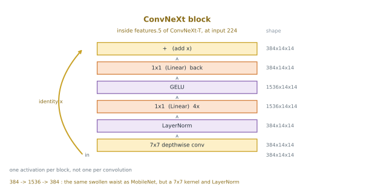

# ConvNeXt 전이 — 버린 것은 합성곱이 아니었다

이 절은 [ViT](12_transfer_vit.md)로 닫힌다. 미끄러지는 합성곱도 풀링 피라미드도 없는 모델이 95.34%로 이 절에서 가장 높고, 그 쪽 제목이 **합성곱을 버린다**다. 이 쪽은 그 제목에 미리 답한다 — 버려야 했던 것이 정말 합성곱이었는지 먼저 묻는다.

갈아 끼우는 것은 ConvNeXt-T다. **어텐션이 한 군데도 없는 순수한 CNN**이며, 다만 트랜스포머가 널리 퍼뜨린 설계 선택을 합성곱 쪽으로 되돌려 받은 것이다. 같은 규약으로 재면 **94.12%**다.

이 수를 두 쪽에서 읽어야 하고, 어느 한쪽이 다른 쪽을 삼키게 두면 안 된다.

- VGG16의 84.75%에서 ViT의 95.34%까지 오른 10.59%포인트 가운데 **9.37%포인트, 곧 88%를 어텐션 없이 덮는다.** 얼린 매개변수는 ViT의 3분의 1이다.
- 그러면서도 **ViT를 따라잡지는 못한다.** 1.22%포인트 아래이고, 두 범위 93.98~94.31과 95.15~95.44는 0.84%포인트 떨어져 겹치지 않는다.

그래서 이 쪽이 말하는 것은 둘이다. **합성곱이 진 것이 아니라 설계가 낡았던 것이고, 설계를 고쳐도 아직 못 이겼다.**

---

## 1. 이 모델의 핵심 — 트랜스포머의 설계를 합성곱에 되돌려 넣는다


노란 줄 안이 이렇게 생겼다.



출발점은 ViT의 줄기다. ViT의 조각 임베딩은 **핵 크기와 보폭이 같은 합성곱 한 층**이므로 `Conv2d`라는 낱말은 거기에도 있다. 그러니 "합성곱을 버렸다"는 말은 낱말이 사라졌다는 뜻이 아니라 **귀납 편향이 사라졌다**는 뜻이다.

그런데 ViT는 그 편향만 버린 것이 아니다. 한꺼번에 여섯 가지를 함께 바꾸었다 — 겹치지 않게 자르는 줄기, 층 정규화, GELU, 블록마다 활성화 하나, 가운데를 네 배로 부풀리는 앞먹임, 그리고 어텐션이다. 이 가운데 넷은 **편향과 아무 상관이 없다.** 단지 트랜스포머와 함께 유행한 설계 관습이다.

걸리는 것은 줄기 하나다. 겹치지 않게 자르는 층은 조각 **사이**에 대해 아무 말도 하지 않는다. 다만 ConvNeXt는 그 자름을 $16 \times 16$이 아니라 $4 \times 4$로 하고, 그 위에 미끄러지는 깊이별 합성곱을 열여덟 겹 쌓는다. 곧 **4화소 격자 아래의 지역성만 내려놓고 그 위는 그대로 둔다.**

ConvNeXt가 하는 일은 이 둘을 갈라 놓는 것이다. **지역성은 지키고 관습만 가져온다.**

### 블록 하나를 한 칸씩

위에 따로 그린 블록의 여섯 칸이 각각 무엇인지 적어 둔다. `features.5`의 블록은 $384 \times 14 \times 14$를 받는다.

- **$7 \times 7$ 깊이별 합성곱.** 384개 채널 저마다 제 필터 하나로 이웃 **마흔아홉 칸**을 본다. 채널끼리 섞지 않으므로 채널 수는 384 그대로다. 핵이 $3 \times 3$이 아니라 $7 \times 7$인 것이 옛 CNN과 다른 자리이며, 어텐션이 한 번에 넓게 보는 것을 합성곱 쪽에서 흉내 낸 선택이다. 깊이별이라 넓혀도 값이 싸다.
- **층 정규화.** 자리마다 그 **384개 채널**을 평균 0, 분산 1로 맞춘다. 배치 정규화처럼 배치 안의 다른 그림을 보지 않으므로 배치 크기와 무관하다. 이 블록에 정규화는 이것 **하나뿐**이다.
- **$1 \times 1$ (Linear) 4x.** 채널을 384에서 **1536개로** 네 배 넓힌다. 자리마다 따로 걸리는 완전 연결과 같은 연산이라 그림에 `Linear`라 적었다. ViT 블록의 MLP가 $768 \to 3072$으로 넓히는 것과 같은 꼴이다.
- **GELU.** 활성 함수. **블록을 통틀어 이것 하나뿐**이라는 점이 요점이다. 옛 CNN은 합성곱마다 ReLU를 하나씩 달았는데, 여기서는 합성곱이 셋인데 활성은 하나다.
- **$1 \times 1$ (Linear) back.** 1536을 다시 **384로** 되돌린다.
- **$+$ (add x).** 들어온 $384 \times 14 \times 14$를 되더한다. 깊이별 합성곱이 보폭 1이고 채널도 그대로여서 모양이 늘 맞으므로, ConvNeXt 블록에는 ResNet과 달리 $1 \times 1$로 모양을 맞춰 주는 곁가지가 아예 없다. 채널을 늘리고 자리를 줄이는 일은 덩이 **사이**의 다운샘플 줄이 따로 맡는다.

그림이 적지 않은 것이 둘 있다. 되더하기 직전에 **층 스케일**이 한 번 곱해지는데, 채널마다 하나씩 있는 학습되는 수이고 처음 값이 $10^{-6}$이다. 곧 학습을 시작할 때 이 블록은 거의 아무 일도 하지 않고 $x$를 그대로 통과시킨다. 그 뒤에 **확률적 깊이**가 있어 학습 중에는 블록 전체가 이따금 통째로 건너뛰어진다. 둘 다 추론에서는 상수 하나와 항등이라 모양에 영향이 없어 그림에서는 뺐다.

| 자리 | 옛 CNN이 하던 것 | ConvNeXt가 하는 것 | 이 책의 어디에 |
|---|---|---|---|
| 줄기 | ResNet은 $7 \times 7$ 보폭 2 합성곱 + $3 \times 3$ 최댓값 풀링 | $4 \times 4$ 보폭 4 합성곱 하나 (조각내기) | [ViT 쪽](12_transfer_vit.md)의 조각 임베딩 |
| 공간 거르기 | $3 \times 3$ 표준 합성곱 | $7 \times 7$ **깊이별** 합성곱 | [MobileNet 쪽](10_transfer_mobilenet.md), [11.1절](../ch10/cnn/depthwise_separable.md) |
| 정규화 | 배치 정규화 | 층 정규화 | [11.3절](../ch10/vit/cnn_to_vit_bridge.md) |
| 활성화 | ReLU | GELU | — |
| 활성화 개수 | 합성곱마다 하나 | **블록마다 하나** | — |
| 블록 모양 | 병목 — 가운데를 4배 좁힌다 | 뒤집은 병목 — 가운데를 4배 넓힌다 | [MobileNet 쪽](10_transfer_mobilenet.md) |
| 덩이 깊이 | ResNet50은 3, 4, 6, 3 | **3, 3, 9, 3** | — |

<div class="defn" markdown>

**정의 (ConvNeXt 블록).** 채널 수 $d$의 텐서를 받아 다음 다섯 걸음을 거친 뒤 입력을 더해 내놓는다.

1. $7 \times 7$ 깊이별 합성곱 — 채널마다 제 필터로 공간만 거른다
2. 층 정규화 — 자리마다 채널 축을 따라 맞춘다
3. $1 \times 1$ 합성곱 — 채널을 $4d$로 넓힌다
4. GELU — 블록 전체에서 활성화는 이 하나뿐이다
5. $1 \times 1$ 합성곱 — 다시 $d$로 좁힌다

세 걸음 1, 3, 5를 나란히 놓으면 **공간을 보는 층이 하나, 채널을 섞는 층이 둘**이다. 곧 [MobileNet 쪽](10_transfer_mobilenet.md)이 소개한 깊이별 분리 합성곱 그대로이고, 다만 핵이 $3 \times 3$이 아니라 $7 \times 7$이며 가운데가 좁아지는 대신 넓어진다. 3과 5의 $1 \times 1$ 합성곱을 torchvision은 `nn.Linear`로 적어 둔다 — 자리마다 채널 축에만 작용하므로 같은 연산이다.

더하는 자리 앞에 채널마다 하나씩 배우는 잣대 `gamma`가 $d$개 더 붙는다(연습문제 4가 이것까지 센다). $10^{-6}$에서 시작해 처음에는 잔차 이음만 살아 있게 만드는 장치이며, [부록 쪽](../appendix/cnn/convnext.md)이 그 까닭을 다룬다.

</div>

### 큰 핵을 쓸 수 있는 까닭은 깊이별이기 때문이다

핵을 $3 \times 3$에서 $7 \times 7$로 키우면 가중치가 $49/9 = 5.4$배로 늘어난다. 표준 합성곱이라면 감당할 수 없는 값이다. 깊이별이면 다르다 — 가중치가 채널 수의 제곱이 아니라 채널 수에 비례하므로, 큰 핵이 거의 무게 없는 일이 된다. 2절의 출력이 이것을 센다. 깊이별 열여덟 층이 쥔 매개변수는 전체의 **1.16%**뿐이고, 같은 자리를 표준 $7 \times 7$ 합성곱으로 되돌리면 **479배**로 불어난다.

그 큰 핵이 벌어 주는 것은 [수용 영역](../ch10/cnn/receptive_field.md)이다. [11.3절](../ch10/vit/cnn_to_vit_bridge.md)은 CNN과 ViT를 견주며 "$3 \times 3$ 보폭 1이면 224 화소를 덮는 데 112층, 보폭 2를 섞으면 12층"이라 적었다. ConvNeXt-T에서 공간에 걸치는 층은 줄기 하나에 깊이별 열여덟, 다운샘플 셋으로 **스물둘**이고, 그 가운데 **여덟째 층에서 이미 224를 덮는다**(연습문제 5). VGG16은 마지막 풀링까지 가서야 212에 닿는다.

곧 **"첫 층부터 전역"은 어텐션만 할 수 있는 일이 아니다.** 어텐션은 한 층에 하고 합성곱은 여덟 층에 하는데, 스물둘 가운데 여덟이면 위쪽 열넷은 그림 전체를 보고 있다. 뒤 쪽이 ViT의 강점으로 적는 것 가운데 하나가 여기서 상당 부분 메워진다.

<div class="exbox" markdown>

**보기 1.** <span class="diff easy" title="쉬움"></span>
그림의 둘째 모양 열은 `Resize` 없이 $32 \times 32$를 그대로 넣은 것이다. 줄기가 $4 \times 4$ 보폭 4인데 왜 첫 줄이 $96 \times 8 \times 8$인가? 그리고 이 모델이 그 입력에서도 오류 없이 도는 까닭은 무엇인가?

</div>

??? success "풀이"
    줄기는 보폭 4로 겹치지 않게 자르므로 한 변이 4분의 1이 된다. $32 / 4 = 8$이라 $96 \times 8 \times 8$이다. $224$에서는 $224/4 = 56$이었다.

    그 뒤로 다운샘플이 세 번 반으로 접으므로 $8 \to 4 \to 2 \to 1$이 되어 마지막 덩이는 $768 \times 1 \times 1$을 본다. 그래도 터지지 않는 까닭은 그 위가 `AdaptiveAvgPool2d(1)`이기 때문이다. 무엇이 들어와도 한 자리로 평균내므로 언제나 768개의 수가 나온다. 2절의 출력에서 $224$, $32$, $448$ 세 경우 모두 `(1, 768)`이 나오는 것이 이것이다.

    같은 일이 [4.6절](03_vgg16_transfer.md)에서는 22.48%포인트를 조용히 잃는 함정이었다. **이 쪽은 그 대가를 재지 않았으므로 수를 적지 않는다.** 다만 마지막 덩이 블록 셋이 $1 \times 1$ 한 자리만 보게 된다는 사실은 그림에 그대로 적혀 있다.

구조를 온전히 적은 것은 [부록의 ConvNeXt 쪽](../appendix/cnn/convnext.md)이다. 블록을 코드로 구현하고 층 잣대(`gamma`)와 다운샘플을 연습문제로 다루므로, 이 쪽은 그것을 되풀이하지 않고 **전이 학습의 자리에서만** 다룬다.

---

## 2. 코드

[4.6절](03_vgg16_transfer.md)의 코드에서 손대는 자리가 **셋**이다. 다른 등뼈와 똑같이 불러오는 줄, 머리를 떼는 줄, 새 머리의 입력 차수다.

```diff
- from torchvision.models import vgg16, VGG16_Weights
+ from torchvision.models import convnext_tiny, ConvNeXt_Tiny_Weights

- net = vgg16(weights=VGG16_Weights.IMAGENET1K_V1).to(device).eval()
- net.classifier = nn.Sequential(*list(net.classifier.children())[:-1])
+ net = convnext_tiny(weights=ConvNeXt_Tiny_Weights.IMAGENET1K_V1).to(device).eval()
+ net.classifier[2] = nn.Identity()

- head = nn.Linear(4096, 10).to(device)
+ head = nn.Linear(768, 10).to(device)
```

나머지는 글자 하나까지 같다. `Resize(224)`와 ImageNet 정규화, 특징을 한 번만 뽑아 두는 `extract()`, Adam $10^{-3}$, 5 에포크, 배치 100까지 그대로다.

!!! warning "`classifier[2]`다 — 전체를 갈아 끼우면 특징이 망가진다"

    ConvNeXt의 `classifier`는 층 셋이다.

    ```
    (0): LayerNorm2d((768,), eps=1e-06, elementwise_affine=True)
    (1): Flatten(start_dim=1, end_dim=-1)
    (2): Linear(in_features=768, out_features=1000, bias=True)
    ```

    머리는 `(2)` 하나뿐이고, `(0)`과 `(1)`은 **특징을 만드는 쪽에 속한다.** `(0)`은 768채널을 정규화하고 `(1)`은 $768 \times 1 \times 1$을 768짜리 벡터로 펼친다. `net.classifier = nn.Identity()`로 셋을 한꺼번에 지우면 정규화되지 않은 **4차원 텐서**가 나오고, 그 뒤 `nn.Linear(768, 10)`은 마지막 차수가 1이라 터진다.

    같은 함정을 이 절의 다른 등뼈들이 저마다 다른 자리에 두고 있다. `net.fc` 하나인 ResNet18과 `classifier`가 맨 `Linear` 하나인 DenseNet121은 **통째로 갈아 끼우는 것이 맞고**, `classifier`가 넷인 MobileNetV3-L은 `[3]`, 셋인 ConvNeXt는 `[2]`다. 번호를 외우지 말고 갈아 끼우기 **전에** 읽어 두는 편이 낫다.

    ```python
    dim = net.classifier[2].in_features   # 768
    net.classifier[2] = nn.Identity()
    head = nn.Linear(dim, 10).to(device)
    ```

무엇이 얼리고 무엇이 학습되는지, 그리고 위 함정이 실제로 무엇을 내놓는지는 가중치를 내려받지 않고도 셀 수 있다.

```python
"""ConvNeXt-T를 특징 뽑개로 만들 때 남는 수를 센다. 가중치는 내려받지 않는다."""

import torch
import torch.nn as nn
from torchvision.models import convnext_tiny

torch.manual_seed(0)

m = convnext_tiny(weights=None)                # 구조만 보므로 가중치가 필요 없다
total = sum(p.numel() for p in m.parameters())
head1000 = sum(p.numel() for p in m.classifier[2].parameters())

print("classifier는 층 셋이고 그 가운데 하나만 머리다")
print(m.classifier)

# === 1. 트랜스포머에서 되돌려 온 자리를 센다 ================================
convs = [x for x in m.modules() if isinstance(x, nn.Conv2d)]
dw = [x for x in convs if x.groups > 1]        # groups > 1 이면 깊이별이다
w_dw = sum(x.weight.numel() + x.bias.numel() for x in dw)
w_dense = sum(x.in_channels * x.out_channels * 49 + x.out_channels for x in dw)

print(f"\n합성곱 {len(convs)}개 (그 가운데 깊이별 {len(dw)}개)")
print(f"깊이별 핵 크기   {sorted(set(x.kernel_size[0] for x in dw))}")
print(f"GELU {sum(1 for x in m.modules() if isinstance(x, nn.GELU))}개 / "
      f"ReLU {sum(1 for x in m.modules() if isinstance(x, nn.ReLU))}개")
print(f"층 정규화 {sum(1 for x in m.modules() if 'LayerNorm' in type(x).__name__)}개 / "
      f"배치 정규화 {sum(1 for x in m.modules() if isinstance(x, nn.BatchNorm2d))}개")
print(f"깊이별 매개변수  {w_dw:,} (전체의 {100 * w_dw / total:.2f}%)")
print(f"  같은 자리를 표준 7x7 합성곱으로 두면 {w_dense:,} ({w_dense / w_dw:.0f}배)")

# === 2. 머리를 뗀다 — classifier[2]만이다 ===================================
m.classifier[2] = nn.Identity()
body = sum(p.numel() for p in m.parameters())

m.eval()
with torch.no_grad():
    shapes = {s: tuple(m(torch.randn(1, 3, s, s)).shape) for s in (224, 32, 448)}

print(f"\n전체 (1000갈래 머리 포함) : {total:,}")
print(f"떼어 낸 머리              : {head1000:,} = 768 x 1000 + 1000")
print(f"얼린 몸통                 : {body:,}")
for s, shape in shapes.items():
    print(f"{s}를 넣으면 나오는 모양   : {shape}")
print(f"새 머리 Linear(768, 10)   : "
      f"{sum(p.numel() for p in nn.Linear(768, 10).parameters()):,}")

# === 3. classifier 전체를 갈아 끼우면 어떻게 되는가 =========================
bad = convnext_tiny(weights=None).eval()
bad.classifier = nn.Identity()                 # 이렇게 하면 안 된다
with torch.no_grad():
    z = bad(torch.randn(2, 3, 224, 224))
print(f"\nclassifier 전체를 Identity로: {tuple(z.shape)}  <- 벡터가 아니다")
try:
    nn.Linear(768, 10)(z)
except RuntimeError as e:
    print(f"그 뒤 Linear(768, 10)       : RuntimeError - {e}")
```

**출력:**

```text
classifier는 층 셋이고 그 가운데 하나만 머리다
Sequential(
  (0): LayerNorm2d((768,), eps=1e-06, elementwise_affine=True)
  (1): Flatten(start_dim=1, end_dim=-1)
  (2): Linear(in_features=768, out_features=1000, bias=True)
)

합성곱 22개 (그 가운데 깊이별 18개)
깊이별 핵 크기   [7]
GELU 18개 / ReLU 0개
층 정규화 23개 / 배치 정규화 0개
깊이별 매개변수  331,200 (전체의 1.16%)
  같은 자리를 표준 7x7 합성곱으로 두면 158,512,608 (479배)

전체 (1000갈래 머리 포함) : 28,589,128
떼어 낸 머리              : 769,000 = 768 x 1000 + 1000
얼린 몸통                 : 27,820,128
224를 넣으면 나오는 모양   : (1, 768)
32를 넣으면 나오는 모양   : (1, 768)
448를 넣으면 나오는 모양   : (1, 768)
새 머리 Linear(768, 10)   : 7,690

classifier 전체를 Identity로: (2, 768, 1, 1)  <- 벡터가 아니다
그 뒤 Linear(768, 10)       : RuntimeError - mat1 and mat2 shapes cannot be multiplied (1536x1 and 768x10)
```

출력의 가운데 토막이 1절의 표를 그대로 되비친다. **GELU 열여덟에 ReLU 영**이니 블록 열여덟 개마다 활성화가 정확히 하나이고, **배치 정규화가 영**이며, 깊이별 핵 크기가 `[7]` 하나로 고른다. [MobileNet 쪽](10_transfer_mobilenet.md)이 찾기로 고른 `[3, 5]`를 찍었던 자리이고, ConvNeXt는 사람이 손으로 하나를 골랐다.

한 가지 더 있다. 깊이별이 아닌 합성곱 넷 — 줄기와 다운샘플 셋 — 은 모두 **핵 크기와 보폭이 같다.** 곧 ConvNeXt는 조각내기를 네 번 한다. 뒤 쪽이 ViT의 첫 층에서 짚는 그 연산이다.

---

## 3. 결과

씨앗 0~4 다섯의 평균이 **94.12%**이고, 범위가 93.98~94.31로 퍼짐이 0.33이다.

| 등뼈 | 평균 | 퍼짐 | 범위 | 특징 | 얼린 매개변수 | 머리 | 특징 뽑기 |
|---|---|---|---|---|---|---|---|
| VGG16 | 84.75% | 0.80 | 84.25~85.05 | 4096 | 134,260,544 | 40,970 | 920초 |
| Inception v3 | 86.51% | 0.79 | 86.07~86.86 | 2048 | 25,112,264 | 20,490 | 744초 |
| ResNet18 | 86.84% | 0.64 | 86.52~87.16 | 512 | 11,176,512 | 5,130 | 243초 |
| DenseNet121 | 89.58% | 0.17 | 89.46~89.63 | 1024 | 6,953,856 | 10,250 | 552초 |
| MobileNetV3-L | 89.60% | 0.17 | 89.53~89.70 | 1280 | 4,202,032 | 12,810 | 172초 |
| EfficientNet-B0 | 91.31% | 0.19 | 91.25~91.44 | 1280 | 4,007,548 | 12,810 | 269초 |
| **ConvNeXt-T** | **94.12%** | **0.33** | **93.98~94.31** | 768 | 27,820,128 | 7,690 | 1027초 |
| ViT-B/16 | 95.34% | 0.29 | 95.15~95.44 | 768 | 85,798,656 | 7,690 | 2234초 |

여덟 줄 모두 같은 규약으로 같은 기계에서 쟀다 — $224$로 키우고, ImageNet 상수로 정규화하고, 등뼈를 얼려 특징을 한 번만 뽑고, 선형 머리 하나를 Adam $10^{-3}$으로 5 에포크 학습하고, 씨앗 다섯으로 되풀이했다. ([4.6절](03_vgg16_transfer.md) 본문이 찍는 84.93%는 씨앗 42 하나의 값이고, 이 표의 84.75%는 씨앗 0~4의 평균이다.)

### 첫째 절반 — 합성곱은 낡았던 것이지 진 것이 아니다

이 절이 오른 사다리의 양 끝은 VGG16의 84.75%와 ViT의 95.34%이고, 그 사이가 10.59%포인트다. ConvNeXt-T가 덮는 몫은

$$\frac{94.12 - 84.75}{95.34 - 84.75} = \frac{9.37}{10.59} = 88.5\%$$

다. **어텐션 한 군데 없이 88%를 덮는다.** 값도 싸다.

| | ConvNeXt-T | ViT-B/16 | |
|---|---|---|---|
| 얼린 매개변수 | 27,820,128 | 85,798,656 | ViT가 **3.1배** 크다 |
| 특징 뽑는 시간 | 1027초 | 2234초 | ViT가 **2.2배** 느리다 |
| 정확도 | 94.12% | 95.34% | ViT가 1.22%포인트 높다 |

남은 오차로 보면 VGG16의 15.25%포인트를 5.88%포인트로 줄인 것이니 **남은 오차의 61%를 지운다.** ViT가 69%이므로 그 차이는 8%포인트다. 그 8%포인트가 어텐션의 몫인지는 이 표로 알 수 없고, 아래 "둘째 절반"이 그 자리를 짚는다.

그러므로 이 절을 "$3 \times 3$ 합성곱을 깊게 쌓는 길은 여기까지"로 읽으면 안 된다. **VGG16이 진 것은 합성곱 때문이 아니라 2014년의 설계 관습 때문이다.** 줄기, 정규화, 활성화, 블록 모양 — 1절의 표에 있는 것들을 요즘 것으로 갈면 같은 합성곱이 94%까지 온다.

### 둘째 절반 — 그래도 아직 못 이겼다

같은 표가 반대쪽도 말한다. **1.22%포인트 차이는 씨앗 탓이 아니다.**

ConvNeXt의 가장 좋은 실행(94.31)이 ViT의 가장 나쁜 실행(95.15)보다 **0.84%포인트 아래**다. 두 범위가 스치지 않고, 그 간격은 두 퍼짐 0.33과 0.29 어느 것보다 크다. 이 절의 판정 규칙대로 재어진 차이다.

그래서 정직한 문장은 이렇다. **설계 관습이 차이의 대부분이었지만 전부는 아니었다.** 남은 1.22%포인트가 어텐션의 몫인지, 아니면 두 가중치가 서로 다른 요령으로 학습되어 생긴 몫인지는 이 표가 가리지 못한다. 아래 상자가 그 어려움을 한 눈에 보인다.

!!! warning "ImageNet에서는 순서가 뒤집힌다"

    torchvision은 배포하는 가중치마다 ImageNet 검증 집합 점수를 적어 둔다. 내려받지 않고 읽을 수 있다.

    ```python
    """여덟 등뼈가 ImageNet에서 받은 점수를 torchvision이 적어 둔 대로 읽는다."""

    from torchvision.models import (VGG16_Weights, Inception_V3_Weights,
                                    ResNet18_Weights, DenseNet121_Weights,
                                    MobileNet_V3_Large_Weights,
                                    EfficientNet_B0_Weights, ConvNeXt_Tiny_Weights,
                                    ViT_B_16_Weights)

    # 이름, 가중치, 3절 표의 CIFAR-10 평균
    rows = [("VGG16", VGG16_Weights, 84.75),
            ("Inception v3", Inception_V3_Weights, 86.51),
            ("ResNet18", ResNet18_Weights, 86.84),
            ("DenseNet121", DenseNet121_Weights, 89.58),
            ("MobileNetV3-L", MobileNet_V3_Large_Weights, 89.60),
            ("EfficientNet-B0", EfficientNet_B0_Weights, 91.31),
            ("ConvNeXt-T", ConvNeXt_Tiny_Weights, 94.12),
            ("ViT-B/16", ViT_B_16_Weights, 95.34)]

    got = [(n, w.IMAGENET1K_V1.meta["_metrics"]["ImageNet-1K"]["acc@1"], c)
           for n, w, c in rows]
    order = {n: i + 1 for i, (n, _, _) in enumerate(sorted(got, key=lambda r: -r[2]))}

    print("등뼈" + " " * 13 + "ImageNet  CIFAR-10  그 등수")
    for n, a, c in sorted(got, key=lambda r: -r[1]):        # ImageNet 순으로 적는다
        print(f"{n:<17}{a:>8.2f}{c:>10.2f}{order[n]:>9}")
    ```

    **출력:**

    ```text
    등뼈             ImageNet  CIFAR-10  그 등수
    ConvNeXt-T          82.52     94.12        2
    ViT-B/16            81.07     95.34        1
    EfficientNet-B0     77.69     91.31        3
    Inception v3        77.29     86.51        7
    DenseNet121         74.43     89.58        5
    MobileNetV3-L       74.04     89.60        4
    VGG16               71.59     84.75        8
    ResNet18            69.76     86.84        6
    ```

    줄은 ImageNet 순으로 놓여 있으므로 **줄 번호가 곧 ImageNet 등수**이고 마지막 열이 우리 표에서의 등수다. **제 데이터에서는 ConvNeXt-T가 여덟 가운데 1등이다.** 82.52%로 ViT-B/16의 81.07%보다 1.45%포인트 높은데, 우리 표에서는 1.22%포인트 진다. 두 잣대가 서로 다른 것을 재기 때문이다 — ImageNet 점수는 **제 머리까지 함께 학습한 모델 전체**의 점수이고, 우리 표는 **그 몸통을 얼린 채 남의 데이터를 선형으로 가르는 능력**이다.

    아래쪽도 어긋난다. Inception v3는 4등에서 7등으로 내려앉고 ResNet18은 8등에서 6등으로 올라온다. 두 열이 맞는 것은 셋째 줄과 다섯째 줄뿐이다. **ImageNet 점수로 전이 성능의 순위를 어림하면 여덟 자리 가운데 여섯이 틀린다.**

    (두 평가 전처리가 같지는 않다. ConvNeXt-T는 236으로 줄여 224를 자르고 ViT-B/16은 256으로 줄여 224를 자르며, Inception v3는 299를 쓴다. 1.45%포인트는 이 차이를 통제하지 않은 값이므로 소수점을 다투는 데 쓸 수 없다. 뒤집힌다는 사실만 읽으면 된다.)

### 이 측정이 재지 못하는 것

- **얼린 특징 위의 선형 머리 하나, 5 에포크, 데이터셋 하나다.** 재는 것은 **빌려 온 표현의 질**이며 구조가 닿을 수 있는 천장이 아니다. 얼리지 않고 마저 학습하면([15장](../ch14/index.md)) 여덟 줄의 순서가 그대로일 이유가 없다.
- **맨바닥 학습에 대해서는 한 마디도 하지 않는다.** ConvNeXt를 CIFAR-10에서 처음부터 학습하면 어떻게 되는지 이 책은 재지 않았다. 뒤 쪽이 ViT에 대해 같은 자리를 비워 두는 것과 같다.
- **여덟 가중치는 서로 다른 해에 서로 다른 요령으로 만들어졌다.** ConvNeXt(2022)와 VGG16(2014) 사이에는 여덟 해와 그 사이에 쌓인 학습 기법이 있다. 9.37%포인트를 "설계를 고쳐 번 몫"으로 읽는 것까지는 이 표가 뒷받침하지만, 그 안에서 핵 크기와 정규화와 활성화가 각각 얼마인지는 재지 않았다. 그것은 ConvNeXt 논문이 한 가지씩 바꾸어 가며 한 일이고, [부록 쪽](../appendix/cnn/convnext.md)이 그 목록을 다룬다.

---

## 4. 어디에 잘 맞는가

**잘 맞는 자리는 CNN이 이미 잘 맞는 자리 전부다.** ConvNeXt는 관을 하나도 바꾸지 않는다. 입력 크기를 고를 수 있고($32$도 $448$도 돈다), 특징 맵이 층마다 다른 크기로 남아 있어 탐지와 분할의 특징 피라미드에 그대로 꽂힌다. ViT로 같은 일을 하려면 창 어텐션이나 계층 구조를 새로 얹어야 한다([11.3절](../ch10/vit/cnn_to_vit_bridge.md)이 Swin과 PVT를 그 자리에 놓는다).

**안 맞는 자리도 CNN과 같다.** 그림과 글을 **같은 블록에** 함께 넣는 일 — 뒤 쪽이 ViT의 장점으로 적는 그 일 — 은 ConvNeXt로 되지 않는다. 토큰 순차열을 내놓는 모델이 아니므로 말 모델과 층을 나눠 쓸 수가 없다. 시각과 언어를 잇는 모델([CLIP](../appendix/vit/clip.md))의 그림 쪽 등뼈가 대개 ViT인 까닭이며, 이것은 정확도로 메울 수 있는 차이가 아니다. CNN 등뼈로 아예 못 하는 일은 아니지만, 그때는 합성곱 쪽 출력을 따로 손질해 이어 붙여야 하고 그것은 트랜스포머끼리 층을 나눠 쓰는 것과 같은 일이 아니다.

### 좋은 점

- 같은 규약, 같은 관, 세 자리만 고쳐 **9.37%포인트**를 번다. 어텐션은 쓰지 않는다.
- 얼린 매개변수가 27,820,128개로 ViT의 3.1배 작고, 특징 뽑기가 2.2배 빠르다.
- 머리가 7,690개뿐이다. ViT와 같고, VGG16의 40,970개의 5분의 1이다.
- 입력 크기가 못박혀 있지 않다. ViT는 $224$가 아니면 `AssertionError`로 멈춘다.

### 아쉬운 점

- **ViT를 못 이긴다.** 1.22%포인트이고 범위가 겹치지 않는다.
- **여덟 가운데 둘째로 느리다.** 1027초로 MobileNetV3-L의 172초의 6.0배이고, 매개변수가 4.8배 **많은** VGG16의 920초보다도 느리다. 아래에서 잰다.
- **저 아래 줄들만큼 작지는 않다.** 27,820,128개는 EfficientNet-B0의 6.9배다. 손전화에 올릴 모델을 찾는 자리라면 이 표에서 고를 것이 아니다.

### 셈이 줄어도 시간은 줄지 않는다

[MobileNet 쪽](10_transfer_mobilenet.md)이 깊이별 합성곱에서 셈과 시간이 어긋난다는 것을 쟀다. 깊이별 층이 열여덟 개인 ConvNeXt에서 같은 어긋남이 더 크게 나온다.

```python
"""ConvNeXt-T와 VGG16, ViT-B/16의 곱셈.덧셈 횟수를 센다. 가중치는 내려받지 않는다."""

import torch
import torch.nn as nn
from torchvision.models import convnext_tiny, vgg16, vit_b_16


def macs(model):
    """MobileNet 쪽의 macs()에서 선형층 줄 하나만 고쳤다. ConvNeXt의 1x1 합성곱은
    nn.Linear로 적혀 있고 자리마다 한 번씩 걸리므로 자리 수를 곱해야 한다.
    그 쪽의 판을 그대로 쓰면 ConvNeXt를 크게 낮춰 센다."""
    total = 0

    def hook(m, i, o):
        nonlocal total
        if isinstance(m, nn.Conv2d):
            h, w = o.shape[2:]
            total += (m.kernel_size[0] * m.kernel_size[1] * m.in_channels
                      * m.out_channels * h * w // m.groups)
        elif isinstance(m, nn.Linear):
            total += m.in_features * m.out_features * (o.numel() // o.shape[-1])

    hs = [m.register_forward_hook(hook) for m in model.modules()
          if isinstance(m, (nn.Conv2d, nn.Linear))]
    with torch.no_grad():
        model(torch.randn(1, 3, 224, 224))
    for h in hs:
        h.remove()
    return total


c = convnext_tiny(weights=None).eval()
c.classifier[2] = nn.Identity()
v = vgg16(weights=None).eval()
v.classifier = nn.Sequential(*list(v.classifier.children())[:-1])
t = vit_b_16(weights=None).eval()
t.heads.head = nn.Identity()

rows = [("VGG16", v, 920), ("ConvNeXt-T", c, 1027), ("ViT-B/16", t, 2234)]
base = None
for name, m, sec in rows:
    n = macs(m)
    per = sec / n                              # 셈 하나에 든 시간
    base = base or per
    print(f"{name:11s} {n:>15,} MAC  {sec:>5}초  "
          f"셈 대비 시간 {per / base:.1f}배 (VGG16 = 1)")
```

**출력:**

```text
VGG16        15,466,168,320 MAC    920초  셈 대비 시간 1.0배 (VGG16 = 1)
ConvNeXt-T    4,454,763,264 MAC   1027초  셈 대비 시간 3.9배 (VGG16 = 1)
ViT-B/16     11,270,356,992 MAC   2234초  셈 대비 시간 3.3배 (VGG16 = 1)
```

**ConvNeXt-T는 VGG16보다 셈이 3.5배 적은데 시간은 1.1배 더 든다.** 셈 하나에 드는 시간이 3.9배다. VGG16의 $3 \times 3$ 표준 합성곱은 가중치 하나가 여러 번 곱셈에 쓰이므로 셈이 촘촘하고, ConvNeXt의 깊이별 $7 \times 7$은 가중치 하나당 하는 일이 적어 **셈이 아니라 메모리 대역폭에 발목이 잡힌다.** [11.1절](../ch10/cnn/depthwise_separable.md)이 시간을 재지 않은 채 경고해 둔 그 일이다.

두 가지를 덧붙여야 이 3.9배를 정직하게 읽을 수 있다. **첫째, 세 시간에는 CPU 쪽 `Resize(224)`와 정규화가 그대로 섞여 있다.** 세 모델이 똑같이 치르는 고정 비용이므로 비를 1쪽으로 끌어당기며, 그 몫이 얼마인지 이 쪽은 모른다. **둘째, 기계 하나의 값이다.** 대역폭에 묶인다는 말이 곧 기계가 바뀌면 비가 바뀐다는 말이다.

---

## 연습문제

<div class="drillbox" markdown>

**연습문제 1.** <span class="diff easy" title="쉬움"></span>
이 쪽이 학습하는 매개변수는 7,690개다. 이 수가 어떻게 나오는지 보이고, 3절의 표에서 같은 7,690을 쓰는 다른 줄을 찾아 무엇을 말할 수 있는지 적어라.

</div>

??? success "연습문제 1 풀이"
    머리는 `nn.Linear(768, 10)` 하나이므로 $768 \times 10 + 10 = 7{,}690$이다.

    같은 7,690을 쓰는 줄은 **ViT-B/16**이다. 두 모델의 특징 차원이 우연히 둘 다 768이어서 머리가 글자 하나 다르지 않다. 그런데 점수는 1.22%포인트 갈린다.

    그러므로 이 쪽과 ViT 쪽을 가르는 것은 분류기가 **전혀** 아니다. 같은 `nn.Linear(768, 10)`이 같은 최적화기로 같은 에포크를 도는데, 받는 768개의 수를 누가 어떻게 적어 주었는지만 다르다. [4.6절](03_vgg16_transfer.md) 연습문제 1이 "문제를 푸는 것은 분류기가 아니라 표현이다"라고 적은 것의 가장 깨끗한 판이다 — 이번에는 분류기가 크기만 같은 것이 아니라 **똑같다.**

---

<div class="drillbox" markdown>

**연습문제 2.** <span class="diff easy" title="쉬움"></span>
`net.classifier = nn.Identity()`로 셋을 한꺼번에 지우면 2절의 출력에 무엇이 찍히는가? 무엇을 잃고, 왜 그것이 머리가 아닌가?

</div>

??? success "연습문제 2 풀이"
    `(2, 768, 1, 1)`이 찍힌다. 벡터가 아니라 **4차원 텐서**이고, 그 뒤 `nn.Linear(768, 10)`은 마지막 차수가 1이라 `mat1 and mat2 shapes cannot be multiplied (1536x1 and 768x10)`으로 터진다.

    잃은 것은 둘이다. `Flatten`은 $768 \times 1 \times 1$을 768짜리 벡터로 펴는 일을 하고, `LayerNorm2d`는 그 768개 값을 정규화한다. 둘 다 **"그림 하나를 768개 수로 적는다"는 일의 일부**이므로 특징 쪽에 속한다. 머리는 그 768개를 1,000갈래 점수로 바꾸는 `(2)` 하나뿐이다.

    터지는 쪽이 그나마 다행이다. `Flatten`만 손으로 되살리고 `LayerNorm2d`를 빼먹으면 **모양이 맞으면서 정규화되지 않은 특징**이 나오고, 그때는 학습도 되고 정확도도 찍힌다. [4.6절](03_vgg16_transfer.md)이 `Resize`를 빼먹었을 때와 같은 종류의 함정이다 — 조용히 틀리는 것이 터지는 것보다 나쁘다.

---

<div class="drillbox" markdown>

**연습문제 3.** <span class="diff med" title="중간"></span>
3절의 표만 보고 다음 셋을 구하라. (가) VGG16에서 ViT까지의 오름 가운데 ConvNeXt-T가 덮는 몫, (나) ConvNeXt-T와 ViT의 차이가 씨앗 탓인지, (다) ConvNeXt-T와 EfficientNet-B0의 차이가 씨앗 탓인지.

</div>

??? success "연습문제 3 풀이"
    **(가)** $(94.12 - 84.75) / (95.34 - 84.75) = 9.37 / 10.59 = 88.5\%$다.

    **(나) 아니다.** 93.98~94.31과 95.15~95.44는 겹치지 않으며 $95.15 - 94.31 = 0.84$%포인트 떨어져 있다. 이 간격이 두 퍼짐 0.33과 0.29보다 크므로 재어진 차이다.

    **(다) 아니다.** $94.12 - 91.31 = 2.81$%포인트이고, 91.25~91.44와 93.98~94.31은 $93.98 - 91.44 = 2.54$%포인트 떨어져 있다. 역시 겹치지 않는다.

    표 안에서 겹치는 짝도 있다. Inception v3(86.07~86.86)와 ResNet18(86.52~87.16)이 겹치고, DenseNet121(89.46~89.63)과 MobileNetV3-L(89.53~89.70)도 겹친다. 그 두 짝은 표에서의 위아래를 이겼다고 읽으면 안 된다. **같은 표 안에서도 판정할 수 있는 차이와 할 수 없는 차이가 함께 있다.**

---

<div class="drillbox" markdown>

**연습문제 4.** <span class="diff med" title="중간"></span>
1절의 정의를 보고 채널 수 $d$인 ConvNeXt 블록 하나의 매개변수 수를 $d$의 식으로 적어라(층 잣대 `gamma` $d$개를 포함한다). 그 식으로 $d = 768$인 넷째 덩이 셋과 $d = 384$인 셋째 덩이 아홉을 세어, 블록 수가 세 배인 쪽이 왜 매개변수는 더 적은지 밝혀라.

</div>

??? success "연습문제 4 풀이"
    다섯 걸음을 차례로 센다.

    - 깊이별 $7 \times 7$: 가중치 $49d$, 편향 $d$ → $50d$
    - 층 정규화: 잣대와 치우침 → $2d$
    - $1 \times 1$ 넓히기: $d \times 4d + 4d = 4d^2 + 4d$
    - $1 \times 1$ 좁히기: $4d \times d + d = 4d^2 + d$
    - 층 잣대 `gamma`: $d$

    모두 더하면

    $$8d^2 + 58d$$

    이다. $d = 768$이면 $8 \cdot 589{,}824 + 44{,}544 = 4{,}763{,}136$이고 블록 셋이면 **14,289,408**개다. $d = 384$이면 $8 \cdot 147{,}456 + 22{,}272 = 1{,}201{,}920$이고 블록 아홉이면 **10,817,280**개다.

    블록이 세 배인 쪽이 더 적은 까닭은 식의 주인이 $8d^2$이기 때문이다. $768^2 = 4 \cdot 384^2$이므로 블록 하나가 네 배 무겁고, $3 \times 4 = 12$가 $9 \times 1 = 9$보다 크다. 곧 **깊이를 셋째 덩이에 몰아 둔 3, 3, 9, 3은 매개변수를 아끼면서 층을 늘리는 배치**다. 가장 넓은 덩이에 블록을 쌓으면 같은 깊이가 훨씬 비싸진다.

    두 수를 합치면 25,106,688개로 얼린 몸통 27,820,128개의 **90.2%**다. 곧 위쪽 두 덩이가 몸통의 열 가운데 아홉을 쥐고 있고, 줄기와 아래 두 덩이와 다운샘플을 다 합쳐도 10%가 못 된다.

---

<div class="drillbox" markdown>

**연습문제 5.** <span class="diff hard" title="어려움"></span>
[수용 영역](../ch10/cnn/receptive_field.md) 쪽의 점화식 $r_l = r_{l-1} + (K_l - 1) \prod_{i<l} s_i$로 ConvNeXt-T가 몇째 층에서 224를 덮는지 구하라. 줄기는 $4 \times 4$ 보폭 4, 깊이별은 $7 \times 7$ 보폭 1, 다운샘플은 $2 \times 2$ 보폭 2이며 덩이 깊이는 3, 3, 9, 3이다. 그리고 이 결과로 1절의 "첫 층부터 전역"을 다시 읽어라.

</div>

??? success "연습문제 5 풀이"
    $r_0 = 1$에서 시작해 층마다 누적 보폭을 곱해 가며 더한다.

    | 층 | 핵, 보폭 | 누적 보폭(그 앞까지) | $r$ |
    |---|---|---|---|
    | 1. 줄기 | 4, 4 | 1 | $1 + 3 \cdot 1 = 4$ |
    | 2~4. 첫 덩이 블록 셋 | 7, 1 | 4 | $4 + 3 \cdot 24 = 76$ |
    | 5. 다운샘플 | 2, 2 | 4 | $76 + 4 = 80$ |
    | 6~8. 둘째 덩이 블록 셋 | 7, 1 | 8 | $80 + 3 \cdot 48 = \mathbf{224}$ |

    **여덟째 층에서 정확히 224다.** 공간에 걸치는 층은 줄기 하나에 깊이별 열여덟, 다운샘플 셋으로 스물둘이므로, 아래에서 3분의 1을 지난 자리에서 이미 그림 전체가 한 뉴런에 들어온다. 그 위 열넷은 전부 전역이다. (계속 세면 셋째 덩이 끝에서 1,096, 넷째 덩이 끝에서 1,688이 되는데, 224보다 크다는 것은 테두리를 함께 센다는 뜻일 뿐이다.)

    같은 셈을 VGG16에 하면 마지막 `pool5`에서 212다. 열여덟 층을 다 써서도 224에 닿지 못한다.

    그러므로 [11.3절](../ch10/vit/cnn_to_vit_bridge.md)의 "$3 \times 3$ 보폭 1이면 112층"은 $3 \times 3$과 보폭 1에 붙은 값이고, 핵을 $7 \times 7$로 키우고 보폭 4 줄기와 다운샘플을 섞으면 여덟 층으로 줄어든다. **"전역"에 이르는 것은 어텐션만 할 수 있는 일이 아니다.**

    다만 그 절이 경고한 갈래를 지워서는 안 된다. 여덟 층째의 전역과 어텐션의 전역은 **같은 것이 아니다.** 어텐션은 토큰 쌍마다 그때그때 정하는 가중치로 잇고, 합성곱은 자리와 무관하게 고정된 가중치를 쌓아 넓힌다. 여기서 보인 것은 "닿는 범위"라는 한 잣대에서 둘의 거리가 생각보다 가깝다는 것뿐이다.

---

<div class="drillbox" markdown>

**연습문제 6.** <span class="diff hard" title="어려움"></span>
3절의 상자는 ConvNeXt-T가 ImageNet에서 1등이고 우리 표에서 2등임을 보였다. 이것을 근거로 "우리 표는 잘못 재었다"고 말할 수 있는가? 두 잣대가 각각 무엇을 재는지 갈라 적고, 둘 다 정직하게 보고하는 문장을 하나 만들어라.

</div>

??? success "연습문제 6 풀이"
    말할 수 없다. 두 수가 서로 다른 것을 재고 있으므로 **어긋나는 것이 정상**이다.

    - **ImageNet 82.52%**는 몸통과 머리를 함께 학습한 **모델 전체**가 제가 학습한 데이터의 검증 집합에서 받은 점수다. 1,000갈래를 가르도록 끝까지 다듬어진 상태를 잰다.
    - **우리 표의 94.12%**는 그 몸통을 얼린 뒤 마지막 768개의 수만 꺼내어, **남의 데이터(CIFAR-10) 열 갈래가 그 768차원 공간에서 선형으로 갈리는가**를 잰다. 머리는 5 에포크만 학습한 `nn.Linear(768, 10)` 하나다.

    둘이 갈릴 수 있는 까닭도 적을 수 있다. ImageNet 점수를 높이는 다듬기는 1,000갈래에 특화된 방향으로 특징을 밀어붙일 수 있고, 그것은 옮겨 쓸 때 오히려 손해가 된다. [4.6절](03_vgg16_transfer.md) 연습문제 3이 "아주 깊은 층은 다시 나빠질 수 있다"며 짚은 것과 같은 이치다. 위 상자의 Inception v3(4등 → 7등)가 여덟 가운데 가장 크게 내려앉은 줄이다.

    그리고 상자가 스스로 적어 둔 대로 두 평가 전처리가 같지 않으므로, 1.45%포인트 자체를 근거로 쓸 수도 없다.

    두 잣대를 함께 담는 문장은 이렇게 쓸 수 있다.

    > **ConvNeXt-T는 ImageNet에서 이 여덟 가운데 가장 높은 점수를 받은 등뼈이지만, 그 가중치를 얼려 CIFAR-10을 선형으로 가르는 일에서는 ViT-B/16이 1.22%포인트 앞선다. 곧 어느 표현이 더 잘 옮겨지는지는 어느 모델이 제 데이터에서 더 잘하는지로 알 수 없다.**

    이 문장이 이 절 전체가 하려던 말의 마지막 꼴이다. 여덟 쪽이 잰 것은 구조의 우열이 아니라 **오늘 내려받을 수 있는 표현이 얼마나 잘 옮겨지는가**이고, 그것은 따로 재어야만 알 수 있다.
