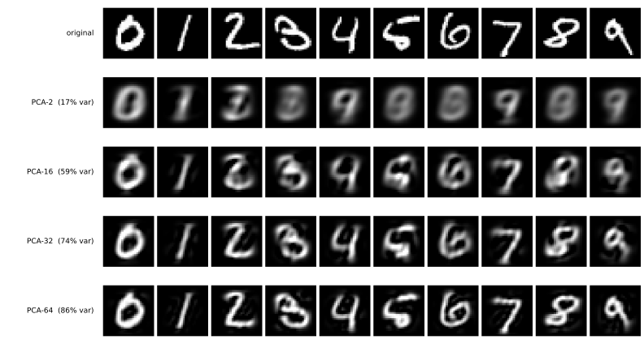

# 되살리는 사다리 — PCA에서 합성곱 자기 부호기까지

[3장](../ch03/index.md)과 [4장](../ch04/index.md)은 **가르는** 법을 배웠다. 이 장은 **만드는** 법을 배운다.

그런데 첫걸음은 만들기가 아니라 **되살리기**다. 그림을 몇 개의 수로 줄였다가 그 수만으로 다시 그려 낼 수 있다면, 그 수들은 그림에 있던 것을 쥐고 있다는 뜻이다. 없던 수를 넣어 없던 그림을 만드는 일은 그다음이다.

---

## 1. 왜 MNIST로 돌아오는가

[4장](../ch04/index.md)은 MNIST가 너무 쉽다며 CIFAR-10으로 옮겨 갔다. 그 판단은 **정확도라는 자**에서 옳았다. 99.02%에 이르면 남은 오차가 1%포인트도 되지 않아 다음 걸음을 잴 수 없었다.

이 장은 자가 다르다. 그리고 그 자에서는 MNIST가 전혀 포화하지 않았다.

| | 4장이 CIFAR-10을 고른 까닭 | 이 장이 MNIST로 돌아온 까닭 |
|---|---|---|
| 재는 것 | 시험 정확도 | 복원 품질, 그리고 나중에는 표본 품질 |
| MNIST의 형편 | 99.02%로 포화 | **눈으로 판정할 수 있는 유일한 자료** |

되살린 그림이 7인지 아닌지는 보면 안다. CIFAR-10에서 32×32짜리 복원은 잘된 것도 갈색 얼룩이고 잘못된 것도 갈색 얼룩이라, 가장 중요한 판정 도구를 잃는다. 게다가 잠재 공간을 2차원으로 두고 그림으로 그리는 일이 MNIST에서만 뜻을 갖는다.

**어느 데이터가 알맞은가는 무엇을 재려느냐가 정한다.** 4장과 이 장이 서로 다른 답을 낸 것이 그 보기다.

---

## 2. 재는 자가 둘이다

**복원 MSE** — 되살린 그림이 원본과 화소 단위로 얼마나 가까운가. 이 사다리가 실제로 최소화하는 값이다.

**같은 숫자로 읽히는 비율** — 되살린 그림을 [3장 4걸음](../ch03/mnist/04_cnn.md)의 합성곱 신경망에 넣어, 원래 라벨과 같게 읽는 비율을 센다. 이 절에서 쓰는 심판은 같은 구조를 같은 규약으로 학습해 **98.83%**를 얻은 것이다.

자를 둘 두는 까닭이 있다. MSE는 "화소가 가깝다"만 말할 뿐 **"3이 아직 3인가"**는 말해 주지 않는다. 뒤에 보겠지만 두 자는 자주 서로 다른 답을 낸다.

!!! note "심판의 98.83%에 대하여"
    [4.1절](../ch04/01_two_ladders.md)이 같은 구조를 씨앗 다섯 개로 재었을 때 98.97~99.30이었다. 여기의 98.83%는 섞는 차례를 따로 고정한 별개의 실행이라 그 범위보다 조금 아래로 나왔다. 3장이 보고한 99.22%를 재현한 값이 아니라 **또 한 번의 뽑기**다.

    심판으로 쓰기에는 넉넉하다. 이 절이 견주는 것은 심판의 절대 성능이 아니라 복원본 사이의 차이이며, 모든 줄이 같은 심판을 쓴다.

---

## 3. 사다리는 3장·4장과 같은 네 걸음이다

| | 분류 사다리 (3·4장) | 이 절의 표현 사다리 |
|---|---|---|
| 1 | 템플릿 — 닫힌 꼴 | **PCA** — 닫힌 꼴 |
| 2 | 선형 + 소프트맥스 | **선형 AE** |
| 3 | 다층 퍼셉트론 | **AE_MLP** |
| 4 | 합성곱 신경망 | **AE_CNN** |

같은 네 생각을 다른 목표에 건다. 라벨은 한 번도 쓰지 않는다.

규약도 그대로다. Adam $10^{-3}$, 묶음 100, 씨앗 42이며, 부호기는 100 에포크를 돈다([4.4절](../ch04/04_dimensionality_reduction.md)에서 20 에포크로는 모자랐던 것을 보았다).

---

## 4. PCA — 닫힌 꼴이라 씨앗이 없다

주성분 분석은 학습하지 않는다. 공분산 행렬을 고유분해하여 분산이 큰 방향 $k$개를 고르면 끝이며, 경사 하강법도 에포크도 씨앗도 없다. **이 사다리의 1걸음에도 오차 막대가 없다** — 3장 템플릿 학습, 4.4절 PCA와 같다.



| | 설명 분산 | 복원 MSE | 같은 숫자로 읽히는 비율 |
|---|---|---|---|
| 원본 (784차원) | 100% | 0 | **98.83%** |
| PCA-2 | 16.8% | 0.5865 | **35.66%** |
| PCA-16 | 59.4% | 0.2830 | 83.69% |
| PCA-32 | 74.4% | 0.1773 | 94.39% |
| PCA-64 | 86.2% | 0.0953 | 97.81% |

그림의 둘째 줄을 보라. PCA-2는 그림을 **흐리게** 만드는 것이 아니라 **다른 숫자로** 만든다. 4는 9가 되고, 5도 9가 되며, 2는 3처럼 보인다.

수로도 그렇다. **35.66%**다. 우연이 10%이니 아주 못 맞히는 것은 아니지만, 원본의 98.83%에서 3분의 2가 날아갔다. **2차원 선형 부분공간은 숫자를 서로 겹쳐 놓는다.**

64개를 쓰면 97.81%로 거의 돌아온다. 784개를 64개로, 곧 12분의 1로 줄이고도 숫자의 정체는 거의 그대로다.

---

## 5. 선형 자기 부호기는 PCA를 다시 찾아낼 뿐이다

2걸음은 같은 일을 경사 하강법으로 한다. 활성화 함수 없이 층 두 개면 된다.

```python
enc = nn.Linear(784, k)      # 활성화가 없다 = 선형
dec = nn.Linear(k, 784)
# 손실은 F.mse_loss(dec(enc(x)), x)
```

| 부호 크기 | | 복원 MSE | 같은 숫자로 |
|---|---|---|---|
| 64 | PCA | **0.09530** | 97.81% |
| 64 | 선형 AE | 0.09587 | 97.80% |
| 2 | PCA | **0.58645** | 35.66% |
| 2 | 선형 AE | 0.58666 | 35.54% |

**두 자 모두에서 같은 값이 나온다.** MSE는 0.6%와 0.04% 차이이고, 숫자 정체는 0.01%포인트와 0.12%포인트 차이다.

당연한 일이다. 활성화가 없는 자기 부호기가 표현할 수 있는 것은 선형 사영뿐이고, 제곱오차를 가장 작게 만드는 $k$차원 선형 사영은 PCA가 주는 것이기 때문이다. 경사 하강법은 `eigh`가 곧장 계산하는 답을 100 에포크에 걸쳐 더듬어 찾은 셈이다.

MSE가 PCA보다 **조금 나쁜** 것도 이치에 맞는다. PCA는 정확한 최적해이고 Adam은 그 근처에서 멈춘다. 만약 선형 AE가 PCA보다 **좋게** 나왔다면 구현이 틀린 것이다.

!!! note "이 확인이 값진 까닭"
    [4.4절](../ch04/04_dimensionality_reduction.md)이 CIFAR-10에서 같은 것을 확인했고, 여기서는 부호 크기 두 가지와 **서로 독립인 자 두 가지**에서 다시 확인된다. 네 번 모두 어긋나지 않는다.

    이론이 주는 값은 이렇게 점검 도구로 쓸 수 있다. 새 자기 부호기를 짰을 때 활성화를 빼고 돌려 PCA와 맞는지 보면, 부호기·복호기·손실·자료 전처리가 모두 제대로 붙었는지를 한 번에 확인할 수 있다.

---

## 6. 비선형성 — 여기서는 크게 번다

3걸음은 부호기와 복호기에 은닉층과 ReLU를 넣는다.

```python
enc = nn.Sequential(nn.Linear(784, 256), nn.ReLU(), nn.Linear(256, k))
dec = nn.Sequential(nn.Linear(k, 256), nn.ReLU(), nn.Linear(256, 784))
```

| 부호 64 | 복원 MSE | 같은 숫자로 |
|---|---|---|
| PCA / 선형 AE | 0.0953 | 97.81% |
| **AE_MLP** | **0.0546** | 98.51% |

**복원 오차가 43% 줄었다.**

여기가 [4.4절](../ch04/04_dimensionality_reduction.md)과 갈리는 자리다. 그 절에서 같은 수법을 CIFAR-10에 걸었을 때는 **아무것도 벌지 못했다**(0.1341 대 PCA의 0.1337). 두 자료의 결이 다르기 때문이다. MNIST의 숫자는 획이 매끄럽게 휘고 굵어지는 **낮은 차원의 굽은 면** 위에 놓여 있어, 곧은 부분공간으로는 잘 맞출 수 없고 굽은 사상으로는 잘 맞출 수 있다. CIFAR-10의 분산은 낮은 주파수의 색이 쥐고 있어 이미 선형으로 충분히 잡히며, 남은 것은 64차원에 담기에 너무 넓다.

!!! warning "완전히 공정한 비교는 아니다"
    4.4절의 깊은 AE는 $3072 \to 512 \to 64$로 48배를 줄였고, 이 절은 $784 \to 256 \to 64$로 12배를 줄인다. 압축률이 네 배 다르므로, 차이가 **자료의 결** 때문인지 **압축률** 때문인지를 이 두 실험만으로는 가를 수 없다. 방향은 뚜렷하지만 원인은 아직 하나로 좁혀지지 않았다.

### 부호가 2일 때 더 또렷하다

| 부호 2 | 복원 MSE | 같은 숫자로 |
|---|---|---|
| PCA / 선형 AE | 0.586 | 35.66% |
| **AE_MLP** | **0.422** | **70.13%** |

MSE로는 28% 나아졌을 뿐인데 **숫자 정체는 두 배 가까이 올랐다**(35.66 → 70.13).

두 자가 같은 것을 재지 않는다는 증거다. 굽은 사상은 화소를 조금 더 가깝게 만드는 데 그치지 않고, **2차원 안에서 숫자들을 서로 떼어 놓는다.** 그것은 MSE가 잘 드러내지 못하는 성질이다.

---

## 7. 합성곱 — 부호가 클 때만 이긴다

4걸음은 부호기를 합성곱으로 바꾼다. 3장 4걸음과 같은 생각이다.

| 부호 64 | 복원 MSE | 부호기 매개변수 | 같은 숫자로 |
|---|---|---|---|
| AE_MLP | 0.0546 | 217,408 | 98.51% |
| **AE_CNN** | **0.0243** | **105,216** | 98.52% |

**매개변수를 절반만 쓰고 복원 오차를 56% 줄인다.** [3장 연습문제 2](../ch03/mnist/04_cnn.md)와 [4.2절 연습문제 2](../ch04/02_vgg16_transfer.md)가 분류에서 재었던 가중치 공유의 효과가, 되살리기에서도 그대로 나온다.

PCA에서 여기까지 오면 복원 오차가 0.0953에서 0.0243으로 **75% 줄었다.** 4.4절의 CIFAR-10 사다리가 부호 64에서 평평했던 것과 정반대다.

### 그런데 부호가 2이면 진다

| 부호 2 | 복원 MSE | 부호기 매개변수 | 같은 숫자로 |
|---|---|---|---|
| AE_MLP | **0.422** | 201,474 | **70.13%** |
| AE_CNN | 0.474 | 7,938 | 61.78% |

순서가 뒤집힌다. 까닭은 두 가지로 보인다. 첫째, 부호가 2이면 합성곱이 살려 온 공간 구조를 **마지막 촘촘한 층이 어차피 뭉개 버린다.** 둘째, 이 구조에서 합성곱 부호기의 매개변수가 25배 적다.

그러므로 "합성곱이 낫다"는 말은 **부호 크기에 딸린 말**이다. 부호 64에서 얻은 결론을 부호 2로 옮기면 틀린다.


---

## 8. 두 자가 서로 다른 말을 한다

부호 64의 네 줄을 두 자로 나란히 보면 순위가 갈린다.

| 부호 64 | 복원 MSE | 같은 숫자로 |
|---|---|---|
| PCA | 0.0953 | 97.81% |
| 선형 AE | 0.0959 | 97.80% |
| AE_MLP | 0.0546 | 98.51% |
| AE_CNN | **0.0243** | 98.52% |

MSE로 보면 AE_CNN이 PCA보다 **네 배** 좋다. 숫자 정체로 보면 **0.71%포인트** 차이뿐이고, AE_MLP와는 0.01%포인트로 사실상 같다.

까닭은 숫자 정체가 이미 **포화**했기 때문이다. 원본조차 98.83%이니 천장이 거기에 있고, 부호 64면 세 방법 모두 그 천장에 닿아 있다. 화소를 더 정확히 맞추는 일이 남아 있을 뿐, 숫자를 알아보는 데에는 더 보탤 것이 없다.

**무엇이 가장 좋은 표현인가는 무엇을 재느냐가 정한다.** 부호 2에서는 두 자가 같은 순서를 주고(AE_MLP가 양쪽 모두 1등), 부호 64에서는 갈린다.

---

## 9. 2차원 잠재 공간 — 그리고 빈 곳

부호를 2로 두면 잠재 공간을 그대로 그림으로 그릴 수 있다. MNIST가 이 장에 알맞은 까닭의 절반이 여기에 있다.


왼쪽 PCA-2는 **한 덩어리**다. 색이 뒤섞여 있어 어디까지가 4이고 어디부터가 9인지 알 수 없다. 35.66%라는 수가 그림으로는 이렇게 보인다.

가운데 AE_MLP-2는 숫자마다 다른 방향으로 갈라져 나간다. 70.13%가 이 갈라짐이다.

오른쪽은 그 잠재 공간을 격자로 훑어 하나하나 복호한 것이다. 가운데 언저리에서는 숫자들이 서로 이어지며 모양이 부드럽게 바뀌고, 바깥으로 가면 뭉개진다.

### 여기서 다음 절의 물음이 나온다

되살리기는 잘된다. 그렇다면 **없던 그림을 만들 수 있는가?**

만들려면 잠재 공간에서 점 하나를 **뽑아** 복호하면 된다. 그런데 어디서 뽑아야 하는가? 가운데 그림을 보면 점들이 고르게 퍼져 있지 않다. 갈래 사이에는 점이 없는 **빈 곳**이 있고, 전체가 어떤 모양으로 퍼져 있는지도 정해진 바가 없다.

**자기 부호기는 부호를 만드는 법을 배웠을 뿐, 부호가 어떻게 분포하는지는 배우지 않았다.** 손실 어디에도 부호를 어떤 모양으로 퍼뜨리라는 요구가 없다.

그렇다면 실제로 뽑아 보면 어떻게 되는가? 부호의 평균과 표준편차에 맞춘 정규분포에서 뽑아 심판에게 물어보면 된다. [다음 절](02_vae.md)이 그것을 먼저 재고, 답이 **부호의 크기에 딸려 있음**을 보인다. 위의 2차원 그림에서 짐작하는 것과 64차원에서 실제로 벌어지는 일이 다르며, 변분 자기 부호기가 고치는 것도 그 가운데 한쪽이다.

---

## 연습문제

<div class="drillbox" markdown>

**연습문제 1.** <span class="diff easy" title="쉬움"></span>
선형 AE의 복원 MSE가 PCA보다 **낮게** 나왔다면 무엇을 의심해야 하는가?

</div>

??? success "연습문제 1 풀이"
    **구현이 틀렸다고 의심해야 한다.**

    부호 크기가 $k$일 때 제곱오차를 가장 작게 만드는 선형 사영은 상위 $k$개 주성분이 이루는 부분공간이며, 이는 증명된 사실이다. 활성화가 없는 자기 부호기가 나타낼 수 있는 것은 선형 사영뿐이므로 그보다 잘할 수 없다.

    흔한 원인은 이렇다. 어딘가에 활성화가 남아 있거나(정말로 선형인지), MSE를 서로 다른 자료에서 쟀거나(한쪽은 학습, 한쪽은 시험), 정규화·중심화가 서로 달랐거나.

    본문에서 부호 2와 64, 자 두 가지로 네 번 확인한 까닭이 이것이다. 이론값은 **공짜로 얻는 점검 도구**다.

---

<div class="drillbox" markdown>

**연습문제 2.** <span class="diff normal" title="중간"></span>
부호 64에서 AE_CNN은 AE_MLP보다 MSE가 56% 낮은데 숫자 정체는 0.01%포인트밖에 좋지 않다. 이 둘이 어긋나는 까닭을 설명하고, 어긋남이 사라지게 하려면 실험을 어떻게 바꾸어야 할지 말하라.

</div>

??? success "연습문제 2 풀이"
    **숫자 정체가 포화했기 때문이다.** 원본조차 98.83%이므로 천장이 거기이고, 부호 64면 세 방법이 모두 98% 언저리에 닿아 더 오를 자리가 없다. 남은 차이는 획의 굵기나 테두리의 매끄러움처럼 **심판이 신경 쓰지 않는** 화소의 차이다.

    어긋남을 드러내려면 **천장을 낮추면 된다.** 부호를 2나 4로 줄이면 두 자 모두 포화에서 벗어나고, 실제로 부호 2에서는 순위가 갈린다(AE_MLP 70.13% 대 AE_CNN 61.78%).

    다른 방법도 있다. 심판을 더 까다롭게 만드는 것이다. 맞혔는지가 아니라 **심판의 확신도**를 재면 98% 언저리에서도 차이가 남는다. 뒤의 절들이 표본을 잴 때 이 방법을 쓴다.

---

<div class="drillbox" markdown>

**연습문제 3.** <span class="diff normal" title="중간"></span>
PCA-2는 4를 9로, 5도 9로 되살린다. 어떤 숫자 짝이 서로 잘 섞이는지 알아보려면 무엇을 재면 되는가?

</div>

??? success "연습문제 3 풀이"
    **혼동 행렬을 만들면 된다.** 복원본을 심판에 넣되 맞은 비율만 세지 말고, 원래 라벨 $i$가 어떤 라벨 $j$로 읽혔는지를 $10 \times 10$ 표에 쌓는다.

    ```python
    conf = torch.zeros(10, 10)
    for true, pred in zip(yte, judge(rec).argmax(1)):
        conf[true, pred] += 1
    ```

    이 표가 알려 주는 것은 PCA의 성질이다. 주성분 2개가 쥐고 있는 것은 분산이 가장 큰 두 방향이고, 그 방향에서 값이 비슷한 숫자들은 같은 자리로 모인다. 4와 9가 섞이는 까닭은 둘 다 위쪽이 닫히거나 열린 고리에 세로획이 붙은 모양이라, 전체 밝기 분포가 닮았기 때문이다.

    같은 표를 AE_MLP-2에도 만들어 견주면, 비선형 사상이 **어떤 짝을 떼어 놓는 데 성공했는지**가 드러난다.

---

<div class="drillbox" markdown>

**연습문제 4.** <span class="diff hard" title="어려움"></span>
본문은 자기 부호기가 "부호가 어떻게 분포하는지는 배우지 않았다"고 했다. 이 주장을 확인하는 실험을 설계하라. 그리고 그 실험이 왜 **표본을 만드는 일**에 결정적인지 말하라.

</div>

??? success "연습문제 4 풀이"
    **잠재 공간에서 아무렇게나 뽑아 복호해 보면 된다.**

    ```python
    z = torch.randn(1000, 2) * ae_z.std(0) + ae_z.mean(0)   # 대충 비슷한 범위에서
    samples = ae.dec(z)
    ```

    그러고 나서 심판에 넣어 **확신도**를 본다. 진짜 숫자라면 심판이 한 클래스에 0.9 넘는 확률을 줄 것이고, 숫자가 아닌 얼룩이라면 여러 클래스에 어정쩡하게 퍼진 확률을 줄 것이다.

    그럴듯한 짐작은 갈래 사이의 빈 곳에서 뽑은 점이 어느 숫자도 아닌 것으로 복호되리라는 것이다. 다만 [다음 절](02_vae.md)이 실제로 재어 보면 2차원에서는 이 짐작이 빗나간다. 자기 부호기의 손실에는 **부호를 어떤 모양으로 퍼뜨리라는 요구가 전혀 없다.** 되살리기만 잘하면 되므로, 학습 자료가 놓인 자리만 잘 덮어 두고 나머지는 아무래도 좋다.

    이것이 표본을 만드는 일에 결정적인 까닭은 이렇다. 만들기란 **잠재 공간에서 뽑아 복호하는 일**인데, 뽑을 분포를 모르면 시작할 수가 없다. 되살리기를 아무리 잘해도 만들지는 못한다.

    변분 자기 부호기는 손실에 항을 하나 더해 **부호가 미리 정한 분포를 따르도록** 밀어붙인다. 그러면 그 분포에서 뽑으면 된다. 그 이야기가 [다음 절](02_vae.md)이다.
