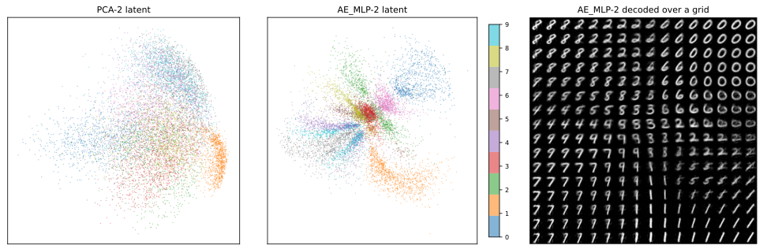

# AE_MLP — 비선형성, 여기서는 크게 번다

3걸음은 인코더와 디코더에 은닉층과 ReLU를 넣는다. [2걸음](02_ae_linear.md)이 막혀 있던 선형이라는 벽을 넘는다.

```python
"""3걸음: 비선형 오토인코더.

mnist_judge.pt는 5.1절 첫 쪽에서 학습해 둔 것을 읽어 쓴다.
규약은 이 장 전체와 같다. Adam 1e-3, 배치 100, 씨앗 42, 인코더 100 에포크.
"""

import torch
import torch.nn as nn
import torch.nn.functional as F
import torch.optim as optim
from torch.utils.data import DataLoader, TensorDataset
import torchvision
import torchvision.transforms as transforms

SEED, BATCH, LR, AE_EPOCHS = 42, 100, 1e-3, 100
device = torch.device("mps" if torch.backends.mps.is_available() else "cpu")

tf = transforms.Compose([transforms.ToTensor(),
                         transforms.Normalize((0.1307,), (0.3081,))])
tr_ds = torchvision.datasets.MNIST("./data", train=True, download=True, transform=tf)
te_ds = torchvision.datasets.MNIST("./data", train=False, download=True, transform=tf)


def materialize(ds):
    xs, ys = [], []
    for x, y in DataLoader(ds, batch_size=2000, shuffle=False):
        xs.append(x); ys.append(y)
    return torch.cat(xs), torch.cat(ys)


Xtr_img, _ = materialize(tr_ds)
Xte_img, yte = materialize(te_ds)
Xtr, Xte = Xtr_img.flatten(1), Xte_img.flatten(1)


class JudgeCNN(nn.Module):
    def __init__(self):
        super().__init__()
        self.conv1 = nn.Conv2d(1, 32, 3, padding=1)
        self.conv2 = nn.Conv2d(32, 64, 3, padding=1)
        self.pool = nn.MaxPool2d(2, 2); self.dropout = nn.Dropout(0.25)
        self.fc1 = nn.Linear(64 * 7 * 7, 128); self.fc2 = nn.Linear(128, 10)

    def forward(self, x):
        x = self.pool(torch.relu(self.conv1(x)))
        x = self.pool(torch.relu(self.conv2(x)))
        return self.fc2(self.dropout(torch.relu(self.fc1(x.flatten(1)))))


judge = JudgeCNN().to(device)
judge.load_state_dict(torch.load("mnist_judge.pt", weights_only=True))
judge.eval()


@torch.no_grad()
def identity(flat):
    pred = torch.cat([judge(flat[i:i + 1000].reshape(-1, 1, 28, 28).to(device))
                      .argmax(1).cpu() for i in range(0, len(flat), 1000)])
    return 100.0 * (pred == yte).float().mean().item()


def train_ae(model, X):
    """되살리기만 배운다. 라벨은 한 번도 쓰지 않는다."""
    torch.manual_seed(SEED)
    model = model.to(device)
    opt = optim.Adam(model.parameters(), lr=LR)
    g = torch.Generator().manual_seed(SEED)
    loader = DataLoader(TensorDataset(X), batch_size=BATCH, shuffle=True, generator=g)
    for _ in range(AE_EPOCHS):
        model.train()
        for (xb,) in loader:
            xb = xb.to(device)
            opt.zero_grad()
            F.mse_loss(model(xb), xb).backward()
            opt.step()
    return model.eval()


@torch.no_grad()
def reconstruct(model, X):
    return torch.cat([model(X[i:i + 1000].to(device)).cpu()
                      for i in range(0, len(X), 1000)])


# === 3걸음: 은닉층과 ReLU를 넣는다 ==========================================
class MLPAE(nn.Module):
    def __init__(self, k):
        super().__init__()
        self.enc = nn.Sequential(nn.Linear(784, 256), nn.ReLU(), nn.Linear(256, k))
        self.dec = nn.Sequential(nn.Linear(k, 256), nn.ReLU(), nn.Linear(256, 784))

    def forward(self, x):
        return self.dec(self.enc(x))


for k in (64, 2):
    m = train_ae(MLPAE(k), Xtr)
    rec = reconstruct(m, Xte)
    enc_p = sum(p.numel() for p in m.enc.parameters())
    print(f"  ae_mlp{k:<2d}  복원 MSE {((rec - Xte) ** 2).mean():.5f}  "
          f"인코더 {enc_p:,}  같은 숫자로 {identity(rec):.2f}%")
    if k == 64:
        torch.save(m.state_dict(), "mnist_ae_mlp64.pt")   # 5.3절이 읽어 쓴다
    if k == 2:                                  # 잠재 공간 그림에 쓸 좌표
        with torch.no_grad():
            z = torch.cat([m.enc(Xte[i:i + 1000].to(device)).cpu()
                           for i in range(0, len(Xte), 1000)])
        torch.save((z, yte), "mnist_ae_mlp2_latent.pt")
```

**출력:**

```
  ae_mlp64  복원 MSE 0.05462  인코더 217,408  같은 숫자로 98.51%
  ae_mlp2   복원 MSE 0.42230  인코더 201,474  같은 숫자로 70.13%
```

| 부호 64 | 복원 MSE | 같은 숫자로 |
|---|---|---|
| PCA / AE_Linear | 0.0953 | 97.81% |
| **AE_MLP** | **0.0546** | 98.51% |

**복원 오차가 43% 줄었다.**

---

## 1. CIFAR-10에서는 이러지 않았다

여기가 [4.5절](../../ch04/05_dimensionality_reduction.md)과 갈리는 자리다. 그 절에서 같은 수법을 CIFAR-10에 걸었을 때는 **아무것도 벌지 못했다**(0.1341 대 PCA의 0.1337).

두 자료의 결이 다르기 때문이다. MNIST의 숫자는 획이 매끄럽게 휘고 굵어지는 **낮은 차원의 굽은 면** 위에 놓여 있어, 곧은 부분공간으로는 잘 맞출 수 없고 굽은 사상으로는 잘 맞출 수 있다. CIFAR-10의 분산은 낮은 주파수의 색이 쥐고 있어 이미 선형으로 충분히 잡히며, 남은 것은 64차원에 담기에 너무 넓다.

!!! warning "완전히 공정한 비교는 아니다"
    4.5절의 깊은 AE는 $3072 \to 512 \to 64$로 48배를 줄였고, 이 절은 $784 \to 256 \to 64$로 12배를 줄인다. 압축률이 네 배 다르므로, 차이가 **자료의 결** 때문인지 **압축률** 때문인지를 이 두 실험만으로는 가를 수 없다. 방향은 뚜렷하지만 원인은 아직 하나로 좁혀지지 않았다.

---

## 2. 부호가 2일 때 더 또렷하다

| 부호 2 | 복원 MSE | 같은 숫자로 |
|---|---|---|
| PCA / AE_Linear | 0.586 | 35.66% |
| **AE_MLP** | **0.422** | **70.13%** |

MSE로는 28% 나아졌을 뿐인데 **숫자 정체는 두 배 가까이 올랐다**(35.66 → 70.13).

두 자가 같은 것을 재지 않는다는 증거다. 굽은 사상은 화소를 조금 더 가깝게 만드는 데 그치지 않고, **2차원 안에서 숫자들을 서로 떼어 놓는다.** 그것은 MSE가 잘 드러내지 못하는 성질이다.

---

## 3. 2차원 잠재 공간을 그려 보면

부호를 2로 두면 잠재 공간을 그대로 그림으로 그릴 수 있다. MNIST가 이 장에 알맞은 까닭의 절반이 여기에 있다.



왼쪽 [PCA-2](01_pca.md)는 **한 덩어리**다. 색이 뒤섞여 있어 어디까지가 4이고 어디부터가 9인지 알 수 없다. 35.66%라는 수가 그림으로는 이렇게 보인다.

가운데 AE_MLP-2는 숫자마다 다른 방향으로 갈라져 나간다. **70.13%가 이 갈라짐이다.**

오른쪽은 그 잠재 공간을 격자로 훑어 하나하나 복호한 것이다. 가운데 언저리에서는 숫자들이 서로 이어지며 모양이 부드럽게 바뀌고, 바깥으로 가면 뭉개진다.

---

## 4. 여기서 다음 장의 물음이 나온다

되살리기는 잘된다. 그렇다면 **없던 그림을 만들 수 있는가?**

만들려면 잠재 공간에서 점 하나를 **뽑아** 복호하면 된다. 그런데 어디서 뽑아야 하는가? 위 그림을 보면 점들이 고르게 퍼져 있지 않다. 갈래 사이에는 점이 없는 **빈 곳**이 있고, 전체가 어떤 모양으로 퍼져 있는지도 정해진 바가 없다.

**오토인코더는 부호를 만드는 법을 배웠을 뿐, 부호가 어떻게 분포하는지는 배우지 않았다.** 손실 어디에도 부호를 어떤 모양으로 퍼뜨리라는 요구가 없다.

그렇다면 실제로 뽑아 보면 어떻게 되는가? [5.2절](../latent_generative/index.md)이 그것을 먼저 재고, 답이 **부호의 크기에 딸려 있음**을 보인다. 위의 2차원 그림에서 짐작하는 것과 64차원에서 실제로 벌어지는 일이 다르다.

---

## 연습문제

<div class="drillbox" markdown>

**연습문제 1.** <span class="diff normal" title="중간"></span>
부호 2에서 MSE는 28%만 좋아졌는데 숫자 정체는 두 배가 되었다. 이 어긋남이 무엇을 뜻하는지 설명하라.

</div>

??? success "연습문제 1 풀이"
    **두 자가 서로 다른 것을 재기 때문이다.**

    MSE는 화소 하나하나가 얼마나 가까운지를 더한다. 획이 한 화소 옆으로 밀리면 그 자리와 원래 자리 양쪽에서 벌을 받아 MSE가 꽤 커지지만, 사람이나 심판이 보기에는 같은 숫자다.

    반대로 고리가 닫혔는지 열렸는지는 화소 몇 개만 바뀌면 되므로 MSE는 거의 안 움직이는데, 4가 9로 바뀌어 정체는 완전히 달라진다.

    곧 **MSE가 크게 치는 오차와 정체를 바꾸는 오차가 서로 다르다.** 비선형 인코더가 잘한 일은 후자 쪽, 곧 숫자를 가르는 데 중요한 것을 2차원 안에 밀어 넣은 것이다.

    이것이 생성 모델을 화소 손실로만 평가하면 안 되는 까닭이기도 하며, [5.3절](../generative/index.md)이 그 이야기를 더 끌고 간다.

---

<div class="drillbox" markdown>

**연습문제 2.** <span class="diff normal" title="중간"></span>
본문 그림의 오른쪽 판은 잠재 공간을 격자로 훑어 복호한 것이다. 이 그림에서 **부호 2가 왜 모자란지**를 읽어 낼 수 있는가?

</div>

??? success "연습문제 2 풀이"
    격자 그림에서 숫자들이 **서로 이어져 있다**는 점을 보라. 한 숫자에서 다른 숫자로 건너가는 사이에 어느 쪽도 아닌 모양이 놓인다.

    2차원 평면 위에 열 가지 숫자를 놓으면서 서로 닿지 않게 할 방법이 없기 때문이다. 평면에서 열 개의 영역을 나누면 반드시 경계가 생기고, 경계 위의 점은 복호했을 때 애매한 모양이 된다.

    70.13%라는 수의 나머지 30%가 대체로 그 경계에서 나온다. 차원을 늘리면 영역들이 서로 멀리 떨어질 자리가 생겨 이 문제가 줄어들고, 실제로 부호 64에서는 98.51%가 된다.

    다만 차원을 늘리면 **다른 문제가 생긴다.** 넓은 공간에 자료가 성기게 놓여, 아무 데서나 뽑으면 자료가 없는 자리에 떨어진다. [5.2절](../latent_generative/index.md)이 그것을 잰다.
