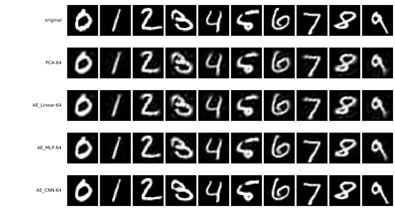

# AE_CNN — 부호가 클 때만 이긴다

4걸음은 인코더를 합성곱으로 바꾼다. [3장 3걸음 → 4걸음](../../ch03/mnist/04_cnn.md)과 같은 생각이며, 다만 가르기가 아니라 되살리기에 건다.

```python
"""4걸음: 합성곱 오토인코더.

mnist_judge.pt는 5.1절 첫 쪽에서 학습해 둔 것을 읽어 쓴다.
규약은 이 장 전체와 같다. Adam 1e-3, 배치 100, 씨앗 42, 인코더 100 에포크.
"""

import torch
import torch.nn as nn
import torch.nn.functional as F
import torch.optim as optim
from torch.utils.data import DataLoader, TensorDataset
import torchvision
import torchvision.transforms as transforms

SEED, BATCH, LR, AE_EPOCHS = 42, 100, 1e-3, 100
device = torch.device("mps" if torch.backends.mps.is_available() else "cpu")

tf = transforms.Compose([transforms.ToTensor(),
                         transforms.Normalize((0.1307,), (0.3081,))])
tr_ds = torchvision.datasets.MNIST("./data", train=True, download=True, transform=tf)
te_ds = torchvision.datasets.MNIST("./data", train=False, download=True, transform=tf)


def materialize(ds):
    xs, ys = [], []
    for x, y in DataLoader(ds, batch_size=2000, shuffle=False):
        xs.append(x); ys.append(y)
    return torch.cat(xs), torch.cat(ys)


Xtr_img, _ = materialize(tr_ds)
Xte_img, yte = materialize(te_ds)
Xtr, Xte = Xtr_img.flatten(1), Xte_img.flatten(1)


class JudgeCNN(nn.Module):
    def __init__(self):
        super().__init__()
        self.conv1 = nn.Conv2d(1, 32, 3, padding=1)
        self.conv2 = nn.Conv2d(32, 64, 3, padding=1)
        self.pool = nn.MaxPool2d(2, 2); self.dropout = nn.Dropout(0.25)
        self.fc1 = nn.Linear(64 * 7 * 7, 128); self.fc2 = nn.Linear(128, 10)

    def forward(self, x):
        x = self.pool(torch.relu(self.conv1(x)))
        x = self.pool(torch.relu(self.conv2(x)))
        return self.fc2(self.dropout(torch.relu(self.fc1(x.flatten(1)))))


judge = JudgeCNN().to(device)
judge.load_state_dict(torch.load("mnist_judge.pt", weights_only=True))
judge.eval()


@torch.no_grad()
def identity(flat):
    pred = torch.cat([judge(flat[i:i + 1000].reshape(-1, 1, 28, 28).to(device))
                      .argmax(1).cpu() for i in range(0, len(flat), 1000)])
    return 100.0 * (pred == yte).float().mean().item()


def train_ae(model, X):
    """되살리기만 배운다. 라벨은 한 번도 쓰지 않는다."""
    torch.manual_seed(SEED)
    model = model.to(device)
    opt = optim.Adam(model.parameters(), lr=LR)
    g = torch.Generator().manual_seed(SEED)
    loader = DataLoader(TensorDataset(X), batch_size=BATCH, shuffle=True, generator=g)
    for _ in range(AE_EPOCHS):
        model.train()
        for (xb,) in loader:
            xb = xb.to(device)
            opt.zero_grad()
            F.mse_loss(model(xb), xb).backward()
            opt.step()
    return model.eval()


@torch.no_grad()
def reconstruct(model, X):
    return torch.cat([model(X[i:i + 1000].to(device)).cpu()
                      for i in range(0, len(X), 1000)])


# === 4걸음: 인코더를 합성곱으로 =============================================
class ConvAE(nn.Module):
    """합성곱으로 줄이고 마지막에만 k차원으로 좁힌다."""

    def __init__(self, k):
        super().__init__()
        self.enc = nn.Sequential(
            nn.Conv2d(1, 16, 3, padding=1), nn.ReLU(), nn.MaxPool2d(2),   # 14
            nn.Conv2d(16, 32, 3, padding=1), nn.ReLU(), nn.MaxPool2d(2),  # 7
            nn.Flatten(), nn.Linear(32 * 7 * 7, k))
        self.dec = nn.Sequential(
            nn.Linear(k, 32 * 7 * 7), nn.ReLU(), nn.Unflatten(1, (32, 7, 7)),
            nn.ConvTranspose2d(32, 16, 2, stride=2), nn.ReLU(),
            nn.ConvTranspose2d(16, 1, 2, stride=2))

    def forward(self, x):
        return self.dec(self.enc(x))


for k in (64, 2):
    # 합성곱은 펼치지 않은 (N, 1, 28, 28)을 받는다
    m = train_ae(ConvAE(k), Xtr_img)
    rec = reconstruct(m, Xte_img)
    enc_p = sum(p.numel() for p in m.enc.parameters())
    print(f"  ae_conv{k:<2d}  복원 MSE {((rec - Xte_img) ** 2).mean():.5f}  "
          f"인코더 {enc_p:,}  같은 숫자로 {identity(rec.flatten(1)):.2f}%")
```

**출력:**

```
  ae_conv64  복원 MSE 0.02427  인코더 105,216  같은 숫자로 98.52%
  ae_conv2   복원 MSE 0.47423  인코더 7,938  같은 숫자로 61.78%
```

| 부호 64 | 복원 MSE | 인코더 매개변수 | 같은 숫자로 |
|---|---|---|---|
| [AE_MLP](03_ae_mlp.md) | 0.0546 | 217,408 | 98.51% |
| **AE_CNN** | **0.0243** | **105,216** | 98.52% |

**매개변수를 절반만 쓰고 복원 오차를 56% 줄인다.** [3장 연습문제 2](../../ch03/mnist/04_cnn.md)와 [4.3절 연습문제 2](../../ch04/03_vgg16_transfer.md)가 분류에서 재었던 가중치 공유의 효과가, 되살리기에서도 그대로 나온다.

[PCA](01_pca.md)에서 여기까지 오면 복원 오차가 0.0953에서 0.0243으로 **75% 줄었다.** [4.5절](../../ch04/05_dimensionality_reduction.md)의 CIFAR-10 사다리가 부호 64에서 평평했던 것과 정반대다.



---

## 1. 그런데 부호가 2이면 진다

| 부호 2 | 복원 MSE | 인코더 매개변수 | 같은 숫자로 |
|---|---|---|---|
| [AE_MLP](03_ae_mlp.md) | **0.422** | 201,474 | **70.13%** |
| AE_CNN | 0.474 | 7,938 | 61.78% |

**순서가 뒤집힌다.** 까닭은 두 가지로 보인다.

**첫째, 마지막 촘촘한 층이 공간 구조를 어차피 뭉갠다.** 합성곱이 $(32, 7, 7)$까지 이웃 관계를 살려 왔더라도, 그것을 2개의 수로 줄이는 것은 촘촘한 층이다. 부호가 2이면 그 층이 병목이라 앞쪽의 수고가 전달되지 않는다.

**둘째, 이 구조에서 합성곱 인코더의 매개변수가 25배 적다**(7,938 대 201,474). 부호가 64일 때는 그 적음이 장점이었지만, 부호가 2여서 표현력이 이미 빠듯한 자리에서는 손해가 된다.

그러므로 **"합성곱이 낫다"는 말은 부호 크기에 딸린 말이다.** 부호 64에서 얻은 결론을 부호 2로 옮기면 틀린다.

---

## 2. 두 자가 서로 다른 말을 한다

네 걸음을 두 자로 나란히 보면 순위가 갈린다.

| 부호 64 | 복원 MSE | 같은 숫자로 |
|---|---|---|
| [PCA](01_pca.md) | 0.0953 | 97.81% |
| [AE_Linear](02_ae_linear.md) | 0.0959 | 97.80% |
| [AE_MLP](03_ae_mlp.md) | 0.0546 | 98.51% |
| AE_CNN | **0.0243** | 98.52% |

MSE로 보면 AE_CNN이 PCA보다 **네 배** 좋다. 숫자 정체로 보면 **0.71%포인트** 차이뿐이고, AE_MLP와는 0.01%포인트로 사실상 같다.

까닭은 숫자 정체가 이미 **포화**했기 때문이다. 원본조차 98.83%이니 천장이 거기에 있고, 부호 64면 세 방법 모두 그 천장에 닿아 있다. 화소를 더 정확히 맞추는 일이 남아 있을 뿐, 숫자를 알아보는 데에는 더 보탤 것이 없다.

**무엇이 가장 좋은 표현인가는 무엇을 재느냐가 정한다.** 부호 2에서는 두 자가 같은 순서를 주고(AE_MLP가 양쪽 모두 1등), 부호 64에서는 갈린다.

---

## 3. 네 걸음을 돌아보며

| 걸음 | 더한 생각 | 부호 64 MSE | 앞 칸 대비 |
|---|---|---|---|
| [1 PCA](01_pca.md) | 없음 — 닫힌 꼴 | 0.0953 | — |
| [2 AE_Linear](02_ae_linear.md) | 경사 하강법 | 0.0959 | **+0.6%** (지고 있다) |
| [3 AE_MLP](03_ae_mlp.md) | 비선형성 | 0.0546 | −43% |
| 4 AE_CNN | 이웃 관계 | **0.0243** | −56% |

2걸음이 아무것도 못 벌고 3·4걸음이 크게 번다. [분류 사다리](../../ch04/01_two_ladders.md)가 +9.46 → +13.85 → +20.78로 고르게 올랐던 것과 모양이 다르다.

그리고 되살리기는 여기서 끝이다. 다음 물음은 [AE_MLP 절](03_ae_mlp.md)이 남긴 것이다. **되살릴 수 있다면 만들 수도 있는가?** [5.2절](../latent_generative/index.md)이 답한다.

---

## 연습문제

<div class="drillbox" markdown>

**연습문제 1.** <span class="diff med" title="중간"></span>
부호 64에서 AE_CNN은 AE_MLP보다 MSE가 56% 낮은데 숫자 정체는 0.01%포인트밖에 좋지 않다. 이 둘이 어긋나는 까닭을 설명하고, 어긋남이 사라지게 하려면 실험을 어떻게 바꾸어야 할지 말하라.

</div>

??? success "연습문제 1 풀이"
    **숫자 정체가 포화했기 때문이다.** 원본조차 98.83%이므로 천장이 거기이고, 부호 64면 세 방법이 모두 98% 언저리에 닿아 더 오를 자리가 없다. 남은 차이는 획의 굵기나 테두리의 매끄러움처럼 **심판이 신경 쓰지 않는** 화소의 차이다.

    어긋남을 드러내려면 **천장을 낮추면 된다.** 부호를 2나 4로 줄이면 두 자 모두 포화에서 벗어나고, 실제로 부호 2에서는 순위가 갈린다(AE_MLP 70.13% 대 AE_CNN 61.78%).

    다른 방법도 있다. 심판을 더 까다롭게 만드는 것이다. 맞혔는지가 아니라 **심판의 확신도**를 재면 98% 언저리에서도 차이가 남는다. [5.2절](../latent_generative/index.md)과 [5.3절](../generative/index.md)이 표본을 잴 때 이 방법을 쓴다.

---

<div class="drillbox" markdown>

**연습문제 2.** <span class="diff hard" title="어려움"></span>
본문은 부호 2에서 합성곱이 지는 까닭을 두 가지로 짐작했다. 둘 가운데 어느 쪽이 맞는지 가르는 실험을 설계하라.

</div>

??? success "연습문제 2 풀이"
    두 짐작은 **병목 층 탓**과 **매개변수 수 탓**이었다. 가르려면 하나를 고정하고 다른 하나만 바꾸면 된다.

    **매개변수를 맞추어 본다.** 합성곱 인코더의 채널을 늘려(16, 32 → 64, 128) 매개변수를 AE_MLP와 비슷하게 만든 뒤 부호 2에서 다시 잰다. 그래도 진다면 매개변수 탓이 아니다.

    **병목을 없애 본다.** 부호를 2가 아니라 $(2, 7, 7)$처럼 **공간을 지닌 모양**으로 두면 마지막 촘촘한 층이 사라진다. 수의 개수는 98개로 늘지만, 공간 구조가 병목을 통과하는지를 볼 수 있다. [4.5절](../../ch04/05_dimensionality_reduction.md)이 CIFAR-10에서 같은 것을 재었고, 납작한 머리와 공간 머리가 10.53%포인트 갈렸다.

    한 가지 더 두면 좋다. **AE_MLP의 매개변수를 합성곱 수준으로 줄이는** 대조군이다. 은닉층을 256에서 8로 줄이면 매개변수가 비슷해진다. 세 실험을 합치면 두 원인의 몫을 나눌 수 있다.

    이런 식으로 원인을 좁혀 가는 것이 [4.7절](../../ch04/07_distillation.md)의 대조군과 같은 생각이다. 본문이 "두 가지로 보인다"고만 적고 단정하지 않은 까닭도 이 실험을 하지 않았기 때문이다.
