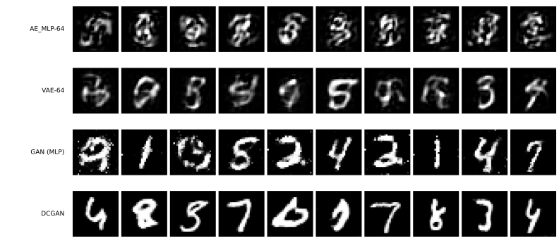

# 적대적 생성모델 — 전체 그림

[5.2절](../latent_generative/index.md)의 VAE는 뽑을 수 있는 잠재 공간을 얻었지만 표본이 흐릿했다. 이 절은 그 흐릿함이 **어디서 오는지** 짚고, 손실을 바꾸어 없앤다.

그 전에 5.2절이 스스로 인정한 빈틈부터 메운다.

---

## 1. 자를 하나 더 만든다

5.2절은 **고름**으로 모드 붕괴를 쟀다. 표본 5,000장을 심판에 넣어 열 가지가 고르게 나오는지 보는 자다. 그런데 [β-VAE 쪽](../latent_generative/02_beta_vae.md)이 이런 경고를 적었다.

> 숫자 열 가지를 딱 한 가지 모양씩만, 늘 똑같이 그려 내는 모델은 확신도도 고름도 만점이다.

고름은 클래스 **사이**의 다양함만 본다. 클래스 **안**에서 같은 것만 찍어 내는 붕괴는 보지 못한다. GAN이 무너지는 대표적인 방식이 바로 그것이므로, 이 절에는 자가 하나 더 필요하다.

$$
\text{클래스 안 다양함} = \frac{\text{같은 숫자로 읽힌 표본들의 화소 분산}}{\text{진짜 자료의 같은 숫자 안 화소 분산}}
$$

**분모가 있어야 뜻이 생긴다.** 화소 분산 0.05라는 수는 그 자체로 아무 말도 하지 않지만, 진짜 MNIST의 같은 값으로 나누면 1.00이 기준이 된다. 1에 가까우면 진짜만큼 다양하고, 0.5면 절반만 다양하다는 뜻이다. 진짜 시험 자료로 재면 0.05272이며, 이것이 모든 줄의 분모다.

### 앞 절 모델들을 새 자로 다시 재면

```python
"""5.3절의 새 자: 클래스 안 다양함. 그리고 앞 절 모델을 그 자로 다시 잰다.

mnist_judge.pt는 5.1절에서 학습해 둔 것을 읽어 쓴다.
GAN은 [-1, 1]로 두고 tanh로 내놓으므로, 심판에 넣기 전에 정규화를 되돌린다.
"""

import time

import torch
import torch.nn as nn
import torch.optim as optim
from torch.utils.data import DataLoader, TensorDataset
import torchvision
import torchvision.transforms as transforms

SEED, BATCH, ZDIM, EPOCHS = 42, 100, 64, 30
N_SAMPLE = 5000
JM, JS = 0.1307, 0.3081                 # 심판이 기대하는 정규화
device = torch.device("mps" if torch.backends.mps.is_available() else "cpu")

# 이 절만 [-1, 1]을 쓴다 — 생성기가 tanh로 내놓기 때문이다
tf = transforms.Compose([transforms.ToTensor(),
                         transforms.Normalize((0.5,), (0.5,))])
tr = torchvision.datasets.MNIST("./data", train=True, download=True, transform=tf)
te = torchvision.datasets.MNIST("./data", train=False, download=True, transform=tf)
Xtr = torch.cat([x for x, _ in DataLoader(tr, batch_size=2000, shuffle=False)])
Xte = torch.cat([x for x, _ in DataLoader(te, batch_size=2000, shuffle=False)])
yte = torch.cat([y for _, y in DataLoader(te, batch_size=2000, shuffle=False)])


class JudgeCNN(nn.Module):
    def __init__(self):
        super().__init__()
        self.conv1 = nn.Conv2d(1, 32, 3, padding=1)
        self.conv2 = nn.Conv2d(32, 64, 3, padding=1)
        self.pool = nn.MaxPool2d(2, 2); self.dropout = nn.Dropout(0.25)
        self.fc1 = nn.Linear(64 * 7 * 7, 128); self.fc2 = nn.Linear(128, 10)

    def forward(self, x):
        x = self.pool(torch.relu(self.conv1(x)))
        x = self.pool(torch.relu(self.conv2(x)))
        return self.fc2(self.dropout(torch.relu(self.fc1(x.flatten(1)))))


judge = JudgeCNN().to(device)
judge.load_state_dict(torch.load("mnist_judge.pt", weights_only=True))
judge.eval()


@torch.no_grad()
def predict(x_pm1):
    """[-1,1] -> [0,1] -> 심판 정규화 -> 심판."""
    xj = (((x_pm1 + 1) / 2) - JM) / JS
    p = torch.cat([torch.softmax(judge(xj[i:i + 1000].to(device)), 1).cpu()
                   for i in range(0, len(xj), 1000)])
    conf, pred = p.max(1)
    return conf, pred


def within_class_var(imgs01, group, min_n=20):
    """같은 클래스로 묶인 것들의 화소 분산을, 무리 크기로 가중해 평균낸다."""
    vs, ws = [], []
    for d in range(10):
        g = imgs01[group == d]
        if len(g) < min_n:
            continue
        vs.append(g.flatten(1).var(0).mean().item()); ws.append(len(g))
    return sum(v * w for v, w in zip(vs, ws)) / sum(ws) if vs else 0.0


# 진짜 자료의 기준선 — 여기서는 심판이 아니라 진짜 라벨로 묶는다
REAL_VAR = within_class_var((Xte + 1) / 2, yte)


def evaluate(samples_pm1, tag):
    conf, pred = predict(samples_pm1)
    share = torch.bincount(pred, minlength=10).float()
    share = share / share.sum()
    nz = share[share > 0]
    bal = (-(nz * nz.log()).sum() / torch.tensor(10.0).log()).item()
    wv = within_class_var((samples_pm1 + 1) / 2, pred)
    print(f"  {tag:14s} 확신도 {conf.mean():.3f}  고름 {bal:.3f}  "
          f"최대몫 {share.max():.3f}  클래스안 다양함 {wv / REAL_VAR:.3f}", flush=True)


# === 앞 절 모델을 새 자로 다시 잰다 =========================================
class MLPAE(nn.Module):
    def __init__(self, k):
        super().__init__()
        self.enc = nn.Sequential(nn.Linear(784, 256), nn.ReLU(), nn.Linear(256, k))
        self.dec = nn.Sequential(nn.Linear(k, 256), nn.ReLU(), nn.Linear(256, 784))


class VAEModel(nn.Module):
    def __init__(self, k):
        super().__init__()
        self.enc = nn.Sequential(nn.Linear(784, 256), nn.ReLU())
        self.mu = nn.Linear(256, k); self.logvar = nn.Linear(256, k)
        self.dec = nn.Sequential(nn.Linear(k, 256), nn.ReLU(), nn.Linear(256, 784))


def judge_space_to_pm1(x):
    """앞 절 모델은 심판 정규화 공간에서 내놓는다. [0,1]로 자른 뒤 [-1,1]로."""
    return ((x * JS + JM).clamp(0, 1) * 2) - 1


print(f"진짜 자료의 클래스 안 화소 분산 {REAL_VAR:.5f}  (기준선 = 1.00)")
print("\n=== 앞 절 모델을 새 자로 ===")

Xte_j = ((Xte + 1) / 2 - JM) / JS               # 앞 절 모델이 기대하는 공간

# 오토인코더 — 뽑을 앞분포가 없으므로 부호의 평균과 표준편차를 재어 쓴다
ae = MLPAE(64).to(device)
ae.load_state_dict(torch.load("mnist_ae_mlp64.pt", weights_only=True)); ae.eval()
with torch.no_grad():
    zr = torch.cat([ae.enc(Xte_j.flatten(1)[i:i + 1000].to(device)).cpu()
                    for i in range(0, len(Xte), 1000)])
    g = torch.Generator().manual_seed(SEED)
    z = torch.randn(N_SAMPLE, 64, generator=g) * zr.std(0) + zr.mean(0)
    s = torch.cat([ae.dec(z[i:i + 1000].to(device)).cpu()
                   for i in range(0, N_SAMPLE, 1000)])
evaluate(judge_space_to_pm1(s).reshape(-1, 1, 28, 28), "AE_MLP-64")

# VAE — 앞분포 N(0, I)에서 그냥 뽑는다
v = VAEModel(64).to(device)
v.load_state_dict(torch.load("mnist_vae64_beta1.0.pt", weights_only=True)); v.eval()
with torch.no_grad():
    g = torch.Generator().manual_seed(SEED)
    z = torch.randn(N_SAMPLE, 64, generator=g)
    s = torch.cat([v.dec(z[i:i + 1000].to(device)).cpu()
                   for i in range(0, N_SAMPLE, 1000)])
evaluate(judge_space_to_pm1(s).reshape(-1, 1, 28, 28), "VAE-64")
```

**출력:**

```
진짜 자료의 클래스 안 화소 분산 0.05272  (기준선 = 1.00)

=== 앞 절 모델을 새 자로 ===
  AE_MLP-64      확신도 0.737  고름 0.580  최대몫 0.619  클래스안 다양함 0.640
  VAE-64         확신도 0.758  고름 0.887  최대몫 0.343  클래스안 다양함 0.628
```

| 부호 64 | 확신도 | 고름 | 클래스 안 다양함 |
|---|---|---|---|
| 진짜 자료 | — | — | **1.00** |
| [AE_MLP-64](../dimreduction/03_ae_mlp.md) | 0.737 | 0.580 | **0.640** |
| [VAE-64](../latent_generative/01_vae.md) | 0.758 | **0.887** | **0.628** |

**VAE가 오토인코더를 이긴 것은 고름뿐이다.** 클래스 안 다양함은 0.640과 0.628로 사실상 같다.

곧 KL 항이 한 일은 **어느 숫자를 만들지 고르게 한 것**이지 **각 숫자를 다양하게 만든 것**이 아니다. 그리고 둘 다 진짜의 63%에 그친다. 만들어 낸 3은 진짜 3보다 밋밋하다.

!!! note "5.2절의 표와 조금 다른 까닭"
    5.2절은 AE_MLP-64의 고름을 0.541로, 여기서는 0.580으로 적는다. 이 절은 tanh로 내놓는 GAN과 공정하게 견주려고 모든 모델의 출력을 $[0, 1]$로 자른 뒤 심판에 넣기 때문이다. 자르면 범위를 벗어난 화소가 없어져 오토인코더 쪽이 조금 유리해진다.

    **이 절의 표는 그 안에서만 견주어야 하고, 5.2절의 수와 직접 맞대면 안 된다.**

---

## 2. 이 절은 규약을 깬다

3장부터 5.2절까지 모든 모델이 Adam $10^{-3}$을 썼다. **GAN은 그 값으로 학습되지 않는다.**

| | 3장~5.2절 | 이 절 |
|---|---|---|
| 학습률 | $10^{-3}$ | $2 \times 10^{-4}$ |
| Adam $\beta_1$ | 0.9 (기본값) | **0.5** |
| 에포크 | 100 (AE) | 30 |

$\beta_1$을 낮추는 까닭이 있다. Adam의 $\beta_1$은 기울기의 이동평균을 얼마나 길게 볼지 정하는데, GAN에서는 상대가 계속 바뀌므로 **예전 기울기가 빨리 낡는다.** 0.9는 너무 오래 기억한다.

[4.3절 연습문제 4](../../ch04/03_vgg16_transfer.md)가 미세 조정을 두고 했던 이야기와 같다. 규약을 지킬 수 없는 기법이 있고, 그때는 **깬다고 적어 두는 것**이 옳다.

---

## 3. 두 걸음, 두 가지 바뀐 것

| 쪽 | 바꾸는 것 | 얻는 것 |
|---|---|---|
| [GAN](01_gan.md) | **손실** (제곱오차 → 적대적) | 클래스 안 다양함 0.628 → 0.953 |
| [DCGAN](02_dcgan.md) | **구조** (촘촘 → 합성곱) | 0.953 → 1.085, 고름 0.945 → 0.970 |

나누어 둔 까닭이 있다. GAN 쪽은 VAE와 **같은 촘촘한 층**을 쓰므로, 거기서 오른 몫은 전부 손실이 가져온 것이다. DCGAN만 돌렸다면 둘 가운데 무엇이 일했는지 가릴 수 없었다.

---

## 4. 네 모델의 결과

| 부호 64 | 확신도 | 고름 | 최대 클래스 | 클래스 안 다양함 |
|---|---|---|---|---|
| 진짜 자료 | — | — | — | **1.00** |
| [AE_MLP-64](../dimreduction/03_ae_mlp.md) | 0.737 | 0.580 | 0.619 | 0.640 |
| [VAE-64](../latent_generative/01_vae.md) | 0.758 | 0.887 | 0.343 | 0.628 |
| [GAN (MLP)](01_gan.md) | **0.908** | 0.945 | 0.214 | **0.953** |
| [**DCGAN**](02_dcgan.md) | **0.909** | **0.970** | **0.162** | **1.085** |



그림이 표보다 많은 것을 말한다. 위의 두 줄은 뭉개져 있고 아래 세 줄은 또렷하다. MLP GAN에는 점 잡음이 끼어 있고 DCGAN은 깨끗하다. 맨 아래 줄은 [5.4절](../diffusion/index.md)의 확산 모델이며, 이 절이 끝난 뒤에야 나오는 것이라 여기서는 견주지 않는다.

!!! note "열 장으로 판단하지 말 것"
    이 그림만 보면 오토인코더의 표본이 VAE보다 못해 보인다. 그런데 5,000장을 심판에 넣어 재면 확신도가 0.782 대 0.768로 **오토인코더 쪽이 오히려 조금 높다**([VAE 쪽](../latent_generative/01_vae.md)).

    낱장의 그럴듯함으로는 둘이 비슷하고, 갈리는 것은 **고름**이다. 오토인코더는 그럴듯한 숫자를 만들되 **자꾸 같은 숫자를 만든다.** 열 장을 눈으로 보아서는 그 차이가 잡히지 않는다.

**가장 크게 갈리는 열이 클래스 안 다양함이다.** VAE의 0.628에서 GAN의 0.953으로 뛴다. [GAN 쪽](01_gan.md)이 그 까닭을 다룬다.

---

## 5. 이 자가 못 보는 것

DCGAN의 클래스 안 다양함이 **1.085로 1을 넘는다.** 진짜보다 다양하다는 뜻으로 읽고 싶어지지만, 그렇게 읽으면 안 된다.

이 자는 **심판이 같은 클래스로 분류한 표본들** 사이의 분산이다. 그러므로 두 가지가 섞여 있다.

- 진짜 다양함 — 굵기, 기울기, 획의 모양이 실제로 여러 가지다
- **잘못 묶인 것** — 심판이 7로 읽은 그림 가운데 사람이 보기에 7이 아닌 것이 섞이면 그 무리의 분산이 커진다

1을 넘었다는 것은 **이 자가 더 이상 다양함만 재고 있지 않다**는 신호로 보는 편이 안전하다. 표본 그림에서 DCGAN 쪽에 뚜렷한 잡음은 보이지 않으므로 잘못 묶인 것이 원인일 가능성이 크지만, 이 실험만으로는 가를 수 없다.

!!! note "자를 하나 더 만들면 또 빈틈이 생긴다"
    5.2절은 고름이 클래스 안을 못 본다고 했고, 이 절은 그것을 메우려 자를 하나 더 만들었다. 그런데 새 자도 1을 넘는 자리에서는 무엇을 재는지 흐려진다.

    표본 품질을 하나의 수로 다 담으려는 시도가 어려운 까닭이 여기 있다. 실제로 쓰이는 잣대들(FID 등)도 저마다 이런 빈틈을 지니며, 무엇을 못 보는지 아는 채로 쓰는 것이 옳다.

---

## 연습문제

<div class="drillbox" markdown>

**연습문제 1.** <span class="diff hard" title="어려움"></span>
이 절의 표는 GAN이 VAE보다 낫다고 보이지만, GAN이 할 수 없고 VAE는 할 수 있는 일이 있다. 두 가지를 들어라.

</div>

??? success "연습문제 1 풀이"
    **하나, 주어진 그림을 부호로 바꾸는 일.** GAN에는 인코더가 없다. $z$에서 그림으로 가는 길만 있고 반대 방향이 없다. 그래서 GAN으로는 [5.1절](../dimreduction/index.md)의 복원 MSE를 아예 잴 수 없고, 어떤 그림을 조금 고치는 일(편집)도 바로는 못 한다. 그 그림에 해당하는 $z$를 따로 찾아내는 최적화를 다시 돌려야 한다.

    **둘, 그럴듯함을 수로 매기는 일.** VAE는 ELBO라는 가능도의 아래끝을 준다. 어떤 그림이 이 모델에서 얼마나 그럴듯한지 수로 말할 수 있고, 그래서 이상치를 찾는 데 쓸 수 있다. GAN은 표본을 만들 뿐 확률을 내놓지 않는다.

    이 절의 표가 GAN의 승리처럼 보이는 까닭은 **잰 것이 표본 품질뿐**이기 때문이다. 자를 바꾸면 순위도 바뀐다. 이 장이 [5.1절](../dimreduction/index.md)부터 되풀이해 온 이야기가 마지막에 한 번 더 나오는 셈이다.

    실제로 두 갈래를 잇는 모델들(VAE-GAN, 적대적 오토인코더)이 있으며, 인코더를 두면서 판별기로 선명함을 얻으려는 시도다.
