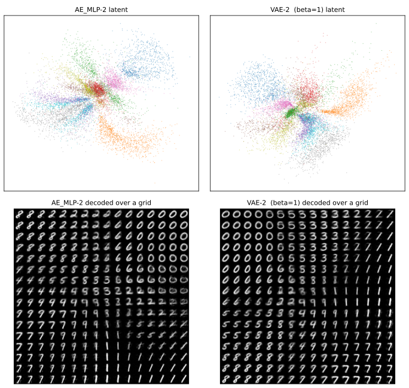
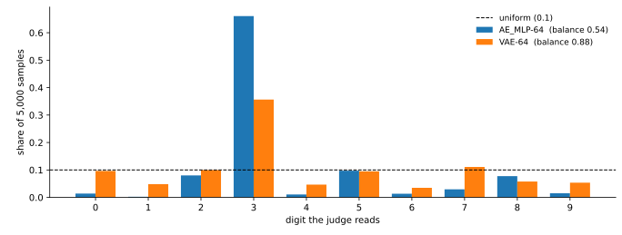

# VAE — 부호를 앞분포 쪽으로 민다

VAE는 부호를 점 하나로 내놓지 않는다. **분포**로 내놓는다. 인코더가 평균 $\mu$와 로그 분산 $\log \sigma^2$을 내고, 거기서 뽑은 $z$를 복호한다.

$$
z = \mu + \sigma \odot \varepsilon, \qquad \varepsilon \sim N(0, I)
$$

이렇게 적는 까닭은 **기울기가 흐르게** 하기 위해서다. $z$를 직접 뽑으면 뽑는 연산에 미분이 정의되지 않지만, 무작위성을 $\varepsilon$으로 밀어내면 $\mu$와 $\sigma$로 기울기가 흐른다. 이를 **재매개변수화 요령**이라 한다.

그리고 손실에 항을 하나 더한다.

$$
L = \underbrace{\lVert \hat{x} - x \rVert^2}_{\text{되살리기}} \;+\; \beta \underbrace{D_{\mathrm{KL}}\!\left(N(\mu, \sigma^2) \,\|\, N(0, I)\right)}_{\text{앞분포로 끌어당기기}}
$$

둘째 항이 **부호마다의 분포를 $N(0, I)$ 쪽으로 민다.** 모든 부호가 그쪽으로 밀리면 부호 전체의 분포도 $N(0, I)$에 가까워지고, 그러면 **$N(0, I)$에서 그냥 뽑으면 된다.** [앞 쪽](index.md)이 오토인코더에서 겪은 "어디서 뽑아야 하는가"라는 문제를, 뽑을 자리를 **미리 정해 버리는** 방식으로 없앤다.

```python
"""VAE. 손실에 KL 항을 더해 부호를 앞분포 쪽으로 민다.

mnist_judge.pt는 5.1절에서 학습해 둔 것을 읽어 쓴다.
구조와 규약은 5.1절 AE_MLP와 같다. 달라지는 것은 손실뿐이다.
"""

import torch
import torch.nn as nn
import torch.nn.functional as F
import torch.optim as optim
from torch.utils.data import DataLoader, TensorDataset
import torchvision
import torchvision.transforms as transforms

SEED, BATCH, LR, EPOCHS = 42, 100, 1e-3, 100
N_SAMPLE = 5000
device = torch.device("mps" if torch.backends.mps.is_available() else "cpu")

tf = transforms.Compose([transforms.ToTensor(),
                         transforms.Normalize((0.1307,), (0.3081,))])
tr_ds = torchvision.datasets.MNIST("./data", train=True, download=True, transform=tf)
te_ds = torchvision.datasets.MNIST("./data", train=False, download=True, transform=tf)


def materialize(ds):
    xs, ys = [], []
    for x, y in DataLoader(ds, batch_size=2000, shuffle=False):
        xs.append(x.flatten(1)); ys.append(y)
    return torch.cat(xs), torch.cat(ys)


Xtr, ytr = materialize(tr_ds)
Xte, yte = materialize(te_ds)


class JudgeCNN(nn.Module):
    def __init__(self):
        super().__init__()
        self.conv1 = nn.Conv2d(1, 32, 3, padding=1)
        self.conv2 = nn.Conv2d(32, 64, 3, padding=1)
        self.pool = nn.MaxPool2d(2, 2); self.dropout = nn.Dropout(0.25)
        self.fc1 = nn.Linear(64 * 7 * 7, 128); self.fc2 = nn.Linear(128, 10)

    def forward(self, x):
        x = self.pool(torch.relu(self.conv1(x)))
        x = self.pool(torch.relu(self.conv2(x)))
        return self.fc2(self.dropout(torch.relu(self.fc1(x.flatten(1)))))


judge = JudgeCNN().to(device)
judge.load_state_dict(torch.load("mnist_judge.pt", weights_only=True))
judge.eval()


@torch.no_grad()
def judge_probs(flat):
    return torch.cat([torch.softmax(
        judge(flat[i:i + 1000].reshape(-1, 1, 28, 28).to(device)), 1).cpu()
        for i in range(0, len(flat), 1000)])


def sample_stats(flat):
    """표본을 심판에 넣어 확신도와 클래스 고름을 잰다.

    고름은 심판이 읽은 클래스 분포의 엔트로피를 균등분포로 나눈 값이다.
    1이면 열 가지가 고르게 나왔고, 0에 가까우면 한 가지로 쏠렸다.
    """
    p = judge_probs(flat)
    conf, pred = p.max(1)
    share = torch.bincount(pred, minlength=10).float()
    share = share / share.sum()
    nz = share[share > 0]
    bal = (-(nz * nz.log()).sum() / torch.tensor(10.0).log()).item()
    return conf.mean().item(), bal, share.max().item()


class VAE(nn.Module):
    """부호를 점이 아니라 분포로 내놓는다. n_cond>0이면 조건부(cVAE)."""

    def __init__(self, k, n_cond=0):
        super().__init__()
        self.k, self.n_cond = k, n_cond
        self.enc = nn.Sequential(nn.Linear(784 + n_cond, 256), nn.ReLU())
        self.mu = nn.Linear(256, k)
        self.logvar = nn.Linear(256, k)
        self.dec = nn.Sequential(nn.Linear(k + n_cond, 256), nn.ReLU(),
                                 nn.Linear(256, 784))

    def encode(self, x, c=None):
        h = self.enc(x if c is None else torch.cat([x, c], 1))
        return self.mu(h), self.logvar(h)

    def decode(self, z, c=None):
        return self.dec(z if c is None else torch.cat([z, c], 1))

    def forward(self, x, c=None):
        mu, logvar = self.encode(x, c)
        # 재매개변수화: 무작위성을 eps로 밀어내어 mu, logvar로 기울기가 흐르게 한다
        z = mu + torch.exp(0.5 * logvar) * torch.randn_like(mu)
        return self.decode(z, c), mu, logvar


def onehot(y):
    return F.one_hot(y, 10).float()


def train_vae(k, beta, cond):
    torch.manual_seed(SEED)
    m = VAE(k, 10 if cond else 0).to(device)
    opt = optim.Adam(m.parameters(), lr=LR)
    g = torch.Generator().manual_seed(SEED)
    loader = DataLoader(TensorDataset(Xtr, ytr), batch_size=BATCH,
                        shuffle=True, generator=g)
    for _ in range(EPOCHS):
        m.train()
        for xb, yb in loader:
            xb = xb.to(device)
            c = onehot(yb).to(device) if cond else None
            opt.zero_grad()
            xh, mu, lv = m(xb, c)
            # 화소에 대해 합, 표본에 대해 평균 — 가우스 가능도의 꼴
            rec = F.mse_loss(xh, xb, reduction="sum") / xb.size(0)
            kl = -0.5 * torch.sum(1 + lv - mu.pow(2) - lv.exp()) / xb.size(0)
            (rec + beta * kl).backward()
            opt.step()
    return m.eval()


# === 부호 2와 64에서 각각 ===================================================
for k in (2, 64):
    m = train_vae(k, beta=1.0, cond=False)

    with torch.no_grad():
        # 복원은 뽑지 않고 평균을 쓴다
        rec = torch.cat([m.decode(m.encode(Xte[i:i + 1000].to(device))[0]).cpu()
                         for i in range(0, len(Xte), 1000)])
        # 표본은 앞분포 N(0, I)에서 그냥 뽑는다 — 이것이 VAE가 산 것이다
        g = torch.Generator().manual_seed(SEED)
        z = torch.randn(N_SAMPLE, k, generator=g)
        s = torch.cat([m.decode(z[i:i + 1000].to(device)).cpu()
                       for i in range(0, N_SAMPLE, 1000)])

    pred = judge_probs(rec).argmax(1)
    ident = 100.0 * (pred == yte).float().mean()
    conf, bal, _ = sample_stats(s)
    tag = f"vae{k}_beta1.0"
    print(f"  {tag:14s} 복원 {((rec - Xte) ** 2).mean():.5f}  "
          f"정체 {ident:.2f}%  확신도 {conf:.3f}  고름 {bal:.3f}")

    # 5.3절이 이 모델을 읽어, 오토인코더·GAN과 같은 자로 다시 잰다
    torch.save(m.state_dict(), f"mnist_vae{k}_beta1.0.pt")
```

**출력:**

```
  vae2_beta1.0   복원 0.42744  정체 71.28%  확신도 0.793  고름 0.950
  vae64_beta1.0  복원 0.07499  정체 98.06%  확신도 0.769  고름 0.877
```

구조와 규약은 [5.1절의 AE_MLP](../dimreduction/03_ae_mlp.md)와 같다. 인코더 $784 \to 256 \to k$, Adam $10^{-3}$, 배치 100, 100 에포크다. **달라지는 것은 손실뿐이다.** 이 쪽은 $\beta = 1$로 두고, 손잡이를 돌리는 이야기는 [다음 쪽](02_beta_vae.md)이 한다.

---

## 1. 부호 2에서는 VAE가 이기지 못한다

| 부호 2 | 복원 MSE | 정체 | 표본 확신도 | 표본 고름 |
|---|---|---|---|---|
| [AE_MLP-2](../dimreduction/03_ae_mlp.md) | **0.4223** | 70.13% | **0.859** | **0.973** |
| VAE-2 ($\beta = 1$) | 0.4274 | 71.28% | 0.793 | 0.950 |

**네 칸 가운데 셋에서 VAE가 진다.** 복원은 1.2% 나쁘고, 표본 확신도와 고름도 조금씩 낮다.

당연한 결과다. 2차원에서는 오토인코더의 부호가 이미 한 덩어리로 모여 있어 뽑는 데 아무 문제가 없었다. **고칠 것이 없는데 고치는 값만 치른 셈**이다. KL 항은 되살리기를 희생시키는데, 그 희생으로 사는 것이 여기서는 없다.



그림으로도 둘이 크게 다르지 않다. VAE 쪽이 원점 둘레로 조금 더 둥글게 모여 있지만, 둘 다 격자를 훑으면 숫자가 고르게 나온다.

!!! note "교과서 그림에 대하여"
    "오토인코더의 잠재 공간에는 빈 곳이 있고 VAE가 그것을 메운다"는 그림을 흔히 본다. 2차원에서 실제로 재어 보면 **그 차이가 거의 없다**(고름 0.973 대 0.952).

    그 그림이 틀렸다기보다, **2차원에서 그릴 수 있는 것과 실제로 문제가 되는 것이 다르다.** 진짜 실패는 그릴 수 없는 차원에서 일어난다.

---

## 2. 부호 64에서 갈린다

| 부호 64 | 복원 MSE | 정체 | 표본 확신도 | 표본 고름 |
|---|---|---|---|---|
| [AE_MLP-64](../dimreduction/03_ae_mlp.md) | **0.0546** | 98.51% | 0.777 | **0.541** |
| VAE-64 ($\beta = 1$) | 0.0750 | 98.06% | 0.769 | **0.877** |

**확신도는 거의 그대로인데 고름이 0.541에서 0.877로 뛴다.**

이것이 이 절의 핵심이다. KL 항이 사는 것은 **표본이 더 숫자다워지는 것**이 아니라 **열 가지를 고루 만들게 되는 것**이다. 낱장으로 보면 두 모델의 표본이 비슷하게 그럴듯하다. 5,000장을 모아 세어 보아야 차이가 드러난다.

### 확신도 0.77은 어느 만큼인가

0.769라는 수만 보아서는 좋은지 나쁜지 알 수 없다. **양 끝을 재어 두면** 눈금이 생긴다.

| 심판에게 무엇을 보였나 | 평균 확신도 | 확신 > 0.9 |
|---|---|---|
| 진짜 시험 자료 | **0.992** | 97.8% |
| AE_MLP-64 표본 | 0.782 | 43.4% |
| VAE-64 표본 | 0.768 | 39.7% |
| 균등 잡음 | 0.490 | 0.5% |
| 가우스 잡음 | 0.324 | 0.0% |
| 검은 화면 | 0.119 | 0.0% |

두 가지를 알 수 있다.

**첫째, 이 자는 쓸 만하다.** 심판은 진짜 숫자에 0.992를 주고 순수한 잡음에는 0.32~0.49를 준다. 잡음 가운데 0.9를 넘는 것은 0.5%도 되지 않는다. 분류기가 처음 보는 입력에 함부로 확신하는 일이 흔하다는 점을 생각하면(그 이야기는 [43장](../../ch42/index.md)이 다룬다) 이 심판은 뜻밖에 잘 가려낸다.

**둘째, 그래서 0.78과 0.77이 같다는 말을 믿을 수 있다.** 자가 눌려 있어서 같아 보이는 것이 아니다. 잡음과 진짜 사이를 제대로 벌려 놓고도 두 모델을 가르지 않는다면, **두 모델의 표본이 낱장으로는 정말 비슷하다**는 뜻이다.

그러므로 오토인코더의 표본이 못 쓸 것은 아니다. 하나하나는 VAE의 것만큼 그럴듯하다. 문제는 **그 가운데 셋 중 둘이 3이라는 것**이다.



오토인코더는 **3만 만든다.** 5,000장 가운데 3,305장이 3으로 읽히고, 1은 11장뿐이다. VAE도 3으로 기울지만(35.6%) 나머지 아홉 가지가 3.5~11%로 살아 있다.

두 모델이 모두 3으로 기우는 까닭도 짐작할 만하다. 잠재 공간의 **평균 언저리**를 복호하면 모든 숫자를 평균한 듯한 모양이 나오고, 그것이 3과 가장 닮았다. 정규분포에서 뽑으면 평균 언저리가 가장 자주 뽑힌다. VAE는 그 쏠림을 **줄이지만 없애지는 못한다.**

---

## 연습문제

<div class="drillbox" markdown>

**연습문제 1.** <span class="diff easy" title="쉬움"></span>
재매개변수화 없이 $z \sim N(\mu, \sigma^2)$을 그냥 뽑아 쓰면 무엇이 안 되는가?

</div>

??? success "연습문제 1 풀이"
    **기울기가 인코더로 흐르지 않는다.**

    `torch.normal(mu, sigma)`는 $\mu$와 $\sigma$를 받아 수를 내놓지만, 그 연산은 뽑기이지 미분할 수 있는 함수가 아니다. 역전파가 $z$까지 와서 멈춘다. 인코더의 가중치는 갱신되지 않고 디코더만 학습된다.

    $z = \mu + \sigma \varepsilon$으로 적으면 무작위성이 $\varepsilon$에 몰리고, $\varepsilon$은 학습할 것이 아니므로 기울기가 필요 없다. 남은 $\mu$와 $\sigma$에 대한 연산은 덧셈과 곱셈이라 미분이 잘 정의된다.

    **무작위성을 매개변수에서 떼어 내어 입력 쪽으로 밀어내는 것**이 이 요령의 전부다.

---

<div class="drillbox" markdown>

**연습문제 2.** <span class="diff normal" title="중간"></span>
부호 2에서는 VAE가 오토인코더를 이기지 못하고 부호 64에서는 크게 이긴다. 이 사실만으로 "부호는 크게 두는 편이 낫다"고 말할 수 있는가?

</div>

??? success "연습문제 2 풀이"
    **말할 수 없다.** 부호를 키우면 VAE의 **상대적** 이득이 커질 뿐, 절대적으로 좋아진다는 뜻이 아니다.

    실제로 두 가지가 함께 일어난다. 부호가 커지면 되살리기가 좋아지고(0.4274 → 0.0750), 동시에 **뽑기가 어려워진다.** 오토인코더의 고름이 0.973에서 0.541로 무너지는 것이 그 증거다. VAE는 그 무너짐을 되돌리는 것이지 없는 이득을 만드는 것이 아니다.

    그리고 [cVAE](03_cvae.md)에서는 부호가 크면 **조건이 먹지 않는다.** 99.66%에서 73.64%로 떨어진다. 부호를 키우면 잠재 공간을 다루기가 어려워진다는 이야기가 이 절에서만 두 번 나온다.

    부호 크기는 **무엇을 하려느냐에 따라** 정할 일이다. 되살리기가 목적이면 크게, 다루기가 목적이면 작게. 하나의 답이 없다.
