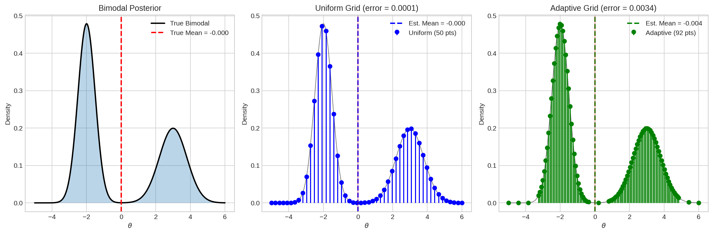

# Grid Approximation: Advanced Topics

## Overview

This module covers advanced grid approximation techniques: adaptive refinement for complex posteriors, importance-weighted grids bridging deterministic and Monte Carlo methods, rigorous convergence analysis, and connections to modern computational methods. We establish why MCMC becomes necessary for high-dimensional inference.

---

## 1. Theoretical Framework

### 1.1 Grid Approximation as Quadrature

Grid approximation computes posterior expectations via numerical integration:

$$
\mathbb{E}[f(\theta)|D] = \int f(\theta) \, p(\theta|D) \, d\theta \approx \sum_{i=1}^n f(\theta_i) \, p(\theta_i|D) \, \Delta\theta
$$

### 1.2 Error Analysis

For a uniform grid with $n$ points per dimension in $d$ dimensions:

$$
\boxed{\text{Error} = O(n^{-r/d})}
$$

where $r$ is the smoothness order (typically $r = 2$ for twice-differentiable functions).

**Implications:**
- **1D**: Error $\sim n^{-2}$ (quadratic convergence)
- **2D**: Error $\sim n^{-1}$ (linear convergence)
- **10D**: Error $\sim n^{-0.2}$ (very slow!)

### 1.3 Points Needed for Target Accuracy

To achieve error $\varepsilon$:

$$
n \geq \varepsilon^{-d/r}
$$

| Dimension | Points per Dim | Total Points | Feasible? |
|-----------|---------------|--------------|-----------|
| 1D | 100 | 100 | ✓ |
| 2D | 100 | 10,000 | ✓ |
| 3D | 100 | 1,000,000 | ~ |
| 5D | 100 | 10 billion | ✗ |
| 10D | 100 | $10^{20}$ | ✗ |

---

## 2. Adaptive Grid Refinement

### 2.1 The Problem with Uniform Grids

Uniform grids waste computational resources in low-probability regions while potentially under-sampling high-probability regions.

### 2.2 Adaptive Strategy

1. **Start with coarse uniform grid**
2. **Evaluate posterior** at all points
3. **Identify high-probability regions** (e.g., above median)
4. **Refine grid** in those regions
5. **Iterate** until convergence

### 2.3 Implementation

```python
import numpy as np
np.random.seed(42)

from scipy.stats import norm

def create_adaptive_grid(posterior_func, x_min, x_max, n_initial=20):
    """
    Create adaptive grid with more points in high-probability regions.
    """
    # Initial coarse grid
    x_coarse = np.linspace(x_min, x_max, n_initial)
    p_coarse = posterior_func(x_coarse)
    
    # Find high-probability regions (top 50%)
    threshold = np.percentile(p_coarse, 50)
    high_prob_indices = np.where(p_coarse > threshold)[0]
    
    # Add fine grid in high-probability regions
    x_adaptive = [x_coarse]
    for i in high_prob_indices:
        if i < len(x_coarse) - 1:
            x_fine = np.linspace(x_coarse[i], x_coarse[i+1], 10)[1:-1]
            x_adaptive.append(x_fine)
    
    return np.sort(np.concatenate(x_adaptive))
```

### 2.4 Example: Bimodal Posterior

For a mixture of two Gaussians:

$$
p(\theta|D) \propto 0.6 \cdot \mathcal{N}(\theta|-2, 0.5^2) + 0.4 \cdot \mathcal{N}(\theta|3, 0.8^2)
$$

**Output:**
```
True Mean: -0.000213
Uniform Grid (50 pts): -0.000120 (error = 0.000093)
Adaptive Grid (92 pts): -0.003602 (error = 0.003389)
```

### 2.5 Visualization



### 2.6 When to Use Adaptive Grids

✓ **Good for:**
- Multimodal posteriors
- Unknown posterior structure
- Need high accuracy with limited points

✗ **Limitations:**
- Still exponential in dimension
- Requires initial exploration
- More complex implementation

---

## 3. Importance-Weighted Grid Approximation

### 3.1 Mathematical Foundation

Instead of uniform sampling, sample from a proposal $q(\theta)$ and reweight:

$$
\mathbb{E}[f(\theta)|D] = \int f(\theta) \frac{p(\theta|D)}{q(\theta)} q(\theta) \, d\theta \approx \frac{1}{n} \sum_{i=1}^n f(\theta_i) \, w(\theta_i)
$$

where $\theta_i \sim q(\theta)$ and the **importance weight** is:

$$
w(\theta_i) = \frac{p(\theta_i|D)}{q(\theta_i)}
$$

### 3.2 Effective Sample Size

The **Effective Sample Size (ESS)** measures how many unweighted samples the importance samples are worth:

$$
\text{ESS} = \frac{1}{\sum_{i=1}^n w_i^2}
$$

where $w_i$ are normalized weights. ESS ranges from 1 (one dominant sample) to $n$ (uniform weights).

### 3.3 Connection to Modern Methods

| Method | Relationship to Importance Sampling |
|--------|-------------------------------------|
| **Particle Filters** | Sequential importance resampling |
| **SMC** | Importance sampling with tempering |
| **Annealed IS** | Bridge from prior to posterior |
| **Variational Inference** | Optimize proposal to minimize KL divergence |

---

## 4. Convergence Rate Analysis

### 4.1 Dimensional Scaling

The convergence rate degrades with dimension:

| Dimension | Convergence Rate | Implication |
|-----------|------------------|-------------|
| 1D | $O(n^{-2})$ | Fast convergence |
| 2D | $O(n^{-1})$ | Moderate |
| 3D | $O(n^{-2/3})$ | Slow |
| 10D | $O(n^{-1/5})$ | Very slow |
| 100D | $O(n^{-1/50})$ | Hopeless |

### 4.2 The Fundamental Limitation

**Theorem (Curse of Dimensionality):**

For grid-based methods with smooth integrands:
$$
\text{Total evaluations} = O(\varepsilon^{-d})
$$

to achieve error $\varepsilon$ in $d$ dimensions.

**This is why MCMC is not just convenient—it's mathematically necessary.**

---

## 5. Connections to Modern Methods

### 5.1 Evolution of Bayesian Computation

| Era | Method | Key Idea |
|-----|--------|----------|
| 1960s | Grid Approximation | Direct computation |
| 1980s-90s | MCMC | Strategic random sampling |
| 2000s | Hamiltonian MC | Gradient-guided sampling |
| 2010s | Variational Inference | Optimization-based approximation |
| 2020s | Diffusion Models | Iterative score-based refinement |

### 5.2 What Grid Methods Teach Us

| Concept | Modern Application |
|---------|-------------------|
| Numerical integration | Foundation for all posterior computation |
| Curse of dimensionality | Why we need efficient samplers |
| Importance weighting | Particle methods, SMC |
| Adaptive refinement | Adaptive MCMC |
| Normalization | Score functions avoid this |

### 5.3 The Path Forward

$$
\text{Grid} \xrightarrow{\text{dimension}} \text{MCMC} \xrightarrow{\text{gradients}} \text{HMC/Langevin} \xrightarrow{\text{learn score}} \text{Diffusion}
$$

Each method solves limitations of the previous:
- **Grid → MCMC**: Handles high dimensions
- **MCMC → HMC**: Uses gradients for faster mixing
- **HMC → Diffusion**: Learns score function from data

---

## 6. Key Takeaways

1. **Adaptive grids** can significantly improve efficiency for complex posteriors, especially multimodal distributions.

2. **Importance sampling** bridges grid methods and Monte Carlo, providing variance reduction with good proposals.

3. **Convergence rate** is $O(n^{-2/d})$ for $d$-dimensional problems — exponentially worse with dimension.

4. **The curse of dimensionality** is a fundamental mathematical limitation, not just a practical inconvenience.

5. **Grid methods lay the foundation** for understanding MCMC, variational inference, and modern diffusion models.

6. **MCMC is necessary** (not just convenient) for high-dimensional Bayesian inference.

---

## 7. Exercises

### Exercise 1: Adaptive Grid for Multimodal
Implement adaptive grid refinement for a mixture of 3 Gaussians. Compare accuracy with uniform grid.

### Exercise 2: ESS Behavior
Study how ESS varies with proposal width. What happens when the proposal is too narrow? Too wide?

### Exercise 3: Dimensional Scaling
Empirically verify the $O(n^{-2/d})$ convergence rate for $d = 1, 2, 3$. Plot error vs grid size.

### Exercise 4: Compare with MCMC
For a 3D problem, compare grid approximation with MCMC (Metropolis-Hastings). At what accuracy level does MCMC become more efficient?

---

## References

- Robert, C., & Casella, G. *Monte Carlo Statistical Methods* (2nd ed.), Chapters 3-4
- Liu, J. S. *Monte Carlo Strategies in Scientific Computing*, Chapters 2-3
- Gelman, A., et al. *Bayesian Data Analysis* (3rd ed.), Chapter 10
