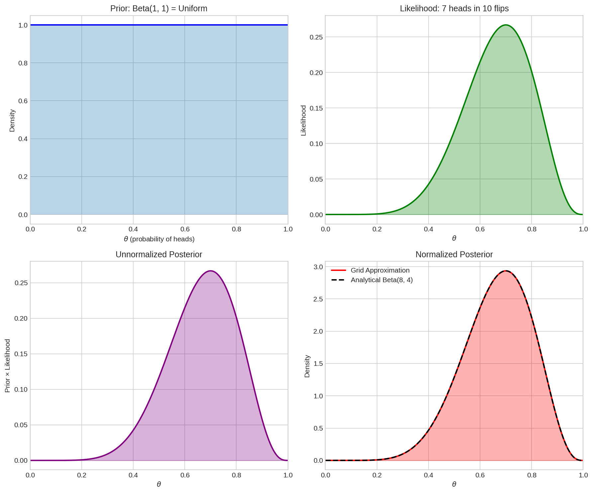
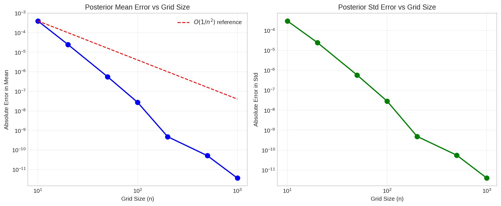
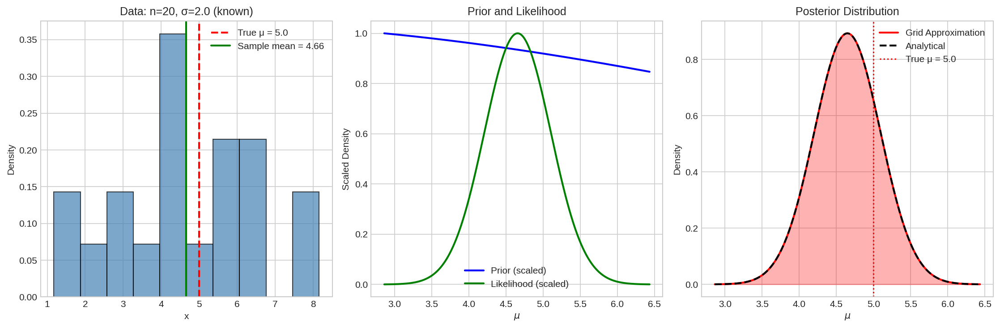
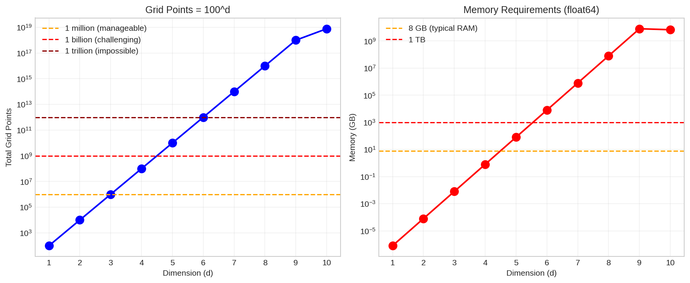
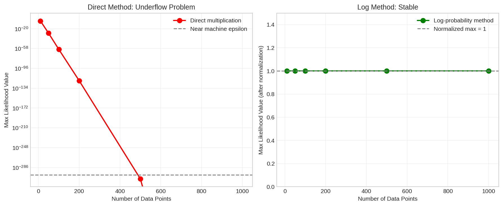

# Grid Approximation for Bayesian Inference

## Overview

Grid approximation is the simplest numerical method for computing posterior distributions. This module develops the algorithm, demonstrates its application to coin flipping and normal mean inference, analyzes the effect of grid resolution, and reveals why the curse of dimensionality necessitates more sophisticated methods like MCMC.

---

## 1. The Central Challenge of Bayesian Inference

### 1.1 Bayes' Theorem Revisited

$$
p(\theta | D) = \frac{p(D | \theta) \, p(\theta)}{p(D)}
$$

The denominator, called the **evidence** or **marginal likelihood**, is:

$$
p(D) = \int p(D | \theta) \, p(\theta) \, d\theta
$$

This integral is usually **impossible to compute analytically**.

### 1.2 The Key Insight: We Don't Need $p(D)$

Bayesian computation only requires the posterior **up to a constant**:

$$
\boxed{p(\theta | D) \propto p(D | \theta) \, p(\theta)}
$$

We can compute:
1. **Unnormalized posterior**: $\tilde{p}(\theta_i) = p(D | \theta_i) \cdot p(\theta_i)$
2. **Normalize**: $p(\theta_i | D) = \tilde{p}(\theta_i) / \sum_j \tilde{p}(\theta_j)$

The denominator $\sum_j \tilde{p}(\theta_j)$ plays the role of $p(D)$, but we never compute it symbolically.

### 1.3 This Principle Generalizes

| Method | How Normalization is Handled |
|--------|------------------------------|
| Grid approximation | Sum over grid points |
| Importance sampling | Sum of weights |
| MCMC | Acceptance ratios cancel normalizing constant |
| Score-based/Diffusion | Learn $\nabla \log p(x)$ (constant cancels in gradient) |

---

## 2. The Grid Approximation Algorithm

### 2.1 Algorithm Steps

1. **Define grid**: Create discrete values $\theta_1, \theta_2, \ldots, \theta_n$ covering the parameter space
2. **Evaluate prior**: Compute $p(\theta_i)$ at each grid point
3. **Evaluate likelihood**: Compute $p(D | \theta_i)$ at each grid point
4. **Compute unnormalized posterior**: $\tilde{p}(\theta_i) = p(D | \theta_i) \cdot p(\theta_i)$
5. **Normalize**: $p(\theta_i | D) = \tilde{p}(\theta_i) / \sum_j \tilde{p}(\theta_j) \cdot \Delta\theta$

### 2.2 Implementation

```python
import numpy as np
np.random.seed(42)  # For reproducibility

from scipy.stats import beta, binom

def grid_approximation(theta_grid, prior_func, likelihood_func):
    """
    Generic grid approximation for 1D Bayesian inference.
    
    Parameters
    ----------
    theta_grid : array
        Grid of parameter values
    prior_func : callable
        Function returning prior density at each theta
    likelihood_func : callable
        Function returning likelihood at each theta
    
    Returns
    -------
    posterior : array
        Normalized posterior density at each grid point
    """
    grid_width = theta_grid[1] - theta_grid[0]
    
    # Evaluate prior and likelihood
    prior = prior_func(theta_grid)
    likelihood = likelihood_func(theta_grid)
    
    # Unnormalized posterior
    unnormalized = prior * likelihood
    
    # Normalize (approximate integral)
    normalization = np.sum(unnormalized) * grid_width
    posterior = unnormalized / normalization
    
    return posterior
```

---

## 3. Example: Coin Flip Inference

### 3.1 Problem Setup

- **Data**: $k$ heads in $n$ flips
- **Parameter**: $\theta = P(\text{heads}) \in [0, 1]$
- **Prior**: $\theta \sim \text{Beta}(\alpha, \beta)$
- **Likelihood**: $p(k | n, \theta) = \binom{n}{k} \theta^k (1-\theta)^{n-k}$
- **Analytical posterior**: $\text{Beta}(\alpha + k, \beta + n - k)$

### 3.2 Implementation

```python
import numpy as np
np.random.seed(42)

from scipy.stats import beta, binom

# Data: 7 heads in 10 flips
n_flips, n_heads = 10, 7

# Prior: Beta(1, 1) = Uniform
prior_alpha, prior_beta = 1, 1

# Create grid
n_grid = 1000
theta_grid = np.linspace(0.001, 0.999, n_grid)
grid_width = theta_grid[1] - theta_grid[0]

# Evaluate prior and likelihood
prior_grid = beta.pdf(theta_grid, prior_alpha, prior_beta)
likelihood_grid = binom.pmf(n_heads, n_flips, theta_grid)

# Compute posterior
unnormalized = prior_grid * likelihood_grid
posterior_grid = unnormalized / (np.sum(unnormalized) * grid_width)

# Compare with analytical solution
analytical = beta.pdf(theta_grid, prior_alpha + n_heads, prior_beta + n_flips - n_heads)

# Compute statistics
post_mean = np.sum(theta_grid * posterior_grid * grid_width)
post_var = np.sum((theta_grid - post_mean)**2 * posterior_grid * grid_width)
analytical_mean = (prior_alpha + n_heads) / (prior_alpha + prior_beta + n_flips)

print(f"Grid Posterior Mean: {post_mean:.6f}")
print(f"Analytical Mean:     {analytical_mean:.6f}")
print(f"Grid Posterior Std:  {np.sqrt(post_var):.6f}")
print(f"Max Error: {np.max(np.abs(posterior_grid - analytical)):.2e}")
```

**Output:**
```
Grid Posterior Mean: 0.666667
Analytical Mean:     0.666667
Grid Posterior Std:  0.130744
Max Error: 3.22e-11
```

### 3.3 Visualization



The four-panel figure shows:
- **Top-left**: Uniform prior Beta(1,1)
- **Top-right**: Binomial likelihood for 7 heads in 10 flips
- **Bottom-left**: Unnormalized posterior (prior × likelihood)
- **Bottom-right**: Normalized posterior vs analytical Beta(8,4)

### 3.4 Verification

| Quantity | Grid Approximation | Analytical |
|----------|-------------------|------------|
| Posterior Mean | 0.666667 | 0.666667 |
| Posterior Std | 0.130744 | 0.130744 |
| Error | ~$10^{-11}$ | — |

Grid approximation reproduces the analytical result to machine precision.

---

## 4. Effect of Grid Resolution

### 4.1 Accuracy vs Computation Trade-off

```python
grid_sizes = [10, 20, 50, 100, 200, 500, 1000]
```

**Results:**

| Grid Size | Mean Error | Std Error |
|-----------|------------|-----------|
| 10 | 4.02e-04 | 3.05e-04 |
| 20 | 2.50e-05 | 2.50e-05 |
| 50 | 5.60e-07 | 5.88e-07 |
| 100 | 2.73e-08 | 2.88e-08 |
| 200 | 4.80e-10 | 4.88e-10 |
| 500 | 5.13e-11 | 5.54e-11 |
| 1000 | 3.65e-12 | 3.94e-12 |

### 4.2 Error Scaling



The error decreases approximately as $O(1/n^2)$ where $n$ is the number of grid points:

$$
\text{Error} \approx \frac{C}{n^2}
$$

### 4.3 Practical Recommendation

For 1D problems:
- **500-1000 points**: Usually sufficient for ~$10^{-5}$ accuracy
- **Check convergence**: Verify results don't change with more points
- **Check boundaries**: Ensure posterior ≈ 0 at grid edges

---

## 5. Normal Mean Inference

### 5.1 Problem Setup

- **Data**: $x_1, \ldots, x_n \sim \mathcal{N}(\mu, \sigma^2)$ with $\sigma$ known
- **Prior**: $\mu \sim \mathcal{N}(\mu_0, \tau^2)$
- **Posterior**: $\mu | D \sim \mathcal{N}(\mu_n, \sigma_n^2)$ (conjugate)

### 5.2 Analytical Posterior

$$
\mu_n = \frac{\tau^{-2} \mu_0 + n\sigma^{-2} \bar{x}}{\tau^{-2} + n\sigma^{-2}}, \quad \sigma_n^2 = \frac{1}{\tau^{-2} + n\sigma^{-2}}
$$

### 5.3 Grid Approximation with Log-Likelihood

For numerical stability with many data points:

```python
import numpy as np
np.random.seed(42)

from scipy.stats import norm

# Generate data
true_mu = 5.0
known_sigma = 2.0
n_data = 20
data = np.random.normal(true_mu, known_sigma, n_data)

# Prior
prior_mu = 0.0
prior_tau = 10.0  # prior std

# Grid
n_grid = 1000
data_mean = np.mean(data)
mu_grid = np.linspace(data_mean - 3*known_sigma, data_mean + 3*known_sigma, n_grid)
dmu = mu_grid[1] - mu_grid[0]

# Prior
prior_grid = norm.pdf(mu_grid, prior_mu, prior_tau)

# Log-likelihood (for numerical stability)
log_likelihood = np.zeros(n_grid)
for x in data:
    log_likelihood += norm.logpdf(x, mu_grid, known_sigma)

# Subtract max before exp to prevent overflow
log_likelihood -= log_likelihood.max()
likelihood_grid = np.exp(log_likelihood)

# Posterior
unnormalized = prior_grid * likelihood_grid
posterior = unnormalized / (np.sum(unnormalized) * dmu)

# Statistics
grid_mean = np.sum(mu_grid * posterior * dmu)
grid_std = np.sqrt(np.sum((mu_grid - grid_mean)**2 * posterior * dmu))

print(f"True μ: {true_mu}")
print(f"Sample mean: {data_mean:.4f}")
print(f"Grid Posterior Mean: {grid_mean:.4f}")
print(f"Grid Posterior Std: {grid_std:.4f}")
```

**Output:**
```
True μ: 5.0
Sample mean: 4.6574
Grid Posterior Mean: 4.6481
Grid Posterior Std: 0.4465
```

### 5.4 Visualization



---

## 6. The Curse of Dimensionality

### 6.1 Exponential Growth

For $d$ dimensions with $n$ points per dimension:

| Dimensions | Grid Points | Memory (float64) |
|------------|-------------|------------------|
| 1 | 100 | 0.8 KB |
| 2 | 10,000 | 80 KB |
| 3 | 1,000,000 | 8 MB |
| 4 | 100,000,000 | 800 MB |
| 5 | 10,000,000,000 | 80 GB |
| 6 | 1,000,000,000,000 | 8 TB |

$$
\text{Grid points} = n^d \quad \text{(exponential in dimension)}
$$

### 6.2 Visualization



### 6.3 Why Grid Fails in High Dimensions

- **Memory**: Cannot store $n^d$ values
- **Computation**: Cannot evaluate likelihood $n^d$ times
- **Most volume is empty**: In high dimensions, most grid points have negligible posterior probability

### 6.4 Grid vs MCMC Scaling

| Dimension | Grid Points (n=100) | MCMC Samples (typical) |
|-----------|---------------------|------------------------|
| 1 | 100 | 1,000 |
| 2 | 10,000 | 1,000 |
| 5 | 10 billion | 10,000 |
| 10 | $10^{20}$ | 10,000 |
| 100 | $10^{200}$ | 50,000 |

**MCMC samples scale gracefully with dimension!**

### 6.5 Connection to Diffusion Models

Images are extremely high-dimensional:
- 256×256×3 RGB image = **196,608 dimensions**
- Grid approximation is completely hopeless
- This is why we need score-based methods and diffusion models

---

## 7. Numerical Stability

### 7.1 The Underflow Problem

When multiplying many small probabilities:

```python
# BAD: Direct multiplication
likelihood = 1.0
for x in data:
    likelihood *= norm.pdf(x, mu, sigma)  # Quickly becomes 0!
```

### 7.2 The Log-Probability Solution

```python
# GOOD: Log probabilities
log_likelihood = 0.0
for x in data:
    log_likelihood += norm.logpdf(x, mu, sigma)  # Stays finite

# Subtract max before exponentiating
log_likelihood -= log_likelihood.max()
likelihood = np.exp(log_likelihood)  # Now well-scaled
```

### 7.3 Demonstration

```python
data_sizes = [10, 50, 100, 200, 500, 1000]
```

**Results:**

| n | Direct Max | Log Method Max |
|---|------------|----------------|
| 10 | 9.70e-06 | 1.000000 |
| 50 | 2.74e-29 | 1.000000 |
| 100 | 3.48e-60 | 1.000000 |
| 200 | 2.64e-120 | 1.000000 |
| 500 | 1.64e-308 | 1.000000 |
| 1000 | **0.0 (underflow!)** | 1.000000 |

### 7.4 Visualization



### 7.5 Best Practices Summary

| Practice | Reason |
|----------|--------|
| Use log probabilities | Prevent underflow in likelihood products |
| Subtract max before exp() | Prevent overflow |
| Check boundary values ≈ 0 | Ensure grid covers posterior support |
| Use enough grid points (1000+) | Adequate resolution |
| Multiply by grid width $\Delta\theta$ | Proper numerical integration |

---

## 8. When to Use Grid Approximation

### 8.1 Appropriate Uses

✓ **1D problems**: Almost always fine  
✓ **2D problems**: Usually OK  
✓ **Teaching and visualization**: Excellent for building intuition  
✓ **Verifying other methods**: Quick sanity check  

### 8.2 When to Use Other Methods

✗ **3D+ problems**: Consider MCMC  
✗ **High-dimensional**: Use MCMC, variational inference, or score-based methods  
✗ **Complex posteriors**: Adaptive methods may be needed  

---

## 9. The Path Forward

Grid approximation teaches the fundamental principle:

$$
\text{Posterior} \propto \text{Prior} \times \text{Likelihood}
$$

But its limitations motivate more advanced methods:

| Method | Overcomes |
|--------|-----------|
| **MCMC** | Curse of dimensionality |
| **Langevin Dynamics** | Slow MCMC convergence (uses gradients) |
| **Variational Inference** | Computational cost of sampling |
| **Score Matching/Diffusion** | Learning unnormalized densities |

**The journey:**
$$
\text{Grid} \to \text{MCMC} \to \text{Langevin} \to \text{Score Matching} \to \text{Diffusion}
$$

Each method solves the limitations of the previous one.

---

## 10. Key Takeaways

1. **Grid approximation** is the simplest numerical Bayesian method: discretize parameter space, evaluate prior × likelihood, normalize.

2. **We never need $p(D)$ explicitly** — this insight underlies all Bayesian computation.

3. **Error scales as $O(1/n^2)$** where $n$ is grid size. 500-1000 points usually suffice for 1D.

4. **Use log probabilities** to prevent numerical underflow when computing likelihoods.

5. **Curse of dimensionality**: Grid points grow as $n^d$, making grid approximation useless for $d \geq 3$.

6. **Grid approximation prepares intuition** for MCMC, Langevin dynamics, and diffusion models.

---

## 11. Exercises

### Exercise 1: Beta-Binomial Verification
Implement grid approximation for different Beta priors (informative vs uninformative). Verify against analytical posteriors.

### Exercise 2: Resolution Analysis
For a coin flip problem, plot posterior mean error vs grid size on a log-log scale. Verify the $O(1/n^2)$ scaling.

### Exercise 3: 2D Grid
Implement grid approximation for a 2D problem (e.g., normal mean and variance). Visualize as a contour plot. Note the computational cost.

### Exercise 4: Numerical Stability
Generate data that causes underflow without log probabilities. Implement both methods and compare.

### Exercise 5: When Does Grid Fail?
Estimate the maximum dimension where grid approximation with n=100 points per dimension is feasible on your computer (memory < 8GB).

---

## References

- McElreath, R. *Statistical Rethinking* (2nd ed.), Chapter 2
- Gelman, A., et al. *Bayesian Data Analysis* (3rd ed.), Chapter 3
- Murphy, K. *Machine Learning: A Probabilistic Perspective*, Chapter 5
