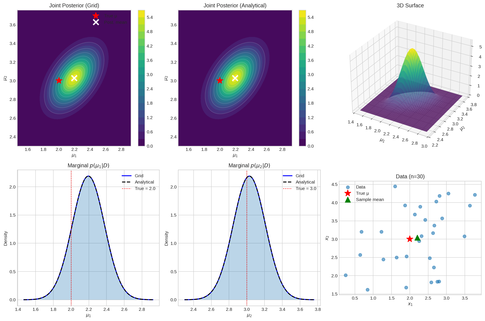
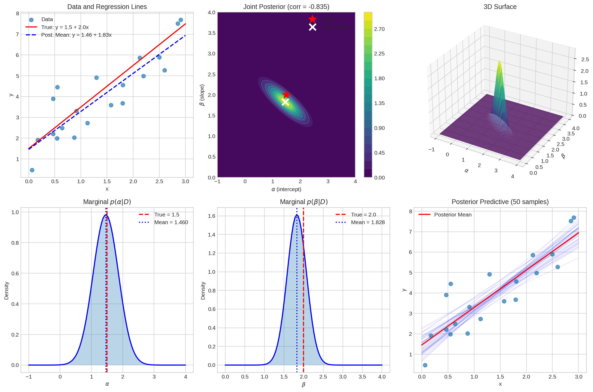

# Grid Approximation: Intermediate (2D)

## Overview

This module extends grid approximation to two-dimensional parameter spaces, covering bivariate posteriors, marginal and conditional distributions, correlation visualization, and Bayesian linear regression. We also examine computational efficiency and the practical limits of grid methods.

---

## 1. 2D Grid Approximation Framework

### 1.1 Mathematical Foundation

For two parameters $\theta = (\theta_1, \theta_2)$:

**Joint Posterior:**
$$
p(\theta_1, \theta_2 | D) \propto p(D | \theta_1, \theta_2) \, p(\theta_1, \theta_2)
$$

**Marginal Posteriors:**
$$
p(\theta_1 | D) = \int p(\theta_1, \theta_2 | D) \, d\theta_2
$$
$$
p(\theta_2 | D) = \int p(\theta_1, \theta_2 | D) \, d\theta_1
$$

**Conditional Posteriors:**
$$
p(\theta_1 | \theta_2, D) = \frac{p(\theta_1, \theta_2 | D)}{p(\theta_2 | D)}
$$

### 1.2 Algorithm for 2D Grid

1. **Create 2D grid**: $(\theta_{1,i}, \theta_{2,j})$ for $i = 1, \ldots, n_1$ and $j = 1, \ldots, n_2$
2. **Evaluate prior**: $p(\theta_{1,i}, \theta_{2,j})$ at each point
3. **Evaluate likelihood**: $p(D | \theta_{1,i}, \theta_{2,j})$ at each point
4. **Compute unnormalized posterior**: prior × likelihood
5. **Normalize**: Divide by sum × grid area
6. **Compute marginals**: Sum over one dimension

### 1.3 Computational Cost

| Grid Size | Points | Memory (float64) | Typical Time |
|-----------|--------|------------------|--------------|
| 50 × 50 | 2,500 | 20 KB | < 10 ms |
| 100 × 100 | 10,000 | 80 KB | ~50 ms |
| 200 × 200 | 40,000 | 320 KB | ~200 ms |
| 500 × 500 | 250,000 | 2 MB | ~1 sec |

**Scaling**: $O(n^2)$ for an $n \times n$ grid.

---

## 2. Example: Bivariate Normal Inference

### 2.1 Problem Setup

- **Data**: $x_1, \ldots, x_n \sim \mathcal{N}(\mu, \Sigma)$ with $\Sigma$ known
- **Unknown**: $\mu = (\mu_1, \mu_2)$
- **Prior**: $\mu \sim \mathcal{N}(\mu_0, \Sigma_0)$
- **Posterior**: $\mu | D \sim \mathcal{N}(\mu_n, \Sigma_n)$ (conjugate)

### 2.2 Analytical Solution

$$
\Sigma_n^{-1} = \Sigma_0^{-1} + n\Sigma^{-1}
$$
$$
\mu_n = \Sigma_n \left( \Sigma_0^{-1} \mu_0 + n\Sigma^{-1} \bar{x} \right)
$$

### 2.3 Implementation

```python
import numpy as np
np.random.seed(42)

from scipy.stats import multivariate_normal

# True parameters
true_mu = np.array([2.0, 3.0])
true_Sigma = np.array([[1.0, 0.5], [0.5, 1.0]])

# Generate data
n_data = 30
data = np.random.multivariate_normal(true_mu, true_Sigma, n_data)
data_mean = data.mean(axis=0)

# Prior
prior_mu = np.array([0.0, 0.0])
prior_Sigma = np.array([[10.0, 0.0], [0.0, 10.0]])

# Analytical posterior
prior_precision = np.linalg.inv(prior_Sigma)
data_precision = n_data * np.linalg.inv(true_Sigma)
post_precision = prior_precision + data_precision
post_Sigma = np.linalg.inv(post_precision)
post_mu = post_Sigma @ (prior_precision @ prior_mu + data_precision @ data_mean)

# Grid approximation
n_grid = 100
std1 = np.sqrt(post_Sigma[0, 0])
std2 = np.sqrt(post_Sigma[1, 1])
mu1_grid = np.linspace(post_mu[0] - 4*std1, post_mu[0] + 4*std1, n_grid)
mu2_grid = np.linspace(post_mu[1] - 4*std2, post_mu[1] + 4*std2, n_grid)
Mu1, Mu2 = np.meshgrid(mu1_grid, mu2_grid)
grid_points = np.stack([Mu1.ravel(), Mu2.ravel()], axis=1)

# Evaluate prior
prior_vals = multivariate_normal.pdf(grid_points, prior_mu, prior_Sigma)

# Evaluate likelihood (log for stability)
log_likelihood = np.zeros(len(grid_points))
for x in data:
    log_likelihood += multivariate_normal.logpdf(grid_points, x, true_Sigma)
log_likelihood -= log_likelihood.max()
likelihood_vals = np.exp(log_likelihood)

# Posterior
unnormalized = prior_vals * likelihood_vals
grid_area = (mu1_grid[1] - mu1_grid[0]) * (mu2_grid[1] - mu2_grid[0])
posterior_vals = unnormalized / (np.sum(unnormalized) * grid_area)
posterior_grid = posterior_vals.reshape(n_grid, n_grid)

# Compute grid statistics
grid_mean1 = np.sum(Mu1 * posterior_grid * grid_area)
grid_mean2 = np.sum(Mu2 * posterior_grid * grid_area)

print(f"True μ: [{true_mu[0]}, {true_mu[1]}]")
print(f"Sample mean: [{data_mean[0]:.4f}, {data_mean[1]:.4f}]")
print(f"Grid Post Mean: [{grid_mean1:.4f}, {grid_mean2:.4f}]")
print(f"Analytical Post Mean: [{post_mu[0]:.4f}, {post_mu[1]:.4f}]")
```

**Output:**
```
True μ: [2.0, 3.0]
Sample mean: [2.2074, 3.0423]
Grid Post Mean: [2.1951, 3.0285]
Analytical Post Mean: [2.1951, 3.0285]
```

### 2.4 Visualization



The six-panel figure shows:
- **Top-left**: Joint posterior contours (grid approximation)
- **Top-middle**: Joint posterior contours (analytical)
- **Top-right**: 3D surface of posterior density
- **Bottom-left**: Marginal distribution of $\mu_1$
- **Bottom-middle**: Marginal distribution of $\mu_2$
- **Bottom-right**: Data scatter plot

### 2.5 Computing Marginals

```python
def compute_marginals(posterior_grid, mu1_grid, mu2_grid):
    """Compute marginal distributions from joint posterior."""
    
    d_mu1 = mu1_grid[1] - mu1_grid[0]
    d_mu2 = mu2_grid[1] - mu2_grid[0]
    
    # p(μ₁|D) = ∫ p(μ₁,μ₂|D) dμ₂
    marginal_mu1 = np.sum(posterior_grid, axis=0) * d_mu2
    
    # p(μ₂|D) = ∫ p(μ₁,μ₂|D) dμ₁
    marginal_mu2 = np.sum(posterior_grid, axis=1) * d_mu1
    
    return marginal_mu1, marginal_mu2
```

---

## 3. Visualizing Parameter Correlation

### 3.1 Types of Correlation

| Correlation | Contour Shape | Interpretation |
|-------------|---------------|----------------|
| Independent ($\rho = 0$) | Circular | Parameters vary independently |
| Positive ($\rho > 0$) | Ellipse (↗ diagonal) | $\theta_1 \uparrow \Rightarrow \theta_2 \uparrow$ |
| Negative ($\rho < 0$) | Ellipse (↘ diagonal) | $\theta_1 \uparrow \Rightarrow \theta_2 \downarrow$ |

### 3.2 Why Correlation Matters

1. **MCMC efficiency**: Correlated posteriors cause samplers to explore slowly
2. **Uncertainty quantification**: Marginal uncertainties don't capture joint structure
3. **Parameter interpretation**: Correlated parameters have dependent effects
4. **Regression problems**: Intercept and slope are often negatively correlated

---

## 4. Linear Regression with 2D Grid

### 4.1 Model

$$
y_i = \alpha + \beta x_i + \varepsilon_i, \quad \varepsilon_i \sim \mathcal{N}(0, \sigma^2)
$$

**Parameters**: $\theta = (\alpha, \beta)$ (intercept and slope)

### 4.2 Likelihood

$$
p(y | x, \alpha, \beta, \sigma^2) = \prod_{i=1}^n \mathcal{N}(y_i | \alpha + \beta x_i, \sigma^2)
$$

### 4.3 Implementation

```python
import numpy as np
np.random.seed(42)

from scipy.stats import norm

# True parameters
true_alpha = 1.5
true_beta = 2.0
sigma = 1.0

# Generate data
n_data = 20
x = np.random.uniform(0, 3, n_data)
y = true_alpha + true_beta * x + np.random.normal(0, sigma, n_data)

# Grid approximation
n_grid = 100
prior_std = 5.0
alpha_range = np.linspace(-1, 4, n_grid)
beta_range = np.linspace(0, 4, n_grid)
Alpha, Beta = np.meshgrid(alpha_range, beta_range)

alpha_vec = Alpha.ravel()
beta_vec = Beta.ravel()

# Prior (independent)
prior_vals = norm.pdf(alpha_vec, 0, prior_std) * norm.pdf(beta_vec, 0, prior_std)

# Likelihood
log_likelihood = np.zeros(len(alpha_vec))
for xi, yi in zip(x, y):
    y_pred = alpha_vec + beta_vec * xi
    log_likelihood += norm.logpdf(yi, y_pred, sigma)

log_likelihood -= log_likelihood.max()
likelihood_vals = np.exp(log_likelihood)

# Posterior
unnormalized = prior_vals * likelihood_vals
grid_area = (alpha_range[1] - alpha_range[0]) * (beta_range[1] - beta_range[0])
posterior_vals = unnormalized / (np.sum(unnormalized) * grid_area)
posterior_grid = posterior_vals.reshape(n_grid, n_grid)

# Statistics
alpha_mean = np.sum(Alpha * posterior_grid * grid_area)
beta_mean = np.sum(Beta * posterior_grid * grid_area)
alpha_var = np.sum((Alpha - alpha_mean)**2 * posterior_grid * grid_area)
beta_var = np.sum((Beta - beta_mean)**2 * posterior_grid * grid_area)
cov_ab = np.sum((Alpha - alpha_mean) * (Beta - beta_mean) * posterior_grid * grid_area)
corr_ab = cov_ab / (np.sqrt(alpha_var) * np.sqrt(beta_var))

print(f"True α: {true_alpha}, True β: {true_beta}")
print(f"Post Mean α: {alpha_mean:.4f} ± {np.sqrt(alpha_var):.4f}")
print(f"Post Mean β: {beta_mean:.4f} ± {np.sqrt(beta_var):.4f}")
print(f"Correlation(α, β): {corr_ab:.4f}")
```

**Output:**
```
True α: 1.5, True β: 2.0
Post Mean α: 1.4601 ± 0.4063
Post Mean β: 1.8283 ± 0.2477
Correlation(α, β): -0.8353
```

### 4.4 Visualization



The six-panel figure shows:
- **Top-left**: Data and regression lines (true vs posterior mean)
- **Top-middle**: Joint posterior contours showing negative correlation
- **Top-right**: 3D surface
- **Bottom-left**: Marginal of intercept $\alpha$
- **Bottom-middle**: Marginal of slope $\beta$
- **Bottom-right**: Posterior predictive (50 sample lines)

### 4.5 Key Observation: Intercept-Slope Correlation

In linear regression, $\alpha$ and $\beta$ are typically **negatively correlated** (here $\rho = -0.84$):
- If the slope is higher, the intercept must be lower to fit the same data
- This correlation increases with the mean of $x$

---

## 5. Computational Efficiency

### 5.1 Vectorization is Essential

```python
# BAD: Loop over grid points
posterior = np.zeros((n_grid, n_grid))
for i in range(n_grid):
    for j in range(n_grid):
        posterior[i, j] = compute_posterior(theta1[i], theta2[j])

# GOOD: Vectorized computation
theta1_vec = Theta1.ravel()
theta2_vec = Theta2.ravel()
posterior_vec = compute_posterior_vectorized(theta1_vec, theta2_vec)
posterior = posterior_vec.reshape(n_grid, n_grid)
```

### 5.2 Performance Tips

| Technique | Benefit |
|-----------|---------|
| **Vectorize** | 10-100x speedup |
| **Use log-probabilities** | Numerical stability |
| **Adaptive grid range** | Focus on posterior mass |
| **Sparse grids** | Memory reduction (advanced) |
| **Parallel computation** | Multi-core utilization |

### 5.3 Scaling Law

For an $n \times n$ grid:
- **Time complexity**: $O(n^2 \cdot m)$ where $m$ is data size
- **Space complexity**: $O(n^2)$

---

## 6. Limitations and Path Forward

### 6.1 The 3D Wall

| Dimension | Grid Size (n=100) | Feasibility |
|-----------|-------------------|-------------|
| 1D | 100 | ✓ Excellent |
| 2D | 10,000 | ✓ Good |
| 3D | 1,000,000 | ~ Challenging |
| 4D | 100,000,000 | ✗ Impractical |
| 5D+ | $10^{10+}$ | ✗ Impossible |

### 6.2 Why MCMC?

| Grid Approximation | MCMC |
|--------------------|------|
| Evaluates everywhere | Focuses on high-probability regions |
| $O(n^d)$ scaling | $O(\text{samples})$ scaling |
| Fixed grid resolution | Adapts to posterior shape |
| Works for $d \leq 2$ | Works for any $d$ |

### 6.3 The Path Forward

$$
\text{Grid} \xrightarrow{\text{dimension limits}} \text{MCMC} \xrightarrow{\text{use gradients}} \text{Langevin} \xrightarrow{\text{learn score}} \text{Diffusion}
$$

---

## 7. Key Takeaways

1. **2D grid approximation** works well with 100×100 = 10,000 points, enabling joint posterior visualization.

2. **Marginal distributions** are computed by integrating (summing) over the other dimension.

3. **Correlation structure** is revealed through contour plots and ellipse orientation. Correlated parameters affect MCMC sampling efficiency.

4. **Linear regression** naturally produces correlated posteriors for intercept and slope ($\rho \approx -0.84$ in our example).

5. **Vectorization is essential** — avoid loops over grid points.

6. **3D and beyond**: Grid approximation becomes impractical. This motivates MCMC methods.

---

## 8. Exercises

### Exercise 1: Different Correlation Strengths
Create 2D normal posteriors with correlations $\rho \in \{-0.9, -0.5, 0, 0.5, 0.9\}$. Visualize how the contour ellipses change.

### Exercise 2: Marginal vs Joint
For a correlated 2D posterior, show that knowing the marginals $p(\theta_1|D)$ and $p(\theta_2|D)$ is not enough to reconstruct the joint $p(\theta_1, \theta_2|D)$.

### Exercise 3: Conditional Distributions
Implement computation of conditional distributions $p(\theta_1 | \theta_2 = c, D)$ from the 2D grid. Visualize how the conditional changes as $c$ varies.

### Exercise 4: Regression Correlation
For linear regression, derive analytically why $\text{Corr}(\alpha, \beta)$ depends on $\bar{x}$. Verify with grid approximation.

### Exercise 5: 3D Attempt
Try to implement 3D grid approximation for a simple problem. Document the memory and time requirements. At what grid size does it become impractical?

---

## References

- McElreath, R. *Statistical Rethinking* (2nd ed.), Chapter 4
- Gelman, A., et al. *Bayesian Data Analysis* (3rd ed.), Chapter 3
- Murphy, K. *Machine Learning: A Probabilistic Perspective*, Chapter 7
