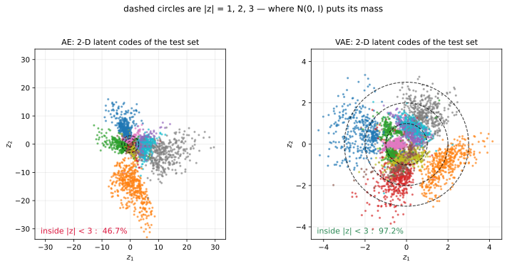

# 숨은 공간에서 뽑을 수 있는가

---

## 1. 학습 목표

이 쪽을 마치면 다음을 할 수 있게 된다.

- 자기 부호기가 **만들어 내는 모델이 아닌** 까닭을 말하기
- 학습된 숨은 공간에서 표본을 뽑아 무슨 일이 벌어지는지 재어 보기
- 다시 세우기를 잘한다는 것과 뽑을 수 있다는 것이 다른 일임을 구별하기
- [다음 장](../../ch24/index.md)이 무엇을 고치려는지 미리 알기

---

## 2. 그럴듯한 기대

자기 부호기를 익히고 나면 자연스러운 생각이 하나 떠오른다.

부호기가 숫자를 $d$차원 코드로 줄였고 풀개가 그 코드를 다시 그림으로 되돌린다. 그렇다면 코드를 하나 **지어내서** 풀개에 넣으면 새 숫자가 나오지 않겠는가?

$$
z \sim \mathcal{N}(0, I)
\quad\longrightarrow\quad
\text{풀개}(z)
\quad\longrightarrow\quad
\text{새 숫자?}
$$

재어 보자.

---

## 3. 재어 보기

부호기와 풀개의 얼개, 병목의 크기, 익히기 예산을 모두 똑같이 두고 자기 부호기 하나와 [변분 자기 부호기](../../ch24/index.md) 하나를 익혔다. 병목은 16차원, 20 에포크, 씨앗 42로 고정했다. 두 모델의 **다른 점은 다음 장이 더하는 두 줄뿐**이다.

그런 다음 두 모델 모두에 $z \sim \mathcal{N}(0, I)$를 1,000개 넣어 풀개를 통과시켰다. 나온 그림이 숫자처럼 보이는지는 눈으로 말고 **따로 익힌 분류기**(시험 정확도 98.50%)에게 물었다.

| | 다시 세우기 MSE | 분류기 평균 확신도 | 확신도 > 0.9 |
|---|---|---|---|
| **자기 부호기** | **0.00880** | 0.354 | **0.2%** |
| 변분 자기 부호기 | 0.01379 | 0.839 | **57.4%** |
| (실제 시험 숫자) | — | 0.981 | 95.1% |

두 줄이 서로 반대 방향을 가리킨다.

**자기 부호기가 다시 세우기는 더 잘한다.** 오차가 0.00880 대 0.01379로 36% 낮다. 주어진 그림을 줄였다가 되돌리는 일만 놓고 보면 자기 부호기가 이긴다.

**그런데 뽑기는 전혀 못한다.** 지어낸 코드로 만든 그림 가운데 분류기가 숫자라고 확신한 것이 **1,000장에 2장**뿐이다. 변분 자기 부호기는 574장이다.

그림을 보면 사정이 분명하다. 자기 부호기의 출력은 숫자가 아니라 여러 숫자가 겹친 듯한 뿌연 얼룩이다.

---

## 4. 왜 그런가

병목을 2차원으로 줄여 학습 자료의 코드가 실제로 **어디에 놓이는지** 그려 보면 까닭이 드러난다.

점선 원은 $|z| = 1, 2, 3$이다. $\mathcal{N}(0, I)$에서 뽑으면 표본은 거의 모두 이 안에 떨어진다.

| | 코드가 퍼진 범위 | $\lvert z \rvert < 3$ 안에 든 비율 |
|---|---|---|
| 자기 부호기 | $x \in [-15.0,\ +30.3]$, $y \in [-33.1,\ +15.9]$ | **46.7%** |
| 변분 자기 부호기 | $x \in [-4.2,\ +4.3]$, $y \in [-4.2,\ +3.6]$ | **97.2%** |

자기 부호기의 코드는 원점에서 30배 넘게 떨어진 곳까지 흩어져 있고, 덩이와 덩이 사이에 아무것도 없는 **빈 곳**이 넓다. 16차원에서 잰 표준편차도 4.20으로 1과는 거리가 멀다.

까닭은 간단하다. **자기 부호기의 손실은 코드가 어디에 놓이든 상관하지 않는다.** 손실은 다시 세우기 오차뿐이므로, 부호기는 풀개가 알아볼 수만 있다면 코드를 아무 데나 놓아도 된다. 실제로 서로 다른 숫자를 멀찍이 떼어 놓는 편이 다시 세우기에 유리하다.

그러니 $z \sim \mathcal{N}(0, I)$로 뽑는다는 것은 **풀개가 한 번도 본 적 없는 자리**를 찔러 보는 일이다. 그 자리에서 풀개가 무엇을 내놓을지는 아무도 약속한 바가 없다.

!!! warning "다시 세우기를 잘한다고 만들어 낼 수 있는 것이 아니다"
    이 두 가지는 서로 다른 능력이다.

    - **다시 세우기**는 $x \to z \to \hat{x}$가 잘 돌아오는가를 묻는다. 자료에서 온 $z$만 쓴다.
    - **만들어 내기**는 자료에서 오지 않은 $z$를 넣어도 그럴듯한 것이 나오는가를 묻는다.

    자기 부호기는 앞의 것만 약속한다. 그래서 **압축기이지 만들어 내는 모델이 아니다.** 이 장이 [22장 차원 줄이기](../../ch22/index.md) 다음에 놓인 것도 그 때문이다. 주성분 분석이 하던 일을 비선형으로 넓혔을 뿐, 아직 만들어 내는 쪽으로는 한 걸음도 가지 않았다.

---

## 5. 무엇을 고쳐야 하는가

문제가 무엇인지 또렷해졌다. 코드가 놓이는 자리를 **아무도 단속하지 않는다**는 것이다. 그러니 고칠 것도 분명하다. 코드가 우리가 뽑을 줄 아는 분포, 이를테면 $\mathcal{N}(0, I)$ 근처에 모이도록 **강제**하면 된다.

[다음 장](../../ch24/index.md)이 그 일을 두 가지 손질로 해낸다.

1. 부호기가 코드 하나가 아니라 **분포** $q(z \mid x) = \mathcal{N}(\mu(x), \sigma(x))$를 내놓게 한다.
2. 손실에 그 분포를 $p(z) = \mathcal{N}(0, I)$ 쪽으로 당기는 **KL 항**을 더한다.

코드로는 서너 줄이다. 그런데 그 서너 줄이 위의 표를 0.2%에서 57.4%로 바꾼다. 대신 다시 세우기 오차는 0.00880에서 0.01379로 나빠진다. **공짜가 아니라 맞바꿈이며**, 무엇을 주고 무엇을 받는지가 이 사다리의 세 번째 칸이다.

---

## 연습문제

**연습문제 1.** 
자기 부호기가 다시 세우기에서는 이기는데 뽑기에서는 지는 까닭을 두 문장으로 설명하라.

??? success "연습문제 1 풀이"
    자기 부호기의 손실은 다시 세우기 오차뿐이므로, 그 한 가지에만 온 힘을 쏟는다. 코드가 어디에 놓이는지는 벌점을 받지 않으니 자유롭게 흩어 놓을 수 있고, 그 자유가 다시 세우기에는 이득이다.

    변분 자기 부호기는 KL 항 때문에 코드를 $\mathcal{N}(0, I)$ 근처로 모아야 한다. 그 제약이 다시 세우기에는 손해지만, 덕분에 **뽑을 수 있는 자리와 풀개가 아는 자리가 같아진다.**

---

**연습문제 2.** 
$\mathcal{N}(0, I)$ 대신 **학습 자료의 코드에서** 뽑으면 어떻게 되는가? 자기 부호기의 코드 두 개를 골라 그 사이를 잇는 직선 위에서 뽑아 보라.

??? success "연습문제 2 풀이"
    학습 자료의 코드 자체를 쓰면 당연히 잘 나온다. 그 자리는 풀개가 익힌 자리이기 때문이다. 곧 다시 세우기를 다시 하는 것일 뿐 새로 만들어 내는 것이 아니다.

    두 코드 사이를 잇는 직선 위에서 뽑으면 흥미로워진다. 두 끝은 멀쩡한 숫자이지만 가운데로 갈수록 흐릿해지고, 어떤 구간에서는 아무것도 아닌 얼룩이 된다. 4절의 그림에서 덩이와 덩이 사이가 비어 있기 때문이다.

    변분 자기 부호기에서 같은 일을 하면 훨씬 매끄럽게 이어진다. KL 항이 코드를 한데 모아 사이를 메운 덕이다. 이 성질을 숨은 공간이 **이어져 있다**고 말하며, 조건부 생성이나 속성 조작이 가능해지는 바탕이다.

---

**연습문제 3.** 
3절의 실험에서 병목을 16이 아니라 2로 줄이면 두 모델의 격차가 어떻게 달라지겠는가? 재어 보고 까닭을 말하라.

??? success "연습문제 3 풀이"
    다시 세우기 오차는 둘 다 크게 나빠진다. 784차원을 2차원으로 줄이면 잃는 것이 너무 많다.

    그런데 **뽑기의 격차는 줄어든다.** 차원이 낮으면 자기 부호기의 코드도 좁은 곳에 몰릴 수밖에 없어, 지어낸 $z$가 아는 자리에 떨어질 확률이 올라간다. 4절의 그림에서 2차원 자기 부호기조차 46.7%가 $|z| < 3$ 안에 있었던 것이 그 까닭이다.

    차원이 높아질수록 사정이 나빠진다는 점을 새겨 둘 만하다. 16차원에서 코드의 표준편차가 4.20이었는데, 차원마다 그만큼씩 퍼지면 $\mathcal{N}(0, I)$가 덮는 부피와 실제 코드가 놓인 부피가 걷잡을 수 없이 어긋난다. **차원이 높을수록 제약 없는 숨은 공간에서 뽑기가 어려워진다.**

---

**연습문제 4.** 
자기 부호기의 코드를 사후에 손보아 만들어 내기를 흉내 낼 수 있을까? 학습 자료의 코드에 가우시안을 맞추어 거기서 뽑는 방법을 생각해 보고, 그 한계를 말하라.

??? success "연습문제 4 풀이"
    할 수 있고 실제로 쓰이기도 한다. 학습 자료의 코드 $\{z_i\}$에 평균 $\mu$와 공분산 $\Sigma$를 맞춘 뒤 $\mathcal{N}(\mu, \Sigma)$에서 뽑으면, $\mathcal{N}(0, I)$에서 뽑는 것보다 훨씬 나은 그림이 나온다. 적어도 코드가 놓인 자리 근처를 찌르기 때문이다.

    한계가 셋이다.

    첫째, **가우시안이 맞지 않는다.** 4절의 그림에서 코드는 열 개의 덩이로 갈라져 있지 가우시안 한 덩이가 아니다. 가우시안을 맞추면 덩이 사이의 빈 곳에도 확률을 주게 되고, 거기서 뽑힌 코드는 여전히 얼룩이 된다.

    둘째, **사후에 맞추는 것은 익히기에 아무 영향을 주지 않는다.** 부호기는 여전히 제 좋을 대로 코드를 흩어 놓고, 우리는 그 결과를 뒤늦게 따라갈 뿐이다. 변분 자기 부호기는 익히는 동안 코드를 모으므로 부호기 자체가 달라진다.

    셋째, **밀도를 셈할 수 없다.** 이렇게 얻은 것은 뽑는 절차일 뿐 $p(x)$에 대한 모형이 아니라서, 가능도를 재거나 다른 모형과 견줄 수가 없다.

    그래도 이 생각 자체는 죽지 않았다. 자기 부호기를 먼저 익히고 그 숨은 공간에 따로 만들어 내는 모형을 얹는 방식이 실제로 쓰이며, VQ-VAE 계열과 요즘의 숨은 공간 퍼짐 모델이 바로 그 얼개다. 다만 그때 얹는 것은 사후에 맞춘 가우시안이 아니라 제대로 익힌 모형이다.

## 정리하며

**다룬 것** — 자기 부호기가 못 하는 일

자기 부호기는 다시 세우기를 잘한다. 같은 얼개의 변분 자기 부호기보다 오차가 36% 낮다. 그런데 $\mathcal{N}(0, I)$에서 뽑은 코드를 풀개에 넣으면 1,000장에 2장만 숫자처럼 보인다.

까닭은 손실에 있다. 다시 세우기 오차만 재는 손실은 코드가 **어디에** 놓이는지 상관하지 않으므로, 부호기는 코드를 원점에서 30배 떨어진 곳까지 마음대로 흩어 놓는다. 그렇게 생긴 빈 곳을 찌르면 풀개는 한 번도 본 적 없는 입력을 받는다.

그러므로 자기 부호기는 **압축기이지 만들어 내는 모델이 아니다.** 22장의 주성분 분석을 비선형으로 넓힌 자리까지가 이 장의 몫이다.

다음 장은 코드가 놓이는 자리를 단속해 이 문제를 푼다. 부호기가 분포를 내놓게 하고 손실에 KL 항을 더하는 것, 그 두 가지뿐이다.
