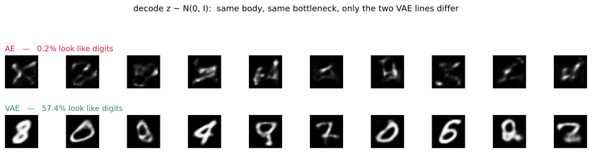

# 숨은 공간에서 뽑을 수 있는가

---

## 1. 학습 목표

이 쪽을 마치면 다음을 할 수 있게 된다.

- 오토인코더가 **만들어 내는 모델이 아닌** 까닭을 말하기
- 학습된 숨은 공간에서 표본을 뽑아 무슨 일이 벌어지는지 재어 보기
- 다시 세우기를 잘한다는 것과 뽑을 수 있다는 것이 다른 일임을 구별하기
- [다음 장](../../ch26/index.md)이 무엇을 고치려는지 미리 알기

---

## 2. 그럴듯한 기대

오토인코더를 익히고 나면 자연스러운 생각이 하나 떠오른다.

인코더가 숫자를 $d$차원 코드로 줄였고 디코더가 그 코드를 다시 그림으로 되돌린다. 그렇다면 코드를 하나 **지어내서** 디코더에 넣으면 새 숫자가 나오지 않겠는가?

$$
z \sim \mathcal{N}(0, I)
\quad\longrightarrow\quad
\text{디코더}(z)
\quad\longrightarrow\quad
\text{새 숫자?}
$$

재어 보자.

---

## 3. 재어 보기

인코더와 디코더의 얼개, 병목의 크기, 익히기 예산을 모두 똑같이 두고 오토인코더 하나와 [변분 오토인코더](../../ch26/index.md) 하나를 익혔다. 병목은 16차원, 20 에포크, 씨앗 42로 고정했다. 두 모델의 **다른 점은 다음 장이 더하는 두 줄뿐**이다.

그런 다음 두 모델 모두에 $z \sim \mathcal{N}(0, I)$를 1,000개 넣어 디코더를 통과시켰다. 나온 그림이 숫자처럼 보이는지는 눈으로 말고 **따로 익힌 분류기**(시험 정확도 98.50%)에게 물었다.

| | 다시 세우기 MSE | 분류기 평균 확신도 | 확신도 > 0.9 |
|---|---|---|---|
| **오토인코더** | **0.00880** | 0.354 | **0.2%** |
| 변분 오토인코더 | 0.01379 | 0.839 | **57.4%** |
| (실제 시험 숫자) | — | 0.981 | 95.1% |

두 줄이 서로 반대 방향을 가리킨다.

**오토인코더가 다시 세우기는 더 잘한다.** 오차가 0.00880 대 0.01379로 36% 낮다. 주어진 그림을 줄였다가 되돌리는 일만 놓고 보면 오토인코더가 이긴다.

**그런데 뽑기는 전혀 못한다.** 지어낸 코드로 만든 그림 가운데 분류기가 숫자라고 확신한 것이 **1,000장에 2장**뿐이다. 변분 오토인코더는 574장이다.

그림을 보면 사정이 분명하다. 오토인코더의 출력은 숫자가 아니라 여러 숫자가 겹친 듯한 뿌연 얼룩이다.

---

## 4. 왜 그런가

병목을 2차원으로 줄여 학습 자료의 코드가 실제로 **어디에 놓이는지** 그려 보면 까닭이 드러난다.

점선 원은 $|z| = 1, 2, 3$이다. $\mathcal{N}(0, I)$에서 뽑으면 표본은 거의 모두 이 안에 떨어진다.

| | 코드가 퍼진 범위 | $\lvert z \rvert < 3$ 안에 든 비율 |
|---|---|---|
| 오토인코더 | $x \in [-15.0,\ +30.3]$, $y \in [-33.1,\ +15.9]$ | **46.7%** |
| 변분 오토인코더 | $x \in [-4.2,\ +4.3]$, $y \in [-4.2,\ +3.6]$ | **97.2%** |

오토인코더의 코드는 원점에서 30배 넘게 떨어진 곳까지 흩어져 있고, 덩이와 덩이 사이에 아무것도 없는 **빈 곳**이 넓다. 16차원에서 잰 표준편차도 4.20으로 1과는 거리가 멀다.

까닭은 간단하다. **오토인코더의 손실은 코드가 어디에 놓이든 상관하지 않는다.** 손실은 다시 세우기 오차뿐이므로, 인코더는 디코더가 알아볼 수만 있다면 코드를 아무 데나 놓아도 된다. 실제로 서로 다른 숫자를 멀찍이 떼어 놓는 편이 다시 세우기에 유리하다.

그러니 $z \sim \mathcal{N}(0, I)$로 뽑는다는 것은 **디코더가 한 번도 본 적 없는 자리**를 찔러 보는 일이다. 그 자리에서 디코더가 무엇을 내놓을지는 아무도 약속한 바가 없다.

!!! warning "다시 세우기를 잘한다고 만들어 낼 수 있는 것이 아니다"
    이 두 가지는 서로 다른 능력이다.

    - **다시 세우기**는 $x \to z \to \hat{x}$가 잘 돌아오는가를 묻는다. 자료에서 온 $z$만 쓴다.
    - **만들어 내기**는 자료에서 오지 않은 $z$를 넣어도 그럴듯한 것이 나오는가를 묻는다.

    오토인코더는 앞의 것만 약속한다. 그래서 **압축기이지 만들어 내는 모델이 아니다.** 이 장이 [24장 차원 줄이기](../../ch24/index.md) 다음에 놓인 것도 그 때문이다. 주성분 분석이 하던 일을 비선형으로 넓혔을 뿐, 아직 만들어 내는 쪽으로는 한 걸음도 가지 않았다.

---

## 5. 무엇을 고쳐야 하는가

문제가 무엇인지 또렷해졌다. 코드가 놓이는 자리를 **아무도 단속하지 않는다**는 것이다. 그러니 고칠 것도 분명하다. 코드가 우리가 뽑을 줄 아는 분포, 이를테면 $\mathcal{N}(0, I)$ 근처에 모이도록 **강제**하면 된다.

[다음 장](../../ch26/index.md)이 그 일을 두 가지 손질로 해낸다.

1. 인코더가 코드 하나가 아니라 **분포** $q(z \mid x) = \mathcal{N}(\mu(x), \sigma(x))$를 내놓게 한다.
2. 손실에 그 분포를 $p(z) = \mathcal{N}(0, I)$ 쪽으로 당기는 **KL 항**을 더한다.

코드로는 서너 줄이다. 그런데 그 서너 줄이 위의 표를 0.2%에서 57.4%로 바꾼다. 대신 다시 세우기 오차는 0.00880에서 0.01379로 나빠진다. **공짜가 아니라 맞바꿈이며**, 무엇을 주고 무엇을 받는지가 이 사다리의 세 번째 칸이다.

---

## 연습문제

**연습문제 1.** 
오토인코더가 다시 세우기에서는 이기는데 뽑기에서는 지는 까닭을 두 문장으로 설명하라.

??? success "연습문제 1 풀이"
    오토인코더의 손실은 다시 세우기 오차뿐이므로, 그 한 가지에만 온 힘을 쏟는다. 코드가 어디에 놓이는지는 벌점을 받지 않으니 자유롭게 흩어 놓을 수 있고, 그 자유가 다시 세우기에는 이득이다.

    변분 오토인코더는 KL 항 때문에 코드를 $\mathcal{N}(0, I)$ 근처로 모아야 한다. 그 제약이 다시 세우기에는 손해지만, 덕분에 **뽑을 수 있는 자리와 디코더가 아는 자리가 같아진다.**

---

**연습문제 2.** 
$\mathcal{N}(0, I)$ 대신 **학습 자료의 코드에서** 뽑으면 어떻게 되는가? 오토인코더의 코드 두 개를 골라 그 사이를 잇는 직선 위에서 뽑아 보라.

??? success "연습문제 2 풀이"
    학습 자료의 코드 자체를 쓰면 당연히 잘 나온다. 그 자리는 디코더가 익힌 자리이기 때문이다. 곧 다시 세우기를 다시 하는 것일 뿐 새로 만들어 내는 것이 아니다.

    두 코드 사이를 잇는 직선 위에서 뽑으면 흥미로워진다. 두 끝은 멀쩡한 숫자이지만 가운데로 갈수록 흐릿해지고, 어떤 구간에서는 아무것도 아닌 얼룩이 된다. 4절의 그림에서 덩이와 덩이 사이가 비어 있기 때문이다.

    변분 오토인코더에서 같은 일을 하면 훨씬 매끄럽게 이어진다. KL 항이 코드를 한데 모아 사이를 메운 덕이다. 이 성질을 숨은 공간이 **이어져 있다**고 말하며, 조건부 생성이나 속성 조작이 가능해지는 바탕이다.

---

**연습문제 3.** 
3절의 실험에서 병목을 16이 아니라 2로 줄이면 두 모델의 격차가 어떻게 달라지겠는가? 재어 보고 까닭을 말하라.

??? success "연습문제 3 풀이"
    다시 세우기 오차는 둘 다 크게 나빠진다. 784차원을 2차원으로 줄이면 잃는 것이 너무 많다.

    그런데 **뽑기의 격차는 줄어든다.** 차원이 낮으면 오토인코더의 코드도 좁은 곳에 몰릴 수밖에 없어, 지어낸 $z$가 아는 자리에 떨어질 확률이 올라간다. 4절의 그림에서 2차원 오토인코더조차 46.7%가 $|z| < 3$ 안에 있었던 것이 그 까닭이다.

    차원이 높아질수록 사정이 나빠진다는 점을 새겨 둘 만하다. 16차원에서 코드의 표준편차가 4.20이었는데, 차원마다 그만큼씩 퍼지면 $\mathcal{N}(0, I)$가 덮는 부피와 실제 코드가 놓인 부피가 걷잡을 수 없이 어긋난다. **차원이 높을수록 제약 없는 숨은 공간에서 뽑기가 어려워진다.**

---

**연습문제 4.** 
오토인코더의 코드를 사후에 손보아 만들어 내기를 흉내 낼 수 있을까? 학습 자료의 코드에 가우시안을 맞추어 거기서 뽑는 방법을 생각해 보고, 그 한계를 말하라.

??? success "연습문제 4 풀이"
    할 수 있고 실제로 쓰이기도 한다. 학습 자료의 코드 $\{z_i\}$에 평균 $\mu$와 공분산 $\Sigma$를 맞춘 뒤 $\mathcal{N}(\mu, \Sigma)$에서 뽑으면, $\mathcal{N}(0, I)$에서 뽑는 것보다 훨씬 나은 그림이 나온다. 적어도 코드가 놓인 자리 근처를 찌르기 때문이다.

    한계가 셋이다.

    첫째, **가우시안이 맞지 않는다.** 4절의 그림에서 코드는 열 개의 덩이로 갈라져 있지 가우시안 한 덩이가 아니다. 가우시안을 맞추면 덩이 사이의 빈 곳에도 확률을 주게 되고, 거기서 뽑힌 코드는 여전히 얼룩이 된다.

    둘째, **사후에 맞추는 것은 익히기에 아무 영향을 주지 않는다.** 인코더는 여전히 제 좋을 대로 코드를 흩어 놓고, 우리는 그 결과를 뒤늦게 따라갈 뿐이다. 변분 오토인코더는 익히는 동안 코드를 모으므로 인코더 자체가 달라진다.

    셋째, **밀도를 셈할 수 없다.** 이렇게 얻은 것은 뽑는 절차일 뿐 $p(x)$에 대한 모형이 아니라서, 가능도를 재거나 다른 모형과 견줄 수가 없다.

    그래도 이 생각 자체는 죽지 않았다. 오토인코더를 먼저 익히고 그 숨은 공간에 따로 만들어 내는 모형을 얹는 방식이 실제로 쓰이며, VQ-VAE 계열과 요즘의 숨은 공간 퍼짐 모델이 바로 그 얼개다. 다만 그때 얹는 것은 사후에 맞춘 가우시안이 아니라 제대로 익힌 모형이다.

---

**연습문제 5.** 
3절의 실험에서 오토인코더의 숨은 코드에 **가우시안을 맞춘 뒤** 거기서 뽑으면 얼마나 나아지겠는가? 연습문제 4의 답을 수치로 확인해 보라.

??? success "연습문제 5 풀이"
    나아지기는 한다. 코드의 평균과 공분산을 맞춘 $\mathcal{N}(\mu, \Sigma)$에서 뽑으면
    $\mathcal{N}(0, I)$보다 훨씬 자주 코드가 놓인 자리 근처에 떨어지기 때문이다.

    그러나 변분 오토인코더에는 미치지 못한다. 까닭은 4절의 그림에 있다. 코드가
    **열 개의 덩이로 갈라져** 있지 가우시안 한 덩이가 아니다. 가우시안을 맞추면
    덩이 사이의 빈 곳에도 확률을 주므로, 거기서 뽑힌 코드는 여전히 얼룩이 된다.

    가우시안 혼합을 맞추면 더 나아지고, 덩이의 개수를 열로 두면 꽤 그럴듯해진다.
    그런데 그쯤 되면 **숨은 공간에 따로 만들어 내는 모형을 얹은** 셈이고, 그것이
    바로 VQ-VAE나 숨은 공간 퍼짐 모델이 하는 일이다.

    변분 오토인코더와 다른 점은 하나다. 이쪽은 인코더를 익힌 **뒤에** 뒤따라가지만,
    변분 오토인코더는 익히는 **동안** 코드를 모은다. 그래서 인코더 자체가 달라진다.

---

**연습문제 6.** 
$\mathcal{N}(0, I)$에서 뽑은 표본을 분류기에게 판정시켰다. 왜 사람 눈으로 보지 않고 분류기를 썼는가?

??? success "연습문제 6 풀이"
    **수로 나오기 때문이다.** 눈으로 보면 "얼룩 같다"는 인상은 얻지만 0.2%와 57.4%
    같은 비교는 할 수 없다.

    분류기를 쓰면 잣대가 생긴다. 게다가 기준점도 함께 잴 수 있다. 실제 시험 숫자에
    같은 분류기를 쓰면 평균 확신도 0.981, 확신도 0.9 넘는 비율 95.1%가 나오므로,
    표본이 진짜에 얼마나 가까운지 견줄 수 있다.

    다만 이 잣대의 한계도 분명하다.

    - 분류기가 **숫자처럼 보이는지**만 볼 뿐 **다양한지**는 보지 않는다. 모든 표본이
      똑같은 3이어도 점수는 높다.
    - 분류기가 속을 수 있다. 사람 눈에 얼룩인 그림에 높은 확신도를 주기도 한다.

    그래서 만들어 내는 모델을 제대로 재려면 다양성까지 보는 잣대가 필요하며,
    [29장](../../ch29/index.md)의 인셉션 점수와 프레셰 인셉션 거리가 그 일을 한다.

---

**연습문제 7.** 
병목을 16이 아니라 2로 두고 같은 실험을 하면 어떻게 되는가?

??? success "연습문제 7 풀이"
    2차원 코드로 잰 값이 4절의 표에 있다. 오토인코더는 $|z| < 3$ 안에 **46.7%**가
    들어 있고 변분 오토인코더는 **97.2%**다.

    16차원일 때보다 오토인코더 쪽 사정이 낫다. 차원이 낮으면 코드가 퍼질 수 있는
    자리도 좁아 지어낸 $z$가 아는 자리에 떨어질 확률이 올라가기 때문이다.

    그렇다고 2차원에서 뽑기가 잘되는 것은 아니다. 다시 세우기가 워낙 나빠져
    (784차원을 2차원으로 줄이므로) 나오는 그림 자체가 흐릿하다. 곧 **뽑기는 나아지고
    되돌리기는 나빠지는** 맞바꿈이다.

    차원이 높아질수록 제약 없는 숨은 공간에서 뽑기가 급격히 어려워진다는 점이
    중요하다. 16차원에서 코드의 표준편차가 4.20이었는데, 차원마다 그만큼 퍼지면
    $\mathcal{N}(0,I)$가 덮는 부피와 코드가 실제로 놓인 부피가 걷잡을 수 없이 어긋난다.

---

**연습문제 8.** 
다시 세우기 오차는 오토인코더가 낮은데 뽑기는 변분 오토인코더가 낫다. 이 둘을 하나의 잣대로 묶을 수 있는가?

??? success "연습문제 8 풀이"
    묶을 수 있고, 그 잣대가 **가능도** $p(x)$다.

    우리가 정말 알고 싶은 것은 "이 모델이 자료 분포를 얼마나 잘 나타내는가"이다.
    다시 세우기 오차는 그 일부만 본다. 자료에서 온 $x$를 얼마나 잘 되돌리는지는 재지만,
    모델이 자료에 **없는** 것에 얼마나 확률을 주는지는 재지 않는다.

    오토인코더는 애초에 $p(x)$를 정의하지 않는다. 인코더와 디코더가 있을 뿐 어떤 확률
    모형도 세우지 않으므로, 가능도를 물을 수조차 없다. 그래서 다시 세우기 오차 말고는
    잴 것이 없다.

    변분 오토인코더는 $p(x) = \int p(x \mid z) p(z)\, dz$라는 모형을 세운다. 그 적분이
    다루기 어려워 직접 셈하지는 못하지만, **증거 하한**으로 아래에서 묶을 수 있다.

    $$\log p(x) \ge \mathbb{E}_{q(z \mid x)}[\log p(x \mid z)] - D_{\mathrm{KL}}(q(z \mid x) \,\|\, p(z))$$

    오른쪽의 첫 항이 다시 세우기이고 둘째 항이 KL이다. 곧 **두 가지가 하나의 식의 두
    항**이며, 우리가 따로 재던 것들이 사실 같은 목표의 부분이었다. 오토인코더는 첫
    항만 보고 둘째 항을 버린 꼴이다.

    이 유도가 [다음 장](../../ch26/index.md)의 출발점이다.

---

**연습문제 9.** 
이 실험에서 두 모델의 병목과 익히기 예산을 같게 맞춘 까닭은 무엇인가?

??? success "연습문제 9 풀이"
    차이의 원인을 하나로 좁히기 위해서다.

    병목이 다르면 "코드가 더 커서 잘된 것 아닌가", 에포크가 다르면 "더 익혀서 그런 것
    아닌가"라는 반론이 가능하다. 모두 같게 두면 남는 차이가 **다시 뽑기와 KL 항**뿐이
    되므로, 결과를 그 둘에 돌릴 수 있다.

    이 장 전체가 같은 방식으로 쓰였다. [3장](../../ch03/index.md)에서 네 걸음이 모두
    같은 손실과 최적화기를 쓴 것도, [주성분 분석과 오토인코더](../architecture/04_ae_principal_manifold.md)를
    같은 병목에서 견준 것도 마찬가지다.

    한 번에 하나씩만 바꾸는 것이 실험의 기본이며, 책에 싣는 수치일수록 더 그렇다.
    읽는 사람은 실험을 다시 돌려 볼 수 없으므로 조건이 통제되었다는 것을 글로 보장해
    주어야 한다.

---

**연습문제 10.** 
오토인코더로도 그럴듯한 표본을 얻는 방법이 정말 없는가? 숨은 공간을 건드리지 않고 할 수 있는 일을 생각해 보라.

??? success "연습문제 10 풀이"
    몇 가지가 있고, 모두 "빈 곳을 피한다"는 하나의 생각에서 나온다.

    **코드 사이 끼움.** 학습 자료의 코드 두 개를 골라 그 사이를 이으면, 적어도 양 끝은
    아는 자리다. 가운데가 얼룩이 되는 구간이 있지만 무작위보다는 낫다.

    **이웃에서 흔들기.** 학습 자료의 코드에 작은 잡음을 더해 뽑는다. 아는 자리 근처에
    머무르므로 대체로 그럴듯하다. 다만 원래 자료와 거의 같은 것만 나와 **새롭지 않다.**

    **코드에 모형 얹기.** 앞의 연습문제 5에서 본 방법이다. 가우시안 혼합이나 흐름
    모델을 코드 분포에 맞춘다.

    셋 모두 공통된 한계가 있다. **인코더가 코드를 어떻게 흩어 놓았는지에 매여 있다는
    것**이다. 인코더가 덩이를 멀리 떼어 놓았으면 사이 끼움은 빈 곳을 지나고, 코드 분포가
    복잡하면 얹는 모형도 복잡해야 한다.

    변분 오토인코더가 다른 점은 문제를 **뒤늦게 수습하지 않고 애초에 만들지 않는다**는
    것이다. 익히는 동안 코드를 모으므로 수습할 빈 곳이 생기지 않는다. 고치는 것보다
    만들지 않는 편이 낫다는 것이 이 사다리의 세 번째 칸이 주는 교훈이다.

## 정리하며

**다룬 것** — 오토인코더가 못 하는 일

오토인코더는 다시 세우기를 잘한다. 같은 얼개의 변분 오토인코더보다 오차가 36% 낮다. 그런데 $\mathcal{N}(0, I)$에서 뽑은 코드를 디코더에 넣으면 1,000장에 2장만 숫자처럼 보인다.

까닭은 손실에 있다. 다시 세우기 오차만 재는 손실은 코드가 **어디에** 놓이는지 상관하지 않으므로, 인코더는 코드를 원점에서 30배 떨어진 곳까지 마음대로 흩어 놓는다. 그렇게 생긴 빈 곳을 찌르면 디코더는 한 번도 본 적 없는 입력을 받는다.

그러므로 오토인코더는 **압축기이지 만들어 내는 모델이 아니다.** 24장의 주성분 분석을 비선형으로 넓힌 자리까지가 이 장의 몫이다.

다음 장은 코드가 놓이는 자리를 단속해 이 문제를 푼다. 인코더가 분포를 내놓게 하고 손실에 KL 항을 더하는 것, 그 두 가지뿐이다.
