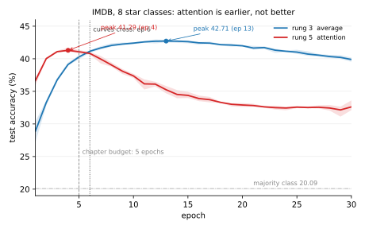

# 별점을 맞힌다 — 일감이 어려우면 달라지는가

[빌려 온 벡터](03_frozen.md)가 사다리의 뒤집힘을 **임베딩이 자료에 비해 너무 컸다**로 설명했다. 그런데 설명이 하나 더 있을 수 있다.

**좋다/나쁘다를 가르는 일이 너무 쉬웠다는 것이다.** `terrible`이나 `perfect`가 있는지만 세어도 거의 풀리는 일감이라면, 차례를 읽는 장치는 보탤 것이 없는 자리에 힘을 쓴 셈이 된다. 그렇다면 뒤집힘의 원인은 자료의 크기가 아니라 **일감의 쉬움**이다.

이 쪽이 그것을 가른다. **같은 평 2만 5천 편**으로 더 어려운 일감을 만들어 사다리를 다시 오른다. 자료의 크기가 그대로이므로, 뒤집힘이 풀리면 원인은 일감이었고 그대로면 원인은 크기였다.

---

## 1. 여덟 갈래는 어디서 오는가

aclImdb는 파일 이름에 별점을 적어 둔다. `200_8.txt`는 200번 평이고 별 여덟이라는 뜻이다. 그러니 내려받을 것도 없이 갈래를 늘릴 수 있다.

다만 **다섯과 여섯이 없다.** 자료를 만든 이들이 라벨 붙은 묶음에서 뺐기 때문이며, 그 까닭을 README가 적어 두었다.

> In the labeled train/test sets, a negative review has a score <= 4 out of 10, and a positive review has a score >= 7 out of 10. Thus reviews with more neutral ratings are not included in the train/test sets.

애매한 가운데를 덜어 내야 **좋다/나쁘다**가 또렷해지기 때문이다. 5★과 6★짜리 평은 라벨 없는 5만 편 쪽에 들어 있다. 그러므로 쓸 수 있는 갈래는 1~4★과 7~10★, 모두 **여덟**이다.

갈래가 고르지 않다는 점도 함께 적어야 한다.

| | 1★ | 2★ | 3★ | 4★ | 7★ | 8★ | 9★ | 10★ |
|---|---|---|---|---|---|---|---|---|
| 시험 편수 | **5,022** | 2,302 | 2,541 | 2,635 | 2,307 | 2,850 | 2,344 | 4,999 |

우연은 $100/8 = 12.5\%$지만, 가장 많은 1★을 늘 찍으면 **20.09%**가 된다. **넘어야 할 바닥은 20.09%다.** 우연이 아니다.

### 자를 하나 더 둔다

별점은 **순서가 있는** 이름표다. 9★짜리 평을 10★으로 본 것과 1★으로 본 것은 똑같이 "틀림"이지만 같은 잘못이 아니다. 그래서 정확도와 함께 **MAE**를 잰다. 맞힌 별과 참 별의 차이를 별 단위로 평균한 값이다.

```python
STARS = [1, 2, 3, 4, 7, 8, 9, 10]          # 5, 6은 없다
S2I = {s: i for i, s in enumerate(STARS)}   # 별점 -> 0~7

def mae_stars(pred):
    s = np.array(STARS)
    return np.abs(s[pred] - s[yte]).mean()
```

나머지는 6장 그대로다. 낱말집 2만, 길이 400, 임베딩 64차원, Adam $10^{-3}$, 배치 100, 5 에포크, 씨앗 다섯. **내놓는 갈래 수만 2에서 8로 바뀐다.**

---

## 2. 사다리를 다시 오른다

| 걸음 | 정확도 | 퍼짐 | MAE | 이진에서는 |
|---|---|---|---|---|
| 바닥 (가장 많은 갈래) | 20.09 | — | — | 50.00 |
| [1 최근접 중심](01_counting.md) | 24.75 | — | — | 65.16 |
| [2 선형 학습](02_linear.md) | 30.21 | 1.55 | 2.97★ | 78.80 |
| [3 평균](03_embedding.md) | **40.28** | 0.59 | 1.71★ | **87.03** |
| [4 LSTM](04_lstm.md) | 35.84 | 1.28 | 1.94★ | 81.51 |
| [5 어텐션](05_attention.md) | **41.08** | 0.54 | 1.52★ | 86.11 |
| [6 트랜스포머](06_transformer.md) | **41.33** | 0.33 | 1.51★ | 85.98 |

**첫눈에는 뒤집힘이 풀린 것처럼 보인다.** 어텐션이 평균을 0.80, 트랜스포머가 1.05 이긴다. 범위도 겹치지 않는다(39.92\~40.52 대 40.80\~41.34). MAE도 같은 쪽을 가리킨다.

그리고 걸음 사이가 훨씬 넓게 벌어졌다. 이진에서는 3·5·6걸음이 87.03, 86.11, 85.98로 1점 안에 몰려 있어 가릴 것이 거의 없었다. 여기서는 2걸음에서 3걸음으로 **10.07%포인트**를 오른다. 임베딩이 하는 일이 처음으로 크게 보인다.

**여기서 멈췄다면 "어려운 일감에서는 차례가 값을 한다"고 적었을 것이다.** 그런데 이 장은 예산을 의심하는 버릇이 있다.

---

## 3. 5 에포크가 공평한 자리인가

[장 개요](index.md)가 이진 일감에서 이미 겪은 일이다. 3걸음은 9에포크에서 꼭대기를 찍고 내려오는데 2걸음은 30에포크까지 올랐다. 그래서 5 에포크는 3걸음 편이었다.

같은 것을 여기서도 재었다. 3걸음과 5걸음을 30에포크까지 돌리며 **에포크마다** 시험 정확도를 잰다.



| 에포크 | 3 평균 | 5 어텐션 | 차이 |
|---|---|---|---|
| 1 | 28.89 | 36.64 | **+7.75** |
| 3 | 36.75 | 41.09 | +4.34 |
| **5** (이 장의 규약) | 40.28 | 41.08 | **+0.80** |
| **6** | 41.15 | 40.82 | **−0.33** |
| 13 | 42.71 | 35.25 | −7.47 |
| 20 | 41.99 | 32.91 | **−9.08** |
| 30 | 39.89 | 32.62 | −7.27 |

**두 곡선이 6에포크에서 교차하고, 이 장의 규약은 그 바로 한 에포크 앞이다.**

그리고 재는 자리에 따라 같은 두 모델의 차이가 **+7.75에서 −9.09까지** 움직인다. 16.8%포인트짜리 폭이다. 부호도 크기도 **언제 멈추었느냐가 정한다.**

저마다 가장 좋은 자리끼리 견주면 이렇게 된다.

| | 꼭대기 | 그 자리 | 범위 |
|---|---|---|---|
| 3 평균 | **42.78** | 13에포크 | 42.52\~42.97 |
| 5 어텐션 | 41.32 | **4에포크** | 41.12\~41.69 |

**−1.46으로 뒤집힌다.** 범위가 42.52와 41.69로 겹치지 않으니 이것도 참인 차이다. 곧 2절의 +0.80은 **규약이 만든 값**이었다.

---

## 4. 어텐션은 더 나은 것이 아니라 더 이른 것이다

곡선의 모양이 설명을 준다.

**어텐션은 1에포크에서 이미 36.64%다.** 평균은 그때 28.89%로 한참 뒤에 있다. 7.75%포인트를 앞선 채 출발한다. 그러고는 4에포크에 꼭대기를 찍고 **무너진다.** 30에포크에서 32.62%이니 꼭대기에서 **8.70%포인트**를 잃었다.

평균은 느리게 오른다. 13에포크까지 꾸준히 올라 42.78%에 닿고, 그 뒤로도 30에포크까지 2.89%포인트만 잃는다.

곧 어텐션은 **빨리 맞추고 빨리 외운다.** 평 2만 5천 편에서 빨리 맞춘다는 것은 빨리 외운다는 뜻이기도 하다.

!!! warning "하마터면 적을 뻔한 것"
    이 쪽을 5 에포크에서 끝냈다면 **"어려운 일감에서는 차례가 값을 한다"**고 적었을 것이다. 그리고 그 문장은 [앞 쪽들](03_frozen.md)의 결론과 어긋나므로, 장 전체를 고쳐 썼을 것이다.

    막은 것은 새로운 생각이 아니라 **이미 있던 버릇**이다. 이진 일감에서 한 번 데였기에 예산을 의심했고, [4걸음 6절](04_lstm.md)이 30에포크 곡선을 그리는 코드를 이미 갖고 있었다.

    **틀린 결론을 막는 것은 대개 새 수법이 아니라 지난번에 틀렸던 자리를 기억하는 일이다.**

---

## 5. 그래서 답은 크기다

두 축을 따로 움직여 보았다.

| 자료 | 일감 | 3걸음 → 5걸음 | 어떻게 쟀나 |
|---|---|---|---|
| IMDB 2만 5천 | 이진 | **−0.92** | 5에포크 |
| IMDB 2만 5천 | 여덟 갈래 | **−1.46** | 저마다 꼭대기 |
| **Yelp 2만 5천** | **다섯 갈래** | **−1.60** | 저마다 꼭대기 |
| Yelp 56만 | 이진 | **+1.85** | 5에포크 |

**일감을 어렵게 해도 뒤집힘은 풀리지 않는다.** 바닥에서 45%포인트나 떨어진, 낱말 세기로는 30%밖에 못 가는 일감에서도 차례를 버린 평균이 이긴다.

**자료가 다른 것이어도 마찬가지다.** 별 다섯 갈래 Yelp를 **같은 2만 5천 편**으로 잘라 재면 −1.60이다. 그리고 그쪽에서는 어텐션의 꼭대기가 **정확히 5에포크**에 있었다. 5에포크로 재면 어텐션이 +1.96으로 이기는 것처럼 보이고, 저마다 꼭대기로 재면 −1.60으로 뒤집힌다. **이 절이 방금 겪은 일이 다른 자료에서 한 번 더 일어난 것이다.**

**자료를 키우면 풀린다.** 같은 이진 일감이라도 Yelp에서 56만 편을 주면 LSTM이 평균을 1.85 이긴다.

그러므로 [빌려 온 벡터](03_frozen.md)의 읽기가 선다. 이 장의 사다리가 3걸음에서 멈춘 것은 **차례가 쓸모없어서도, 일감이 쉬워서도 아니다. 평 2만 5천 편에 견주어 모델이 너무 컸기 때문이다.**

!!! note "그래도 남은 것"
    이 쪽이 헛일은 아니다. 어려운 일감은 **걸음 사이를 벌려 놓았다.** 2걸음에서 3걸음으로 10.07%포인트를 오르고, MAE가 2.97★에서 1.71★로 줄어든다. 이진에서는 8.23%포인트였고 MAE라는 자는 아예 없었다.

    곧 어려운 일감이 고친 것은 **뒤집힘이 아니라 해상도**다. 사다리는 여전히 뒤집혀 있지만, 이제 걸음마다 무엇이 얼마를 버는지가 훨씬 또렷하게 보인다.

---

## 연습문제

<div class="drillbox" markdown>

**연습문제 1.** <span class="diff easy" title="쉬움"></span>
이 쪽은 우연(12.5%)이 아니라 가장 많은 갈래(20.09%)를 바닥으로 삼는다. 왜 그런가? 갈래가 고르다면 둘이 같아지는가?

</div>

??? success "연습문제 1 풀이"
    **아무것도 배우지 않고도 20.09%를 얻을 수 있기 때문이다.** 늘 1★이라고만 찍으면 된다. 그러므로 12.5%를 넘었다는 말은 자랑이 아니다. 20.09%를 넘어야 무언가를 배운 것이다.

    갈래가 고르면 둘이 같아진다. 갈래마다 $1/8$씩이면 가장 많은 갈래도 12.5%이므로 아무 갈래나 찍어도 12.5%다.

    이 자료는 고르지 않다. 1★이 5,022편이고 9★이 2,344편이니 두 배가 넘게 차이 난다. **고르지 않은 자료에서 정확도만 보면 속기 쉽다.** 큰 갈래만 잘 맞혀도 수가 오르기 때문이다. 이 쪽이 MAE를 함께 싣는 까닭의 절반이 여기에 있다.

---

<div class="drillbox" markdown>

**연습문제 2.** <span class="diff easy" title="쉬움"></span>
2걸음에서 3걸음으로 갈 때 정확도가 10.07%포인트 오르고 MAE가 2.97★에서 1.71★로 준다. 두 수가 같은 말을 하는가, 다른 말을 하는가?

</div>

??? success "연습문제 2 풀이"
    **비슷한 말이지만 같은 말은 아니다.**

    정확도는 **딱 맞혔는가**만 센다. 8★짜리 평을 7★으로 본 것과 1★으로 본 것이 똑같이 0점이다. MAE는 그 둘을 1★과 7★으로 구별한다.

    두 수가 함께 좋아졌으므로 3걸음은 **더 자주 맞히면서 틀릴 때도 덜 멀리 틀린다.** 만약 정확도만 오르고 MAE가 그대로였다면, 쉬운 평 몇 개를 더 맞혔을 뿐 어려운 평에서는 여전히 크게 빗나간다는 뜻이 된다.

    낱말 세기에서 임베딩으로 갈 때 얻는 것이 무엇인지도 여기서 보인다. 낱말 세기는 `great`이 있는지만 안다. 임베딩은 `great`과 `superb`와 `decent`가 **얼마나 센 말인지**를 벡터에 담을 수 있다. 별점을 맞히는 일에 필요한 것이 정확히 그것이라, MAE 쪽이 더 크게 좋아진다.

---

<div class="drillbox" markdown>

**연습문제 3.** <span class="diff med" title="중간"></span>
3절의 표에서 어텐션과 평균의 차이가 +7.75(1에포크)에서 −9.09(22에포크)까지 움직인다. 그렇다면 "저마다 가장 좋은 자리끼리 견준다"는 것이 언제나 옳은 규칙인가?

</div>

??? success "연습문제 3 풀이"
    **아니다. 그것도 하나의 고름이며, 값을 치른다.**

    가장 좋은 자리끼리 견주려면 **시험 자료를 보고 멈출 자리를 골라야** 한다. 그런데 시험 자료는 원래 한 번만 보는 것이다. 30에포크를 돌며 에포크마다 시험 정확도를 재고 가장 높은 것을 고르는 것은, 시험 자료에 30번 맞춰 보는 일이다. 그렇게 고른 값은 **낙관적으로 치우친다.**

    제대로 하려면 학습 자료에서 검증 묶음을 떼어 거기서 멈출 자리를 고르고, 시험은 마지막에 한 번만 보아야 한다. 이 책은 그 절차를 [9장](../ch09/index.md)에서 다룬다.

    그러면 이 쪽의 −1.46은 믿을 수 없는가? **부호는 믿을 만하다.** 두 모델 모두 같은 방식으로 치우쳤고, 꼭대기 자리가 13과 4로 멀리 떨어져 있어 조금 어긋나도 순서가 바뀌지 않는다. 다만 **1.46이라는 크기**를 그대로 믿을 것은 못 된다.

    요점은 이렇다. **하나의 고정된 예산도 한쪽 편이고, 저마다의 꼭대기도 한쪽 편이다.** 어느 쪽도 중립이 아니므로, 어느 자로 쟀는지를 적는 수밖에 없다.

---

<div class="drillbox" markdown>

**연습문제 4.** <span class="diff hard" title="어려움"></span>
어텐션은 평균보다 매개변수가 3.3%(42,368개) 많을 뿐인데 꼭대기에서 8.70%포인트나 무너진다. 평균은 2.89%포인트만 잃는다. 3.3%가 그 차이를 만들 수 있는가?

</div>

??? success "연습문제 4 풀이"
    **매개변수의 수만으로는 설명되지 않는다.** 1,322,888과 1,280,520은 거의 같은 크기의 모델이다.

    두 가지를 나누어 보아야 한다.

    **하나, 무너지는 빠르기.** 어텐션은 1에포크에 36.64%다. 평균이 28.89%일 때다. 곧 어텐션은 같은 자료를 **훨씬 빨리 맞춘다.** 빨리 맞추는 모델은 빨리 외우기도 한다. 이것은 매개변수의 수가 아니라 **최적화가 얼마나 잘 흐르는가**의 문제다. 어텐션은 낱말에서 출력까지 거리가 1이라([5걸음](05_attention.md)) 기울기가 곧장 닿는다.

    **둘, 꼭대기의 높이.** 41.32와 42.78이다. 이쪽은 빠르기로 설명되지 않는다. 저마다 가장 좋은 자리를 주었는데도 어텐션이 낮다.

    둘째에 대한 후보 하나는 **자리 임베딩**이다. `self.pos`는 $400 \times 64 = 25{,}600$개로, 어텐션이 평균 위에 더하는 42,368개의 60%다. 그런데 400칸을 다 채우는 평은 드물다. 뒤쪽 자리의 벡터는 그 자리까지 오는 몇 편 안 되는 평으로만 정해지므로, **애초에 제대로 정해질 수 없는 매개변수**다.

    이 책은 아직 그것을 재지 않았다. 재려면 `self.pos`를 빼고 같은 곡선을 그려 꼭대기가 오르는지 보면 된다. **그 전까지는 후보로만 적어 두는 것이 옳다.**
